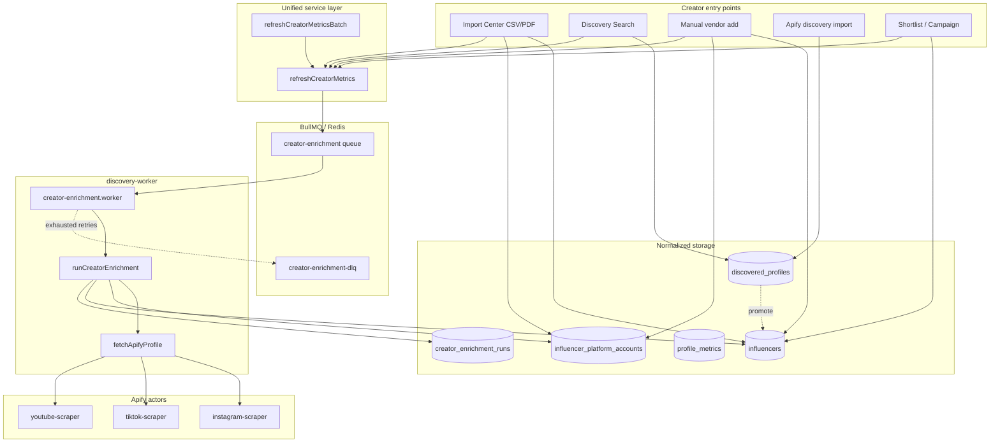
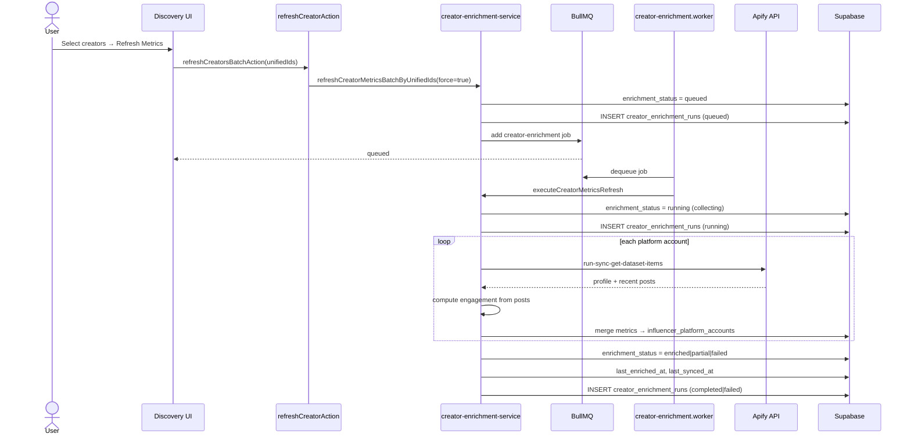
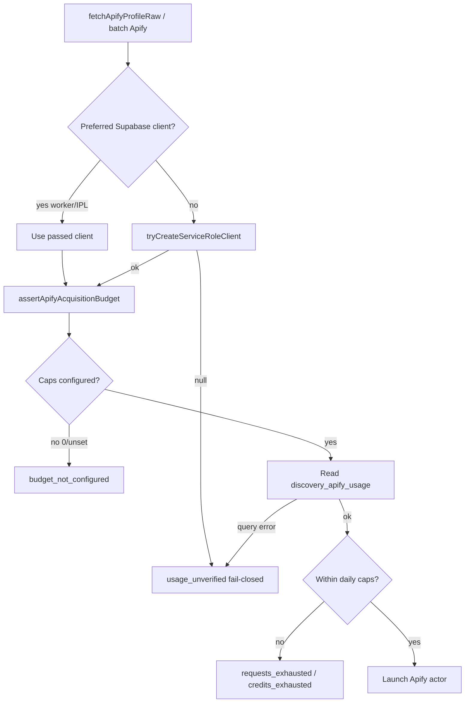

# Apify Creator Enrichment Architecture

Unified creator metrics enrichment for Thinkway. All creator entry paths converge on **`refreshCreatorMetrics`** (`lib/services/creators/creator-enrichment-service.ts`), which enqueues or executes the Apify profile pipeline via the discovery worker.

## Business goal

One pipeline refreshes profile metrics for creators regardless of origin:

| Entry path | Storage | Refresh |
|---|---|---|
| CSV / PDF Import Center | `influencers` + `influencer_platform_accounts` | `refreshCreatorMetrics` |
| Discovery search / manual add | `discovered_profiles` → promoted to `influencers` | `refreshCreatorMetrics` |
| Vendor manual creation | `influencers` + `influencer_platform_accounts` | `refreshCreatorMetrics` |
| Shortlist / campaign add | same influencer rows | auto-enqueue + manual refresh |
| Direct Apify discovery import | `discovered_profiles` or `influencers` | `refreshCreatorMetrics` |

## Architecture diagram



## Sequence: explicit Refresh Metrics



## Tables

### Commercial creators (primary)

| Table | Role |
|---|---|
| `influencers` | Creator orchestration: `enrichment_status`, `last_enriched_at`, `next_refresh_at`, `apify_run_id`, audience demographics |
| `influencer_platform_accounts` | Per-platform metrics: followers, ER, avg_views/likes/comments, `recent_publications`, `field_sources`, `sync_status`, `last_synced_at` |
| `creator_enrichment_runs` | Audit / sync log for every queued, running, completed, skipped, failed, or dead-letter run |

### Discovery-only (pre-promotion)

| Table | Role |
|---|---|
| `discovered_profiles` | Search/Apify discovery staging; linked via `influencer_id` after promotion |
| `profile_metrics` | Historical metrics snapshots for discovery profiles |
| `profile_posts` | Recent posts from discovery crawler pipeline |

**Normalization rule:** Refresh Metrics always targets `influencers.id`. Discovery-only profiles (`dis:{uuid}`) are auto-promoted to `influencers` + `influencer_platform_accounts` on first refresh when the requesting user has permission.

## Sync status enum (UI / API)

Public status (`CreatorMetricsSyncStatus`) maps from DB `creator_enrichment_status`:

| Public | DB `enrichment_status` |
|---|---|
| `pending` | `never` |
| `queued` | `queued` |
| `collecting` | `running` |
| `completed` | `enriched`, `partial`, `skipped` |
| `failed` | `failed` |

Audit rows in `creator_enrichment_runs.status` use: `queued`, `running`, `completed`, `partial`, `skipped`, `failed`, `dead_letter`.

## Queue flow

| Queue | Producer | Consumer | Purpose |
|---|---|---|---|
| `creator-enrichment` | `refreshCreatorMetrics`, shortlist/campaign hooks | `creator-enrichment.worker` | Unified Apify profile enrichment |
| `creator-enrichment-dlq` | worker on retry exhaustion | manual ops | Dead-letter visibility |
| `creator-import` | Import Center upload | `creator-import.worker` | Parse CSV/PDF, upsert creators |
| `creator-import-enrich` | legacy per-account jobs | `creator-import-enrich.worker` | Delegates to unified pipeline (inline) |
| `discovery-enrich` | Apify discovery search | `enrichment.worker` | `discovered_profiles` crawler (separate from commercial refresh) |

**Required env:** `REDIS_URL`, `APIFY_TOKEN`, plus actor IDs (defaults below).

## Apify actors (Instagram, TikTok, YouTube)

Configured via `getMetricsCollectorEnv()` / `apifyActorIdForPlatform()`:

| Platform | Env var | Default actor |
|---|---|---|
| Instagram | `APIFY_INSTAGRAM_ACTOR_ID` | `apify/instagram-scraper` |
| TikTok | `APIFY_TIKTOK_ACTOR_ID` | `clockworks/tiktok-scraper` |
| YouTube | `APIFY_YOUTUBE_ACTOR_ID` | `streamers/youtube-scraper` |

Profile fetch input builders live in `lib/creator-enrichment/apify-profile.ts`. Engagement is computed from the latest posts returned by the actor:

```
engagement_rate = ((avg_likes + avg_comments) / followers) × 100
```

Manual metric overrides (`metrics_is_manual_override` or `field_sources.manual`) are never overwritten.

## Refresh workflow

1. **Detect platform** — iterate `influencer_platform_accounts` for the creator; skip non-social platforms.
2. **Select actor** — `apifyActorIdForPlatform(platformKey, env)`.
3. **Launch actor** — `POST /v2/acts/{actorId}/run-sync-get-dataset-items`.
4. **Collect profile metrics** — followers, following, posts count, bio, avatar, verified.
5. **Collect latest posts** — up to 6 recent items → `recent_publications` jsonb.
6. **Calculate engagement** — average likes/comments/views from posts.
7. **Save metrics** — merge with manual protection into `influencer_platform_accounts`.
8. **Save sync logs** — `creator_enrichment_runs` (+ platform `sync_status`, `sync_source=apify`).
9. **Update timestamps** — `last_synced_at`, `last_enriched_at`, `next_refresh_at`.
10. **Update enrichment status** — creator + account level.

### Triggers and priority

| Trigger | Priority | Force skip 30-day? |
|---|---|---|
| `campaign` | 1 (highest) | no |
| `shortlist` | 2 | no |
| `detail` | 3 | no |
| `manual` (Refresh Metrics) | 4 | **yes** |
| `stale` (import background) | 4 | no |

## Public API

```typescript
// lib/services/creators/creator-enrichment-service.ts
refreshCreatorMetrics(supabase, creatorId, options?)
refreshCreatorMetricsBatch(supabase, creatorIds, options?)
refreshCreatorMetricsByUnifiedId(supabase, unifiedId, options?)
refreshCreatorMetricsBatchByUnifiedIds(supabase, unifiedIds, options?)
getCreatorMetricsSyncStatus(supabase, creatorId)
mapEnrichmentStatusToSyncStatus(dbStatus)
executeCreatorMetricsRefresh(supabase, payload) // worker inline
```

Server actions: `features/discovery/enrichment/actions.ts`

UI:

- `RefreshCreatorButton` — creator detail sheet
- Discovery Search bulk bar — **Refresh Metrics** for selected creators

## Demo flow

1. Start Redis + discovery worker: `npm run discovery:worker`
2. Set `APIFY_TOKEN` (+ optional actor overrides) in `.env.local` and worker env
3. Upload CSV at `/discovery/import` — creators land in `influencers`
4. Open `/discovery/search`, select a subset
5. Click **Refresh Metrics** in the bulk action bar
6. Poll creator rows: `enrichment_status` transitions `queued → running → enriched`
7. Verify `influencer_platform_accounts.follower_count`, `engagement_rate`, `recent_publications`

## Manual refresh stabilization — **Enterprise Ready** (CLOSED)

**Status:** **CLOSED · Enterprise Ready** (product path) · tip `7a90b5f0` · evidence `docs/architecture/APIFY_REFRESH_STABILIZATION_ENTERPRISE_RELEASE.md`  
**R2.4:** Carry-in baseline (architecture / diagnostics) — Production promote only with explicit approval.  
**Not product:** Dev Railway worker crash → `docs/infrastructure/BACKLOG_DEV_RAILWAY_WORKER_REDIS_LOG_RATE_LIMITS.md`

Stabilization: worker-safe budget verification, latest-refresh status SSOT, stage-specific toasts, and persisted execution traces.

### Budget verification flow



**Worker-safe client:** `lib/supabase/service-role-client.ts` — never import `@/lib/supabase/admin` from discovery-worker (that module uses `server-only` and throws outside Next.js, which previously caused `usage_unverified`).

**Required runtime env (Vercel Preview/Development + Railway discovery-worker):**

| Variable | Role |
|---|---|
| `DISCOVERY_APIFY_MAX_REQUESTS_PER_DAY` | Positive daily request cap (DB `costProtection` may be 0/0) |
| `DISCOVERY_APIFY_MAX_CREDITS_PER_DAY` | Positive daily credit cap |
| `SUPABASE_SERVICE_ROLE_KEY` | Usage table reads + enrichment writes |
| `APIFY_TOKEN` | Actor launch |

Do **not** bypass the gate. If verification fails, UI must show **Budget verification failed** — never “Refresh finished without new Apify data”.

### Status precedence rules

`resolveAggregatedCreatorEnrichmentStatus` (`lib/creator-enrichment/status-resolution.ts`):

1. In-flight BullMQ job → `queued` / `running`
2. Influencer stored status **`failed`** (no job) → **`failed`** (latest refresh SSOT — historical platform `enriched` must not map to completed)
3. Otherwise reconcile from platform terminal states (`partial` / `enriched` / `awaiting_profile_details` / `never`)

Poll API: `getCreatorRefreshPollStatus` / `getCreatorRefreshPollStatusAction` returns `syncStatus` plus `failureStage`, `failureReason`, `refreshId`.

### Failure stages + toasts

`lib/creator-enrichment/refresh-failure-stage.ts`

| Stage | Toast title |
|---|---|
| `budget_verification` | Budget verification failed |
| `actor_launch` | Actor launch failed |
| `dataset_retrieval` | Dataset retrieval failed |
| `snapshot_import` | Snapshot import failed |
| `dna_enrichment` | DNA enrichment failed |
| `eci_generation` | ECI generation failed |
| `no_profile_changes` | No profile changes detected |
| `unknown` | Creator refresh failed |

Never reuse budget copy for unrelated failures.

### Refresh execution trace

Migration: `supabase/migrations/20260804120000_creator_refresh_execution_trace.sql`

Columns on `creator_enrichment_runs`:

- `refresh_id` — stable id for one attempt (shared across running + terminal rows)
- `failure_stage` — stage enum above
- `execution_trace` jsonb — budget verification, actorId, externalRunId, datasetId, snapshotId, DNA update, ECI update, final status, failure reason, duration

Also mirrored under `influencers.metadata.last_manual_refresh` for UI convenience.

### Support troubleshooting flow

1. Locate creator → latest `creator_enrichment_runs` where `status != running` ordered by `created_at desc`
2. Read `refresh_id`, `failure_stage`, `error_message`, `execution_trace`
3. If `failure_stage = budget_verification` → check service-role client on worker, `DISCOVERY_APIFY_MAX_*`, `discovery_apify_usage`
4. If actor/dataset → Apify console using `execution_trace.externalRunId`
5. If DNA/ECI → snapshot id + DNA bridge / `loadCreatorIntelligenceBundle`
6. Confirm UI toast matches `failure_stage` (poll must be `failed` when orchestration failed)

Soak tooling: `npx tsx scripts/soak-apify-refresh-pipeline.ts` · `npx tsx scripts/soak-apify-refresh-matrix.ts`

## Related modules (not duplicated)

| Module | Scope |
|---|---|
| `lib/creator-enrichment/service.ts` | Apify merge engine (worker execution) |
| `lib/creator-enrichment/apify-profile.ts` | Actor input + field normalization |
| `lib/supabase/service-role-client.ts` | Worker-safe service-role Supabase client |
| `lib/performance/metrics-collector/` | **Publication** post metrics (campaign performance) |
| `services/discovery-worker/src/enrichment/pipeline.ts` | Discovery profile crawler (pre-commercial) |

## Gaps / follow-ups

- Discovery-only detail sheet: batch refresh promotes profiles; inline detail refresh for `dis:` without prior promotion requires `influencer_id` or batch action
- Demographics remain `demographic_source = unavailable` until Modash/HypeAuditor/CreatorIQ integration
- Facebook / Snapchat profile enrichment uses same actor registry but is not in the demo platform set (IG/TT/YT)
- Dev Railway worker may crash under Redis/log rate limits — classify as Development infrastructure limitation; product path validated via service-role soak + Production worker remains separate

- Import Center UI does not yet expose per-file Refresh Metrics; use Discovery Search bulk action after import completes
