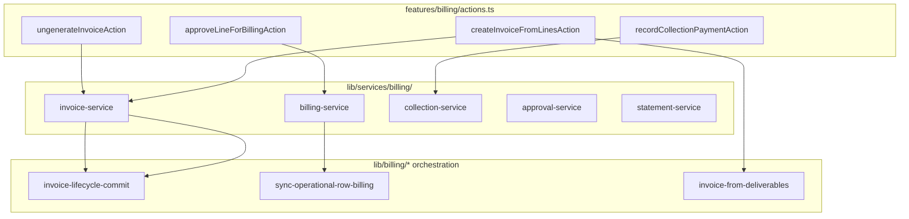

# Billing Service Layer Audit — Phase 3 Step 3

**Date:** June 2026  
**Branch:** `refactor/phase2-shared-domains-ui`  
**Scope:** Extract billing business logic from `features/billing/actions.ts` and `features/billing/queries.ts` into `lib/services/billing/`

---

## Executive Summary

Phase 3 Step 3 extracts the billing module god file into a dedicated service layer following the campaign extraction pattern (commits `4077e36`, `cc995e6`). Server actions and query entry points remain the public API; they follow **authorize → validate → invoke service → revalidate → return**.

**Primary extraction:** invoice lifecycle (create, append, ungenerate, regenerate), operational billing workflow (approve, move, bulk), collections, vendor payments, financial approvals, dashboard/statement reads, and campaign billing queries.

---

## LOC Metrics

| File | Before | After | Δ |
|------|--------|-------|---|
| `features/billing/actions.ts` | 1,551 | 182 | **−1,369 (−88%)** |
| `features/billing/queries.ts` | 922 | 47 | **−875 (−95%)** |
| **New service modules** | 0 | 2,781 | +2,781 |

### Module breakdown

| File | LOC | Role |
|------|-----|------|
| `billing-service.ts` | 704 | Line billing workflow + campaign billing queries |
| `invoice-service.ts` | 1,004 | Invoice create/append/ungenerate/regenerate + workspace |
| `statement-service.ts` | 427 | Dashboard assembly, aging, KPI enrichment |
| `approval-service.ts` | 52 | Financial approval chain + override |
| `collection-service.ts` | 31 | Client collection payments |
| `vendor-payment-service.ts` | 40 | Vendor payment batches |
| `billing-helpers.ts` | 48 | Shared helpers, result types |
| `repositories/billing-repository.ts` | 170 | Lines, approval requests |
| `repositories/invoice-repository.ts` | 130 | Invoice CRUD helpers |
| `repositories/payment-repository.ts` | 84 | Payments, vendor batches |
| `repositories/statement-repository.ts` | 67 | Dashboard read queries (stub exports) |
| `billing-service-layer.test.ts` | 19 | Regression tests |

**Net feature-layer reduction:** −2,244 LOC from entry files.

---

## Action Inventory

| Action | Service | Repository | Status |
|--------|---------|------------|--------|
| `approveLineForBillingAction` | `billing-service.approveLineForBilling` | inline + `billing-repository` | ✅ Extracted |
| `moveLineToBillingAction` | `billing-service.moveLineToBilling` | inline + `billing-repository` | ✅ Extracted |
| `bulkApproveOperationalBillingAction` | `billing-service.bulkApproveOperationalBilling` | `lib/billing/sync-operational-row-billing` | ✅ Extracted |
| `bulkMoveOperationalBillingAction` | `billing-service.bulkMoveOperationalBilling` | `lib/billing/sync-operational-row-billing` | ✅ Extracted |
| `createInvoiceFromLinesAction` | `invoice-service.createInvoiceFromLines` | inline + `invoice-repository` | ✅ Extracted |
| `recordCollectionPaymentAction` | `collection-service.recordCollectionPayment` | `payment-repository` | ✅ Extracted |
| `recordVendorPaymentAction` | `vendor-payment-service.recordVendorPayment` | `payment-repository` | ✅ Extracted |
| `decideFinancialApprovalAction` | `approval-service.decideFinancialApproval` | `billing-repository` | ✅ Extracted |
| `requestFinanceOverrideAction` | `approval-service.requestFinanceOverride` | `billing-repository` | ✅ Extracted |
| `grantFinanceOverrideAction` | `approval-service.grantFinanceOverride` | `billing-repository` | ✅ Extracted |
| `closeBillingLineAction` | `billing-service.closeBillingLine` | `billing-repository` | ✅ Extracted |
| `ungenerateInvoiceAction` | `invoice-service.ungenerateInvoice` | governance + lifecycle commit | ✅ Extracted |
| `regenerateInvoiceAction` | `invoice-service.regenerateInvoice` | lifecycle commit + line regen | ✅ Extracted |
| `loadCampaignBillingDetailAction` | `billing-service.getCampaignOperationalBillingDetail` | operational billing query | ✅ Extracted |
| `refreshBillingAfterInvoiceAction` | repair pipeline + detail reload | — | ✅ Thin wrapper |

---

## Query Inventory

| Query | Service | Status |
|-------|---------|--------|
| `getBillingDashboard` | `statement-service.getBillingDashboard` | ✅ Extracted |
| `getInvoiceWorkspace` | `invoice-service.getInvoiceWorkspace` | ✅ Extracted |
| `getCampaignBillingLines` | `billing-service.getCampaignBillingLines` | ✅ Extracted |
| `getCampaignBillingGroups` | `billing-service.getCampaignBillingGroups` | ✅ Extracted |
| `getCampaignOperationalBillingDetail` | `billing-service.getCampaignOperationalBillingDetail` | ✅ Extracted |

---

## Workflow Map



---

## Dependency Graph

```
features/billing/actions.ts  ──► lib/services/billing/*
features/billing/queries.ts  ──► lib/services/billing/*
lib/services/billing/*       ──► lib/billing/* (orchestration, unchanged)
lib/services/billing/*       ──► lib/finance/*, lib/vat/*, lib/auth/*
lib/services/billing/*       ──► features/billing/types (existing pattern)
lib/services/billing/*       ──✗ features/billing/actions (no reverse import)
```

**Dependency reduction:** `features/billing/actions.ts` no longer imports 30+ `lib/billing/*` modules directly; those imports are consolidated in service modules.

---

## Coupling Analysis

| Coupling | Before | After |
|----------|--------|-------|
| Actions → lib/billing | 20+ direct imports | 0 (via services) |
| Actions → Supabase mutations | Inline in actions | Repositories + services |
| Queries → Supabase reads | Inline in queries | statement/billing services |
| Invoice lifecycle | Monolithic action | `invoice-service` + existing `commitInvoiceLifecycleMutation` |

**Preserved coupling (intentional):** Heavy invoice orchestration remains in `lib/billing/*` helpers (`invoice-from-deliverables`, `invoice-lifecycle-commit`, IO coverage). Services coordinate these — same as campaign services delegating to `lib/campaigns/*`.

---

## Transaction Boundaries

| Operation | Boundary | Rollback |
|-----------|----------|----------|
| Create invoice (new) | `commitInvoiceLifecycleMutation` + `rollbackNewInvoiceDraft` | Unlock deliverables, delete line items + invoice |
| Append invoice | Lifecycle commit only | No draft rollback |
| Ungenerate | Version snapshot → lifecycle commit → repair pipeline | Version stored in `invoice_versions` |
| Regenerate | Scope resolution → line regen → lifecycle commit → version snapshot | Lifecycle commit handles sync |
| Collection payment | Insert payment → sync deliverable collections | No multi-table transaction (existing behavior) |
| Vendor payment | Batch insert → assignment update | No multi-table transaction (existing behavior) |

---

## Remaining God Files

| File | LOC | Notes |
|------|-----|-------|
| `lib/services/billing/invoice-service.ts` | 1,004 | Largest module; candidate for invoice-repository split of inline Supabase |
| `lib/services/billing/billing-service.ts` | 704 | Mixes mutations + queries; optional query split |
| `lib/billing/invoice-from-deliverables.ts` | — | Pre-existing orchestration (unchanged) |

---

## Validation

| Check | Result |
|-------|--------|
| `npx tsc --noEmit` | ✅ Pass |
| `npm run build` | ✅ Pass |
| `npx tsx lib/services/billing/billing-service-layer.test.ts` | ✅ Pass |

---

## Constraints Preserved

- ✅ No UX changes
- ✅ No database schema changes
- ✅ No API contract changes (action/query signatures unchanged)
- ✅ Server actions remain public entry points
- ✅ Routes, permissions, audit logging preserved
- ✅ Revalidation paths unchanged

---

## Phase 3 Reference

- Step 1: `4077e36` — campaign CRUD service layer
- Step 2: `cc995e6` — campaign workspace, publications, performance, deliverables
- Step 3: this commit — billing service layer

## Remaining Gaps (Phase 3 Step 4+)

1. **`lib/services/billing/invoice-service.ts`** — split inline Supabase into `invoice-repository` usage
2. **`statement-repository.ts`** — wire dashboard reads through repository (currently statement-service uses inline Supabase matching pre-extraction)
3. **Move `features/billing/types.ts`** — optional migration to `lib/domains/commercial/types` when domain types stabilize
