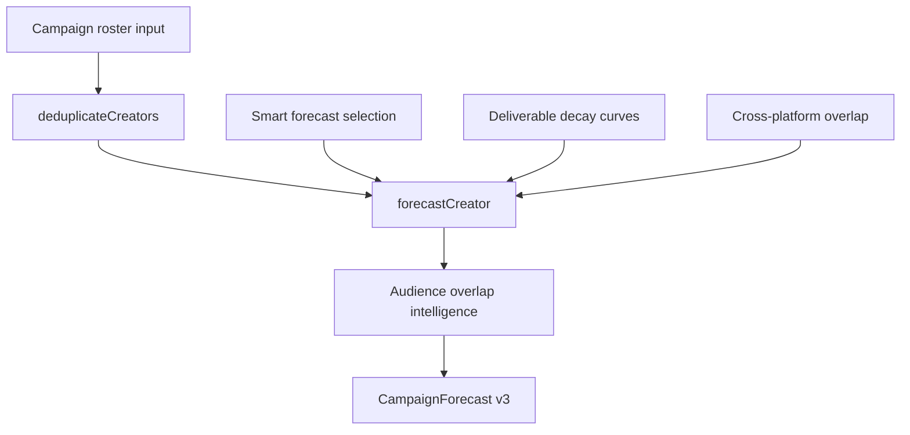

# Campaign Forecast Engine — Phase 2 Intelligence

**Version:** `forecast_engine_v3`  
**Entry point:** `computeCampaignForecast(input)` — unchanged API surface

Phase 2 upgrades the engine from generic multipliers to agency-grade intelligence while preserving a single source of truth.

---

## Architecture (Phase 2)



### Module map

| Module | Responsibility |
|--------|----------------|
| `forecast-strategy.ts` | Historical → similar creator → platform benchmark → generic |
| `deliverable-decay.ts` | Diminishing returns per content family |
| `audience-overlap.ts` | Pairwise + campaign overlap deduction |
| `cross-platform.ts` | Same-creator multi-platform dedup |
| `confidence.ts` | Data-driven 0–100 score with deductions |
| `studio-adapter.ts` | Campaign Studio roster → forecast input |
| `campaign-forecast-service.ts` | Studio wrapper + snapshot persistence |

---

## Strategy Selection Matrix

| Scenario | Selected strategy |
|----------|-------------------|
| Creator has historical publication metrics for content type | `historical_performance` |
| Category + platform known, no historical samples | `similar_creator_benchmark` |
| Platform known only | `platform_benchmark` |
| Followers only | `generic_multiplier` |

Run: `strategySelectionMatrix()` for programmatic access.

---

## Audience Overlap Model

Pairwise overlap signals (configurable):

- Shared country (+15%)
- Shared language (+10%)
- Same platform (+10%)
- Category Jaccard overlap (up to +15%)
- Same niche (+20%)
- Audience interest overlap (up to +10%)

Campaign reach:

```
grossReach = Σ creator net reach (after cross-platform)
overlapDeduction = Σ min(reachA, reachB) × pairOverlapRate
estimatedReach = max(maxSingleCreatorReach, grossReach − overlapDeduction)
```

**Example:** Creator A 500K + Creator B 300K, 20% overlap → gross 800K, deduction 160K, net **640K**.

---

## Deliverable Decay Model

Sequential units use family curves (not linear multiplication):

| Family | Unit 1 | Unit 2 | Unit 3 | Unit 4 |
|--------|--------|--------|--------|--------|
| Reel/Video | 100% | 80% | 65% | 55% |
| Story | 100% | 70% | 55% | 45% |
| Post | 100% | 85% | 72% | 62% |

---

## Historical Performance Model

Fallback order per deliverable:

1. `avgReachByContentType[contentType]` from recent publications
2. `avgViewsByContentType` × 0.92
3. Creator-level `avgReach` / `avgViews`
4. Similar creator benchmark (platform + category)
5. Platform benchmark (`reachFactor`)
6. Generic multiplier (`reach-forecast-engine`)

Pass historical data inline on `CampaignForecastCreatorInput` — no async DB calls inside the engine.

---

## Confidence Score Model

Base 25, then bonuses/deductions for:

| Factor | Impact |
|--------|--------|
| Followers present | +20 |
| Platform resolved | +10 |
| Engagement rate | +12 |
| Historical samples ≥10 | +18 |
| Verified account | +5 |
| Fresh metrics ≤14 days | +8 |
| Creator DNA completeness ≥70% | +6 |
| Audience intelligence present | +8 |
| Historical strategy selected | +10 |
| Missing historical data | −15 |
| Generic multiplier fallback | −8 |
| Stale metrics >60 days | −8 |
| High overlap >25% | −5 |

Every forecast exposes `confidenceScore.deductions` and `.bonuses` with reasons.

---

## Campaign Studio Integration

All Studio KPI surfaces now consume the same engine:

| Surface | Integration |
|---------|-------------|
| `patchKpiForecastFromSlate` | `studioForecastArtifacts()` → snapshot + grounded KPIs |
| `apply-draft-reoptimize` | Persists `campaignForecast` on performance section |
| `resolveGroundedKpis` | Prefers stored snapshot → grounded KPIs |
| `computeCampaignScores` | Reach / engagement / budget efficiency from forecast |

Snapshot type: `PerformanceSectionData.campaignForecast`

---

## Before vs After (Phase 2)

| Capability | Phase 1 (v2) | Phase 2 (v3) |
|------------|--------------|--------------|
| Campaign reach | Sum of creator reach | Overlap-adjusted net reach |
| Multi-deliverable | +15% per extra unit | Family decay curves |
| Strategy | Generic multiplier only | 4-tier auto selection |
| Historical data | Ignored | Preferred when available |
| Cross-platform | Summed | 35% overlap dedup |
| Confidence | Simple checklist | Deductions + bonuses |
| Campaign Studio | Industry templates | Same engine as quotations |

---

## Validation

```bash
npm run test:campaign-forecast-engine
```

Tests cover: overlap deduction, historical vs generic, deliverable decay, strategy matrix, confidence explainability.

---

## Unchanged (by design)

- Discovery, Creator DNA schema, BullMQ, campaign execution, performance provider sync
- Budget-driven `generateKpiForecast()` (budget-only projection)
- Industry narrative KPI reasoning (qualitative targets)
