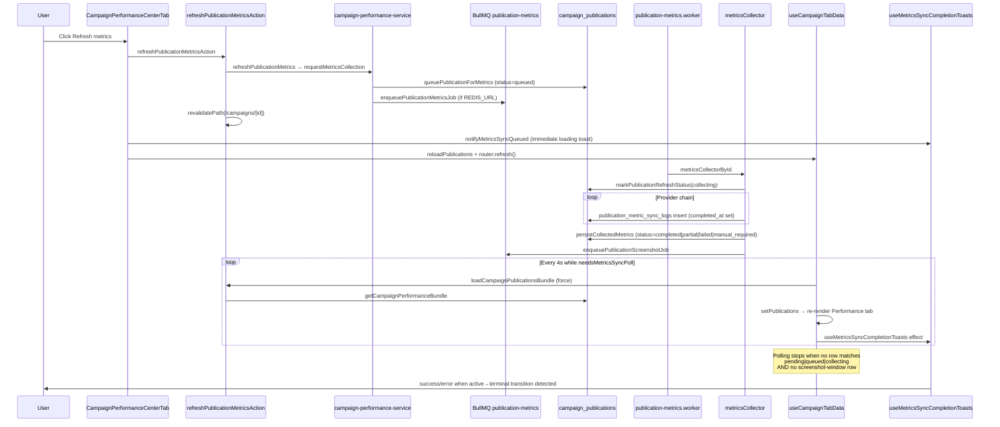

# Campaign Performance Polling — Root Cause Investigation

**Date:** 2026-06-27  
**Scope:** Read-only trace of metrics collection + client polling behavior. No code changes.  
**Symptoms reported (pre-existing):**

- Campaign Performance tab continuously refreshes while metrics collection is running
- Toast “Collecting metrics for X” appears repeatedly
- Metrics sometimes appear immediately without real collection
- Polling does not stop after collection completes

---

## Executive summary

The behavior is **mostly by design in the polling policy**, with **semantic mismatches** between status values and UI/poll logic as the primary root cause — not a missing cleanup hook or runaway interval multiplication.

| Issue | Primary root cause | Layer |
|-------|-------------------|-------|
| Continuous tab refresh during collection | 4s client poll refetches entire publications bundle and re-renders Performance tab | Frontend |
| Polling never stops (even when metrics “done”) | `pending` treated as in-flight; post-completion **screenshot poll window** (10 min); stuck `queued`/`collecting` if worker absent | Frontend policy + DB status |
| Repeated “Collecting metrics” toast | `pending` treated as active collection in toast hook; dual toast paths; bulk/all refresh; possible remount resets | Frontend |
| Metrics appear before/outside real collection | Existing DB metrics never cleared on queue; collector **seeds merge from stored metrics**; inline collection when Redis unavailable | Backend collector + Frontend display |

**Single most impactful failing condition:** `publicationsNeedMetricsSyncPoll()` returns `true` when **any** publication has `metrics_refresh_status === "pending"`, but `pending` means **“never collected”** (see `docs/PRODUCTION_METRICS_COLLECTION.md`), not “worker is running”. Campaigns with draft/no-URL publications therefore keep a **permanent 4s poll loop** for the entire workspace session.

---

## End-to-end timeline



### Step reference (with line citations)

| Step | Location | What happens |
|------|----------|--------------|
| 1. User triggers refresh | `campaign-performance-center-tab.tsx` L269–284 | `handleRefreshPublication` → server action → optional `notifyMetricsSyncQueued` → `refreshAfterPublicationMutation()` |
| 2. Queue + DB queued | `collect-publication-metrics.ts` L44–64, L53–56 | `queuePublicationForMetrics` then `enqueuePublicationMetricsJob` |
| 3. DB status queued | `persist.ts` L1115–1134 | `metrics_refresh_status: "queued"` |
| 4. Server cache revalidation | `performance-actions.ts` L123–131 | `revalidateCampaign` on success |
| 5. Client refetch (mutation) | `campaign-operational-refresh.tsx` L57–64 | `reloadPublications()` + `router.refresh()` |
| 6. Worker pickup | `publication-metrics.worker.ts` L14–41 | BullMQ job → `metricsCollectorById` |
| 7. Collecting status | `metrics-collector.ts` L74–78 | `markPublicationRefreshStatus(..., "collecting")` |
| 8. Provider logs | `metrics-collector.ts` L187–209, `persist.ts` L82–102 | One row per provider attempt; `completed_at` when `completed: true` |
| 9. Persist outcome | `metrics-collector.ts` L267–307, `persist.ts` L906–968 | Updates metrics + terminal `metrics_refresh_status` |
| 10. Screenshot queued | `metrics-collector.ts` L379–396 | Separate queue; may leave `screenshot_captured_at` null |
| 11. Poll loop | `use-campaign-tab-data.ts` L315–328 | `setInterval` 4000ms → `loadBundle("publications", { force: true })` |
| 12. Poll stop condition | `metrics-sync-poll-policy.ts` L36–44 | `publicationsNeedMetricsSyncPoll` false → interval cleared |

---

## Frontend architecture

### Polling entry point (not in `publication-workspace.tsx`)

`PublicationWorkspace` is a **passive consumer** of `publications` props. It does not poll. Polling lives in `useCampaignTabData`, mounted once at `CampaignWorkspaceView` level.

```315:328:features/campaigns/hooks/use-campaign-tab-data.ts
  const needsMetricsSyncPoll = useMemo(
    () => publicationsNeedMetricsSyncPoll(publications),
    [publications]
  );

  useEffect(() => {
    if (!needsMetricsSyncPoll) return;

    const timer = window.setInterval(() => {
      void loadBundle("publications", { force: true });
    }, METRICS_SYNC_POLL_INTERVAL_MS);

    return () => window.clearInterval(timer);
  }, [needsMetricsSyncPoll, loadBundle]);
```

- **Interval:** `METRICS_SYNC_POLL_INTERVAL_MS = 4_000` (`metrics-sync-poll-policy.ts` L47)
- **Fetch target:** `loadCampaignPublicationsBundle` → `getCampaignPerformanceBundle` (full grid + KPIs + charts + sync health)
- **Silent refresh:** `isSilentDeferredBundleRefresh` avoids skeleton flash but still calls `setPublications` (`deferred-bundle-policy.ts` L13–17, `use-campaign-tab-data.ts` L220–256)

### Poll policy

```1:47:features/campaigns/hooks/metrics-sync-poll-policy.ts
const ACTIVE_METRICS_SYNC_STATUSES = new Set(["pending", "queued", "collecting"]);
// ...
export function publicationsNeedMetricsSyncPoll(
  publications: PublicationSyncPollRow[]
): boolean {
  return publications.some((row) => {
    const status = row.metrics_refresh_status;
    if (status != null && ACTIVE_METRICS_SYNC_STATUSES.has(status)) return true;
    return publicationNeedsScreenshotCapturePoll(row);
  });
}
```

**Screenshot extension (intentional):** After metrics reach `completed` or `partial`, polling continues up to **10 minutes** if `content_url` is set and `screenshot_captured_at` is null (`metrics-sync-poll-policy.ts` L7–33, tested in `metrics-sync-poll-policy.test.ts` L130–184).

### Toast paths (two independent triggers)

**Path A — explicit on user action** (`campaign-performance-center-tab.tsx` L219–224, L276–278):

```219:224:features/campaigns/components/performance/campaign-performance-center-tab.tsx
  function queueMetricsSyncToasts(publicationIds: string[]) {
    for (const id of publicationIds) {
      const row = publications.find((p) => p.id === id);
      notifyMetricsSyncQueued(id, row?.influencer_name);
    }
  }
```

**Path B — hook on every `publications` change** (`campaign-workspace.tsx` L104, `use-metrics-sync-toasts.ts` L38–78):

```53:57:features/campaigns/hooks/use-metrics-sync-toasts.ts
      if (status != null && ACTIVE_METRICS_SYNC_STATUSES.has(status)) {
        if (prior == null || !ACTIVE_METRICS_SYNC_STATUSES.has(prior)) {
          toast.loading(`Collecting metrics for ${label}…`, { id: toastId });
        }
      }
```

Both paths use the same Sonner id (`metrics-sync-${publicationId}`), but Path B fires on **any transition into an “active” status**, including first sighting of `pending` rows when the bundle first loads.

### Mutation refresh stack (amplifies “continuous refresh” on click)

```57:64:features/campaigns/hooks/campaign-operational-refresh.tsx
export function useRefreshCampaignAfterPublicationMutation() {
  const router = useRouter();
  const reloadPublications = useCampaignPublicationsRefresh();

  return useCallback(() => {
    void reloadPublications?.();
    router.refresh();
  }, [reloadPublications, router]);
}
```

On each refresh click: **client bundle refetch + Next.js RSC refresh + 4s poll** (if policy says poll needed).

**Poll cycles do not call `router.refresh()`** — only `loadBundle`. Server `revalidatePath` runs on the mutation action, not on poll.

---

## Backend / queue / DB

### Request path

```239:265:lib/services/campaigns/campaign-performance-service.ts
export async function refreshPublicationMetrics(...) {
  const result = await requestMetricsCollection(supabase, {
    publicationId: input.publicationId,
    campaignHeaderId: input.campaignId,
    triggeredBy: "manual_refresh",
  });
  if (result.mode === "queued") {
    return { ok: true, message: "Metrics collection queued.", status: "queued" };
  }
  // inline path when Redis unavailable
```

```44:68:lib/performance/metrics-collector/collect-publication-metrics.ts
export async function requestMetricsCollection(...) {
  await queuePublicationForMetrics(supabase, { ... });  // status → queued
  if (isMetricsQueueAvailable()) {
    await enqueuePublicationMetricsJob({ ... });
    return { mode: "queued" };
  }
  const outcome = await metricsCollectorById(supabase, input);
  return { mode: "inline", outcome };
}
```

### Worker

```14:41:services/discovery-worker/src/workers/publication-metrics.worker.ts
export function startPublicationMetricsWorker(): Worker<PublicationMetricsJobData> {
  return new Worker<PublicationMetricsJobData>(
    QUEUES.publicationMetrics,
    async (job) => {
      const outcome = await metricsCollectorById(supabase, { ... });
      return { publicationId, status: outcome.status, source: outcome.source };
    },
    { connection: getRedisConnection(), concurrency: 2 }
  );
}
```

### Status transitions (DB)

| Phase | `metrics_refresh_status` | Writer |
|-------|-------------------------|--------|
| Created (manual) | `pending` | `publication-actions.ts` L91 |
| User/scheduler request | `queued` | `persist.ts` L1115–1134 |
| Worker starts | `collecting` | `metrics-collector.ts` L74–78 |
| Success / partial / fail | `completed` / `partial` / `failed` / `manual_required` | `persist.ts` via `persistCollectedMetrics` or `markPublicationRefreshStatus` |

### `publication_metric_sync_logs`

- Inserted per **provider attempt** in `writeSyncLog` (`persist.ts` L82–102)
- Provider attempts pass `completed: true` (`metrics-collector.ts` L201)
- `completed_at` set when `input.completed` is true (`persist.ts` L94)
- **No single “job opened / job closed” row** for the overall BullMQ job — only per-provider rows plus ER/reach audit rows
- If worker dies after `collecting` is written, logs may show partial provider attempts but publication row can remain **`collecting`** with no terminal publication-level log

### “Metrics appear without collection” — backend mechanisms

1. **UI shows existing DB values while status is `queued`/`collecting`** — queue path does not zero metrics.
2. **Collector seeds from stored metrics** (except `manual_restore_automatic`):

```154:157:lib/performance/metrics-collector/metrics-collector.ts
  let merged: Partial<CollectedMetrics> =
    options.triggeredBy === "manual_restore_automatic"
      ? {}
      : storedMetricsFromPublication(publication as Record<string, unknown>);
```

3. **Inline mode** — without `REDIS_URL`, collection runs synchronously inside the server action; UI may show success before any poll (`collect-publication-metrics.ts` L58–68).
4. **Fast worker completion** — metrics persisted before first 4s poll; user perceives instant update.

---

## Verification checklist (answers)

### How many polling intervals can run simultaneously?

**One** per `useCampaignTabData` instance (one per campaign workspace view).

- Interval created in `use-campaign-tab-data.ts` L320–327
- Cleanup on `needsMetricsSyncPoll === false` or unmount
- `inFlightRef` dedupes concurrent `loadBundle("publications")` calls (`use-campaign-tab-data.ts` L213–214) but does not block sequential poll + mutation refetches

React Strict Mode may mount/unmount once in dev; not a sustained multi-interval leak.

### Does polling stop on `completed` / `failed`?

| Status | Polling |
|--------|---------|
| `completed` / `partial` / `failed` / `manual_required` | Stops **unless** screenshot poll window applies |
| `queued` / `collecting` | Continues |
| `pending` | **Continues indefinitely** (bug/semantic mismatch) |
| `null` | Stops (not in active set) |

Failed publications stop polling. Completed publications may poll up to **10 min** waiting for screenshot.

### Toast repeated due to rerenders?

**Partially yes — by design gaps, not Sonner id failure alone.**

| Mechanism | Repeated toast? |
|-----------|----------------|
| Poll updates `publications` every 4s | Effect re-runs, but `previousStatusRef` should suppress duplicate loading toasts for stable `collecting`/`queued` |
| `pending` on first bundle load | **Yes — once per publication per mount** (“Collecting…” though nothing is running) |
| Re-queue after terminal status | **Yes — once per re-queue** (`prior` terminal → `queued`) |
| `notifyMetricsSyncQueued` + hook on same click | Same toast id; may flash update |
| Bulk “Refresh all metrics” | **N loading toasts** (one per publication id) |
| `CampaignWorkspaceView` remount (navigation) | Ref resets → pending/active toasts fire again |

Most likely user-visible “repeated” pattern: **many publications with `pending`**, and/or **pending mislabeled as “Collecting metrics”** on each workspace entry.

### Workspace revalidated every poll?

| Mechanism | On poll? | On mutation? |
|-----------|----------|--------------|
| `loadCampaignPublicationsBundle` (client server action) | Yes, every 4s | Yes |
| `router.refresh()` (RSC) | No | Yes |
| `revalidatePath` | No | Yes (`performance-actions.ts` L29–31) |

Poll causes **full client-side publications state replace** → Performance tab (grid, KPI strip, charts, sync health) re-renders. Not a Next.js server revalidation each poll.

### Cached metrics reused without collection?

**Yes.** `storedMetricsFromPublication` pre-fills merge; `mergeCollectedMetrics` retains non-null existing values when providers return null (see regression test in `campaign-performance-regression.test.ts`). Refresh re-persists merged snapshot even when providers add nothing new (if `hasAnyMetric(merged)` and `winningSource` set).

### `publication_metric_sync_logs` rows closed correctly?

**Per provider attempt: yes** (`completed_at` populated).  
**Per BullMQ job: no dedicated open/close row** — infer job completion from publication `metrics_refresh_status` + last log timestamp.  
**Failure mode:** worker crash after `collecting` → publication stuck, logs may be incomplete relative to job lifecycle.

---

## Root cause by symptom

### 1. Continuous refresh while collecting

**Expected:** 4s polling is intentional while policy returns true.  
**Amplifiers:** mutation path adds immediate refetch + `router.refresh()`; entire bundle (not single row) is refetched; tabs use `forceMount` so Performance tab stays mounted and re-renders on each poll.

### 2. Toast “Collecting metrics for X” repeatedly

**Root causes (ranked):**

1. **`pending` ∈ ACTIVE statuses in `use-metrics-sync-toasts.ts` L8** — never-collected rows trigger “Collecting…” on first observation.
2. **Dual toast entry points** — `notifyMetricsSyncQueued` on click + hook on status transitions.
3. **Bulk refresh** — `queueMetricsSyncToasts(publications.map(...))` (`campaign-performance-center-tab.tsx` L226–231).
4. **Re-queue transitions** — terminal → `queued` legitimately re-shows loading toast.

### 3. Metrics appear immediately without real collection

**Root causes:**

1. Pre-existing metrics remain visible during `queued`/`collecting`.
2. Collector merge baseline from `storedMetricsFromPublication`.
3. Inline collection when Redis queue unavailable.
4. Sub-4s worker completion before first poll.

### 4. Polling does not stop after collection completes

**Root causes (ranked):**

1. **Screenshot poll window** — by design up to 10 min (`SCREENSHOT_CAPTURE_POLL_WINDOW_MS`).
2. **`pending` rows in same campaign** — any never-synced publication keeps campaign-level poll active.
3. **Stuck `queued`/`collecting`** — worker not running / Redis down / job failure without terminal status update.
4. **User expectation mismatch** — metrics terminal but screenshot still pending looks like “collection still running”.

---

## Recommended fixes (do not implement in this pass)

### Frontend — poll policy (`metrics-sync-poll-policy.ts`)

1. **Remove `pending` from `ACTIVE_METRICS_SYNC_STATUSES`.** Poll only `queued` and `collecting` (true in-flight). Treat `pending` as idle until explicitly queued.
2. **Split screenshot polling** from metrics polling — separate interval or flag so metrics completion stops the “collecting” UX even if screenshot is pending.
3. **Optional:** Poll only affected publication ids (status in-flight) instead of full bundle, or merge row updates to reduce re-render surface.

### Frontend — toasts (`use-metrics-sync-toasts.ts`)

1. Remove `pending` from active set; use copy like “Metrics not synced yet” only on explicit user action if needed.
2. Consolidate to **one** toast owner — either `notifyMetricsSyncQueued` or the hook, not both on the same action.
3. Guard bulk toasts (single campaign-level loading toast, or suppress hook when `notifyMetricsSyncQueued` just ran).

### Frontend — refresh mutation (`campaign-operational-refresh.tsx`)

1. Consider dropping `router.refresh()` for publication-only mutations if deferred bundle refetch is sufficient — reduces double-fetch and remount risk.

### Backend — status semantics

1. On create without `content_url`, use `pending` but document that it must **not** drive in-flight polling.
2. When queueing, consider transitioning `pending` → `queued` only (already done); ensure rows never revert to `pending` mid-flight.

### Backend — collector (`metrics-collector.ts`)

1. For `manual_refresh`, optionally skip `storedMetricsFromPublication` seed so UI can show a cleared/loading state (product decision).
2. Ensure worker failure paths always call `markPublicationRefreshStatus(..., "failed")` (BullMQ `failed` handler / DLQ audit).

### Operations

1. Verify `REDIS_URL` + discovery-worker running; stuck `queued` is often infra not code.
2. Query stuck rows: `metrics_refresh_status IN ('queued','collecting') AND metrics_refresh_attempted_at < now() - interval '5 minutes'`.

---

## Where console logging WOULD go (read-only recommendation)

Do **not** add unless debugging a specific environment. Preferred locations:

| Event | File | Suggested log |
|-------|------|---------------|
| Poll start/stop | `use-campaign-tab-data.ts` ~L320 | `[metrics-poll] start/stop campaignId=… needsPoll=… activeCount=… pendingCount=…` |
| Interval tick | `use-campaign-tab-data.ts` ~L323 | `[metrics-poll] tick bundle=publications force=true` |
| Policy decision | `metrics-sync-poll-policy.ts` ~L36 | `[metrics-poll] publicationId=… status=… screenshotWindow=… → needsPoll` |
| Toast firing | `use-metrics-sync-toasts.ts` ~L53 | `[metrics-toast] id=… prior=… next=… action=loading|success|error` |
| Explicit queue toast | `use-metrics-sync-toasts.ts` ~L20 | `[metrics-toast] notifyQueued id=…` |
| Mutation refetch | `campaign-operational-refresh.tsx` ~L61 | `[metrics-poll] mutation refetch publications + router.refresh` |
| Queue write | `persist.ts` ~L1115 | `[metrics-collector] queued publicationId=…` |
| Status transition | `persist.ts` ~L1090 | `[metrics-collector] status publicationId=… → …` |
| Worker job | `publication-metrics.worker.ts` ~L17 | `[publication-metrics] job start/complete id=… status=…` |
| Provider attempt | `metrics-collector.ts` ~L182 | Already logged |

---

## Affected files (reference)

| Layer | Files |
|-------|-------|
| **Frontend — polling** | `features/campaigns/hooks/use-campaign-tab-data.ts`, `features/campaigns/hooks/metrics-sync-poll-policy.ts`, `features/campaigns/hooks/deferred-bundle-policy.ts` |
| **Frontend — toasts** | `features/campaigns/hooks/use-metrics-sync-toasts.ts`, `features/campaigns/components/campaign-workspace.tsx`, `features/campaigns/components/performance/campaign-performance-center-tab.tsx` |
| **Frontend — refresh** | `features/campaigns/hooks/campaign-operational-refresh.tsx` |
| **Frontend — display** | `features/campaigns/components/performance/campaign-performance-center-tab.tsx`, `features/campaigns/components/performance/publication-workspace/publication-workspace.tsx` |
| **Server actions** | `features/campaigns/actions/performance-actions.ts`, `features/campaigns/actions/load-campaign-tab-data.ts` |
| **Service** | `lib/services/campaigns/campaign-performance-service.ts`, `lib/services/campaigns/campaign-publication-service.ts` |
| **Collector** | `lib/performance/metrics-collector/collect-publication-metrics.ts`, `lib/performance/metrics-collector/metrics-collector.ts`, `lib/performance/metrics-collector/persist.ts`, `lib/performance/metrics-collector/queue.ts` |
| **Worker** | `services/discovery-worker/src/workers/publication-metrics.worker.ts`, `services/discovery-worker/src/index.ts` |
| **DB** | `campaign_publications.metrics_refresh_status`, `publication_metric_sync_logs` |
| **Tests documenting intent** | `features/campaigns/hooks/metrics-sync-poll-policy.test.ts` |

---

## Related docs

- `docs/PRODUCTION_METRICS_COLLECTION.md` — status meanings (`pending` = never collected)
- `docs/PUBLICATION_WORKSPACE_QA.md` — drawer stability during parent poll refresh
- `docs/INSTAGRAM_SCREENSHOT_PIPELINE.md` — screenshot pending after metrics complete

---

## Conclusion

The polling loop itself **works as coded**: one interval, cleanup on policy false, terminal metrics statuses stop metrics-phase polling. The reported issues come from **policy treating `pending` as in-flight**, **post-metrics screenshot polling**, **full-bundle refetch re-rendering the tab every 4s**, and **toasts/copy aligned with in-flight states for never-collected rows**. Metrics appearing “before collection” is largely **existing data + merge seeding**, not a separate cache bug.

Fix priority: **remove `pending` from client active-status sets** (poll + toast), then **decouple screenshot wait from metrics polling UX** (30s screenshot poll vs 4s in-flight poll), then **reduce duplicate refresh on mutation**.

**Implemented 2026-06-27:** `pending` removed from in-flight poll/toast sets; screenshot capture uses `publicationsNeedScreenshotCapturePoll` at 30s interval, separate from 4s in-flight metrics poll in `use-campaign-tab-data.ts`.
