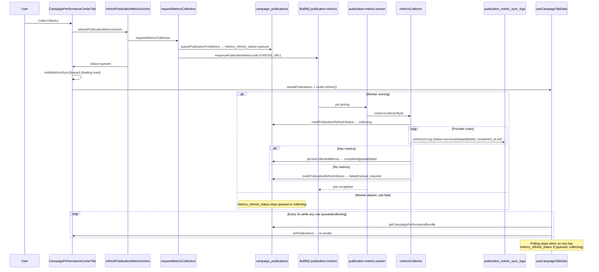

# Campaign Performance Sync Stuck — Root Cause Investigation

**Date:** 2026-06-27  
**Scope:** Read-only trace after frontend fix `cd301b1`. No code changes.  
**Symptoms (post-fix):**

- Performance tab still refreshes every 4s while collection appears active
- Loading toast “Collecting metrics for X…” stays visible indefinitely
- Grid rows remain `queued` or `collecting` and never reach a terminal status
- Frontend polls only in-flight statuses — polling is correct; backend never completes

**Prior context:** `docs/CAMPAIGN_PERFORMANCE_POLLING_INVESTIGATION.md` (pre-fix `pending` polling bug, fixed in `cd301b1`).

---

## Executive summary

| Question | Answer |
|----------|--------|
| **Root cause** | **Backend/infra:** `campaign_publications.metrics_refresh_status` never transitions from `queued`/`collecting` to a terminal state. The frontend fix works as designed — it now *correctly* keeps polling until the worker finishes, exposing stuck rows that were previously masked by `pending` polling. |
| **Table/field mismatch?** | **No.** Frontend, worker, and queue path all read/write **`campaign_publications.metrics_refresh_status`**. There is no `metrics_sync_status` column in the codebase. |
| **Stale table** | **`campaign_publications`** — specifically `metrics_refresh_status` stuck at `queued` or `collecting`. |
| **Sync logs vs publication status** | **`publication_metric_sync_logs`** records per-provider attempts only; it does **not** drive client polling and often has `metrics_refresh_status = null` on provider rows. |

**Single most likely failure mode:** discovery-worker not running, Redis/worker misconfiguration, or BullMQ job failure without a DB terminal-status write — leaving the publication row stuck while the UI (correctly) polls forever.

---

## End-to-end lifecycle (single publication)



### Step reference

| Step | File | Behavior |
|------|------|----------|
| User click | `campaign-performance-center-tab.tsx` L269–284 | `handleRefreshPublication` → action → `notifyMetricsSyncQueued` on `status === "queued"` |
| Queue DB write | `persist.ts` L1115–1134 | `metrics_refresh_status: "queued"` (**does not** set `metrics_refresh_attempted_at`) |
| Enqueue | `collect-publication-metrics.ts` L53–64, `queue.ts` L37–44 | BullMQ job `collect-metrics` on queue `publication-metrics` |
| Worker start | `publication-metrics.worker.ts` L14–41 | Calls `metricsCollectorById` with service-role Supabase |
| Collecting | `metrics-collector.ts` L74–78 | `markPublicationRefreshStatus(..., "collecting")` + sets `metrics_refresh_attempted_at` |
| Provider logs | `metrics-collector.ts` L187–209, `persist.ts` L82–102 | One log row per provider; `completed_at` when `completed: true` |
| Terminal success | `metrics-collector.ts` L292–307, `persist.ts` L906–968 | `persistCollectedMetrics` → `metrics_refresh_status: completed\|partial\|failed`, `last_synced_at` |
| Terminal no-metrics | `metrics-collector.ts` L397–402 | `markPublicationRefreshStatus` with `outcome.status` |
| Client poll | `use-campaign-tab-data.ts` L317–338 | 4s interval while `publicationsNeedMetricsSyncPoll` |
| Poll policy (post-cd301b1) | `metrics-sync-poll-policy.ts` L61–66 | Poll only when `metrics_refresh_status ∈ {queued, collecting}` |
| Toast | `use-metrics-sync-toasts.ts` L56–58 | Loading on transition into in-flight; success/error only on in-flight → terminal |

---

## Field naming (no `metrics_sync_status`)

The codebase uses **`metrics_refresh_status`** exclusively. Grep finds **zero** references to `metrics_sync_status`.

| User term | Actual column | Table | Set by |
|-----------|---------------|-------|--------|
| Sync status (UI poll) | `metrics_refresh_status` | `campaign_publications` | Worker via `markPublicationRefreshStatus` / `persistCollectedMetrics` |
| Last sync time | `last_synced_at` | `campaign_publications` | `persistCollectedMetrics` on success |
| Last attempt time | `metrics_refresh_attempted_at` | `campaign_publications` | `markPublicationRefreshStatus`, `persistCollectedMetrics` |
| Legacy sync labels | `sync_status`, `api_sync_status` | `campaign_publications` | Mirrored to `refreshStatus` in `persistCollectedMetrics` L945–947 — **not polled by client** |
| Provider attempt status | `status` | `publication_metric_sync_logs` | `writeSyncLog` — values: `success`, `skipped`, `failed`, `er_recalculated`, etc. |
| Optional mirror on log | `metrics_refresh_status` | `publication_metric_sync_logs` | Usually **null** on provider rows; set on ER/reach audit rows only |

---

## Publication “Amir Youssef” — expected DB state

**Known publication ID (from `.tmp/probe-amir-avatar-live.ts`):**  
`02e7e3eb-649c-426a-88e6-6c456dcf541a` — Instagram, handle `amiryoussef.official`.

Cannot query prod DB from this pass; expected values by phase:

### A) Immediately after user clicks Collect Metrics

| Field | Expected value |
|-------|----------------|
| `campaign_publications.metrics_refresh_status` | `queued` |
| `campaign_publications.metrics_refresh_attempted_at` | `null` (queued write does not set it) |
| `campaign_publications.last_synced_at` | Previous value unchanged |
| `publication_metric_sync_logs` | No new rows yet |
| BullMQ `publication-metrics` | Job in `waiting` or `active` |

### B) Worker picked up job

| Field | Expected value |
|-------|----------------|
| `metrics_refresh_status` | `collecting` |
| `metrics_refresh_attempted_at` | ~now (set by `markPublicationRefreshStatus`) |
| `publication_metric_sync_logs` | Rows appearing per provider (`apify`, etc.), each with `completed_at` set |

### C) Successful collection (typical IG via Apify)

| Field | Expected value |
|-------|----------------|
| `metrics_refresh_status` | `completed` or `partial` |
| `metrics_refresh_attempted_at` | ~now |
| `last_synced_at` | ~now |
| `metrics_provider` / `metrics_collection_source` | e.g. `apify` |
| `views`, `likes`, `comments`, … | Updated from provider |
| `publication_metric_sync_logs` | Latest `apify` row: `status=success`, `completed_at` set, `metrics_snapshot` populated |
| BullMQ job | `completed` (removed per `removeOnComplete: 1000`) |

### D) Stuck state (matches reported symptoms)

| Symptom | Likely DB pattern | Interpretation |
|---------|-------------------|----------------|
| Stuck `queued` | `metrics_refresh_status=queued`, `metrics_refresh_attempted_at=null`, no recent sync logs | Job never consumed — **worker down**, wrong Redis, or job lost |
| Stuck `collecting` | `metrics_refresh_status=collecting`, partial sync logs, no terminal update | Worker started then **crashed/threw** before `persistCollectedMetrics` / final `markPublicationRefreshStatus` |
| Stuck `collecting` + failed BullMQ | Same DB + job in Redis `failed` after 3 attempts | Worker **`failed` handler does not update DB** |

**Diagnostic queries (ops):**

```sql
-- Publication row
SELECT id, influencer_id, content_url, platform,
       metrics_refresh_status, metrics_refresh_attempted_at,
       last_synced_at, metrics_provider, updated_at
FROM campaign_publications
WHERE id = '02e7e3eb-649c-426a-88e6-6c456dcf541a';

-- Recent sync logs
SELECT provider, status, message, error_code, completed_at, created_at, triggered_by
FROM publication_metric_sync_logs
WHERE publication_id = '02e7e3eb-649c-426a-88e6-6c456dcf541a'
ORDER BY created_at DESC
LIMIT 10;

-- Stuck rows campaign-wide
SELECT id, metrics_refresh_status, metrics_refresh_attempted_at, updated_at
FROM campaign_publications
WHERE metrics_refresh_status IN ('queued', 'collecting')
  AND updated_at < now() - interval '5 minutes';
```

---

## Frontend polling — what field is read?

Post-`cd301b1`, the client polls **`metrics_refresh_status`** on publication rows from the performance bundle.

```61:66:features/campaigns/hooks/metrics-sync-poll-policy.ts
/** Poll publications bundle while metrics collection jobs are in flight (queued/collecting only). */
export function publicationsNeedMetricsSyncPoll(
  publications: PublicationSyncPollRow[]
): boolean {
  return publications.some((row) => isSyncInFlight(row.metrics_refresh_status));
}
```

```3:8:features/campaigns/hooks/metrics-sync-poll-policy.ts
/** Worker-backed statuses: publication is actively being collected. */
export const IN_FLIGHT_SYNC_STATUSES = ["queued", "collecting"] as const;
```

**Data path:**

1. `use-campaign-tab-data.ts` → `loadCampaignPublicationsBundle` (4s while in-flight)
2. `load-campaign-tab-data.ts` → `getCampaignPerformanceBundle`
3. `campaign-publication-service.ts` L255 → maps `r.metrics_refresh_status`
4. `publication-repository.ts` → selects `metrics_refresh_status` in schema-driven column list

**Screenshot poll (separate, 30s):** After metrics reach `completed`/`partial`, a slower poll may run for up to 10 min if `content_url` is set and `screenshot_captured_at` is null. This does **not** show “Collecting metrics” toasts and is **not** the cause of infinite 4s refresh when rows are `queued`/`collecting`.

**Toast persistence:** `notifyMetricsSyncQueued` (on click) sets a Sonner **loading** toast. `useMetricsSyncCompletionToasts` only dismisses/replaces it on **in-flight → terminal** transition. If DB never reaches terminal, the loading toast stays forever — even though the hook no longer re-fires loading on every poll tick.

---

## Worker verification

### Does the worker always mark completed?

**No.** Normal happy path always reaches a terminal write:

| Path | Terminal writer | Status |
|------|-----------------|--------|
| Metrics persisted | `persistCollectedMetrics` | `completed` / `partial` / input status |
| No metrics after providers | `markPublicationRefreshStatus` | `failed` / `manual_required` |
| Unsupported Instagram URL | `markPublicationRefreshStatus` | `failed` (early return L124–128) |

**Gaps — terminal status NOT written:**

| Scenario | Resulting DB status | Evidence |
|----------|---------------------|----------|
| BullMQ job throws (DB error, OOM, unhandled exception) after `collecting` set | **`collecting`** | Worker processor has no `try/finally`; `publication-metrics.worker.ts` L17–41 |
| BullMQ job fails all 3 retries | **`collecting` or `queued`** | `index.ts` L53–55 logs only — **no `markPublicationRefreshStatus("failed")`** |
| Worker process not running | **`queued`** | Job sits in Redis `waiting`; scheduler re-enqueues hourly for `queued` only |
| Stalled BullMQ job | **`collecting`** | No `stalled` handler; scheduler **excludes** `collecting` from recovery scan |
| `markPublicationRefreshStatus` Supabase error | Prior status unchanged | L1108–1112 — **no error check** on update |
| `persistCollectedMetrics` throws mid-run | **`collecting`** | Error propagates to BullMQ; no rollback of status |

### Early returns that DO complete

- Instagram unsupported URL → `failed` before provider loop (`metrics-collector.ts` L91–138)
- Provider exceptions → caught in `registry.ts` L74–79, logged as failed attempt, collection continues

### Swallowed exceptions

- Follower sync, avatar persist, screenshot enqueue → `console.warn` only; do **not** block terminal metrics status
- `markPublicationRefreshStatus` → **silent** on Supabase failure (no throw)

### BullMQ configuration

- Queue name: `publication-metrics` (consistent in `queue.ts`, `names.ts`, worker)
- Retries: 3 attempts, exponential backoff 5s (`queue.ts` L13–16)
- Retention: `removeOnComplete: 1000`, `removeOnFail: 100`
- Concurrency: 2 (`publication-metrics.worker.ts` L45)

### Scheduler recovery gap

`publication-metrics-scheduler.ts` L20 re-scans statuses `["queued", "pending", "completed", "partial", "failed"]` — **`collecting` is excluded**. Rows stuck in `collecting` are never re-queued by the hourly scheduler.

---

## Sync logs vs publication status divergence

These are **different layers by design**, not a bug where the UI reads the wrong table:

| Layer | Purpose | Client uses? |
|-------|---------|--------------|
| `campaign_publications.metrics_refresh_status` | Job lifecycle for UI polling | **Yes** |
| `publication_metric_sync_logs.status` | Per-provider attempt outcome | No (workspace drawer loads separately via `loadPublicationSyncLogs`) |
| `publication_metric_sync_logs.metrics_refresh_status` | Optional audit mirror | Usually null on provider rows |

Provider `writeSyncLog` calls (`metrics-collector.ts` L187–209) do **not** pass `metricsRefreshStatus`, so log rows can show `status=success` with `completed_at` set while the publication row is still `collecting` — until `persistCollectedMetrics` runs.

**Infer job completion from:** publication `metrics_refresh_status` + last log timestamp, not a single “job closed” log row.

---

## Verification checklist (A–E)

| # | Question | Finding |
|---|----------|---------|
| **A** | Worker running? | **Unknown in prod** — must verify discovery-worker process + `REDIS_URL`. Stuck `queued` with no sync logs strongly suggests **no**. |
| **B** | Worker finishing? | Code path finishes on success/failure **inside** `metricsCollector`. BullMQ `failed` events do **not** imply DB terminal status. |
| **C** | DB status updated? | **Only if worker completes** `persistCollectedMetrics` or `markPublicationRefreshStatus`. Stuck rows = stale `campaign_publications.metrics_refresh_status`. |
| **D** | Which field does frontend poll? | **`metrics_refresh_status`** via `publicationsNeedMetricsSyncPoll` → `isSyncInFlight`. |
| **E** | Which table is stale? | **`campaign_publications`** (not sync logs). |

---

## Effect of frontend fix `cd301b1`

| Before | After |
|--------|-------|
| Polled `pending`, `queued`, `collecting` | Polls **`queued`, `collecting` only** |
| Never-collected drafts caused permanent 4s poll | Drafts with `pending` no longer poll |
| Screenshot wait bundled into 4s metrics poll | Screenshot uses separate 30s interval |
| “Collecting” toast on first sight of `pending` | Loading toast only on transition into `queued`/`collecting` |

**Why symptoms persist:** If user clicks Collect Metrics, row becomes `queued` → frontend **should** poll until terminal. When worker never completes, behavior is **correct but exposes infra/backend gap**. The fix removed false-positive polling; it did not fix worker completion.

---

## Where temporary logs WOULD go

Prefer code trace for this pass. If debugging locally:

| Event | File | Suggested log |
|-------|------|---------------|
| JOB START | `publication-metrics.worker.ts` ~L17 | `[publication-metrics] start pub=… job=…` |
| STATUS → collecting | `metrics-collector.ts` ~L74 | `[metrics-collector] status pub=… → collecting` |
| FETCH | `metrics-collector.ts` ~L182 | Already logged per provider |
| PERSIST | `persist.ts` ~L962 | `[metrics-collector] persist pub=… status=…` |
| COMPLETE | `publication-metrics.worker.ts` ~L41 | `[publication-metrics] done pub=… status=…` |
| FAIL | `index.ts` ~L53 | Add `pub id` + call `markPublicationRefreshStatus("failed")` |
| QUEUE | `persist.ts` ~L1115 | `[metrics-collector] queued pub=…` |
| Poll tick | `use-campaign-tab-data.ts` ~L333 | `[metrics-poll] tick inFlight=N statuses=…` |
| Toast | `use-metrics-sync-toasts.ts` ~L56 | `[metrics-toast] pub=… prior=… next=…` |

---

## Root cause (ranked)

1. **Worker/infra not completing jobs** — discovery-worker down, `REDIS_URL` mismatch between Vercel and worker, or jobs failing in Redis without DB update. Publication stays `queued` or `collecting` → frontend correctly polls forever.

2. **Missing failure-side DB write** — BullMQ `failed` handler logs only (`services/discovery-worker/src/index.ts` L53–55). After 3 retries, publication can remain `collecting` indefinitely.

3. **No recovery for stuck `collecting`** — Hourly scheduler skips `collecting`; no timeout resets stale in-flight rows.

4. **Silent status update failures** — `markPublicationRefreshStatus` does not check Supabase errors.

5. **UX: immortal loading toast** — `notifyMetricsSyncQueued` + no terminal transition = toast never cleared (secondary to #1–2).

**Not root cause:** Frontend polling wrong field/table. No `metrics_sync_status` vs `metrics_refresh_status` mismatch exists.

---

## Proposed minimal fixes (do not implement)

### Backend — worker failure path (highest impact)

In `publication-metrics.worker.ts` or `index.ts` `failed` handler:

```typescript
// On final failure (job.attemptsMade >= job.opts.attempts):
await markPublicationRefreshStatus(supabase, {
  publicationId: job.data.publicationId,
  campaignHeaderId: job.data.campaignHeaderId,
  status: "failed",
});
```

Wrap processor in `try/catch` with same fallback so DB never stays `collecting` after worker exit.

### Backend — `markPublicationRefreshStatus` error handling

Check Supabase `{ error }` and throw (or log loudly). Silent no-op can leave row at `queued` while worker believes it set `collecting`.

### Backend — stuck-row recovery

- Include `collecting` in scheduler scan with `metrics_refresh_attempted_at < now() - interval '10 minutes'` → re-queue or mark `failed`.
- Or cron/SQL: reset rows `collecting`/`queued` older than N minutes to `failed` with message.

### Backend — enqueue acknowledgment

In `requestMetricsCollection`, verify `enqueuePublicationMetricsJob` returns `{ enqueued: true }`; if false while `REDIS_URL` set, fall back to inline collection or return error instead of `mode: "queued"`.

### Frontend — toast timeout (UX only)

Dismiss or downgrade loading toast after e.g. 2–5 minutes with “Still waiting for worker…” or allow manual dismiss — does not fix stuck status but stops immortal toast.

### Operations

1. Confirm discovery-worker running with same `REDIS_URL` as Next.js app.
2. Run `npm run verify:publication-metrics-pipeline` against target env.
3. Inspect Redis queue `publication-metrics`: waiting/active/failed counts via `getAllCampaignPerformanceQueueStats`.

---

## Affected files

| Layer | Files |
|-------|-------|
| **Frontend poll (fixed)** | `features/campaigns/hooks/metrics-sync-poll-policy.ts`, `use-campaign-tab-data.ts`, `use-metrics-sync-toasts.ts` |
| **Frontend trigger** | `features/campaigns/components/performance/campaign-performance-center-tab.tsx` |
| **Server action** | `features/campaigns/actions/performance-actions.ts` |
| **Service / bundle** | `lib/services/campaigns/campaign-performance-service.ts`, `campaign-publication-service.ts`, `repositories/publication-repository.ts` |
| **Queue request** | `lib/performance/metrics-collector/collect-publication-metrics.ts`, `queue.ts` |
| **Collector / persist** | `lib/performance/metrics-collector/metrics-collector.ts`, `persist.ts`, `merge-metrics.ts`, `providers/registry.ts` |
| **Worker** | `services/discovery-worker/src/workers/publication-metrics.worker.ts`, `index.ts` |
| **Scheduler** | `services/discovery-worker/src/schedulers/publication-metrics-scheduler.ts` |
| **Queue observability** | `lib/performance/campaign-performance-queues.ts` |
| **DB** | `campaign_publications.metrics_refresh_status`, `publication_metric_sync_logs` |
| **Types** | `types/database.ts`, `lib/domains/campaign/types.ts` |
| **Tests** | `features/campaigns/hooks/metrics-sync-poll-policy.test.ts` |

---

## Related docs

- `docs/CAMPAIGN_PERFORMANCE_POLLING_INVESTIGATION.md` — pre/post cd301b1 polling behavior
- `docs/PRODUCTION_METRICS_COLLECTION.md` — status model and worker setup
- `scripts/verify-publication-metrics-pipeline.ts` — end-to-end pipeline verification

---

## Conclusion

After `cd301b1`, continuous Performance tab refresh and persistent “Collecting metrics” toasts indicate **real in-flight rows** (`queued`/`collecting`) that the **worker never resolves**. The frontend polls the correct field (`metrics_refresh_status` on `campaign_publications`). Fix priority: **ensure worker completes or marks `failed` on BullMQ failure**, add **stuck-`collecting` recovery**, and verify **Redis/worker ops alignment** — not further poll-policy changes.

---

## Verification checklist (post-fix)

Manual validation after deploying backend stabilization fixes:

1. **Queue metrics, stop worker, confirm failed**
   - Open a campaign Performance tab and click **Collect Metrics** on a publication with a valid `content_url`.
   - Confirm row shows `metrics_refresh_status = queued`, then `collecting` once the worker picks up the job.
   - Stop the discovery-worker process mid-collection (or block Redis so the job exhausts retries).
   - Within ~3 BullMQ retries (or after 15+ minutes via scheduler recovery for stuck `collecting`), confirm the publication reaches **`failed`** (not stuck `queued`/`collecting`).
   - Confirm structured logs include `JOB_FAILED` and `STATUS_UPDATED` with `publicationId` and `jobId`.

2. **Restart worker, queue again, confirm completed**
   - Restart discovery-worker with the same `REDIS_URL` as the Next.js app.
   - Trigger collection again on the same publication.
   - Confirm terminal status **`completed`**, **`partial`**, or **`failed`** (never indefinite in-flight).
   - Confirm `JOB_COMPLETED` log with `provider` and terminal `status`.

3. **Frontend polling stops**
   - While a row is `queued`/`collecting`, Performance tab polls every ~4s (expected).
   - Once the row reaches a terminal status, polling stops and the loading toast clears or shows success/error.

**Automated checks:**

```bash
npm run test:services
npx tsx lib/performance/metrics-collector/recover-stuck-metric-collections.test.ts
npx tsc --noEmit -p tsconfig.json
npm run build
```

**Stuck-row recovery location:** `recoverStuckMetricCollections()` runs at the start of the hourly **publication-metrics scheduler** worker (not on every enqueue) to avoid user-triggered latency while still recovering rows stuck in `collecting` for 15+ minutes without an active BullMQ job.

**Column note:** There is no `metrics_refresh_completed_at` column; terminal attempts set `metrics_refresh_attempted_at` via `markPublicationRefreshStatus`.
