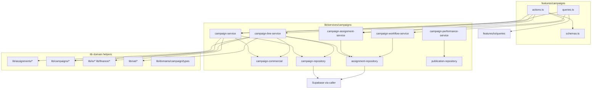

# Campaign Service Layer Audit — Phase 3 Step 1

**Date:** June 2026  
**Branch:** `refactor/phase2-shared-domains-ui`  
**Scope:** Extract business logic from `features/campaigns/actions.ts` and `features/campaigns/queries.ts` into `lib/services/campaigns/`

---

## Executive Summary

Phase 3 Step 1 introduces a dedicated campaign service layer with repository-backed Supabase access. Server actions and query entry points remain the public API; they now follow **validate → authorize → invoke service → revalidate → return**.

**Extracted:** campaign CRUD, line create/update (commercial + assignment sync), deliverable mutations, list/KPI/form queries, influencer search/browse.  
**Deferred (documented gaps):** `getCampaignWorkspace` assembly (~760 LOC), assignment-deliverable actions, performance-actions, publication-actions.

---

## LOC Metrics

| File | Before | After | Δ |
|------|--------|-------|---|
| `features/campaigns/actions.ts` | 1,384 | 296 | **−1,088 (−79%)** |
| `features/campaigns/queries.ts` | 1,363 | 898 | **−465 (−34%)** |
| **New service layer** | 0 | 2,300 | +2,300 |

### New module breakdown

| File | LOC |
|------|-----|
| `campaign-service.ts` | 536 |
| `campaign-line-service.ts` | 597 |
| `repositories/campaign-repository.ts` | 365 |
| `repositories/assignment-repository.ts` | 413 |
| `campaign-commercial.ts` | 195 |
| `campaign-assignment-service.ts` | 63 |
| `campaign-workflow-service.ts` | 20 |
| `campaign-performance-service.ts` | 9 |
| `repositories/publication-repository.ts` | 20 |
| `index.ts` | 40 |
| `campaign-service-layer.test.ts` | 88 |

**Net platform delta:** +747 LOC (service extraction overhead + tests). Feature-layer god files reduced by **1,553 LOC**.

---

## Action Inventory

| Action | Service | Repository | Status |
|--------|---------|------------|--------|
| `createCampaignAction` | `campaign-service.createCampaign` | `campaign-repository.*` | ✅ Extracted |
| `updateCampaignHeaderAction` | `campaign-service.updateCampaignHeader` | `campaign-repository.*` | ✅ Extracted |
| `createCampaignLineAction` | `campaign-line-service.createCampaignLine` | `campaign-repository`, `assignment-repository` | ✅ Extracted |
| `updateCampaignLineAction` | `campaign-line-service.updateCampaignLine` | same + vendor IO revision | ✅ Extracted |
| `duplicateCampaignAction` | `campaign-service.duplicateCampaign` | `campaign-repository.*` | ✅ Extracted |
| `createDeliverableAction` | `campaign-assignment-service.createDeliverable` | `assignment-repository` | ✅ Extracted |
| `updateDeliverableStatusAction` | `campaign-workflow-service.updateLegacyDeliverableStatus` | `assignment-repository` | ✅ Extracted |
| `getClientTaxonomyAction` | `campaign-service.getClientTaxonomy` | `fetchClientRowSafe` (lib/clients) | ✅ Extracted |
| `assignCampaignVendorAction` | — | — | Deprecated stub (unchanged) |
| `updateCampaignVendorAction` | — | — | Deprecated stub (unchanged) |
| `searchInfluencersAction` | — | — | Deprecated stub (unchanged) |

**Not in scope (separate action files):**

- `features/campaigns/actions/assignment-deliverable-actions.ts` (~712 LOC)
- `features/campaigns/actions/performance-actions.ts` (~626 LOC)
- `features/campaigns/actions/publication-actions.ts`
- `features/campaigns/actions/load-campaign-tab-data.ts`

---

## Query Inventory

| Query | Service | Status |
|-------|---------|--------|
| `getCampaignsList` | `campaign-service.getCampaignsList` | ✅ Extracted |
| `getCampaignsKpis` | `campaign-service.getCampaignsKpis` | ✅ Extracted |
| `getCampaignFormOptions` | `campaign-service.getCampaignFormOptions` | ✅ Extracted |
| `searchInfluencersForCampaign` | `campaign-assignment-service` | ✅ Extracted |
| `getInfluencerForAssignment` | `campaign-assignment-service` | ✅ Extracted |
| `browseInfluencersForCampaign` | `campaign-assignment-service` | ✅ Extracted |
| `getCampaignWorkspace` | — | ⚠️ **Gap** — remains in queries.ts |
| `getBrandHierarchySnapshot` | re-export from master-data | Unchanged |

**Related query modules not touched:**

- `features/campaigns/queries/publications.ts` (~879 LOC)
- `features/campaigns/queries/campaign-performance-defaults.ts`

---

## Service Inventory

```
lib/services/campaigns/
├── campaign-service.ts          # Header CRUD, duplicate, list, KPIs, form options, taxonomy
├── campaign-line-service.ts     # Line create/update, commercial math, assignment sync, vendor IO revision
├── campaign-assignment-service.ts # Influencer search, legacy deliverable create
├── campaign-workflow-service.ts # Legacy deliverable status transitions
├── campaign-performance-service.ts # Publication count stub (workspace deferred)
├── campaign-commercial.ts       # Pure commercial/VAT helpers + KPI aggregation
├── index.ts                     # Public barrel exports
├── campaign-service-layer.test.ts
└── repositories/
    ├── campaign-repository.ts   # campaign_headers, campaign_lines mutations & list queries
    ├── assignment-repository.ts # influencers, deliverables, browse/search
    └── publication-repository.ts # campaign_publications count (stub for performance phase)
```

---

## Dependency Graph



### Dependency reduction

| Before | After |
|--------|-------|
| `actions.ts` imported 15+ lib modules directly | `actions.ts` imports 4 service modules + schemas |
| `queries.ts` mixed DB + presentation for list/KPI/search | List/KPI/search delegated to services |
| No testable pure commercial layer | `campaign-commercial.ts` + regression tests |

**Remaining features→lib couplings in services (accepted for Step 1):**

- `features/campaigns/schemas` (Zod validation stays at action boundary; services receive parsed data)
- `features/campaigns/constants` (`METADATA_PLATFORM_KEY`, `CAMPAIGNS_PAGE_SIZE`)
- `features/campaigns/types` (form option shapes)
- `features/campaigns/line-assignment` (title/platform parsing — candidate for `lib/campaigns/line-assignment` move in Step 2)

---

## Business Workflow Map

### Campaign create
1. Resolve brand → client/group/commercial defaults (`campaign-repository`)
2. Credit limit check (`lib/finance/client-credit-exposure`)
3. Insert header + PO fields (transaction boundary: rollback header on PO failure)
4. Audit: none on create

### Campaign header update
1. Merge metadata (platform)
2. Update header fields
3. If group changed → `logCampaignGroupAssignmentChange` audit

### Line create/update
1. Parse assignment JSON (schema)
2. Resolve commercial input (`lib/assignments/resolve-line-commercial-input`)
3. VAT payload (`campaign-commercial` + `lib/vat`)
4. Insert/update line
5. Sync `campaign_influencers` (`lib/campaigns/campaign-influencer-sync`)
6. Sync legacy deliverables + assignment deliverables
7. **Update only:** vendor IO revision if amount drift (`lib/io/revise-vendor-io-batch`)

### Campaign duplicate
1. Clone header (draft)
2. Clone lines via `buildDuplicatedCampaignLineInsert`
3. Optionally clone assignment deliverables + influencers + legacy deliverables
4. Rollback: delete header on any line/copy failure

### Deliverable status (legacy table)
1. Status-specific timestamps (`campaign-workflow-service`)
2. Update row

---

## Transaction Boundaries

| Workflow | Boundary | Rollback strategy |
|----------|----------|-------------------|
| Create campaign | Header insert → PO update | Delete header if PO update fails |
| Create line | Line → influencer → deliverables | Delete influencer + line on deliverable sync failure |
| Update line | Line update → assignment sync (conditional) | No automatic rollback (partial sync possible) |
| Duplicate campaign | Header → lines → assignments | Delete header cascades on line/copy failure |
| Vendor IO revision | Batch revise → unlock line finance fields | Returns error to user; line update already committed |

**Note:** Supabase client does not use explicit DB transactions (RPC). Multi-step rollback uses sequential deletes as before.

---

## Coupling Analysis

| Coupling | Severity | Mitigation path |
|----------|----------|-----------------|
| Campaigns ↔ Billing (vendor IO revision in line update) | 🟠 High | Already uses `lib/io/*`; future: `campaign-billing-service` |
| Campaigns ↔ Assignments (commercial sync) | 🟠 High | Uses `lib/assignments/*`; correct direction |
| Service → `features/campaigns/line-assignment` | 🟡 Medium | Move to `lib/campaigns/line-assignment.ts` |
| Service → `features/campaigns/types` for form options | 🟡 Medium | Extend `lib/domains/campaign/types` |
| `getCampaignWorkspace` → `features/io/queries` | 🟠 High | Move IO reads to `lib/io/client-io-query` in Step 2 |
| Workspace assembly in queries.ts | 🔴 Critical gap | Extract to `campaign-performance-service` Step 2 |

---

## Remaining Gaps (Phase 3 Step 2+)

1. **`getCampaignWorkspace`** (~760 LOC) — largest remaining god function; needs performance-service extraction with workspace presenter types
2. **`features/campaigns/queries/publications.ts`** — publication performance bundle
3. **`assignment-deliverable-actions.ts`** — hierarchy CRUD, billing sync
4. **`performance-actions.ts`** — metrics sync orchestration
5. **`publication-actions.ts`** — publication CRUD
6. **`load-campaign-tab-data.ts`** — deferred tab loading
7. Move `line-assignment.ts` pure helpers to `lib/campaigns/` to eliminate lib→features imports in services
8. Expand `publication-repository.ts` when performance workspace moves

---

## Validation

| Check | Result |
|-------|--------|
| `npx tsc --noEmit -p tsconfig.json` | ✅ Pass |
| `npm run build` | ✅ Pass |
| `npx tsx lib/services/campaigns/campaign-service-layer.test.ts` | ✅ Pass |

---

## Constraints Preserved

- ✅ No UX changes
- ✅ No database schema changes
- ✅ No API contract changes (action signatures unchanged)
- ✅ Server actions remain public entry points
- ✅ Routes, permissions, audit logging preserved
- ✅ Revalidation paths unchanged
