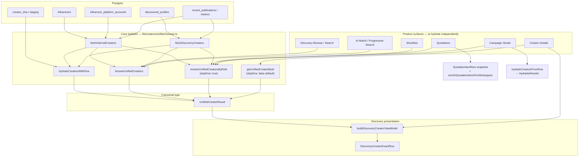

# Creator Data Unification & Single Source of Truth — Architecture Audit

**Status:** Audit complete (Phases 1–7, 8 design, 9–10 plan)  
**Date:** Jul 2026  
**Scope:** Discovery Browse/Search, Shortlists, Quotations, Campaign Studio, Creator Details, AI Campaign Matching  
**Example creator ID (for Phase 3 dumps):** `58c7ab5f-24aa-4cfc-b91f-fab8be5e5e8a`  
**Constraint:** No breaking changes; preserve Discovery RPC pagination, slim feed, media recovery, DNA, AI Search, Studio, commercial pricing, existing caches.

---

## Executive verdict

There is **already a named canonical type** — `UnifiedCreatorResult` (`lib/domains/creator/types.ts`) — and a **core hydrator** — `lib/creators/unified-browse.ts`.

Divergence is **not** “no SSOT type.” It is:

1. **Multiple hydration entry points** that call the same engine with **different flags** (`skipDna`, `omitHeavyFields`).
2. **Presentation / commercial snapshots** that freeze a subset of fields and never re-merge (quotation lines, studio cards).
3. **Parallel legacy schemas** still live (`DiscoveredProfileRow`, `InfluencerSearchResult`, `HydratedVendor`, AI camelCase cards).
4. **Per-surface re-hydration** instead of one hydrate → consume.

Until those close, the same creator can show different country, DNA, followers, avatar, and feed depending on module.

---

## Phase 1 — Pipeline diagram (code-traced)



### Transformation stages (one creator)

| Stage | Location | What happens |
|-------|----------|--------------|
| Postgres | `influencers`, `influencer_platform_accounts`, `discovered_profiles`, `creator_dna*` | Source of truth tables |
| Hydration A | `fetchInternalCreators` / `fetchDiscoveryCreators` | Assemble platforms, metrics, avatar |
| Hydration B | `hydrateCreatorsWithDna` | Overlay DNA (when not skipped) |
| DTO | `UnifiedCreatorResult` | Canonical domain object |
| ViewModel | `buildDiscoveryCreatorViewModel` | Display-only projection for Discovery UI |
| Shortlist | `resolveUnifiedCreatorsByRefs` (**skipDna**) | Re-hydrate from stored refs |
| Quotation | Line snapshot fields ± light enrich / full enrich | Commercial freeze + optional re-resolve |
| Studio | `HydratedVendor` via DNA or batch refs | Parallel presentation type |
| Details | `getUnifiedCreatorById` (**DNA on**) | Full re-fetch even if parent passed a list object |
| AI Match | `browseUnifiedCreators` or legacy profile match | Two match paths |

---

## Phase 2 — Mapper / DTO inventory (high duplication)

### Distinct “creator” types (must collapse)

| Type | Role | Keep / fold |
|------|------|-------------|
| `UnifiedCreatorResult` | Canonical domain | **KEEP — SSOT** |
| `DiscoveryCreatorViewModel` | Presentation only | KEEP as thin view of UCR |
| `CreatorProfileSource` | Avatar/handle/country helper | Fold into shared presentation helpers |
| `ShortlistCreatorItem.creator` | Wrapper + UCR | KEEP wrapper; always hydrate via SSOT |
| `QuotationItemRow` identity fields | Commercial snapshot | KEEP as **snapshot**, document non-live |
| `SearchCreatorCardItem` | Studio/AI card | Fold → projection of UCR |
| `GroundedCreator` / `RankedCreator` | AI formatter | Fold → same projection |
| `HydratedVendor` | Studio vendor card | Fold → projection of UCR (+ DNA extras) |
| `StudioDraftCreatorRef` / `SeedCreator` / `SlateCreator` | Plan/slate refs | Keep as **refs + snapshot**, not alternate hydrators |
| `InfluencerSearchResult` | Legacy campaign HTTP | Deprecate behind adapter |
| `DiscoveredProfileRow` | Legacy discovery search API | Deprecate or wrap into UCR |
| `CampaignCreatorMatch` vs `CreatorMatch` | Parallel fit models | Unify scoring envelope |

### Duplicate mapper clusters

| Cluster | Symbols | Action |
|---------|---------|--------|
| Card/slate | `mapBrowseCreatorToSearchResult`, `normalizeCreators`, `mapCreatorToHydratedVendor`, `mapDnaToHydratedVendor`, `seedCreatorFromUnified` | One `toCreatorCardProjection(UCR)` |
| Profile presentation | `creatorProfileSourceFromUnified`, `buildQuotationCreatorProfileSource`, Discovery VM avatar fields | One `toCreatorPresentation(UCR)` |
| Commercial identity | `buildQuotationSeedFromCreator`, plan→quotation mappers | Keep seeds; always seed from UCR |
| Legacy | `unifiedToInfluencerSearch` | Temporary adapter only |

Full symbol matrix: see agent audit notes in session (35+ symbols across Discovery, Studio, quotations, forecast, DNA, AI).

---

## Phase 3 — Runtime parity (required next)

**Not executed in this audit pass** (needs live DB dump). Deliverable script:

```
scripts/audit-creator-parity.ts --influencer-id=58c7ab5f-24aa-4cfc-b91f-fab8be5e5e8a
```

Must dump JSON from:

| Surface | Loader |
|---------|--------|
| Discovery Browse | `browseUnifiedCreators({ influencerIds })` |
| Discovery Search | same browse path (and legacy `/api/discovery/search` if still used) |
| Shortlist | `resolveUnifiedCreatorsByRefs` as shortlist does |
| Quotation | workspace enrich row + `getUnifiedCreatorById` |
| Campaign Studio | `hydrateCreatorsFromDna` / batch |
| Creator Details | `getUnifiedCreatorById` |
| AI Match | `matchCampaignCreators` embedded creator |

Compare field groups: identity, commercial, audience, performance, content, AI/DNA, metadata.

**Known divergence hotspots (from code):**

| Field area | Browse/Detail | Shortlist/Quotation refs | Studio |
|------------|---------------|--------------------------|--------|
| DNA overlay | Applied | **Skipped** (`skipDna: true`) | DNA table first, different shape |
| Heavy fields | Detail: full; Browse: omitHeavy | omitHeavy | Card subset |
| Country | UCR + DNA | UCR without DNA merge | HydratedVendor country |
| Avatar | primaryAvatarUrl resolution | Same engine, skipDna | DNA/vendor mapper |
| Quotation display | Line snapshot may be stale | — | — |

---

## Phase 4 — Hydration audit

| Expectation | Reality |
|-------------|---------|
| Hydrate once → reuse | **Rejected.** ~15–20 product entry points re-call hydrators |
| One DNA policy | **Rejected.** Browse/detail DNA on; shortlist/quotation refs DNA off |
| One output type | **Partial.** UCR common, but Studio `HydratedVendor` + quotation snapshots bypass |

### Entry points (core)

| Entry | File | DNA |
|-------|------|-----|
| `browseUnifiedCreators` | `lib/creators/unified-browse.ts` | On |
| `resolveUnifiedCreatorsByRefs` | same | **Off** |
| `getUnifiedCreatorById` | same | On (default) |
| `hydrateCreatorsFromDna` | `features/creator-dna/services/creator-hydration-service.ts` | DNA-first → `HydratedVendor` |
| `enrichQuotationItemsForWorkspace` | `lib/services/quotations/enrich-quotation-item-avatars.ts` | Parallel non-UCR path |
| `matchCampaignBrief` (legacy) | `lib/discovery/campaign-match.ts` | Bypasses UCR |

---

## Phase 5 — Data source matrix (canonical fields)

| Field | Primary source | Notes |
|-------|----------------|-------|
| `display_name` | `influencers.display_name` / discovery profile | Sanitized via `formatCreatorDisplayName` |
| Handle / platform | `influencer_platform_accounts` | Metrics account via `default_metrics_platform_account_id` |
| Followers / ER / views | Platform account metrics (+ DNA overlay when on) | Confidence envelopes on UCR |
| Country | `influencers.country_code(s)` + platform audience + inference | DNA may enrich |
| Avatar | `influencers.primary_avatar_url` + platform pics + import | Proxy/CDN recovery separate |
| Feed / publications | Platform `recent_publications` | Slimmed on browse |
| Categories / interests | `influencers.categories` + platform tags + DNA | |
| Thinkway / authenticity scores | Influencer + AI tables + DNA | |
| DNA document | `creator_dna` / staging | Only when DNA hydration runs |
| Quotation price shown on line | **`quotation_items` snapshot** | Intentionally frozen commercial |

**Rule for SSOT:** Live identity/audience/performance/DNA always from UCR. Commercial quotation/campaign line amounts remain snapshots with explicit provenance.

---

## Phase 6 — Cache audit

| Layer | Creator payload cache? |
|-------|------------------------|
| React Query / SWR | **None** |
| Redis | Queues only — **not** creator JSON |
| Next `cache()` | Auth/client dedupe — not browse |
| sessionStorage | Discovery selection stash only |
| Component state | Local re-fetch on mount |
| Media LRU | Avatars/previews only |

**Finding:** Screens do not share a creator document cache; they re-hydrate with different policies → divergence without “stale cache,” via **inconsistent hydration**.

---

## Phase 7 — API / action schema comparison

| Contract | ID | Shape | Used by |
|----------|-----|-------|---------|
| `UnifiedCreatorResult` | `unified_id` | Full domain | Browse, detail, shortlist, modern match |
| `DiscoveredProfileRow` | profile UUID | Legacy flat | `/api/discovery/search`, legacy match |
| `InfluencerSearchResult` | influencer UUID | Lean | Campaign HTTP |
| `CampaignCreatorMatch` | + nested UCR | Scores + creator | Modern AI match |
| `CampaignMatchResult` | profile_id | Scores only | Legacy brief match |
| `SearchCreatorCardItem` | camelCase card | Flat metrics | AI tools / studio |
| `HydratedVendor` | camelCase card | Studio | DNA hydration |
| `ImportCreatorOption` | item_id | label/followers | Quotation import |

Dual APIs that still expose different contracts should either wrap UCR or be deprecated with adapters.

---

## Phase 8 — Target Single Source of Truth

```text
Postgres
  → CreatorHydrator (ONE policy: DNA + heavy fields rules by context)
  → UnifiedCreatorResult          // only domain creator type
  → CreatorPresentation / ViewModel  // display-only
  → Surface wrappers (ShortlistItem, QuotationLine snapshot, StudioCard)
```

### Forbidden as alternate domains

`DiscoveryCreator`, `ShortlistCreator`, `CampaignCreator`, `QuotationCreator`, `CommercialCreator`, `SearchCreator` as **separately hydrated models**.

Allowed:

- **Wrappers** that hold `creator: UnifiedCreatorResult` + domain fields (`item_status`, line economics).
- **Snapshots** for commercial freeze (quotation/campaign), labeled as snapshot with `hydrated_at` / source revision.

### Hydration policy (single)

| Context | DNA | Heavy fields | API |
|---------|-----|--------------|-----|
| Browse list | On (or staged DNA lite — one decision) | omit publications bulk | `browseUnifiedCreators` |
| Detail / compare | On | Full | `getUnifiedCreatorById` |
| Shortlist / quotation list | **Same as browse** (stop skipDna) | List-safe omit | `resolveUnifiedCreatorsByRefs` aligned |
| Studio card | Projection of UCR (+ DNA fields already on UCR) | — | No `HydratedVendor` hydrator |
| Quotation line display of identity | Prefer live UCR by ref; fall back to snapshot | — | Document snapshot rules |

---

## Phase 9 — Refactor plan (non-breaking, sequenced)

### Wave A — Align hydration flags (no UI rewrite)

1. Make `resolveUnifiedCreatorsByRefs` DNA policy match browse (or apply DNA after refs consistently).
2. Delete / gate `enrichQuotationItemsForWorkspace` fields that invent identity/metrics outside UCR; keep performance-only avatar shortcuts if needed with same resolvers.
3. Add `scripts/audit-creator-parity.ts` + CI job for N creators.

### Wave B — Collapse presentation mappers

1. Introduce `toCreatorCardProjection(ucr)` replacing SearchCard / Grounded / HydratedVendor mappers.
2. Keep type aliases for Studio/AI during migration.
3. Studio `useCreatorHydration` returns UCR + optional DNA extras, not a parallel type.

### Wave C — Deprecate legacy APIs

1. `/api/discovery/search` → unified browse wrapper or remove from product paths.
2. Campaign influencers HTTP dual payload → UCR primary.
3. Legacy `matchCampaignBrief` → unified match only.

### Wave D — Snapshot provenance

1. Quotation/campaign identity snapshots store `source_unified_id` + `hydrated_at`.
2. Workspace UI: “live” identity from UCR; commercial from snapshot.

**Do not:** Add another mapping layer; fix one screen at a time without changing the hydrator.

---

## Phase 10 — Regression / parity validation

1. Sample 100 creators (mix internal / discovery / DNA / multi-platform).
2. For each, load via browse, shortlist refs, quotation enrich, studio hydrate, detail by id.
3. Assert equality on: identity, countries, followers/ER, avatar URL, categories, DNA-derived fields (when DNA present), thinkway score.
4. Allow listed exceptions: quotation commercial amounts; slim vs full publications count on browse.

Deliverable: `npm run test:creator-parity` (to be added) + report artifact.

---

## Success criteria checklist

| Criterion | Current |
|-----------|---------|
| Hydrated exactly once per request graph | ❌ |
| All modules consume same UCR | ⚠️ Type yes, policy no |
| No duplicated DTOs | ❌ |
| No duplicated mapping | ❌ |
| Identical display across surfaces | ❌ |
| Field change propagates everywhere | ⚠️ Only if re-hydrated with same flags |
| Automated parity tests | ❌ Not yet |

---

## Immediate next actions (recommended)

1. **Ship parity dump script** for creator `58c7ab5f-24aa-4cfc-b91f-fab8be5e5e8a` across all loaders (Phase 3 evidence).
2. **Wave A:** Align `skipDna` on shortlist/quotation refs with browse/detail.
3. Freeze new mappers: PR rule — no new `*Creator*` DTO without extending UCR / ViewModel.

---

## Related docs

- `docs/DISCOVERY_ARCHITECTURE.md` — UI SSOT (`UnifiedCreatorResult` → ViewModel → ExactRow)
- `docs/CREATOR_PICKER_CONSOLIDATION_AUDIT.md` — selection UI consolidation (does not fix hydration)
- `docs/CREATOR_INTELLIGENCE_ARCHITECTURE.md` — semantic layer on UCR
- `lib/domains/creator/types.ts` — canonical type definition
)
