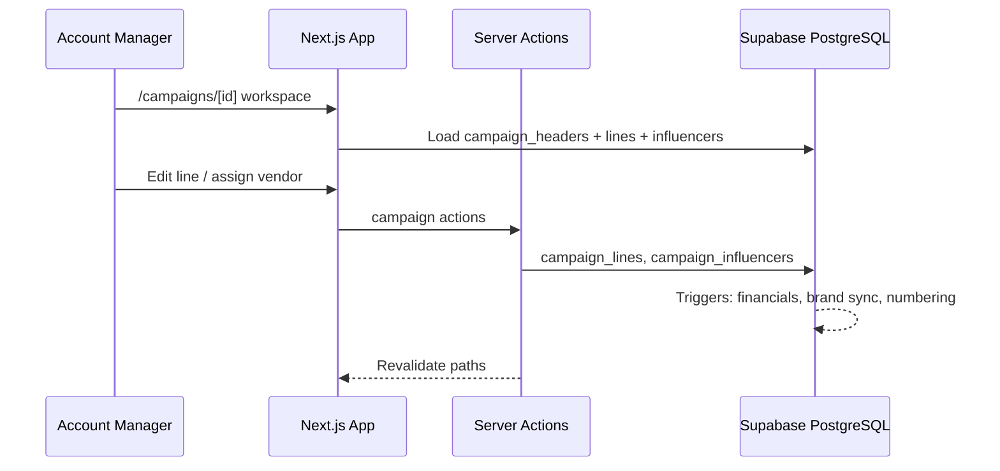
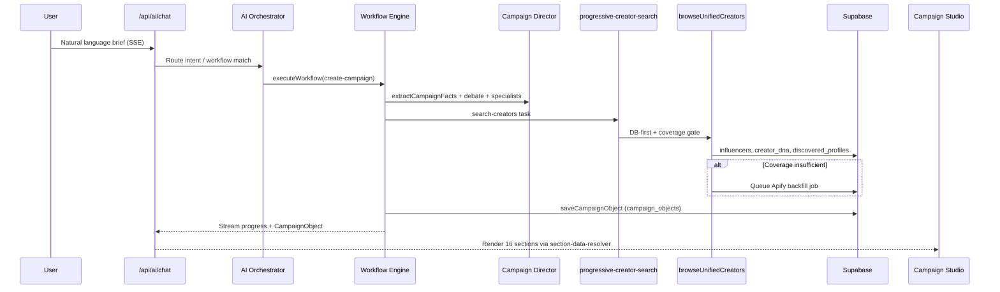
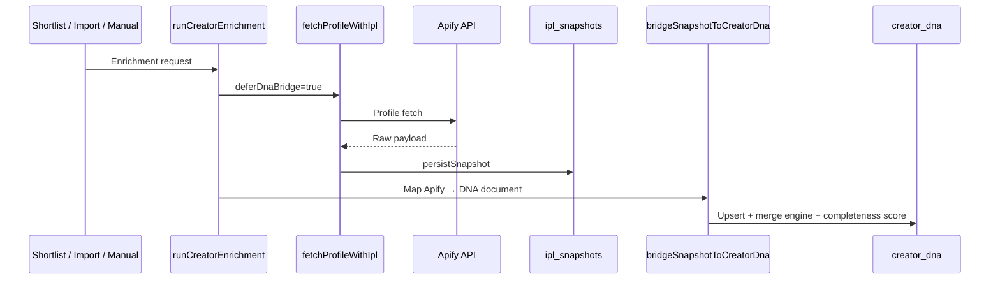
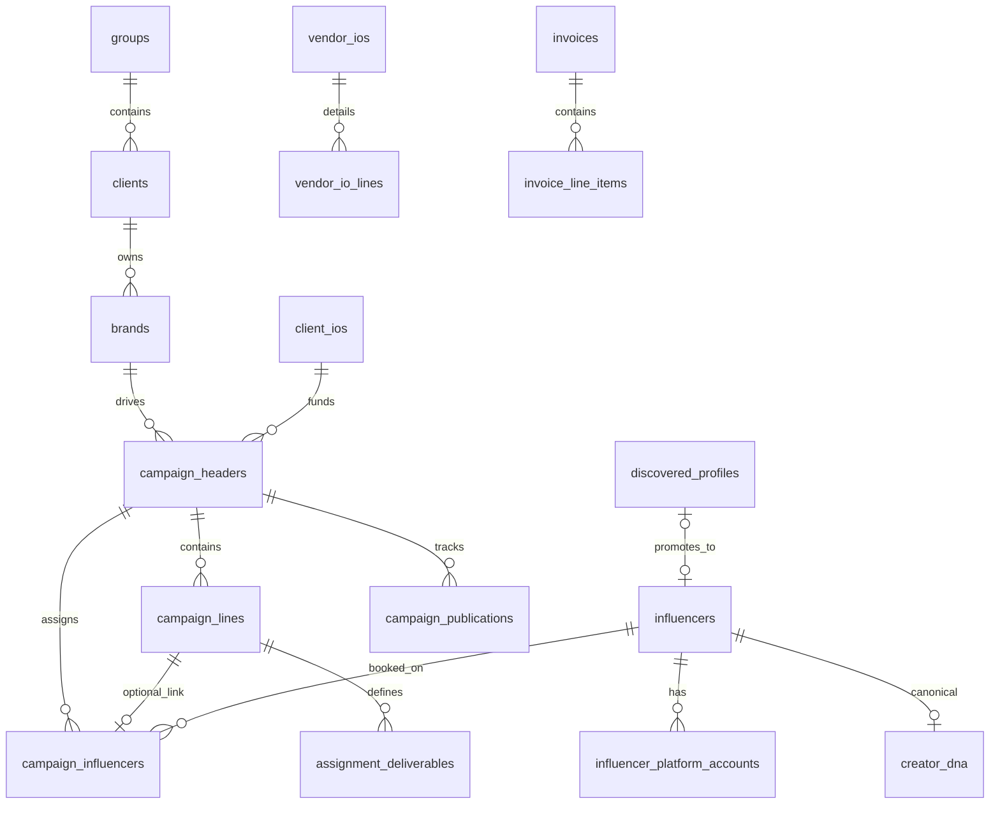
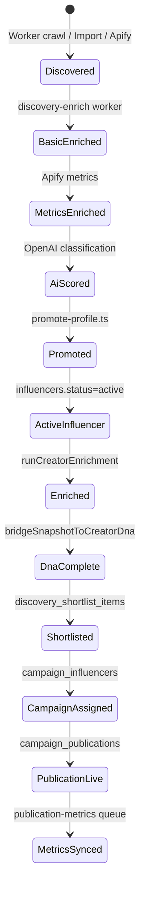
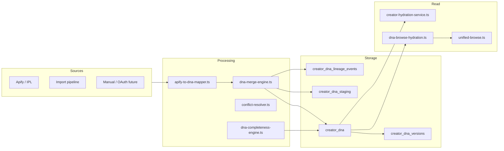
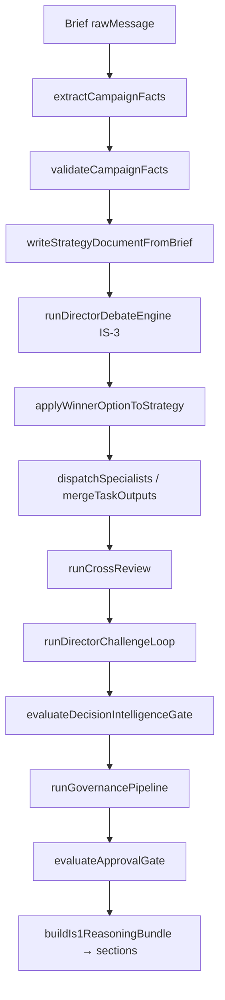
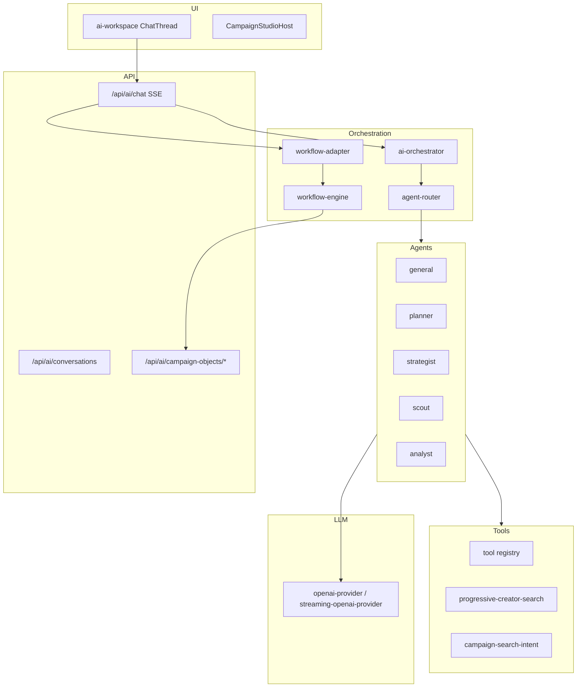

# Thinkway Platform — CTO Handover Report

**Generated:** 2026-07-06  
**Repository:** `c:\thinkway-platform`  
**Method:** Codebase-only audit (files read, grep, build/tsc/migration commands executed)  
**Audience:** Incoming CTO — must stand alone without prior context  

---

## Document metadata

| Item | Value |
|------|-------|
| **Output path** | `docs/CTO_HANDOVER_REPORT.md` |
| **Estimated word count** | ~6,650 words |
| **Build (`npm run build`)** | ❌ **FAIL** — TypeScript error in `lib/discovery/apify-import-pipeline.ts:131` (`metrics_source: "apify"` not assignable to `MetricsSource`) |
| **TypeScript (`npx tsc --noEmit`)** | ❌ **FAIL** — 14 errors (same pipeline + `scripts/import-apify-dataset-to-supabase.ts`) |
| **Migrations (`npx supabase migration list`)** | ✅ **135/135 applied** — local and remote in sync (latest: `20260712020000`) |
| **Stack** | Next.js 16.2.6 · React 19 · TypeScript 5 · Tailwind 4 · shadcn/ui · Supabase · Vercel · BullMQ/Redis (discovery worker) |

---

## 1. Executive Summary

Thinkway is an **enterprise influencer marketing operations platform** built as a Next.js App Router monolith with a separate **Discovery Worker** microservice. The product spans operational CRM (Group → Legal Entity → Brand → Campaign Header → Campaign Line), finance/billing, discovery/search, and an **AI Campaign Intelligence** stack (workflows, Campaign Director, Campaign Studio, Decision Workspace).

### Current maturity snapshot

| Layer | Status | Notes |
|-------|--------|-------|
| **Core hierarchy & campaign workspaces** | ✅ Implemented | Groups, clients, brands, vendors, campaign header/line workspaces |
| **Finance & billing engine** | ✅ Implemented (broad) | Invoices, vendor IO lifecycle, VAT, PO tracker, collections, treasury, planning schema |
| **Discovery & Creator DNA (Release 1.2)** | 🟡 Partial | DB-first browse, DNA merge, control center, import center — **build broken on import path** |
| **AI Campaign Intelligence (Release 1.1)** | ✅ Implemented | Workflows, Director, Debate, 16 Studio sections, Decision mode — validated offline |
| **Campaign Learning / Predictive (1.2 Phase 6–7)** | ❌ Planned only | Spec in docs; **no `campaign_learning` table or code** |
| **Reference-spec gaps** | 🟡 Partial | 5-stage client onboarding, full 6-role RLS, 10 standard reports, workflow rule engine |
| **Production readiness** | ❌ Not GA-ready | No validated staging; build fails; manual UAT unsigned |

### Hierarchy (non-negotiable — enforced in code)

```
Group → Legal Entity (clients) → Brand → Campaign Header → Campaign Line
```

Brand-first campaign creation; commercial fields (category, VR%, direct/agency, currency) live on **brands** and sync to campaign headers via DB trigger — intentional deviation from May 2026 reference doc (documented in `docs/ARCHITECTURE_ALIGNMENT.md`).

### Top 5 findings for incoming CTO

1. **Production build is broken** — TypeScript regression in Apify import/DNA pipeline blocks `npm run build` and CI gates (`validate:f1-one-workspace` reports 58/60 pass, build+tsc fail).
2. **Release 1.2 is half-shipped** — Creator DNA, Discovery Control Center, DB-first search, and enrichment are in code and migrated; **Campaign Learning, Client Intelligence profiles, and Predictive models exist only in specs** (`docs/release/1.2/`).
3. **All 135 Supabase migrations are applied to remote dev** — schema is ahead of some docs; no pending migrations as of this audit.
4. **AI stack is sophisticated but operationally immature** — Campaign Director/Studio/Decision Workspace pass fixture validators; **E2E DB persistence for `campaign_objects` was fixed in code but needs re-verification** per `docs/release/BLOCKERS.md` B-002.
5. **Dual schema legacy** — `supabase/schema.sql` retains early `campaigns` / flat `campaign_influencers.campaign_id` model; **runtime code uses `campaign_headers` / `campaign_lines`** via enterprise migrations. Treat `schema.sql` as bootstrap reference, not live truth.

---

## 2. Complete Platform Architecture

### 2.1 High-level system diagram

```mermaid
flowchart TB
  subgraph Client["Browser"]
    UI[Next.js App Router UI]
    Portals[Client / Creator Portals]
  end

  subgraph App["thinkway-platform (Vercel / Node)"]
    RSC[Server Components + Server Actions]
    API[Route Handlers /api/*]
    AIChat[/api/ai/chat SSE]
    WF[features/ai-workflows]
    CD[features/campaign-director]
    CS[features/campaign-studio]
    DISC[lib/creators/unified-browse]
  end

  subgraph Worker["services/discovery-worker"]
    BQ[BullMQ Queues]
    PW[Playwright / Apify]
    ENR[Enrichment Pipeline]
  end

  subgraph Data["Supabase"]
    PG[(PostgreSQL + RLS)]
    Auth[Supabase Auth]
    Storage[Storage Buckets]
  end

  subgraph External["External"]
    OpenAI[OpenAI API]
    Apify[Apify Actors]
    Redis[(Redis)]
  end

  UI --> RSC
  UI --> API
  UI --> AIChat
  AIChat --> WF
  WF --> CD
  WF --> DISC
  CD --> CS
  API --> PG
  RSC --> PG
  AIChat --> OpenAI
  DISC --> PG
  DISC --> Apify
  BQ --> Redis
  Worker --> PG
  Worker --> Apify
  Worker --> OpenAI
  Portals --> API
  Auth --> PG
```

### 2.2 Request flows

#### Operational campaign flow



#### AI campaign creation flow



#### Creator enrichment → DNA flow



### 2.3 Repository layout

| Path | Role |
|------|------|
| `app/` | Routes: dashboard, campaigns, discovery, finance, settings, portals, `/api/*` |
| `features/` | Domain modules (campaigns, billing, discovery, AI, studio, director, DNA, etc.) |
| `lib/` | Shared services, queries, auth, performance engines, discovery import |
| `components/` | Layout, shadcn/ui wrappers, platform shells |
| `services/discovery-worker/` | Standalone BullMQ worker (separate `package.json`) |
| `supabase/migrations/` | **135** incremental SQL migrations (source of truth for prod schema) |
| `supabase/schema.sql` | ⚠ Legacy bootstrap schema — superseded by migrations for enterprise model |
| `scripts/` | Validators, ETL, import, queue triage, dev runners |
| `docs/` | Product reference, architecture alignment, release artifacts |

### 2.4 Deployment topology

| Component | Target | Status |
|-----------|--------|--------|
| Next.js app | Vercel | Configured (`.env` / `.env.local`) |
| Supabase | Hosted PostgreSQL + Auth | Remote dev project connected |
| Redis | Local Docker / prod unknown | Required for discovery worker + BullMQ |
| Discovery worker | Separate Node process | `npm run discovery:worker` |
| Cron routes | `/api/cron/*` | publication-metrics, campaign-performance-monitor |

**Unknown:** Dedicated production Supabase, Redis HA, Sentry — referenced in `docs/release/BLOCKERS.md` B-008, not verified in repo config.

---

## 3. Module Inventory

Status key: ✅ Implemented | 🟡 Partial | ❌ Planned only | ⚠ Legacy/deprecated

### 3.1 Core navigation modules (from `components/layout/app-sidebar.tsx`)

| Module | Route(s) | Purpose | Key paths | Status | Issues |
|--------|----------|---------|-----------|--------|--------|
| **Home / Executive** | `/`, `/dashboard` | KPI dashboards | `app/(dashboard)/page.tsx`, `features/analytics/` | 🟡 Partial | Not all reference KPIs; intelligence tab separate |
| **Campaigns** | `/campaigns`, `/campaigns/[id]` | Header + line operational workspace | `features/campaigns/`, `lib/services/campaigns/` | ✅ | Missing some reference billing fields on lines |
| **Discovery** | `/discovery/*` | Search, shortlists, quotations, import | `features/discovery/`, `lib/creators/` | ✅ | Apify import TS break; worker schema drift (KI-005) |
| **Clients hierarchy** | `/groups`, `/clients`, `/brands`, `/vendors` | Master data workspaces | `features/groups/`, `features/clients/`, `features/vendors/` | ✅ | Client onboarding stage machine missing |
| **IOs** | `/ios/client`, `/ios/vendor` | Client & vendor IO documents | `features/io/`, `lib/io/` | ✅ | PDF export partial per ARCHITECTURE_ALIGNMENT |
| **Billing** | `/billing`, `/billing/invoices/[id]` | Invoice workspace, campaign billing queue | `features/billing/`, `lib/billing/` | ✅ | Proof of payment workflow incomplete |
| **Operations** | `/operations/move`, `/operations/reassignment` | Entity moves, vendor reassignment | `features/operations/` | ✅ | — |
| **Finance** | `/finance/*`, `/collections`, `/treasury`, `/planning` | Full finance stack | `features/finance/`, `lib/finance/` | ✅ | Planning UI vs schema maturity varies |
| **Reports** | `/reports/*` | P&L, VR, daily, unsettled, etc. | `features/reports/`, `lib/analytics/` | 🟡 Partial | Subset of reference §14 "10 standard reports" |
| **Intelligence** | `/intelligence` | Historical warehouse UI | `features/intelligence/`, `intelligence.*` schema | 🟡 Partial | Warehouse ETL separate from ops learning |
| **AI Workspace** | `/ai`, `/ai/[conversationId]` | Chat + Campaign Studio host | `features/ai-workspace/`, `app/api/ai/` | ✅ | Persistence E2E re-verify |
| **Settings** | `/settings/*` | Users, roles, discovery control | `features/settings/`, `features/discovery/control-center/` | 🟡 Partial | Admin audit UI stubbed |
| **Portals** | `/client-portal/*`, `/creator-portal/*` | External scoped access | `features/portals/`, `app/(client-portal)/` | 🟡 Partial | Phase 2/4 scope in reference |
| **System health** | `/system/health` | Probes aggregation | `app/api/health`, `app/api/ready` | ✅ | Public routes by design |

### 3.2 AI & intelligence modules

| Module | Entry point | Consumers | Dependencies | Status |
|--------|-------------|-----------|--------------|--------|
| **AI Orchestrator** | `features/ai/orchestrator/ai-orchestrator.ts` | General AI (non-workflow) | Agents, tools, LLM provider | ✅ |
| **AI Workspace** | `app/api/ai/chat/route.ts` | UI chat thread | Workflows, SSE, conversations DB | ✅ |
| **Workflow engine** | `features/ai-workflows/engine/workflow-engine.ts` | Chat workflow mode | Task runner, tool registry | ✅ |
| **Campaign Director** | `features/campaign-director/services/campaign-director.ts` | create-campaign workflow | Facts, debate, governance | ✅ |
| **Campaign Facts** | `features/campaign-director/facts/` | Director, Studio resolver | LLM + brief parser | ✅ |
| **Debate engine (IS-3)** | `features/campaign-director/debate/debate-engine.ts` | Director pipeline | Option generator, material diff validator | ✅ |
| **Campaign Studio** | `features/campaign-studio/` | `CampaignStudioHost` | CampaignObject, section-data-resolver | ✅ |
| **Decision Workspace** | `features/campaign-decision-workspace/` | Studio decision mode | Scenario store, promote-scenario | ✅ |
| **Campaign Object persistence** | `features/campaign-intelligence/services/campaign-object-persistence.ts` | Workflow complete save | `campaign_objects` tables | 🟡 |
| **Campaign Governance** | `features/campaign-governance/` | Director approval gate | Presentation validator, QA manager | ✅ |
| **Knowledge Engine** | `features/knowledge-engine/` | Workspace context injection | Entity resolver, fuzzy search | 🟡 Partial |
| **Knowledge Engine validator** | `features/knowledge-engine/validate-knowledge-engine.ts` | CI scripts | — | Unknown if run in CI |

### 3.3 Discovery & data modules

| Module | Entry point | Status | Notes |
|--------|-------------|--------|-------|
| **Unified browse** | `lib/creators/unified-browse.ts` | ✅ | DB-first, DNA hydration, coverage gate |
| **FTS search RPC** | `lib/creators/fts-search.ts` | ✅ | `search_creators` migration-backed |
| **Discovery coverage** | `lib/creators/discovery-coverage.ts` | ✅ | Threshold default 80 |
| **Control center** | `lib/discovery/control-center/` | ✅ | Singleton settings + Apify usage |
| **Creator DNA** | `features/creator-dna/` | ✅ | Merge, completeness, IPL bridge |
| **Creator enrichment** | `lib/creator-enrichment/` | ✅ | Policy, merge, audience filters |
| **IPL (Intelligence Persistence)** | `lib/intelligence-persistence/` | ✅ | Snapshots, refresh policies |
| **Discovery import center** | `features/discovery-import/` | ✅ | CSV, ZIP, PDF, Indahash parsers |
| **Apify import pipeline** | `lib/discovery/apify-import-pipeline.ts` | 🟡 | **Build-breaking TS error** |
| **Discovery worker** | `services/discovery-worker/src/index.ts` | ✅ | Separate deployable |
| **Campaign performance** | `lib/performance/` | ✅ | Metrics collector, ER engine, screenshots |
| **Commercial / Quotations** | `features/quotations/`, `lib/commercial/` | ✅ | Enterprise quotation lifecycle |

### 3.4 Service layer pattern

`lib/services/` introduces repository pattern for hot domains:

- `lib/services/campaigns/` — campaign, assignment, publication services
- `lib/services/billing/` — invoice, statement services  
- `lib/services/quotations/` — quotation lifecycle

Validated by `npm run test:services` (exists in package.json).

---

## 4. Database

**Source of truth:** `supabase/migrations/` (135 files, all applied to remote as of 2026-07-06).  
**Supplement:** `supabase/schema.sql` for auth/RBAC bootstrap; **⚠ contains deprecated `campaigns` table** not used by app code.

### 4.1 Entity relationship (operational core)



### 4.2 Major tables reference

#### Hierarchy & master data

| Table | Purpose | PK | Key FKs / indexes | Used by | Status |
|-------|---------|----|--------------------|---------|--------|
| `groups` | Holding groups | `id` | `document_number` UNIQUE | `/groups/[id]` | ✅ |
| `clients` | Legal entities | `id` | `account_manager_id` → profiles | Client workspace | ✅ |
| `brands` | Brand commercial terms | `id` | `client_id`, category, VR%, currency | Campaign create trigger | ✅ |
| `md_categories`, `md_subcategories` | Taxonomy | `id` | category hierarchy | Brands, discovery | ✅ |
| `md_vr_rates` | VR% master | `id` | brand/header resolution | Finance reports | 🟡 Override resolution partial |
| `md_teams`, `md_currencies`, `md_countries` | Reference data | various | — | Headers, lines | ✅ |
| `agencies` | Agency master | `id` | — | Vendors | ✅ |

#### Campaign operations

| Table | Purpose | PK | Notes | Status |
|-------|---------|----|-------|--------|
| `campaign_headers` | Level-1 campaign | `id` | `document_number` TW-YYYY-NNNN; brand sync trigger | ✅ |
| `campaign_lines` | Level-2 PO/finance lines | `id` | `-A/-B` suffix; financial triggers | ✅ |
| `campaign_influencers` | Vendor assignments | `id` | `campaign_header_id`, `campaign_line_id` | ✅ |
| `assignment_deliverables` | Deliverable grid | `id` | Commercial engine | ✅ |
| `assignment_post_schedule` | Post scheduling | `id` | Operational | ✅ |
| `campaign_publications` | Live content tracking | `id` | Performance module | ✅ |
| `deliverables` | ⚠ Legacy flat model | `id` | In schema.sql; superseded by assignment_deliverables | ⚠ |

#### Finance & billing

| Table | Purpose | Status |
|-------|---------|--------|
| `invoices`, `invoice_line_items`, `invoice_versions` | Client invoicing | ✅ |
| `vendor_ios`, `vendor_io_lines`, `client_ios` | IO documents | ✅ |
| `payments`, `payment_allocations` | Treasury | ✅ |
| `finance_documents`, `finance_posting_batches`, `erp_sync_queue` | ERP posting center | ✅ |
| `client_credit_notes`, `vendor_credit_notes`, `*_debit_notes` | Adjustments | ✅ |
| `md_vat_rates`, VAT engine columns | Tax | ✅ |
| `md_exchange_rates`, `fx_rate_audit_logs` | FX governance | ✅ |
| `financial_approval_requests`, `finance_override_logs` | Governance | ✅ |
| `budget_versions`, `budget_lines`, `planning_scenarios` | Planning engine schema | 🟡 UI partial |

#### Discovery & creators

| Table | Purpose | Status |
|-------|---------|--------|
| `influencers` | Vendor master | ✅ |
| `influencer_platform_accounts` | Per-platform metrics | ✅ |
| `discovered_profiles` | Pre-promotion prospects | ✅ |
| `profile_metrics`, `profile_posts`, `profile_engagement`, `profile_ai_scores` | Discovery signals | ✅ |
| `discovery_jobs`, `discovery_sources`, `hashtags`, `trend_tracking` | Worker pipeline | ✅ |
| `discovery_shortlists`, `discovery_shortlist_items` | Shortlists v1 | ✅ |
| `creator_movements`, `shortlist_notifications` | Shortlists v2 | ✅ |
| `creator_import_files`, `creator_sources` | Import center | ✅ |
| `creator_enrichment_runs` | Enrichment audit | ✅ |
| `creator_dna`, `creator_dna_staging`, `creator_dna_versions`, `creator_dna_lineage_events` | Creator DNA | ✅ |
| `ipl_snapshots`, `ipl_provider_runs`, `ipl_refresh_policies`, `ipl_reprocess_jobs` | IPL cache | ✅ |
| `discovery_control_settings`, `discovery_apify_usage` | Control center | ✅ |
| `discovery_coverage_decisions` | Coverage audit trail | ✅ |
| `discovery_search_analytics` | Search telemetry | ✅ |
| `discovery_saved_filters`, `discovery_recent_searches` | UX persistence | ✅ |

#### AI & campaign intelligence

| Table | Purpose | Status |
|-------|---------|--------|
| `ai_conversations`, `ai_messages` | Chat persistence | ✅ |
| `campaign_objects`, `campaign_object_versions` | CampaignObject DB persistence | 🟡 E2E verify |
| `campaigns` | ⚠ Early flat campaigns | ⚠ **Deprecated** — not referenced in TS code |

#### Intelligence warehouse (`intelligence` schema)

| Table | Purpose | Status |
|-------|---------|--------|
| `historical_campaigns_raw`, `historical_influencers_raw` | ETL staging | ✅ |
| `int_clients`, `int_brands`, `int_influencers`, `int_campaigns` | Normalized history | ✅ |
| `int_pricing_history`, `int_margin_history`, `int_benchmarks` | Benchmarks | ✅ |
| `entity_resolution_overrides` | Manual match overrides | ✅ |

#### Auth & admin

| Table | Purpose | Status |
|-------|---------|--------|
| `profiles`, `roles`, `permissions`, `role_permissions` | RBAC | 🟡 Full matrix incomplete |
| `user_invites`, `access_logs` | User management | ✅ |
| `audit_logs` | Audit trail | ✅ (insert error logging fixed per GO_NO_GO) |
| `client_users`, `portal_uploads`, `portal_notifications` | Portals | 🟡 |

#### Planned tables (spec only — **NOT in migrations**)

| Table | Spec location | Status |
|-------|---------------|--------|
| `campaign_learning` | `docs/release/1.2/CAMPAIGN_LEARNING_SPECIFICATION.md` | ❌ |
| `campaign_learning_creator_outcomes` | same | ❌ |
| `client_profiles` | `docs/release/1.2/RELEASE_1_2_ARCHITECTURE.md` | ❌ |
| `workflow_rules`, `workflow_templates` | THINKWAY_SYSTEM_REFERENCE §20 | ❌ |

### 4.3 Migration health

- **Total migration files:** 135  
- **Pending on remote:** 0 (all local timestamps match remote)  
- **Latest migrations:**
  - `20260712010000_campaign_object_persistence.sql`
  - `20260712020000` (follow-up)
  - `20260711010000_audit_logs_security_foundation.sql`
  - `20260710060000_discovery_search_bio_hashtag.sql`

### 4.4 RLS & roles

- RLS policies spread across migrations (`20260531620000_billing_invoice_rls_hardening.sql`, `20260702110000_fix_ai_workspace_rls.sql`, etc.)
- Permission checks in app: `lib/auth/permissions.ts`, `requirePermission()` on API routes
- **Gap:** Full 6-role matrix from reference §6 not uniformly enforced in UI column hiding and CM scoping (`docs/ARCHITECTURE_ALIGNMENT.md` §4)

---

## 5. Creator Pipeline

Full lifecycle from prospect to campaign assignment:



### Stage detail

| Stage | Mechanism | Files |
|-------|-----------|-------|
| **Discovery ingest** | Worker queues OR import center OR Apify dataset script | `services/discovery-worker/`, `features/discovery-import/`, `scripts/import-apify-dataset-to-supabase.ts` |
| **Normalization** | Import parsers (Indahash, CSV, ZIP, PDF) | `lib/discovery-import/parsers/` |
| **Promotion** | `discovered_profiles` → `influencers` | `lib/discovery/promote-profile.ts` |
| **Apify fetch** | IPL orchestrator | `lib/intelligence-persistence/services/fetch-orchestrator.ts` |
| **IPL snapshot** | Raw + normalized stored | `ipl_snapshots` table |
| **DNA write** | Merge engine + completeness | `features/creator-dna/writers/creator-dna-writer.ts` |
| **Browse read** | DNA hydration, no Apify on read | `lib/creators/dna-browse-hydration.ts` |
| **Enrichment trigger** | Control center policy | `lib/discovery/control-center/discovery-control-policy.ts` |
| **Avatar storage** | Supabase storage sync | `lib/performance/creator-avatar.ts` |
| **Campaign assignment** | Campaign workspace vendors tab | `features/campaigns/` |
| **Performance** | Metrics collector + ER engine | `lib/performance/metrics-collector/` |

### Enrichment status resolution

`discovered` → `basic_enriched` → `metrics_enriched` → `ai_scored` → `verified` (worker README).  
Operational influencers use `creator_enrichment_runs` + platform account fields + DNA completeness score.

---

## 6. Discovery Engine

### 6.1 Architecture

Three source modes (`DiscoverySourceMode` in `lib/discovery/control-center/discovery-control-types.ts`):

| Mode | DB browse | Apify fallback |
|------|-----------|----------------|
| `platform_database_only` | Yes | Never |
| `hybrid` (default intent) | First | When coverage score < threshold (default **80**) |
| `apify_live_only` | Optional skip | Primary when `searchPriority = apify_first` |

### 6.2 Primary code paths

| Path | Function | File |
|------|----------|------|
| UI search | API route | `app/api/discovery/search/route.ts` |
| Unified browse | `browseUnifiedCreators()` | `lib/creators/unified-browse.ts` |
| Coverage evaluation | `evaluateDiscoveryCoverage()` | `lib/creators/discovery-coverage.ts` |
| Backfill orchestration | `browseUnifiedCreatorsWithCoverageBackfill` | `lib/creators/unified-browse.ts` |
| AI progressive search | `executeProgressiveCreatorSearch` | `features/ai/tools/progressive-creator-search.ts` |
| Worker jobs | BullMQ | `services/discovery-worker/src/queues/` |
| Diagnostics | Settings UI | `app/(dashboard)/settings/discovery-diagnostics/page.tsx` |

### 6.3 Coverage & backfill

- Coverage decisions logged to `discovery_coverage_decisions`
- Cost protection via `discovery_apify_usage` daily counters
- `gateApifyBackfill()` in `discovery-control-policy.ts` enforces limits
- Search analytics in `discovery_search_analytics`

### 6.4 Database-first discovery status

| Capability | Status | Evidence |
|------------|--------|----------|
| DB-first browse before Apify | ✅ | `unified-browse.ts` imports coverage module |
| `search_creators` RPC | ✅ | Migrations `20260710030000`, `20260710040000`, `20260710060000` |
| DNA hydration on browse | ✅ | `hydrateCreatorsWithDna()` |
| Control center UI | ✅ | `/settings/discovery-engine` |
| Apify import without new runs | 🟡 | Script exists; **TS broken** |
| Mock/demo seed policy | ✅ | Tests pass (`test:discovery-mock-seed-policy`) |

### 6.5 Limitations

- Demographics (gender, age bands) **never** populated from Apify — marked `verificationRequired` in DNA
- Worker stuck-import recovery may fail if `creator_import_files.updated_at` missing on environment (KI-005)
- Captcha aborts Playwright crawl — no aggressive bypass (by design)
- Windows TLS breaks CLI Supabase fetch without CA workaround (KI-001)
- Hybrid mode still incurs cost if coverage threshold set aggressively low

---

## 7. Creator DNA

### 7.1 Architecture



### 7.2 Document envelope model

Each field wrapped in envelope (`features/creator-dna/services/field-envelope.ts`):

- `value`, `confidence`, `source` (`manual` | `ipl` | `ai_infer` | `campaign` | etc.)
- Merge tier: **Verified > Imported > Inferred > Empty**
- `raw_apify_snapshot` jsonb on row for audit

### 7.3 Completeness

`dna-completeness-engine.ts` — 8 dimensions × 12.5 points = 0–100 score.  
Demographics fields add to `verificationRequired[]` when missing/low confidence.

### 7.4 Read paths

| Consumer | Function | Apify on read? |
|----------|----------|----------------|
| Discovery browse | `hydrateCreatorsWithDna` | No |
| Campaign Studio | `use-creator-hydration.ts` / `creator-hydration-service.ts` | No |
| Progressive AI search | Via browse | No (unless backfill triggered) |
| Shortlists | Unified browse adapters | No |

### 7.5 Write paths

| Trigger | Writer |
|---------|--------|
| Enrichment | `bridgeSnapshotToCreatorDna` after IPL |
| Apify import | `importApifyStoredPayloadWithDnaPipeline` |
| Manual | `CreatorDNAService` (server actions) |

### 7.6 Status

| Item | Status |
|------|--------|
| Tables + migrations | ✅ `20260704120000`, `20260705120000`, `20260705200000`, `20260705210000` |
| Merge never downgrade | ✅ Tested (`dna-merge-engine.test.ts`) |
| ERS-4 validator | ✅ 58/58 per RELEASE_CANDIDATE_REPORT |
| Historical performance section in DNA | 🟡 Empty until campaign_learning exists |
| Build break on import path | ❌ `MetricsSource` type mismatch |

---

## 8. Campaign Studio

**Host:** `features/campaign-decision-workspace/components/campaign-studio-host.tsx`  
**Resolver:** `features/campaign-studio/services/section-data-resolver.ts`  
**Data canonical model:** `CampaignObject` in `features/campaign-intelligence/types/campaign-object.ts`

### 8.1 Section inventory (16 sections)

| Section ID | UI title | Workflow tasks | Primary data source | Intelligence layer | Weaknesses |
|------------|----------|----------------|---------------------|-------------------|------------|
| `campaign-summary` | Campaign Summary | analyze-request, generate-brief | `sections.summary` / brief text | CampaignFacts via `getCampaignFactsOrLegacy` | Legacy fallback if Facts missing |
| `executive-strategy` | Executive Strategy | build-strategy | `sections.strategy.groundedFields` | IS-1 reasoning bundle | Empty if strategist task skipped |
| `creator-discovery` | Vendor Discovery | search-creators | `sections.creators` funnel + pipeline | Progressive search metadata | Pipeline stages depend on search task completion |
| `creator-recommendations` | Vendor Recommendations | build-shortlist | `creators.recommendationsDisplay` text | Parsed from markdown lines — **not structured DB refs** | Fragile text parsing (`@handle` regex) |
| `budget-planner` | Budget Planner | estimate-budget | `sections.budget` + Facts | `buildBudgetSectionDataFromFacts`, allocation reasoning | Requires analyst task or Facts |
| `timeline` | Timeline | generate-timeline | `sections.timeline` + activation timeline | Director timeline rules | Week status inferred from completion flag |
| `kpi-forecast` | KPI Forecast | build-strategy | Strategy KPI reasoning | `kpiReasoningToGrounded` | KPIs AI-generated unless grounded |
| `risk-analysis` | Risk Analysis | build-strategy, estimate-budget | Budget + strategy extras | `buildRiskAnalysisFromBudget` | Derived heuristics |
| `creative-concepts` | Creative Concepts | build-strategy, generate-brief | Strategy section content | Strategist output | Generic if brief thin |
| `content-plan` | Content Plan | build-strategy, generate-timeline | Strategy + timeline merge | Planner specialist | — |
| `creator-mix` | Creator Mix | build-strategy, search-creators | Facts + creators | `buildCreatorMixFromFacts` | Depends on creator IDs populated |
| `why-ai` | Director Decision Minutes | analyze-request, build-strategy | Director minutes | IS-1 `DirectorDecisionMinute[]` | — |
| `industry-benchmark` | Industry Benchmark | build-strategy, estimate-budget | Industry detector + Facts | `detectIndustryFromBrief` | **Not live benchmark DB** — inferred |
| `success-probability` | Success Probability | build-strategy, estimate-budget | Strategy extras | Heuristic scoring | Not predictive model (no learning store) |
| `opportunity-finder` | Strategic Opportunities | build-strategy, search-creators | Strategy extras | LLM-derived opportunities | — |
| `executive-summary` | Executive Summary | prepare-approval, build-strategy | Aggregated sections | Presentation intelligence | — |
| `presentation-status` | Presentation Status | prepare-approval | Governance + section completion | `resolvePresentationCompletion` | Tied to governance gate |

### 8.2 Grounding model

Sections show grounding badges (`GroundedElement`: source AI/Director/Facts, confidence, reason).  
CampaignFacts (`features/campaign-director/facts/`) is SSOT when present; legacy string sections still supported.

### 8.3 Presentation vs Decision mode

- **Presentation:** read-only Campaign Studio cards  
- **Decision:** scenario sandbox, budget/vendor overlays, promote scenario (`features/campaign-decision-workspace/`)  
- Validated: `npm run validate:f1-one-workspace` — 58/60 (build/tsc fail)

---

## 9. Campaign Director

### 9.1 Pipeline (IS-1 / IS-3)



**Entry:** `runCampaignDirectorPipeline()` in `features/campaign-director/services/campaign-director.ts`

### 9.2 Debate engine

| Component | File | Role |
|-----------|------|------|
| Option generator | `debate/option-generator.ts` | Creates strategic alternatives |
| Material difference validator | `debate/material-difference-validator.ts` | Ensures options differ on ≥N dimensions |
| Leadership debate | `debate/leadership-debate.ts` | Simulated role reviews |
| Debate scorer | `debate/debate-scorer.ts` | Weighted scoring |
| Director meeting | `debate/director-meeting.ts` | Winner selection narrative |

Throws if material difference validation fails — **hard fail, not soft degrade**.

### 9.3 Facts layer

| Capability | Status |
|------------|--------|
| Extract from brief | ✅ `extract-campaign-facts.ts` |
| Validate schema | ✅ `validate-campaign-facts.ts` |
| Bridge to Studio | ✅ `facts-display-bridge.ts` |
| Facts as SSOT | ✅ Director uses Facts before legacy text |

### 9.4 Governance integration

`runGovernancePipeline` from `features/campaign-governance/governance-pipeline.ts` — presentation validator, QA manager, compliance checks before approval gate.

### 9.5 Limitations

- Debate options are **synthetic** from strategy doc — not live market data
- Budget rules enforced (`budget-rules.ts`) but don't block workflow on all edge cases
- Specialist dispatch depends on workflow task results being present — partial runs produce partial sections
- No human-in-the-loop approval UI wired to production client sign-off
- Frozen architecture per Release 1.2 — extend via data layers, not Director redesign

---

## 10. AI Architecture

### 10.1 Layer map



### 10.2 Agents (`features/ai/agents/`)

| Agent | Role |
|-------|------|
| `general` | Default conversational |
| `planner` | Timeline / planning tasks |
| `strategist` | Strategy, brief, approval prep |
| `scout` | Creator search tasks |
| `analyst` | Budget estimation |

Routing via `features/ai/routing/agent-router.ts` + intent engine.

### 10.3 Workflows (`features/ai-workflows/definitions/`)

| Workflow ID | Purpose |
|-------------|---------|
| `create-campaign` | Full campaign intelligence run |
| `find-creators` | Discovery-only |
| `analyze-campaign` | Existing campaign analysis |
| `generate-brief` | Brief generation |
| `build-shortlist` | Shortlist builder |
| `campaign-health-check` | Operational health |

Engine: `executeWorkflow` / `resumeWorkflow` with task runner and continuation policies.

### 10.4 SSE streaming

`features/ai-workspace/services/sse-utils.ts` — chunks LLM output, streams workflow progress events, attaches slim workflow metadata.

### 10.5 Persistence

| Store | Table | Usage |
|-------|-------|-------|
| Conversations | `ai_conversations`, `ai_messages` | Chat history |
| Campaign objects | `campaign_objects`, `campaign_object_versions` | Structured campaign snapshots |

`CampaignObjectPersistenceService.ensureHeadRecord()` + versioned saves on workflow complete.

### 10.6 Validators (ERS suite)

| Script | npm script | Purpose |
|--------|------------|---------|
| ERS-1 | `validate:ers1-live-parity` | Search dedupe parity |
| ERS-2 | `validate:ers2-search-intelligence` | Progressive search stages |
| ERS-3 | `features/campaign-intelligence/validate-ers3-*` | CampaignObject integrity |
| ERS-4 | `features/creator-dna/validate-ers4-creator-dna.ts` | DNA hydration |
| Creator integrity | `validate:creator-integrity` | Dedupe pipeline |

---

## 11. Enterprise Settings

### 11.1 Discovery Control Center

**UI:** `/settings/discovery-engine`, `/settings/discovery-diagnostics`  
**SSOT:** `lib/discovery/control-center/`

| Setting | Type | Default intent |
|---------|------|----------------|
| `discoverySource` | `platform_database_only` \| `hybrid` \| `apify_live_only` | hybrid |
| `searchPriority` | `database_first` \| `apify_first` | database_first |
| `coverageThreshold` | number 0–100 | 80 |
| `automaticEnrichment` | `never` \| `shortlisted` \| `before_proposal` \| `always` | never |
| `dnaPolicy.generateAfterImport` | boolean | — |
| `dnaPolicy.updateAfterEnrichment` | boolean | — |
| `dnaPolicy.calculateCompleteness` | boolean | — |
| `dataFreshnessDays` | 7 \| 30 \| 90 \| null | flags stale browse |
| `costProtection.maxRequestsPerDay` | number | Apify gate |
| `costProtection.maxCreditsPerDay` | number | Apify gate |
| `costProtection.confirmBeforeExceed` | boolean | — |

**Storage:** `discovery_control_settings` singleton + `discovery_apify_usage` daily rollups.

### 11.2 Other settings modules

| Route | Module | Status |
|-------|--------|--------|
| `/settings/users` | User invites, profiles | ✅ |
| `/settings/roles` | Role definitions | 🟡 |
| `/settings/permissions` | Permission matrix | 🟡 |
| `/settings/access-control` | Access policies | 🟡 |
| `/settings/client-access` | Client portal grants | ✅ |
| `/settings/client-classification-review` | AI classification review | ✅ |
| `/settings/email` | Email templates/config | 🟡 |

### 11.3 Missing vs reference Admin module (§17)

- VR% admin CRUD UI incomplete  
- System-wide audit explorer stubbed  
- Workflow rules admin ❌  

---

## 12. Import System

### 12.1 Import Center (UI)

**Route:** `/discovery/import`  
**Actions:** `features/discovery-import/actions.ts`  
**Storage:** Supabase bucket + `creator_import_files` table  
**Queue:** `enqueueCreatorImportJob` → discovery worker

### 12.2 Supported formats

| Format | Parser | Test script |
|--------|--------|-------------|
| Indahash XLSX/CSV | `lib/discovery-import/parsers/indahash.ts` | `test:discovery-import-indahash` |
| Generic CSV | normalize pipeline | `test:discovery-import-upsert` |
| PDF | `parsers/pdf.ts` | `test:discovery-import-pdf` |
| ZIP bundles | `parsers/zip.ts` | `test:discovery-import-zip` |

### 12.3 Apify JSON / dataset import

**Script:** `npm run import:apify-dataset` → `scripts/import-apify-dataset-to-supabase.ts`  
**Pipeline:** `lib/discovery/apify-import-pipeline.ts` → IPL snapshot → DNA bridge

**Status:** 🟡 **Broken** — TypeScript errors prevent compile:

```
lib/discovery/apify-import-pipeline.ts:131 — metrics_source: "apify" not in MetricsSource
scripts/import-apify-dataset-to-supabase.ts — multiple type errors
```

### 12.4 Intelligence ETL (historical)

| Script | Purpose |
|--------|---------|
| `npm run intelligence:etl` | Warehouse ETL |
| `npm run intelligence:etl:dry-run` | Dry run |
| `scripts/intelligence-etl/run.ts` | Orchestrator |

Populates `intelligence.*` schema — separate from operational creator import.

### 12.5 Demo reset

`resetDemoImportedCreators` — gated by demo policy; tests in `test:discovery-import-immutability`.

---

## 13. Learning Engine

### 13.1 Implementation status: ❌ Planned only

| Component | Spec | Code | Migration |
|-----------|------|------|-----------|
| `campaign_learning` table | ✅ CAMPAIGN_LEARNING_SPECIFICATION.md | ❌ grep: no matches | ❌ |
| `campaign_learning_creator_outcomes` | ✅ | ❌ | ❌ |
| `outcome-writer.ts` | Proposed path | ❌ | — |
| Predictive models (Phase 7) | ✅ | ❌ | — |
| `client_profiles` | ✅ RELEASE_1_2_ARCHITECTURE | ❌ | ❌ |

### 13.2 What exists today (partial substitutes)

| Data | Location | Used for |
|------|----------|----------|
| Historical campaigns | `intelligence.int_campaigns` | Intelligence workspace benchmarks |
| Publication metrics | `campaign_publications` + sync logs | Performance grid |
| Margin/pricing history | `intelligence.int_pricing_history` | RPCs in intelligence migrations |
| DNA `historicalPerformance` section | `creator_dna.document` | Empty unless manually seeded |

### 13.3 Gaps

- No ETL from completed `campaign_headers` → learning store  
- Studio "Industry Benchmark" and "Success Probability" use **LLM/heuristics**, not learning store  
- Phase 7 predictive intelligence **explicitly forbidden** from LLM fabrication in spec — not implementable until Phase 6 ships  

---

## 14. Known Problems

| ID | Problem | Root cause | Severity | Module | Recommended fix | Owner | Status |
|----|---------|------------|----------|--------|-----------------|-------|--------|
| KP-001 | `npm run build` fails | `MetricsSource` enum missing `"apify"` | **P0** | `lib/discovery/apify-import-pipeline.ts` | Add `apify` to type or map to existing source | Discovery | Open |
| KP-002 | `tsc --noEmit` fails (14 errors) | Same + import script typing | **P0** | scripts/import | Fix types, exclude scripts from app tsconfig or fix | Platform | Open |
| KP-003 | No staging environment | Only localhost + dev Supabase validated | **P0** | Infra | Provision Vercel preview + staging project | DevOps | Open |
| KP-004 | Production Supabase not provisioned | Documented blocker B-008 | **P0** | Infra | PRODUCTION_DEPLOYMENT_CHECKLIST | DevOps | Open |
| KP-005 | `campaign_objects` E2E not re-verified post-fix | Prior fire-and-forget save | **P1** | AI persistence | Run BabyJoy workflow + DB query | AI Platform | Open |
| KP-006 | Worker stuck-import recovery | `creator_import_files.updated_at` column drift | **P1** | discovery-worker | Align worker migration with app | Discovery | Open |
| KP-007 | Windows TLS for CLI | Corporate SSL inspection | **P1** | Tooling | Install org CA; `NODE_OPTIONS=--use-system-ca` | DevOps | Workaround |
| KP-008 | Manual UAT 68 cases unsigned | Process gap | **P1** | QA | Execute critical path subset | QA/Product | Open |
| KP-009 | Vendor recommendations parsed from text | Studio resolver design | **P2** | Campaign Studio | Structured creator refs in CampaignObject | AI UX | Open |
| KP-010 | Industry benchmark not data-backed | No learning store | **P2** | Studio | Phase 6/7 implementation | Data | Planned |
| KP-011 | Full 6-role RLS matrix | Partial implementation | **P1** | Auth | ARCHITECTURE_ALIGNMENT §4 | Security | Open |
| KP-012 | Legacy `schema.sql` campaigns table | Early bootstrap | **P2** | DB docs | Mark deprecated; remove from fresh bootstrap doc | Platform | Open |
| KP-013 | BullMQ failed jobs | Historical (Jul 2026) | **P2** | Worker | GO_NO_GO reports 0 after clean — re-monitor | Platform | Mitigated |
| KP-014 | Security validator vs infra probe conflict | Competing requirements | **P2** | CI | Exclude `/api/health` from P0 auth check | Security | Open |

---

## 15. Technical Debt

| Category | Item | Impact | Effort |
|----------|------|--------|--------|
| **Type system** | Script files included in app TS program | Build break propagates | Low |
| **Schema** | Dual campaign models (schema.sql vs migrations) | Onboarding confusion | Medium |
| **Studio** | Text parsing for vendor recommendations | Fragile UI | Medium |
| **Data** | No campaign_learning | Blocks predictive features | High |
| **Auth** | Cookie-only API auth | External integrators need pattern | Low (document) |
| **Worker** | Separate package.json, duplicate env | Deploy drift | Medium |
| **Tests** | 40+ npm test scripts, no unified `npm test` | CI discoverability | Low |
| **Docs** | Release 1.2 spec says "pre-implementation" for items now built | Doc drift | Low |
| **Reference alignment** | Client onboarding, billing line fields, reports | Product completeness | High |
| **Monolith size** | 1000+ feature files | Cognitive load | Ongoing modularization |

### Do not refactor casually (frozen per Release 1.2)

- `features/campaign-director/` pipeline architecture  
- `features/campaign-director/debate/`  
- CampaignFacts extraction contract  
- Campaign Studio section schema IDs  
- ERS validator semantics (dedupe/search integrity)

---

## 16. Release History

Derived from `docs/release/` and codebase artifacts — **not exhaustive changelog**.

| Release / Milestone | Date (doc) | Scope | Evidence |
|---------------------|------------|-------|----------|
| **UX-1 Layout** | 2026 | Dashboard layout signoff | `docs/release/UX-1-FINAL-LAYOUT-REPORT.md` |
| **Release 1.1.5 Wiring** | 2026 | AI workflow wiring | `RELEASE_1_1_5_WIRING_REPORT.md` |
| **Release 1.1.7 Enterprise Governance** | 2026 | Governance pipeline | `RELEASE_1_1_7_ENTERPRISE_GOVERNANCE.md` |
| **CDI (Campaign Decision Intelligence)** | 2026 | Decision workspace, debate validation | `docs/release/cdi/*` |
| **F1 One Workspace** | 2026 | Merge presentation + decision in single chat workspace | `docs/release/f1-one-workspace/` |
| **Release 1.0 RC / Phase 0.4 UAT** | 2026-07-04 | UAT validators, GO/NO-GO | `RELEASE_CANDIDATE_REPORT.md`, `GO_NO_GO.md` |
| **Release 1.2 (in progress)** | 2026-07-05+ | DB-first discovery, DNA, control center | `docs/release/1.2/*`, migrations Jul 2026 |
| **Vendor IO Invoice Lifecycle** | 2026-06 | Phase 1–2 VIO, operational_status | `ARCHITECTURE_ALIGNMENT.md` |
| **Campaign object persistence** | 2026-07-12 migration | DB tables for CampaignObject | `20260712010000` |

### Validator milestones

| Validator | Result (per RC report 2026-07-04) |
|-----------|-------------------------------------|
| Phase 0.2 Infrastructure | 33/33 PASS |
| Phase 0.3 Campaign Persistence | 24/24 PASS |
| ERS-1..4 | PASS |
| F1 one-workspace (this audit) | 58/60 — build/tsc fail |
| Release 1.2 readiness audit | 50/51 pass, 1 warning |

---

## 17. Current Roadmap

### 17.1 Version matrix

| Capability | 1.1 (frozen) | 1.2 (target) | 1.3+ / future |
|------------|--------------|--------------|---------------|
| Campaign Director / Debate | ✅ Shipped | ❌ No redesign | — |
| Campaign Studio 16 sections | ✅ Shipped | 🟡 Data hydration improved | — |
| Decision Workspace | ✅ Shipped | — | — |
| DB-first discovery | — | ✅ Shipped | Optimize RPC |
| Creator DNA | — | ✅ Shipped | Completeness UX |
| Discovery Control Center | — | ✅ Shipped | — |
| Smart search / NL intent | — | ✅ Shipped (`campaign-search-intent`) | — |
| Client Intelligence profiles | — | ❌ Spec only | Phase 5 |
| Campaign Learning | — | ❌ Spec only | Phase 6 |
| Predictive intelligence | — | ❌ Spec only | Phase 7 |
| Client/Creator portals | 🟡 Partial | 🟡 | Phase 2/4 |
| Workflow rule engine | ❌ | ❌ | Phase 2 |
| Notifications center | ❌ | ❌ | Phase 2 |
| DAM / contracts module | ❌ | ❌ | Phase 2 |
| Analytics warehouse BI | 🟡 intelligence schema | 🟡 | Phase 4 |
| AI Phase 3 (autonomous ops) | ❌ | ❌ | Reference §33 |

### 17.2 Release 1.2 phase status (from architecture doc vs code)

| Phase | Name | Code evidence | Status |
|-------|------|---------------|--------|
| 1 | DB-First Discovery | `unified-browse.ts`, coverage module | ✅ |
| 2 | Creator DNA | `features/creator-dna/`, migrations | ✅ |
| 3 | Smart Search | FTS RPC, search intent tool | ✅ |
| 4 | Enrichment Pipeline | enrichment + IPL + DNA bridge | 🟡 import TS break |
| 5 | Client Intelligence | No `client_profiles` | ❌ |
| 6 | Campaign Learning | No tables | ❌ |
| 7 | Predictive Intelligence | No models | ❌ |

---

## 18. Validation

### 18.1 Build & typecheck (executed 2026-07-06)

| Command | Result | Notes |
|---------|--------|-------|
| `npm run build` | ❌ FAIL | Compiled OK (~80s); TS phase failed on `apify-import-pipeline.ts:131` |
| `npx tsc --noEmit` | ❌ FAIL | 14 errors |

### 18.2 Migrations

| Command | Result |
|---------|--------|
| `npx supabase migration list` | ✅ 135 migrations; all local == remote |

### 18.3 Scripts executed this audit

| Script | Result |
|--------|--------|
| `npm run test:commercial-engine` | ✅ PASS |
| `npm run test:discovery-shortlist` | ✅ PASS |
| `npm run test:creator-enrichment` | ✅ PASS |
| `npm run validate:f1-one-workspace` | 🟡 58/60 (build+tsc fail) |

### 18.4 Available validation scripts (package.json)

**Infrastructure & workspace**

- `validate:infra-phase02`, `validate:campaign-persistence`, `validate:cdi-phase-1`, `validate:cdi-phase-2`, `validate:f1-one-workspace`

**ERS / AI**

- `validate:creator-integrity`, `validate:ers1-live-parity`, `validate:ers2-search-intelligence`, `test:campaign-search-intent`

**Discovery**

- `discovery:verify`, `test:discovery-shortlist*`, `test:discovery-import-*`, `test:discovery-unified-browse-tags`

**Performance**

- `verify:campaign-performance`, `verify:publication-metrics-pipeline`, `test:metrics-collector`, `test:engagement-rate-engine`, + many more

**Commercial**

- `test:quotations`, `test:services`, `test:commercial-engine`

### 18.5 Tests not run (time / env constraints)

- ERS live validators requiring Supabase TLS  
- Puppeteer runtime AI workspace  
- Apify integration tests (`test:apify-instagram`, `test:apify-platform`)  
- Full `test:quotations` bundle  

### 18.6 Recommended CI gate order

1. `npx tsc --noEmit`  
2. `npm run build`  
3. `npm run test:services`  
4. `npm run validate:f1-one-workspace`  
5. `npm run validate:ers2-search-intelligence` (with TLS fix on Windows)  
6. `npx supabase migration list` on deploy  

---

## 19. Final CTO Assessment

### 19.1 Scores (1–10)

| Dimension | Score | Rationale |
|-----------|-------|-----------|
| **Architecture clarity** | 8 | Strong feature modules, clear hierarchy, documented frozen layers |
| **Code quality & types** | 6 | Build broken; broad test surface but uneven CI |
| **Operational CRM readiness** | 7 | Campaign/finance workspaces substantial; reference gaps remain |
| **AI / intelligence stack** | 8 | Director + Studio + validators impressive; persistence needs E2E proof |
| **Data platform (Discovery/DNA)** | 7 | 1.2 delivered in code; import path regressed |
| **Production readiness** | 4 | No staging/prod; blockers open; manual QA incomplete |
| **Security & compliance** | 6 | RLS present; full role matrix and audit UI incomplete |
| **Documentation** | 8 | Strong reference + release docs; some spec drift vs code |
| **Team handoverability** | 7 | This report + ARCHITECTURE_ALIGNMENT; worker is separate deploy |
| **Business completeness vs spec** | 5 | Many Phase 1 reference modules partial (reports, onboarding, bonus) |

**Overall platform maturity: 6.5 / 10** — Advanced AI + finance engineering on a solid Supabase base; **not GA-ready** without fixing build, staging, and learning/data loop.

### 19.2 Fix first (30 days)

1. **Unblock build** — Fix `MetricsSource` / apify-import-pipeline (KP-001) — same-day priority  
2. **Verify campaign_objects write path** — One full BabyJoy workflow → SQL row count  
3. **Stand up staging** — Vercel preview + staging Supabase; rerun Phase 0.4 validators  
4. **Align discovery worker schema** — `creator_import_files.updated_at` (KP-006)  
5. **CI minimum** — tsc + build + test:services + validate:f1-one-workspace on every PR  

### 19.3 Never change without executive sign-off

- Brand-first hierarchy and commercial fields on **brands**  
- Campaign numbering (`TW-YYYY-NNNN`, line suffixes)  
- Release 1.1 frozen intelligence pipeline (Director, Debate, Facts, Governance)  
- ERS-1 single-search-integrity semantics  
- DNA merge-never-downgrade rules  

### 19.4 Avoid

- Adding a third parallel "campaign line" entity  
- LLM-fabricated benchmarks or ROI (explicitly banned in 1.2 spec)  
- Duplicating finance/discovery tables instead of extending existing  
- Large Campaign Director refactors while 1.2 data phases incomplete  
- Force-pushing migration history on shared Supabase  

### 19.5 Simplify

- Consolidate npm test scripts behind `npm test` with tiers (unit / integration / live)  
- Replace Studio text-parse recommendations with structured creator IDs in CampaignObject  
- Deprecate `supabase/schema.sql` flat `campaigns` documentation — point all devs to migrations  
- Single env template for app + discovery-worker  
- Align security and infra validators on public health routes  

### 19.6 Enterprise blockers before GA

| Blocker | ID |
|---------|-----|
| Production infrastructure | B-008 |
| Staging validation | B-001 |
| Manual QA sign-off | B-007 |
| Build green on main | KP-001 |
| Campaign object persistence E2E | B-002 |
| Full RBAC + RLS matrix | ARCHITECTURE_ALIGNMENT §6 |
| Client onboarding workflow | Reference §5 |
| Standard reports pack | Reference §12 |

---

## Appendix A — Key file index

| Concern | Path |
|---------|------|
| Product spec | `docs/THINKWAY_SYSTEM_REFERENCE.md` |
| Gap analysis | `docs/ARCHITECTURE_ALIGNMENT.md` |
| Engineering rules | `CLAUDE.md`, `.cursor/rules/thinkway-product-reference.mdc` |
| Sidebar routes | `components/layout/app-sidebar.tsx` |
| Unified creator browse | `lib/creators/unified-browse.ts` |
| Discovery policy | `lib/discovery/control-center/discovery-control-policy.ts` |
| Creator DNA service | `features/creator-dna/services/creator-dna-service.ts` |
| Campaign Director | `features/campaign-director/services/campaign-director.ts` |
| Studio resolver | `features/campaign-studio/services/section-data-resolver.ts` |
| AI chat SSE | `app/api/ai/chat/route.ts` |
| Workflow engine | `features/ai-workflows/engine/workflow-engine.ts` |
| Campaign object DB | `features/campaign-intelligence/services/campaign-object-persistence.ts` |
| Discovery worker | `services/discovery-worker/src/index.ts` |
| Release artifacts | `docs/release/` |
| Database types | `types/database.ts` (generated from Supabase) |

## Appendix B — Environment & runtime

| Variable area | Location |
|---------------|----------|
| App secrets | `.env.local`, `.env` |
| Worker secrets | `services/discovery-worker/.env` |
| Node version | `>=22.17.0` (package.json engines) |
| Redis | Required for BullMQ (`docker-compose.discovery.yml`) |
| Supabase | Project URL + anon + service role keys |

---

*End of CTO Handover Report. All status markers reflect codebase inspection on 2026-07-06 unless noted as historical from release docs.*
