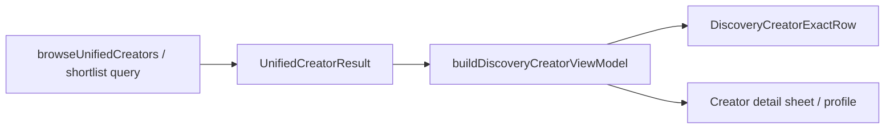

# Discovery Architecture

Companion to **`docs/DISCOVERY_UI_CONTRACT.md`**. Defines how Discovery UI is structured after Phase 2 exact-row consolidation.

---

## Canonical components

All creator browse surfaces share one row implementation:

| Layer | Component | Path |
|-------|-----------|------|
| Data | `buildDiscoveryCreatorViewModel` | `features/discovery/view-models/discovery-creator-view-model.ts` |
| Row | `DiscoveryCreatorExactRow` | `features/discovery/components/discovery-creator-exact-row.ts` |
| Header | `DiscoveryCreatorExactHeader` | same |
| Page | `DiscoveryPageShell` | `features/discovery/components/discovery-page-shell.tsx` |
| Design system | Barrel export | `features/discovery/components/design-system/` |

Chips and badges: `discovery-interest-chips.tsx`, `discovery-platform-cell.tsx`, enrichment badges via existing enrichment components.

---

## Data flow

**ViewModel** centralizes: display name, handle, avatar URL, categories, platform stats, feed publications, brand safety, enrichment labels, relevance (when enabled).

**Row** handles: selection, hover card trigger, optional `meta` / `actions` slots, `rowBehavior` (`open-detail` vs `toggle-select`).

---

## Design system rules

- Import from `@/features/discovery/components/design-system` for new Discovery UI.
- CSS for exact-row lives in `app/thinkway-platform-v6.css` (`discovery-search-exact-*` classes) — extend with modifiers (e.g. `--with-meta`, `--enriching`), don't fork row CSS per page.
- List pages (shortlists, quotations index) use `DiscoveryListCard` + `DISCOVERY_TABLE_*` — not creator exact-row.
- Workspaces use `DiscoveryWorkspaceToolbar` + `DISCOVERY_WORKSPACE_INNER_CLASS`.

---

## Extension guidelines

### Adding a new Discovery module

1. Wrap in `DiscoveryPageShell` with correct `page` identity.
2. Creator lists → `DiscoveryCreatorExactRow` + `DiscoveryCreatorExactHeader`.
3. Filters → `DiscoveryFilterBar` / `DiscoveryFilterDrawer`.
4. Bulk actions → `DiscoverySelectionFlyout`.
5. Empty / loading → design-system states.
6. Extend ViewModel if new *data* is needed; extend row via `meta` / `actions` slots if new *chrome* is needed.

### Phase 3 targets (status)

| Module | Architectural requirement | Status |
|--------|---------------------------|--------|
| Creator Profile | Single ViewModel source; Search typography tokens | ✅ `DiscoveryCreatorProfileSummary` |
| Creator Drawer | Sheet chrome; shared hover + metrics | ✅ `DiscoveryCreatorDetailHost` → `CreatorDetailSheet` |
| Campaign Match | No new creator card component | ✅ Exact-row workspace |
| AI Discovery | Filter/rank logic only; render via exact row | ✅ Chat preview + detail host |
| Studio vendor slate | Domain decision cards | ⚠️ Slate UI retained; detail unified |

---

## Deprecated (must not reintroduce)

- `CreatorResultRow` grid layout
- `creator-result-row.tsx` compatibility shim (removed)
- Per-page creator table constants (`TH_CLASS`, `TD_CLASS`)
- Duplicate selection flyouts wrapping glass primitives directly
- Local creator display resolvers outside `discovery-creator-view-model.ts`

---

## Related docs

- `docs/DISCOVERY_UI_CONTRACT.md` — mandatory component list + CI checks
- `docs/DISCOVERY_UI_MIGRATION_CHECKLIST.md` — migration status
- `docs/DISCOVERY_RELEASE_READINESS.md` — Search parity audit
