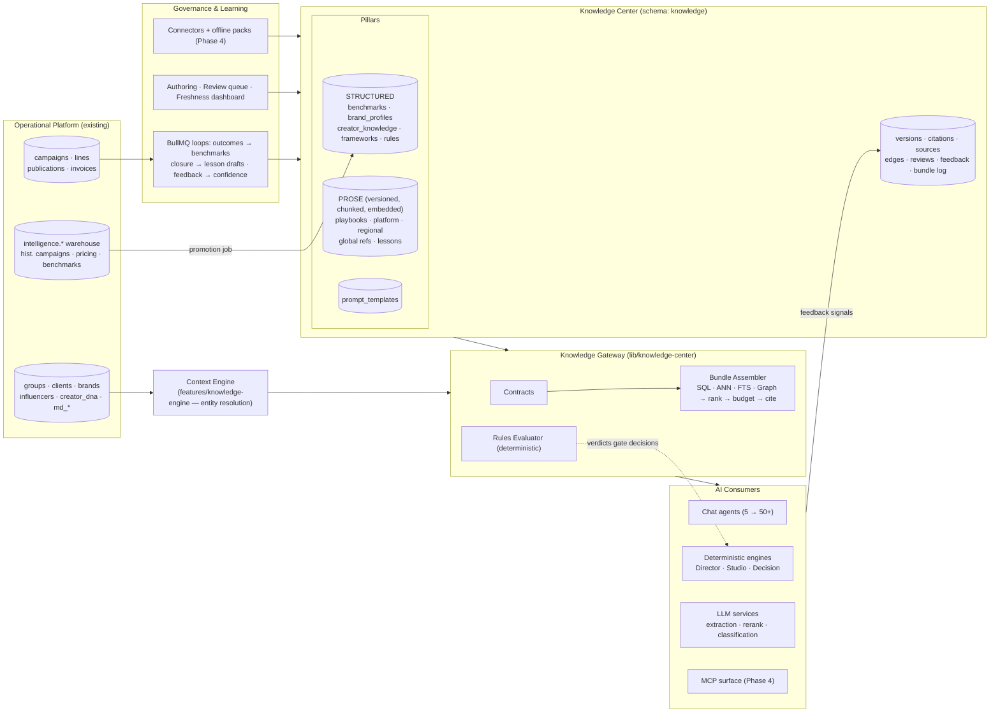

# Thinkway Knowledge Center — Enterprise Architecture

**Status:** Architecture & design only — no implementation in this document
**Date:** July 2026
**Scope:** The knowledge layer ("enterprise AI brain") for every AI component in Thinkway
**Companion docs:** `THINKWAY_SYSTEM_REFERENCE.md` · `ARCHITECTURE_ALIGNMENT.md` · `THINKWAY_INTELLIGENCE_ARCHITECTURE.md`

---

## 0. Executive summary

Thinkway's execution engine (Campaign Studio, Director, Intelligence, Discovery, Decision Engine) is mature. Its intelligence, however, currently comes from three fragile sources: **hardcoded constants** (`features/campaign-studio/services/industry-intelligence.ts`), **inline prompt strings** scattered across services, and the **base LLM's general knowledge** (`gpt-4o-mini` via raw fetch). None of these are versioned, governed, tenant-scoped, or learning from outcomes.

This document designs the **Thinkway Knowledge Center (KC)**: a governed, versioned, retrievable knowledge layer that every AI component consumes through a single **Knowledge Gateway**. It covers taxonomy, database design, retrieval, AI integration, rules, learning loops, governance, security, scalability, and a phased roadmap.

### The Chief AI Architect's position — where this design deliberately deviates from the brief

The brief was challenged as requested. Five deviations, each argued in §2:

1. **Invert the knowledge priority.** The brief leads with Global Marketing Knowledge (marketing science, consumer behavior, 20+ verticals). That is the *least* valuable layer: the LLM already knows most of it, it rots fastest, and nobody at Thinkway will maintain 27 encyclopedias. The moat is **proprietary knowledge**: Thinkway's ~14k historical campaign lines, pricing history, brand DNA, creator performance, and regional (MENA) operating reality. The KC is designed **proprietary-first, global-knowledge-thin**.
2. **Structured facts first, RAG second.** Most of what Thinkway's agents need (benchmarks, rates, rules, brand constraints) is *structured* and must be retrieved **deterministically via SQL**, not semantically via embeddings. RAG is reserved for prose knowledge (playbooks, lessons learned, cultural guidance). A benchmark returned by vector similarity is a bug, not a feature.
3. **No graph database, no external vector database.** Postgres (Supabase) with `pgvector`, FTS, and a typed edge table covers the graph and semantic requirements at Thinkway's scale for years. Trade-offs in §2.3.
4. **Hard constraints never pass through the LLM.** The AI Rules Engine is a deterministic evaluator over rule rows; the LLM receives rules as context and *advises*, but the gate is code. This is the difference between an enterprise system and a prompt.
5. **"Learning" = data loops, not fine-tuning.** The system improves by writing outcomes back into benchmarks, lessons, and rule proposals — human-approved — not by retraining models. Fine-tuning is explicitly deferred (§10.5).

Everything else in the brief — taxonomy breadth, versioning, governance, citations, multi-tenancy, MCP, offline packs — is adopted and specified below.

---

## 1. Current state (grounded audit)

Facts verified in the codebase, July 2026:

| Area | Current reality | Consequence for KC |
|------|-----------------|---------------------|
| LLM provider | OpenAI `gpt-4o-mini` only, via raw `fetch` in 2 provider classes (`features/ai/llm/openai-provider.ts`, `features/ai-workspace/services/streaming-openai-provider.ts`) + 4 standalone callers | Model-agnostic gateway needed; provider abstraction already thin enough to wrap |
| Embeddings / RAG | **None.** No pgvector, no embeddings, no vector index anywhere in `supabase/` | Greenfield for semantic retrieval — no legacy to migrate |
| Retrieval today | Postgres FTS (`tsvector` on discovery) + deterministic entity resolution (`features/knowledge-engine/`) | The existing "knowledge-engine" is an **operational context engine** (resolves campaign/brand/creator mentions → DB snapshots). It is a KC *consumer input*, not the KC itself. Keep it; rename conceptually to "Context Engine" |
| Prompts | Shared `PromptLibrary` for the 5 chat agents (`features/ai/prompts/`); **inline strings** in extraction (`extract-profile-llm.ts`), rerank (`campaign-fit-rerank.ts`), classification (`classify-client-category-ai.ts`), worker enrichment | Prompt duplication problem the brief names is real — solved by moving prompts into the KC as governed, versioned artifacts (§8.4) |
| Domain knowledge | **Hardcoded** `INDUSTRY_PROFILES` / `INDUSTRY_SIGNALS` in `campaign-studio/services/industry-intelligence.ts`; benchmark strings as literals | First migration target: these constants become KC records (§20 Phase 1) |
| "AI" reasoning engines | Campaign Director / Studio / Intelligence / Decision Engine are **deterministic rule code** — zero LLM calls | Good news: Thinkway already separates deterministic reasoning from LLM generation. KC must serve *both* consumers |
| Historical intelligence | `intelligence.*` warehouse schema exists (raw → int → `int_benchmarks`), ~14k campaign lines + 8.4k vendor rows, entity-resolved — but **feature-flagged OFF** (`INTELLIGENCE_ARCHIVED = true`) | The single richest proprietary knowledge source is built and switched off. Un-archiving + piping it into the KC is the highest-ROI move in this entire document |
| Brand/campaign SSOT | `campaign_intelligence_profiles` (brand-scoped jsonb SSOT), `campaign_objects` + versions | The Brand Intelligence pillar (§4) extends this pattern rather than inventing a new one |
| Infra | Supabase Postgres + RLS, BullMQ + Redis queues, worker service, Vercel | KC runs on the same rails: Postgres schema + gateway lib + BullMQ jobs |
| Rules/approvals | `approvals` table exists; no rules engine; workflow thresholds documented but unenforced | Rules Engine (§9) fills a gap the System Reference (§20) already demands |

**Summary:** Thinkway does not need "an AI knowledge project bolted on." It needs the knowledge that already exists (warehouse, brand profiles, hardcoded constants, prompts) **promoted into one governed system**, plus the missing pillars (playbooks, regional, rules, learning loop) built on that same system.

---

## 2. Architecture principles & contested decisions

### 2.1 Principles

1. **One gateway, many consumers.** No AI component queries knowledge tables directly. Everything goes through the Knowledge Gateway API (§8.1). This is how "avoid duplicated retrieval / prompts / rules" is actually enforced — by making duplication structurally impossible.
2. **Right retrieval for the knowledge shape.** Facts → SQL resolvers. Prose → hybrid semantic + FTS. Relationships → edge traversal. Never force one mechanism.
3. **Scope-specific beats generic.** Retrieval ranking always prefers the most specific applicable knowledge: brand > client > industry+region > industry > region > global (§7.4).
4. **Every answer carries citations.** A knowledge bundle without provenance is inadmissible in an enterprise product (§7.6).
5. **Humans govern, machines propose.** LLMs may *draft* knowledge (lessons learned, extracted playbook rules); only humans *publish* it (§11).
6. **Hard constraints are code-evaluated.** The LLM never gates a financial, legal, or brand-safety decision (§9).
7. **Tenant isolation by construction.** Every knowledge row carries scope columns enforced by RLS from day one — white-label is a filter, not a rewrite (§13).
8. **Freshness is a first-class property.** Every knowledge type has a decay half-life; stale knowledge demotes itself (§15).

### 2.2 Contested decision — Build vs. buy (Glean / Notion AI–class platforms)

| Option | For | Against |
|--------|-----|---------|
| Buy enterprise search (Glean-style) | Fast connector coverage, mature relevance | Built for *document* corpora across SaaS tools; Thinkway's knowledge is mostly **structured operational data** in its own Postgres; per-seat cost; no benchmark/rules semantics; white-label impossible |
| Build on Supabase (chosen) | Knowledge = same DB as operations → joins, RLS, one deploy; benchmarks are SQL aggregates over own facts; full control for white-label | Must build governance UI, retrieval quality, and connectors ourselves |

**Decision: build.** Thinkway's differentiating knowledge is not sitting in Google Drive — it is in its own campaign tables. External-document connectors come later as ingestion sources (§17.3), not as the platform.

### 2.3 Contested decision — Storage engines

| Requirement | Dedicated system | Chosen | Rationale |
|-------------|------------------|--------|-----------|
| Semantic search | Pinecone / Qdrant / Weaviate | **pgvector in Supabase** | KC corpus is 10⁴–10⁶ chunks for years; HNSW in pgvector handles ≤ ~50M vectors comfortably; avoids a second datastore, second auth model, second failure domain, and cross-store consistency bugs. Revisit only past ~50M embeddings or <50ms p99 semantic-only SLA (§16) |
| Knowledge graph | Neo4j / Neptune | **`knowledge_edges` table + recursive CTEs** | The graph is shallow (2–3 hops: brand→industry→benchmarks; creator→campaigns→outcomes). Native graph DBs pay off at deep-traversal/analytics workloads Thinkway doesn't have. Edges-as-rows keeps the graph joinable with RLS and citations |
| Full-text | Elasticsearch | **Postgres FTS** | Already in production for discovery; multilingual configs available; one less cluster |
| Cache | — | **Redis (existing) + in-process** | Redis already runs for BullMQ |

**Decision: single Postgres (Supabase) as the system of record for all knowledge, with pgvector + FTS + edge table.** This is the same conclusion Notion, Supabase-native AI products, and most sub-100M-document enterprise systems reach; the Pinecone/Neo4j tier is justified by scale Thinkway will not hit before Phase 4.

### 2.4 Contested decision — How much "Global Marketing Knowledge" to author

The brief lists ~27 global domains × 8 platforms × 17 industry playbooks × 10 regions. Authored naively that is thousands of documents nobody maintains, mostly restating what any frontier LLM knows.

**Decision: the global layer is thin and curated.**
- Author only what is (a) **opinionated** ("Thinkway plans Snapchat-heavy for KSA beauty because…"), (b) **numeric** (benchmarks, budget splits), or (c) **frequently wrong in LLMs** (MENA advertising regulations, platform ad specs, seasonality like Ramadan commerce patterns).
- Everything else is either *not stored* (LLM baseline suffices) or *ingested from sources* (platform changelogs, regulator publications) with freshness tracking rather than hand-written.
- Budget guidance: ≤ 300 curated global/platform/regional items at launch, vs. thousands of proprietary records generated automatically from operations.

This is the single most important scope control in the design. A knowledge base that is 80% stale generic prose will *lower* AI quality versus the base LLM, because retrieval will surface it above the model's fresher parametric knowledge.

### 2.5 Contested decision — One brain vs. per-agent knowledge

Per-agent knowledge silos ("Scout's data", "Director's rules") are how the current duplication happened. **Decision: one KC, agent-specific *views*.** Each agent declares a **Knowledge Contract** (§8.2) — which pillars, scopes, and budget it needs — and the gateway assembles a bundle. Contracts are data, not code, so adding agent #51 is a row, not a retrieval implementation.

---

## 3. Enterprise architecture overview

```mermaid
flowchart TB
    subgraph consumers["AI Consumers (current + future 50+)"]
        chat["Chat agents<br/>Planner · Strategist · Scout · Analyst · General"]
        engines["Deterministic engines<br/>Director · Studio · Decision · Intelligence"]
        services["LLM services<br/>Brief extraction · Rerank · Classification · Enrichment"]
        future["Future agents<br/>Risk · KPI · Prediction · Creative"]
    end

    subgraph gateway["Knowledge Gateway (lib/knowledge-center)"]
        contracts["Knowledge Contracts<br/>per-agent declarative needs"]
        assembler["Bundle Assembler<br/>rank · budget · cite"]
        resolvers["Structured resolvers (SQL)"]
        semantic["Semantic retrieval (pgvector)"]
        fts["FTS retrieval"]
        graph["Graph expansion (edges)"]
        rules["Rules Engine<br/>deterministic evaluator"]
        cache["Cache (Redis + memory)"]
    end

    subgraph store["Knowledge Store (Postgres · schema knowledge)"]
        items["knowledge_items + versions<br/>(playbooks · platform · regional · frameworks)"]
        structured["Structured pillars<br/>benchmarks · pricing · brand_profiles · creator_knowledge"]
        rulesT["rules · rule_sets"]
        edges["knowledge_edges"]
        embeds["knowledge_chunks + embeddings"]
        prompts["prompt_templates (versioned)"]
    end

    subgraph feeds["Ingestion & Learning (BullMQ jobs)"]
        ops["Operational DB<br/>campaigns · lines · publications · invoices"]
        wh["intelligence.* warehouse<br/>(un-archived)"]
        editor["Governance UI<br/>author · review · publish"]
        post["Post-campaign learning loop<br/>outcomes → lessons → benchmark refresh"]
        ext["External connectors (Phase 4)<br/>platform updates · regulations · docs"]
    end

    consumers -->|"retrieve(context, contract)"| gateway
    gateway --> store
    ops --> post --> store
    wh --> store
    editor --> store
    ext --> store
    rules -.->|verdicts, never LLM-gated| consumers
```

**Placement in the codebase (design intent):**
- `supabase/` → new `knowledge` schema (migrations), following the precedent of the isolated `intelligence` schema.
- `lib/knowledge-center/` → gateway, resolvers, ranking, rules evaluator (server-side, framework-free, testable like `lib/services/*`).
- `features/knowledge-center/` → governance UI (authoring, review queue, freshness dashboard) following the workspace pattern.
- Existing `features/knowledge-engine/` remains the **Context Engine** (entity resolution); the gateway takes its output (`KnowledgeContext`: campaign, brand, creators) as the *scoping input* for retrieval.

---

## 4. Knowledge taxonomy

Two orthogonal axes: **pillar** (what kind of knowledge) and **scope** (whom it applies to). Every record has exactly one pillar and a scope vector.

### 4.1 Pillars

| # | Pillar | Shape | Primary storage | Examples |
|---|--------|-------|-----------------|----------|
| P1 | **Performance Knowledge** | Structured facts | Views/marts over operational DB + `intelligence.*` | Campaign outcomes, ROI/ROAS/CPM/CPC/CPA/CPV/CTR, completion, client satisfaction |
| P2 | **Benchmark Library** | Structured aggregates | `benchmarks` table (materialized) | Median CPM: beauty × Instagram × KSA × macro; margin percentiles; budget splits |
| P3 | **Creator Knowledge** | Structured + prose notes | `creator_knowledge` + existing `creator_dna` | Pricing history, audience quality, fraud signals, brand affinity, collaboration history, risk |
| P4 | **Brand Intelligence** | Structured profile + prose | `brand_profiles` (extends `campaign_intelligence_profiles` pattern) | Brand DNA, tone, visual identity, competitors, preferred creators, safety rules, approval rules, history |
| P5 | **Industry Playbooks** | Semi-structured docs | `knowledge_items` (typed sections) | 17 verticals: objectives, audience, creator mix, KPIs, structure, budgets, pillars, risks, benchmarks refs |
| P6 | **Platform Knowledge** | Semi-structured docs, fast-decaying | `knowledge_items` | 8 platforms: algorithm notes, formats, ad specs, audience behavior, updates |
| P7 | **Regional Intelligence** | Semi-structured docs | `knowledge_items` | EG/SA/AE/QA/KW/JO/MA/TR/EU/NA: consumer insight, culture, seasonality (Ramadan!), regulations, creator ecosystem |
| P8 | **Global Marketing Knowledge** | Prose, thin & curated | `knowledge_items` | Frameworks, measurement, attribution — only where opinionated or LLM-weak (§2.4) |
| P9 | **Decision Frameworks** | Structured templates | `frameworks` | Planning, creator selection, budget allocation, risk, brand safety, creative eval, proposal, exec approval |
| P10 | **Rules** | Executable rows | `rules` / `rule_sets` | Hard/soft constraints, compliance, brand safety, financial validation, approval policies |
| P11 | **Prompt & Instruction Assets** | Versioned text | `prompt_templates` | All agent prompts, extraction prompts — governed like knowledge, ending inline-string drift |
| P12 | **Lessons Learned** | Prose, cited to campaigns | `knowledge_items` (type `lesson`) | Post-campaign insights, failure analyses, client feedback distillations |

### 4.2 Scope vector (applies to every record)

```
tenant_id        — organization (Thinkway HQ, white-label customer). NULL = platform-global
scope_level      — global | region | country | industry | platform | client | brand | creator | campaign
region / country — e.g. MENA / SA
industry_id      — FK md_categories (reuse existing taxonomy; do NOT invent a parallel one)
platform         — enum (instagram, tiktok, youtube, snapchat, linkedin, pinterest, x, threads)
brand_id / client_id / group_id / influencer_id — FKs when entity-scoped
language         — content language (en, ar, …)
```

**Design rule:** scope columns are nullable FKs into *existing* master data (`md_categories`, `md_countries`, `brands`…) — the KC never forks Thinkway's taxonomy. Industry playbook verticals map to `md_categories`; where the brief's list (e.g. "Government") has no category yet, the category is added to master data first.

### 4.3 Knowledge item types (for `knowledge_items.item_type`)

`playbook_section` · `platform_guide` · `regional_guide` · `marketing_reference` · `framework_doc` · `lesson` · `policy` · `faq` · `glossary` — each with a JSON schema for its structured fields (Zod, mirroring the codebase's validation convention), so "playbook" isn't a blob but has typed `objectives`, `kpi_refs`, `budget_range`, `content_pillars`, `risks[]`.

---

## 5. Database design (schema `knowledge`)

Design-level DDL sketch; names/types indicative, not final migrations.

### 5.1 Core content tables

```
knowledge_items
  id uuid PK
  item_type text                    -- §4.3
  pillar text                       -- P5–P9, P12 (prose pillars)
  slug text                         -- stable handle: "playbook/beauty/creator-mix"
  title text
  scope: tenant_id, scope_level, region, country_code, industry_id,
         platform, group_id, client_id, brand_id, influencer_id
  language text DEFAULT 'en'
  translation_group_id uuid         -- same knowledge across languages (§14)
  status text                       -- draft | in_review | published | deprecated | archived
  current_version_id uuid FK
  confidence numeric(3,2)           -- §15
  freshness_half_life_days int      -- per type default, overridable
  valid_from / valid_to date        -- seasonality & regulation windows
  created_by / owner_id uuid        -- accountable human owner (required to publish)
  tags text[]
  created_at / updated_at

knowledge_item_versions              -- append-only
  id uuid PK
  item_id uuid FK
  version int                       -- monotonic per item
  content jsonb                     -- typed per item_type (validated)
  content_text text                 -- flattened for FTS + chunking
  change_summary text
  authored_by uuid, review_id uuid FK
  published_at timestamptz
  supersedes_version_id uuid

knowledge_chunks                     -- retrieval units (built from published versions)
  id uuid PK
  version_id uuid FK, item_id uuid FK (denormalized + scope columns denormalized for filter-first ANN)
  chunk_index int
  text text
  embedding vector(1536)            -- pgvector; dimension per embedding model registry
  embedding_model text
  fts tsvector GENERATED
  -- indexes: HNSW on embedding; GIN on fts; btree on scope columns

knowledge_sources
  id uuid PK
  source_type text                  -- internal_campaign | warehouse | document | url | human | llm_draft
  reference jsonb                   -- e.g. {campaign_header_id}, {url, retrieved_at}, {file_id}
  authority numeric(3,2)            -- source trust weighting (§15)

knowledge_citations
  id uuid PK
  version_id uuid FK
  source_id uuid FK
  locator text                      -- section/row/page pointer
```

### 5.2 Structured pillar tables

```
benchmarks                           -- P2 (successor of intelligence.int_benchmarks, promoted & governed)
  id uuid PK
  metric text                       -- cpm | cpc | cpa | cpv | ctr | er | view_rate | completion_rate |
                                    -- margin_pct | budget_split | roas | …
  dimensions: tenant_id, industry_id, platform, country_code, region,
              creator_tier text, campaign_type text, content_format text
  p25 / p50 / p75 / mean numeric
  sample_size int
  period daterange
  source text                       -- thinkway_history | curated_external | blended
  computed_at timestamptz, pipeline_run_id uuid
  status text                       -- auto_published | needs_review (small samples gate to review, §11)

brand_profiles                       -- P4 (extends campaign_intelligence_profiles pattern; brand-scoped SSOT)
  brand_id uuid PK FK brands
  dna jsonb            -- positioning, values, personality
  tone_of_voice jsonb  -- do/don't, vocabulary, examples
  visual_identity jsonb
  competitors uuid[] / jsonb
  preferred_creators / blocked_creators uuid[]
  safety_rules jsonb   -- content exclusions, category blocks
  approval_rules jsonb -- who approves what (feeds Rules Engine)
  history_summary jsonb -- rolled-up campaign performance (materialized from P1)
  version int, status, owner_id      -- same lifecycle as knowledge_items

creator_knowledge                    -- P3 (knowledge overlay; operational truth stays in influencers/creator_dna)
  influencer_id uuid PK FK influencers
  pricing_observations jsonb[]      -- {rate, currency, platform, format, source, observed_at}
  audience_quality jsonb            -- authenticity, fraud signals + evidence citations
  brand_affinity jsonb              -- categories, past brand collabs, exclusivity windows
  performance_summary jsonb         -- materialized from campaign_publications / P1
  risk jsonb                        -- incidents, disputes, content risk flags
  notes_item_id uuid                -- prose notes live as knowledge_items (governed)

frameworks                           -- P9
  id uuid PK, framework_type text, name text
  definition jsonb                  -- steps, inputs, weights, output schema
  scope + version + status (as above)

prompt_templates                     -- P11 (migrates features/ai/prompts + all inline prompts)
  id uuid PK, template_key text UNIQUE  -- "strategist.system", "cip.extraction"
  body text, variables jsonb, model_hints jsonb
  version int, status, owner_id, change_summary
```

### 5.3 Rules Engine tables (P10) — see §9

```
rule_sets(id, name, domain, scope…, status, version)
rules(id, rule_set_id, rule_key, kind hard|soft|advisory,
      condition jsonb,            -- typed expression AST evaluated in code (no eval, no LLM)
      action jsonb,               -- block | require_approval(role) | warn | adjust_default
      message text, citations, priority int, status, version)
rule_evaluations(id, rule_id, subject_type, subject_id, verdict, context_snapshot jsonb, evaluated_at)
```

### 5.4 Graph & operations tables

```
knowledge_edges
  id uuid PK
  from_type / from_id, to_type / to_id      -- knowledge items AND operational entities
  edge_type text    -- applies_to | derived_from | supersedes | contradicts | supports |
                    -- benchmark_of | competitor_of | preferred_creator | lesson_from
  weight numeric, metadata jsonb, created_by, created_at

knowledge_reviews                    -- §11 approval workflow (mirrors existing approvals pattern)
  id, item_id/version_id, state, reviewer_id, decision, comments, decided_at

knowledge_feedback                   -- §10 learning signals
  id, bundle_id, item_id, agent text, signal text  -- used | ignored | contradicted | user_upvote |
                                                   -- user_downvote | outcome_positive | outcome_negative
  context jsonb, created_at

knowledge_bundles_log                -- audit of every retrieval (sampled at scale)
  id, agent, contract_key, scope jsonb, item_version_ids uuid[], token_cost int, latency_ms int, created_at

embedding_models                     -- registry: model name, dimension, language coverage, active flag
ingestion_runs                       -- pipeline audit
```

### 5.5 Relationship to existing tables

| Existing | KC relationship |
|----------|-----------------|
| `intelligence.int_benchmarks` etc. | **Feeder.** Warehouse stays isolated (per its own architecture doc); a promotion job publishes governed rows into `knowledge.benchmarks` with citations back to warehouse rows |
| `campaign_intelligence_profiles` | Campaign-level extraction SSOT stays; `brand_profiles` is its durable brand-level sibling; edge `derived_from` links them |
| `creator_dna` | Operational identity/DNA stays authoritative; `creator_knowledge` holds *judgment* (risk, affinity, pricing intel) with citations |
| `md_*` master data | Scope FKs only — never duplicated |
| `approvals` / audit patterns | Review workflow mirrors them (per `ARCHITECTURE_ALIGNMENT.md`: extend existing patterns, don't fork) |

---

## 6. Storage strategy

| Content | Store | Why |
|---------|-------|-----|
| All knowledge records, versions, rules, benchmarks | Postgres `knowledge` schema | Joins with operations, RLS, one backup/restore story |
| Embeddings | pgvector column on `knowledge_chunks` | §2.3; HNSW index; scope-filtered ANN |
| Large source documents (uploaded PDFs, decks, brand books) | Supabase Storage buckets (existing `*_documents` pattern) | Only extracted/normalized text enters `knowledge_chunks`; the binary is a cited source |
| Hot bundles / rule sets | Redis (existing) with event-driven invalidation on publish | Retrieval latency budget (§7.7) |
| Offline knowledge packs (Phase 4) | Signed, versioned export files (JSONL + manifest) generated from published versions | §17.2 |

**Version retention:** versions are append-only and never deleted; storage cost is trivial (text). Embeddings are kept only for **published** versions; superseded chunks are deleted (re-embeddable from text at any time).

**Backfill posture:** on embedding-model change, re-embedding is a batch BullMQ job over `knowledge_chunks` (model registry makes multi-model coexistence explicit during migration).

---

## 7. Retrieval architecture

### 7.1 The one entry point

```ts
// lib/knowledge-center/gateway.ts (design signature)
retrieveKnowledge(input: {
  contract: AgentContractKey            // e.g. "strategist.plan", "budget.allocate"
  context: KnowledgeContext             // from existing Context Engine (entities, workspace)
  query?: string                        // free-text need, if any
  scope: ScopeVector                    // tenant, brand, industry, region, platform, language
  budget: { maxTokens: number }         // hard cap for bundle size
}): Promise<KnowledgeBundle>
```

`KnowledgeBundle` = ordered sections of typed entries, each with `{ content, item_version_id, confidence, freshness, citations[] }`, plus `applicable_rules[]` (pre-evaluated verdicts where subject data exists) and `bundle_id` for feedback correlation.

### 7.2 Four retrieval lanes (composed per contract)

1. **Structured resolvers (SQL, deterministic).** Benchmarks, pricing, brand profile, creator knowledge, frameworks, rules. Exact scope-match cascade with explicit fallback (§7.4). *Never* embedded, *never* approximate.
2. **Semantic (pgvector ANN).** Prose pillars only. Filter-first: SQL `WHERE` on scope columns, *then* HNSW similarity on the survivors — preventing cross-tenant/off-scope leakage at the query level, not post-hoc.
3. **Lexical (FTS).** Exact terms, names, Arabic text, regulation identifiers — merged with semantic via Reciprocal Rank Fusion (standard hybrid-search practice; cheap and robust; a cross-encoder reranker is a Phase 3+ upgrade only if quality demands it).
4. **Graph expansion (1–2 hops).** From resolved entities: brand → competitors → their lessons; industry → playbook → cited benchmarks; creator → past collabs → outcomes. Bounded depth, executed as recursive CTEs.

### 7.3 Assembly pipeline

```
contract → required sections
  → run lanes in parallel
  → dedupe (item level; prefer highest version)
  → score = w_rel·relevance × w_conf·confidence × w_fresh·freshness × w_scope·scope_specificity
  → knapsack into token budget (each section has min/max share)
  → render with citations
  → log bundle (knowledge_bundles_log) → return
```

### 7.4 Scope-specificity cascade

For any knowledge need, candidates are ranked by specificity before score:
`brand → client/group → industry×region → industry → region → platform-global → tenant-global → platform default`.
A brand's "no alcohol adjacency" rule always beats the industry playbook's "nightlife creators perform well." Structured resolvers implement this as an explicit `COALESCE`-style cascade so behavior is testable, not emergent.

### 7.5 Avoiding duplicated retrieval (the brief's explicit requirement)

- Consumers cannot import knowledge tables — lint rule + code review convention, same as the existing "no direct writes to `campaign_headers` from UI" discipline.
- Contracts are rows (`agent_contracts` seed data), so retrieval logic exists **once**; 50 agents = 50 contract rows.
- The existing 4 standalone LLM callers migrate to the gateway in Phase 1–2 (§20), removing their inline context assembly.

### 7.6 Citations

Every bundle entry carries `citations[] → knowledge_citations → knowledge_sources`. Agent outputs that surface knowledge to users (proposals, strategy docs) render human-readable provenance ("Benchmark: 142 Thinkway KSA beauty lines, 2024–2026" / "Brand rule set v7, approved by X on date"). This is both an enterprise trust feature and the debugging tool for retrieval quality.

### 7.7 Caching & latency budget

| Layer | TTL / invalidation | Target |
|-------|--------------------|--------|
| In-process (existing memory-cache pattern) | 60s, key = contract+scope hash | hot workspace loops |
| Redis | invalidated on publish events (`knowledge.published` channel) | brand profiles, rule sets, benchmarks: p50 < 20ms |
| Full bundle assembly (cold) | — | p50 < 300ms, p99 < 1s (semantic lane dominates) |

Publishing is the *only* cache-busting event — a key benefit of the draft→published lifecycle: consumers never see torn writes.

---

## 8. AI integration architecture

### 8.1 Consumer classes and how each integrates

| Consumer | Integration |
|----------|-------------|
| **Chat agents** (Planner/Strategist/Scout/Analyst/General) | Orchestrator step "enrich context" (already exists as `knowledge-context-service.ts`) extends to call the gateway; bundle sections render into the system prompt via the prompt template's declared slots |
| **Deterministic engines** (Director/Studio/Decision/Intelligence) | Consume **structured lanes only** (benchmarks, rules, frameworks, brand profile) as typed objects — no prompt involved. This replaces `INDUSTRY_PROFILES` constants with `getBenchmarks()/getPlaybook()` calls |
| **LLM services** (brief extraction, rerank, classification, worker enrichment) | Fetch their prompt from `prompt_templates` + scoped knowledge bundle; drop inline strings |
| **Future agents** | Declare a contract row + prompt template; zero retrieval code |

### 8.2 Knowledge Contracts (declarative per-agent needs)

```jsonc
// seed row example — strategist planning task
{
  "contract_key": "strategist.plan",
  "sections": [
    { "pillar": "brand_profile",  "lane": "structured", "required": true,  "budget_share": 0.20 },
    { "pillar": "benchmarks",     "lane": "structured", "metrics": ["cpm","er","budget_split"], "budget_share": 0.15 },
    { "pillar": "playbook",       "lane": "hybrid",     "budget_share": 0.25 },
    { "pillar": "regional",       "lane": "hybrid",     "budget_share": 0.15 },
    { "pillar": "lessons",        "lane": "hybrid",     "filter": "same brand OR same industry×region", "budget_share": 0.15 },
    { "pillar": "rules",          "lane": "structured", "required": true,  "budget_share": 0.10 }
  ],
  "freshness_floor": { "platform_guide": 180 }   // days; stale items excluded, not just demoted
}
```

### 8.3 Prompt architecture (ending duplication)

- All prompts live in `prompt_templates` (P11), versioned and reviewed like knowledge.
- Templates declare **knowledge slots** (`{{knowledge.brand_profile}}`, `{{knowledge.rules}}`) filled from the bundle — prompts stop restating domain facts.
- The existing `PromptLibrary` class becomes a thin loader over the table (interface unchanged for the 5 agents — low-risk migration).
- Model-specific hints (`model_hints`) allow per-model variants without forking templates, supporting the "future LLMs" requirement: swapping models = provider config + optional hint rows, zero knowledge changes.

### 8.4 LLM provider posture

Out of scope to redesign here, but a KC dependency: the two hand-rolled providers + 4 inline callers should converge on one provider interface with a **model registry** (model, dimension/context limits, cost tier per task). The KC's value is bounded by the model reading it; `gpt-4o-mini`-only is a product decision worth revisiting for strategy-generation tasks once bundles carry real knowledge. (Recommendation, not requirement.)

### 8.5 MCP exposure (future-proofing, Phase 4)

The gateway's operations (`retrieveKnowledge`, `getBenchmarks`, `evaluateRules`, `searchKnowledge`) are designed as **transport-agnostic functions** so they can be exposed as MCP tools for external/desktop agents and future orchestration frameworks without re-implementation. Internal consumers keep in-process calls (no network hop); MCP is an *additional* surface, not the internal bus.

---

## 9. AI Rules Engine

**Non-negotiable principle:** hard constraints are evaluated by deterministic code over `rules` rows. The LLM sees rules as context (so its drafts comply) but cannot approve, waive, or reinterpret them.

- **Rule kinds:** `hard` (block), `soft` (require approval per role — wiring into the existing `approvals` table and System Reference §20 thresholds: >$50k → Director, margin <15% → Finance/CFO, discount >20% → CEO), `advisory` (warn/annotate).
- **Condition language:** a small typed expression AST over declared subject schemas (campaign draft, budget allocation, creator selection, proposal) — JSON-defined, code-evaluated, unit-testable. No string eval, no DSL creep: if a rule needs more than comparisons/boolean logic/lookups, it becomes a code-registered predicate referenced by key.
- **Where enforced:** engines call `evaluateRules(subject)` at gate points (Director's `approval-gate.ts` and `decision-intelligence-gate.ts` are the natural seams — they already exist as deterministic gates). Chat agents receive the same verdicts in their bundle so conversation and enforcement never diverge.
- **Every evaluation is logged** (`rule_evaluations`) with a context snapshot — the audit trail for "why did the AI refuse/require approval."
- Brand-safety rules resolve through the scope cascade (brand rules override industry/global).

---

## 10. Learning system

The brief's requirement — "AI improves over time without changing prompts" — is met with four closed loops, all human-gated at publish:

### 10.1 Outcome ingestion (automatic)
Post-campaign (closure stage / scheduled BullMQ job): roll up line economics, publication metrics, deliverable outcomes → refresh `benchmarks`, `brand_profiles.history_summary`, `creator_knowledge.performance_summary`. Fully automatic **because it's aggregation of authoritative facts**, with `needs_review` gating for small-sample or outlier-shifting updates.

### 10.2 Lessons learned (LLM-drafted, human-published)
On campaign closure (and on rejection/loss events): an LLM pass over the campaign object, performance, approvals history, and client feedback drafts a `lesson` knowledge item with citations. It enters the review queue (§11); an owner edits/approves/rejects. Rejected campaigns and failures explicitly included — negative knowledge is the highest-value lesson content.

### 10.3 Retrieval feedback (automatic signal, periodic action)
`knowledge_feedback` accumulates: bundle items ignored by agents, user thumbs-down on AI outputs, contradictions detected (agent output vs. cited knowledge). A monthly job flags low-utility / contradicted items for owner review; confidence scores adjust within bounded ranges (never auto-zero, never auto-publish).

### 10.4 Rule proposals
Patterns in overrides (e.g., Finance repeatedly waiving a soft rule; margins consistently renegotiated) generate **draft rule changes** into the review queue. Rules never change without human approval — full stop.

### 10.5 Explicit non-goal: fine-tuning
Deferred indefinitely. Reasons: (1) data volume per niche is small; (2) fine-tuned weights can't be governed, cited, corrected, or tenant-scoped — everything this architecture exists to provide; (3) it couples Thinkway to one model generation, violating the future-LLM requirement. Revisit only for narrow classifiers (e.g., brief field extraction) if prompt+knowledge accuracy plateaus measurably.

---

## 11. Governance, validation & update lifecycle

### 11.1 Roles

| Role | Rights |
|------|--------|
| **Knowledge Admin** (per tenant) | Manage taxonomy config, contracts, rule sets; publish anything; assign owners |
| **Domain Editor** | Author/edit drafts within assigned pillars/scopes (e.g., "Regional: GCC", "Playbooks: Beauty") |
| **Reviewer** | Approve/reject in review queue; cannot author-and-approve own item (mirrors onboarding's "cannot self-approve") |
| **Consumer** | AI components + all staff read published knowledge per RLS scope |

Maps onto the existing roles/permissions system (`roles`, `permissions`, `requirePermission`) with new `knowledge.*` permission keys — no parallel auth.

### 11.2 Lifecycle state machine

```
draft → in_review → published → (new version → in_review → published, supersedes)
                        ↓
                   deprecated → archived
```

- **Publish requirements:** owner assigned, ≥1 citation (or explicit `uncited_expert_opinion` flag, capped confidence), schema-valid content, reviewer ≠ author.
- **Deprecation:** excluded from retrieval immediately; edges `superseded_by` preserve history; consumers holding cached bundles expire ≤ TTL.
- **Emergency kill switch:** Admin can archive instantly (compliance/legal events) — cache invalidation is push-based so propagation is seconds.
- **Scheduled validity:** `valid_from/valid_to` for seasonal knowledge (Ramadan playbooks auto-activate/retire) and regulation effective dates.

### 11.3 Validation workflow (quality gates before review)

1. **Schema validation** (Zod per item type).
2. **Automated checks:** broken citation refs, scope contradictions (brand item citing wrong industry), numeric sanity vs. existing benchmarks, duplicate-similarity warning (embedding distance to existing published items).
3. **Contradiction detection:** flags published items whose claims conflict (`contradicts` edge proposed) — reviewer resolves precedence or deprecates one.
4. **Human review** (§11.1), with diff-vs-previous-version view.

### 11.4 Freshness operations

A **freshness dashboard** (governance UI) lists items past half-life by pillar/owner; platform-guide items (fastest decay) get review SLAs. Stale-beyond-floor items drop out of bundles automatically (§8.2) — the system degrades to "LLM baseline" rather than serving rot, directly countering the §2.4 risk.

---

## 12. Versioning

- **Append-only versions** per item; `current_version_id` pointer; monotonic version numbers; `supersedes` chain.
- **Bundles log version IDs**, so any AI decision is reproducible: "Proposal X was generated with brand profile v7, rule set v12, benchmark run 2026-06-30."
- **Rules and prompts version identically** — a compliance requirement, not a nicety.
- **Benchmarks version by pipeline run** (`computed_at`, `pipeline_run_id`) with period ranges, enabling "as-of" queries.
- **Offline packs** (Phase 4) are manifests of exact version IDs — auditable snapshots by construction.

---

## 13. Security model & multi-tenancy

- **RLS on every `knowledge.*` table** keyed by `tenant_id` + role permissions, same enforcement plane as the operational DB. Platform-global rows (`tenant_id IS NULL`) are readable by all tenants but writable only by platform Knowledge Admins.
- **White-label:** tenant rows override/extend global rows via the scope cascade — a white-label customer sees global marketing/platform knowledge + their own brand/regional/rules layer, never another tenant's. Escalation path if a customer demands physical isolation: per-tenant schema or project, viable because the KC has no cross-tenant joins by design. Start with RLS (operationally 10× cheaper); the cascade design keeps the escape hatch open.
- **Data classification:** creator banking, contract values, and PII **never enter knowledge tables** — pricing intel stores rates and dates, not bank references (the warehouse doc's finance-isolation rule extends to KC). Client-confidential lessons can be marked `internal_only`, excluded from any tenant-shared or offline-pack surface.
- **Prompt-injection surface:** ingested external documents (briefs, connector content) are data, not instructions — chunk rendering wraps them in clearly delimited citation blocks, and prompts instruct models to treat knowledge content as reference material. Rules verdicts being code-evaluated (§9) caps the blast radius of any successful injection.
- **Audit:** authoring, review decisions, publishes, rule evaluations, and (sampled) retrievals are logged, consistent with the existing `audit_logs` discipline.

---

## 14. Multi-language

- `language` + `translation_group_id`: one logical knowledge item, N language variants sharing lifecycle events (publishing a new English version flags siblings `translation_stale`).
- **Arabic is first-class** (MENA-core business): Arabic FTS configuration; embedding model chosen for multilingual performance (registry entry, swappable); regional items authored NL-first where the domain is Arabic (regulations, cultural guidance) with English as the translation.
- Retrieval prefers the requester's language, falls back to translation-group siblings with a `translated_from` marker so agents can note provenance.

---

## 15. Knowledge scoring: confidence & freshness

```
confidence(item) = f( source_authority,          -- knowledge_sources.authority
                      validation_state,          -- reviewed? cited? contradiction-free?
                      sample_size,               -- for data-derived items
                      feedback_adjustment )      -- bounded ±0.15 from §10.3
freshness(item)  = exp( -age_days / half_life )  -- half-life per item_type:
                   platform_guide 90d · benchmarks per-period · regional_guide 365d ·
                   playbook 540d · lesson 720d · brand_profile event-driven (no decay, staleness by review SLA)
```

Both factors multiply into retrieval ranking (§7.3) and are **rendered in bundles** so the LLM can express calibrated uncertainty ("based on 12 campaigns, moderate confidence…") — a Harvey-style pattern for professional-grade AI output.

---

## 16. Scalability

| Dimension | Design headroom | Escalation path |
|-----------|-----------------|-----------------|
| Knowledge items | 10⁴–10⁵ items, 10⁵–10⁷ chunks — pgvector HNSW fine | Partition chunks by tenant/pillar; dedicated vector store only past ~50M vectors |
| Creators (millions) | `creator_knowledge` is 1:1 with `influencers`; summaries materialized, not computed at read | Move performance_summary refresh to incremental jobs (already the BullMQ pattern) |
| Campaigns (millions) | Benchmarks are periodic aggregates — read cost independent of fact volume | Warehouse layer already isolates heavy ETL from serving |
| 50+ agents | Contracts are rows; gateway stateless | Horizontal scale = Next.js/server scale; Redis bundle cache absorbs hot paths |
| Retrieval QPS | Cache-first; cold assembly p99 < 1s | Read replicas for the knowledge schema; per-tenant cache shards |
| Countries/companies | Scope vector + RLS from day one | Schema-per-tenant if contractually forced (§13) |

The deliberate constraint — **one Postgres** — is also the scalability risk to watch; §18 R6.

---

## 17. Future requirements coverage

### 17.1 Future LLMs
Model registry + provider interface (§8.4), prompt `model_hints` (§8.3), embeddings registry with re-embed jobs (§6). No knowledge content is model-specific.

### 17.2 Offline knowledge packs
Signed JSONL exports of published version sets (manifest = exact version IDs + scope filter + license), for air-gapped enterprise deployments or edge inference. Excluded: `internal_only`, PII-adjacent, other-tenant rows. Import side verifies signature + schema version.

### 17.3 External connectors
Phase 4 ingestion adapters (platform policy pages, regulator feeds, client brand portals, Drive/Notion docs) land in a **staging inbox** as `draft` items with `source_type=url|document` — full review lifecycle applies; connectors never publish directly.

### 17.4 MCP tools / RAG / Knowledge Graph / Semantic search
All designed in: §8.5 (MCP), §7.2 lanes 2–3 (RAG/semantic), §5.4 + §7.2 lane 4 (graph).

---

## 18. Risks

| # | Risk | Likelihood | Impact | Mitigation |
|---|------|-----------|--------|------------|
| R1 | **Knowledge rot** — stale content degrades AI below LLM baseline | High | High | Thin global layer (§2.4), half-life exclusion floors (§8.2), freshness dashboard + owner SLAs (§11.4) |
| R2 | **No authoring capacity** — taxonomy built, nobody writes/reviews | High | High | Proprietary pillars auto-populate from operations (P1–P4); prose pillars scoped to ≤300 launch items; every item has a named owner or it doesn't publish |
| R3 | **Retrieval quality disappoints** — wrong/irrelevant knowledge in bundles | Medium | High | Structured-first design shrinks the semantic surface; bundle logs + feedback loop (§10.3); golden-set retrieval tests per contract (CI, mirroring the repo's `test:*` discipline) |
| R4 | **Over-engineering stall** — 12 pillars × governance × multi-tenant before value ships | Medium | High | Phasing (§20) delivers agent-visible value in Phase 1 from *existing* data; governance UI is Phase 3, not a prerequisite |
| R5 | **Cross-tenant leakage** (white-label) | Low | Critical | RLS at table level + filter-first ANN (§7.2) + no cross-tenant joins by design; leakage tests in CI |
| R6 | **Single-Postgres ceiling** | Low (yrs) | Medium | §16 escalation paths pre-designed; version/citation model is store-agnostic |
| R7 | **LLM ceiling** — `gpt-4o-mini` can't exploit rich bundles | Medium | Medium | §8.4 model registry; bundle quality measurable independently (citations/eval sets) so model upgrades are evidence-based |
| R8 | **Prompt-injection via ingested docs** | Medium | Medium | §13 delimiting + code-evaluated rules; connector content always human-reviewed before publish |
| R9 | **Benchmark misuse** — small-sample numbers steer big decisions | Medium | Medium | `sample_size` mandatory, rendered with values; `needs_review` gate on small/outlier updates; confidence discounts thin data (§15) |

---

## 19. Trade-offs summary (what was given up, knowingly)

| Chosen | Rejected | Cost accepted |
|--------|----------|---------------|
| Postgres + pgvector | Dedicated vector DB | Lower ANN ceiling; acceptable for years (§2.3) |
| Edge table + CTEs | Native graph DB | No deep-graph analytics; not needed by any consumer |
| Thin curated global knowledge | Encyclopedic authoring | Some generic questions fall back to LLM baseline — by design |
| Human-gated publishing | Fully automatic learning | Slower knowledge velocity; enterprise trust requires it |
| One gateway (in-process lib) | Standalone knowledge microservice | Coupled deploys with the app; avoids network hop + service ops until MCP surface (Phase 4) justifies a service boundary |
| RLS multi-tenancy | Schema-per-tenant | Requires RLS rigor; escape hatch preserved |
| Data loops | Fine-tuning | No parametric "learning"; full governability retained (§10.5) |
| Reuse `md_*` taxonomy & roles | Standalone KC taxonomy/auth | KC coupled to platform master data — the point, per `ARCHITECTURE_ALIGNMENT.md` |

---

## 20. Implementation phases (recommendation)

> Sequencing rule: every phase must make at least one shipping AI feature measurably better; no "foundation-only" releases after Phase 0.

**Phase 0 — Foundation (small):**
`knowledge` schema migrations (items, versions, sources, citations, edges, contracts); gateway skeleton with structured lane; pgvector extension enabled (unused yet); `knowledge.*` permissions.

**Phase 1 — Proprietary knowledge online (highest ROI):**
Un-archive the `intelligence` warehouse → promotion job into `knowledge.benchmarks`; migrate `INDUSTRY_PROFILES`/`INDUSTRY_SIGNALS` constants into playbook/benchmark records; `brand_profiles` (from `campaign_intelligence_profiles` + backfill); wire Studio/Director/Decision engines to `getBenchmarks()/getPlaybook()/getBrandProfile()`. **Exit test:** delete the hardcoded constants file; proposals cite live benchmarks.

**Phase 2 — Rules + prompts unification:**
Rules Engine (tables, evaluator, gates in Director + chat bundle verdicts) implementing System Reference §20 thresholds; migrate all prompts (library + 4 inline callers) to `prompt_templates`; review queue (minimal UI on existing approvals pattern).

**Phase 3 — RAG + authoring + learning loop:**
Chunking/embedding pipeline; hybrid retrieval lanes; regional + playbook authoring (≤300 items, owners assigned); lessons-learned drafts on campaign closure; feedback logging; governance UI (authoring, review, freshness dashboard); retrieval golden-set tests.

**Phase 4 — Scale & openness:**
Multi-tenant hardening + white-label onboarding; MCP tool surface; external connectors (staged ingestion); offline knowledge packs; read replicas / performance work as metrics demand; contradiction detection automation.

Dependency-ordered; each phase independently valuable; Phases 1–2 require **no new authored content** — they promote knowledge Thinkway already has.

---

## 21. Final enterprise architecture diagram



---

## Appendix A — Requirement traceability

| Brief requirement | Where addressed |
|---|---|
| Global / platform / industry / regional knowledge | §4 P5–P8, scope §4.2, authoring posture §2.4 |
| Brand / creator / performance / benchmarks | §4 P1–P4, §5.2 |
| Decision frameworks / rules engine | §4 P9–P10, §9 |
| Learning system | §10 |
| DB architecture · taxonomy · versioning · metadata | §5, §4, §12 |
| Retrieval · embeddings · search · caching | §7, §6 |
| Validation · approval · update workflow · governance | §11 |
| Permissions · security | §13, §11.1 |
| Multi-language · freshness · scoring · confidence | §14, §15 |
| Graph · citations · source tracking | §5.4, §7.6 |
| AI integration, no duplicated retrieval/prompts/rules | §8, §7.5, §9 |
| 50+ agents · millions of entities · multi-tenant · white-label | §16, §13 |
| Offline packs · connectors · MCP · RAG · KG · future LLMs | §17 |
| Deliverables list (architecture → diagram) | §3–§21 |
| "Challenge every assumption" | §0 position, §2 contested decisions, §19 |

## Appendix B — What was deliberately *not* designed

- LLM provider consolidation implementation (flagged as dependency, §8.4)
- Fine-tuning pipeline (rejected for now, §10.5)
- Data-warehouse/BI expansion beyond knowledge needs (Phase 4 of platform roadmap, separate concern)
- Agent framework redesign — the KC serves the existing orchestrator/engines as-is
