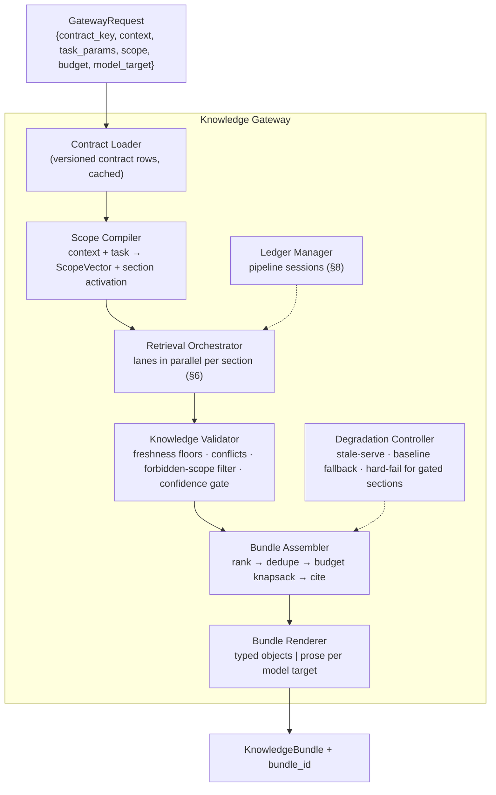
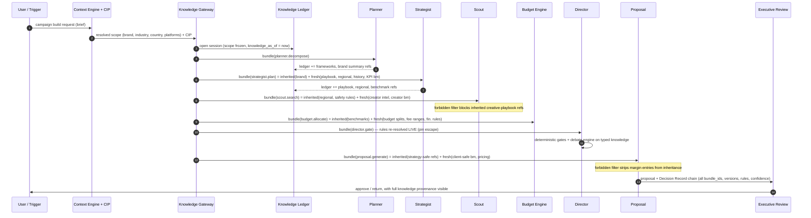
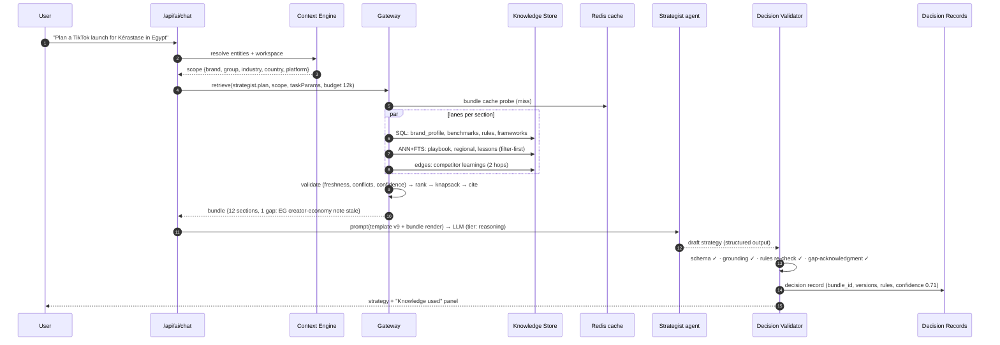
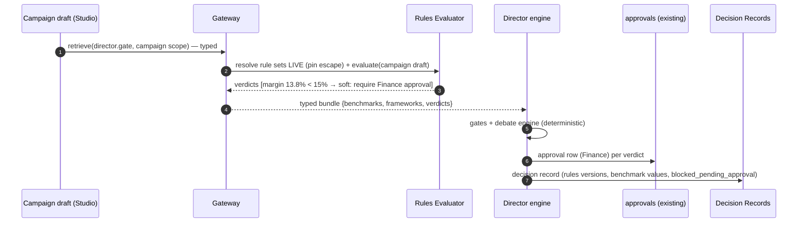

# Thinkway Knowledge Center — Phase 2: Consumption & AI Integration Architecture

**Status:** Architecture & design only — no implementation in this document
**Date:** July 2026
**Prerequisite:** `docs/KNOWLEDGE_CENTER_ARCHITECTURE.md` (approved) — pillars P1–P12, `knowledge` schema, scope vector, lifecycle, rules engine, learning loops
**Scope:** How every AI decision inside Thinkway consumes knowledge: the Knowledge Gateway, formal Knowledge Contracts, dynamic bundles, retrieval orchestration, decision validation, multi-agent knowledge flow, and a disruption-free adoption roadmap
**Companion docs:** `THINKWAY_SYSTEM_REFERENCE.md` · `ARCHITECTURE_ALIGNMENT.md`

---

## 0. Executive summary

Phase 1 defined **what the Knowledge Center stores**. This document defines **how it is consumed** — the single orchestration layer through which every AI request flows, so that no agent ever decides independently what knowledge to retrieve.

Core design commitments:

1. **One pipeline for every AI request** (§1): Context Resolution → Gateway → Retrieval → Validation → Bundle → Agent → Decision Validation → Output. Agents receive knowledge; they never search for it.
2. **Knowledge Contracts as data** (§3–4): every AI component — the 5 chat agents, the deterministic engines (Director, Budget, Decision, KPI, Risk), the retrieval-adjacent engines (Recommendation, Ranking), and the generators (Proposal, Creative) — has a formal, versioned contract declaring required/optional/forbidden knowledge, priorities, token budget, and confidence thresholds. Adding agent #51 is a contract row, not retrieval code.
3. **Dynamic bundles, not document dumps** (§5): the gateway assembles a scoped, ranked, budgeted, cited bundle per request — the "L'Oréal Egypt TikTok Launch" case resolves to 12 knowledge sections automatically (§12 walkthrough).
4. **Every output carries a Decision Record** (§7): knowledge versions used, rules applied, benchmarks applied, confidence, citations, reasoning summary, validation status — persisted and auditable.
5. **Pipeline inheritance via a Knowledge Ledger** (§8): downstream agents inherit upstream knowledge version-pinned, filtered through their own contract — no re-retrieval, no contract bypass.
6. **Multi-LLM by construction** (§10): bundles are model-agnostic intermediate representations rendered per provider (OpenAI, Anthropic, Gemini, local) at the last step.
7. **Adoption without disruption** (§13): strangler pattern with a shadow mode — the gateway runs beside today's paths, logging what it *would* have served, before any cutover.

Section §14 is the requested pre-implementation critique of this very design — including two places where the brief itself is corrected (§1.1, §8.1) and the genuine weaknesses that remain.

---

## 1. The canonical consumption pipeline

### 1.1 The pipeline (adopted from the brief, with two corrections)

```
User Request / System Trigger
        ↓
[1] Context Resolution          ← Context Engine (existing features/knowledge-engine)
        + Campaign Intelligence Profile (when a campaign/brief is in scope)
        ↓
[2] Knowledge Gateway           ← contract lookup + scope computation
        ↓
[3] Knowledge Retrieval         ← 4 lanes (SQL / ANN / FTS / graph), §6
        ↓
[4] Knowledge Validation        ← pre-delivery checks: scope, freshness floors,
        ↓                          conflict resolution, confidence gating
[5] Knowledge Bundle            ← ranked, budgeted, cited, model-agnostic
        ↓
[6] AI Agent / Engine           ← LLM call or deterministic computation
        ↓
[7] Decision Validation         ← rules verdicts, output schema, grounding checks
        ↓
[8] Output + Decision Record    ← persisted; feedback signals emitted
```

**Correction 1 — "Campaign Intelligence" is a stage input, not a router.** The brief places Campaign Intelligence between the user request and the gateway. What actually belongs there is **context resolution**: the existing Context Engine (entity resolution: brand, campaign, creators, workspace) plus the **Campaign Intelligence Profile** (`campaign_intelligence_profiles` — the structured understanding of the brief) when one exists. Campaign Intelligence *the module* is itself a knowledge **consumer** with its own contract (§4). Making it a mandatory router would put a heavyweight component in front of lightweight requests (a Scout query needs entity scope, not a full campaign profile) and create a circular dependency (Campaign Intelligence needs knowledge to build profiles).

**Correction 2 — the gateway determines *which contract sections activate*, not "what knowledge is needed" from scratch.** Fully dynamic per-request inference of knowledge needs (an LLM deciding what to retrieve) is the "agentic RAG" pattern — flexible but unauditable, unstable across model versions, and impossible to test. Thinkway's gateway is **declarative-first**: contracts define the possibility space; the request's resolved scope + task parameters select and weight sections deterministically. An optional LLM-assisted *query expansion* step exists inside lane 2 (semantic) only, where it is harmless (§6.2). This keeps every retrieval decision reproducible and testable.

### 1.2 Request classes

| Class | Examples | Pipeline shape |
|-------|----------|----------------|
| **Interactive chat** | Strategist Q&A, Scout search, Analyst | Full pipeline, per-message; bundle cached per conversation turn window |
| **Deterministic computation** | Director gates, Budget allocation, KPI forecast, Decision Engine scenarios | Stages 2–5 return **typed objects** (no prose rendering); stage 6 is code; stage 7 is the rules engine + invariant checks |
| **Batch / background** | Creator enrichment, rerank, classification, lessons drafting | Same pipeline invoked from BullMQ workers; relaxed latency budget, strict cost budget |
| **Pipeline session** | Planner→…→Executive Review campaign build | Stages 1–2 once per session; per-agent delta retrieval via the Knowledge Ledger (§8) |

### 1.3 What agents can no longer do

- Query `knowledge.*` tables directly (lint + review rule).
- Assemble their own context beyond what the Context Engine resolves.
- Carry inline prompts (all prompts come from `prompt_templates`, with knowledge slots).
- Enforce or waive rules (verdicts come pre-evaluated in the bundle; hard gates re-checked at stage 7).

---

## 2. Knowledge Gateway architecture

### 2.1 Placement and shape

`lib/knowledge-center/gateway/` — an **in-process, stateless library** (not a microservice; §14.4 revisits this), invoked by:
- the chat orchestrator (`features/ai/orchestrator`) at its existing "enrich context" step,
- deterministic engines through typed accessor facades (`getBenchmarks`, `getBrandProfile`, `getPlaybook`, `evaluateRules`),
- BullMQ workers (worker service imports the same lib against the same DB),
- (Phase 4) the MCP surface, wrapping identical functions.

### 2.2 Internal components



### 2.3 Gateway request/response (design signatures)

```ts
type GatewayRequest = {
  contractKey: string            // "strategist.plan", "director.gate", "scout.search"
  contractVersion?: int          // pin for reproducibility; default = published
  context: KnowledgeContext      // from Context Engine (entities, workspace, CIP ref)
  taskParams: Record<string, unknown>  // task inputs (objective, budget range, platforms…)
  scopeOverrides?: Partial<ScopeVector>
  budget: { maxKnowledgeTokens: number }  // normalized tokens (§10.2)
  modelTarget?: ModelRef         // rendering hints; absent for deterministic consumers
  session?: { ledgerId: string } // pipeline inheritance (§8)
}

type KnowledgeBundle = {
  bundleId: uuid                 // correlation key for feedback + decision records
  contractKey: string; contractVersion: int
  scope: ScopeVector
  sections: BundleSection[]      // §5
  rulesVerdicts: RuleVerdict[]   // pre-evaluated where subject data exists
  confidence: { overall: number; perSection: Record<string, number> }
  gaps: KnowledgeGap[]           // declared misses: section, reason (no_data | stale | below_threshold)
  degradation?: DegradationNotice[]
  tokenCost: { budgeted: number; used: number }
}
```

**`gaps` is a first-class output.** When the gateway cannot satisfy a required section above threshold, it says so explicitly. Agents are prompted/coded to acknowledge gaps ("no Egypt beauty benchmarks with sufficient sample; using MENA-level with reduced confidence") instead of silently receiving less. This is the single most important honesty mechanism in the consumption layer.

### 2.4 Degradation modes (gateway availability contract)

| Failure | Behavior |
|---------|----------|
| Semantic lane slow/down | Serve structured + FTS lanes; mark `degradation: semantic_unavailable` |
| Knowledge DB read fails | Serve last Redis-cached bundle if scope-identical and < TTL (`stale_served`); else proceed knowledge-less with `baseline_fallback` flag — **except** sections marked `gate:true` |
| Rules cannot be evaluated | **Hard fail for gated actions.** Proposals, approvals, and financial validations never proceed without rule verdicts. Chat degrades to advisory-only with a visible notice |
| Budget exceeded mid-assembly | Deterministic knapsack truncation by priority; never mid-item truncation |

---

## 3. Knowledge Contract specification

A contract is a **versioned row set** (`knowledge.agent_contracts` + `contract_sections`), reviewed and published through the same lifecycle as knowledge items (§11 of Phase 1). Schema:

```jsonc
{
  "contract_key": "strategist.plan",
  "version": 3,
  "owner_id": "…",                          // accountable human
  "consumer_type": "llm_agent",             // llm_agent | deterministic_engine | batch_service
  "responsibilities": "Campaign strategy: objectives, audience, platform mix, content pillars, phasing",
  "default_budget_tokens": 12000,           // normalized tokens (§10.2)
  "confidence_floor": 0.55,                 // below → section reported as gap, not served
  "output_schema_ref": "schemas/strategy-output.v2",   // for decision validation (§7)
  "sections": [
    {
      "section_key": "brand_profile",
      "pillar": "P4", "lane": "structured",
      "requirement": "required",            // required | optional | forbidden
      "priority": 1,                        // knapsack ordering; 1 = never dropped
      "budget_share": { "min": 0.10, "max": 0.25 },
      "shape": "structured",                // structured | narrative | both
      "activation": "always",               // always | when(taskParams/scope predicate)
      "freshness_floor_days": null,
      "gate": false                         // gate:true = request fails rather than degrades
    },
    { "section_key": "industry_playbook", "pillar": "P5", "lane": "hybrid",
      "requirement": "required", "priority": 2, "budget_share": {"min":0.15,"max":0.30},
      "shape": "narrative", "activation": "when(scope.industry_id != null)" },
    { "section_key": "creator_pricing", "requirement": "forbidden" }   // §3.2
  ],
  "inheritance": {                          // pipeline behavior (§8)
    "accepts_from": ["planner.decompose"],
    "exposes": ["strategy_summary", "platform_mix", "audience_definition"]
  }
}
```

### 3.2 Forbidden sections — why negative constraints exist

`forbidden` is not (only) cost control. It encodes:
- **Segregation of concerns:** the Strategist must not see creator pricing — strategy anchored on cost produces cost-shaped strategy, and pricing negotiation is Budget/Proposal territory (same reason Data Entry can't see financial columns — Reference §6).
- **Bias prevention:** the Ranking Engine must not see client budget (rank by fit, price later); the Risk Engine must not see revenue targets.
- **Confidentiality:** the Creative Generator (client-facing output) must not receive internal margin benchmarks.

Forbidden sections are enforced at three layers: contract compilation (section never activates), ledger filtering (§8.3 — inheritance cannot smuggle them in), and bundle-log auditing (a forbidden pillar appearing in a bundle is an alertable defect).

An agent that legitimately needs a forbidden section doesn't work around it — it triggers a **contract change request** (new version through review). This is deliberately more friction than editing code; contracts are the governance boundary.

---

## 4. Knowledge Contracts — full catalog

Consumer names map to actual codebase components (Phase 1 §1 audit). Budgets are launch defaults in normalized tokens; thresholds are bundle-confidence floors.

### 4.1 Catalog table

| # | Contract | Codebase anchor | Type | Required knowledge | Optional | **Forbidden** | Budget | Conf. floor |
|---|----------|----------------|------|--------------------|----------|---------------|--------|-------------|
| 1 | `planner.decompose` | `features/ai/planner` | LLM | Frameworks (planning), campaign lifecycle model, brand profile (summary), rules (workflow thresholds) | Regional seasonality, playbook outline | Creator pricing, margin benchmarks | 8k | 0.50 |
| 2 | `strategist.plan` | `features/ai/strategist` | LLM | Marketing frameworks, industry playbook, regional intelligence, brand DNA, historical campaign outcomes (brand + industry×region), KPI benchmarks | Platform guides, competitor learnings, lessons | **Creator pricing**, vendor costs, margins | 12k | 0.55 |
| 3 | `scout.search` | `features/ai/scout` + discovery | LLM+tools | Creator knowledge (audience quality, fraud signals, brand affinity), creator benchmarks (tier × platform × region), platform updates, brand safety rules (creator-level) | Regional creator ecosystem, past collaborations | **Creative playbooks**, client budget total, margin data | 10k | 0.55 |
| 4 | `analyst.report` | `features/ai/analyst` | LLM | Performance knowledge (campaign facts), benchmarks (all metrics), KPI definitions/frameworks | Lessons, industry playbook (for context) | Rules internals, other-client data outside scope | 12k | 0.60 |
| 5 | `general.chat` | `features/ai/general` | LLM | Glossary, FAQs, platform module knowledge | Any published pillar at low priority | Tenant-restricted items outside user scope | 6k | 0.40 |
| 6 | `campaign_intelligence.extract` | `campaign-intelligence-profile/extract-profile-llm` | Batch LLM | Extraction prompt (P11), taxonomy (md_* vocabularies), brand profile (for disambiguation) | Regional vocabulary packs (AR) | Benchmarks, pricing (extraction must not invent numbers) | 4k | n/a (schema-validated) |
| 7 | `campaign_intelligence.reason` | `campaign-intelligence/services/reasoning` | Deterministic | Benchmarks (typed), brand profile, playbook (typed sections), frameworks | Lessons (structured refs) | — (deterministic; no prose) | typed | n/a |
| 8 | `director.gate` | `campaign-director` (approval/decision gates, debate) | Deterministic | **Rules (gate:true)**, brand safety rules, benchmarks (margin, budget), frameworks (approval, risk), brand approval rules | Historical dispute lessons (refs) | — | typed | gate |
| 9 | `budget.allocate` | `campaign-studio/budget-allocation`, decision-engine | Deterministic | Budget benchmarks (splits by industry×region×platform), creator fee benchmarks (tier-level ranges), rules (financial validation, VR%), FX/master data refs | Historical budget outcomes | Individual creator negotiated rates (tier ranges only — §12 note) | typed | gate |
| 10 | `creator_intel.enrich` | `discovery-worker/enrichment`, `creator-dna` | Batch LLM | Classification prompt, taxonomy, fraud-signal definitions, platform guides (format vocabulary) | Regional creator ecosystem notes | Brand data, campaign data (enrichment is entity-scoped) | 3k | n/a |
| 11 | `creator_reco.match` | `lib/discovery/campaign-relevance-scoring`, `rank-browse-for-campaign` | Deterministic | Creator knowledge (typed), brand affinity, brand safety rules (creator filters), creator benchmarks | Past collaboration outcomes | **Client budget**, margins | typed | 0.60 |
| 12 | `ranking.rerank` | `lib/discovery/campaign-fit-rerank` | Batch LLM | CIP summary, creator knowledge cards (top-N), platform fit notes | Regional audience notes | **Pricing**, budget, margins (rank by fit only) | 8k | 0.55 |
| 13 | `proposal.generate` | `campaign-studio/export/campaign-proposal-document` | LLM+det. | Strategy output (ledger), brand profile (tone, visual refs), benchmarks (client-safe subset), creator cards (selected), pricing (client-facing rates), proposal framework, citations | Case-study lessons (client-safe) | **Internal margins**, other-client identifiable data, rule internals | 16k | 0.65 |
| 14 | `creative.generate` (future) | — | LLM | Brand DNA + tone (gate:true), content pillars, platform format specs, brand safety rules | Regional cultural guidance, trend notes | Margins, pricing, internal benchmarks | 10k | 0.65 |
| 15 | `kpi.recommend` | `campaign-studio` kpi-forecast, `campaign-intelligence` kpi-reasoning | Deterministic | KPI benchmarks (metric × industry × platform × region, with sample sizes), measurement frameworks, historical outcomes | Platform measurement caveats | — | typed | 0.60 |
| 16 | `risk.assess` | `campaign-studio` risk-analysis (+ future engine) | Det.+LLM | Risk framework, brand safety rules, creator risk records, regional regulation items, historical failure lessons | Platform policy updates | **Revenue targets**, sales pressure context | 8k | 0.60 |
| 17 | `performance.predict` (future) | reach/impressions forecast engines | Deterministic | Benchmarks (full distribution, not medians), creator performance summaries, seasonality curves | — | — | typed | 0.60 |
| 18 | `lessons.draft` | learning loop (Phase 1 §10.2) | Batch LLM | Campaign object + outcomes, prior lessons (dedup), lesson framework | — | Unrelated-brand data | 8k | n/a (human-reviewed) |

Notes:
- **Deterministic engines have contracts too** — theirs resolve to *typed objects* with the same scope/version/citation guarantees; "budget" is row-count caps rather than tokens. This is what makes "single intelligence source" true rather than LLM-only.
- Two brief examples confirmed: Strategist forbids creator pricing; Scout forbids creative playbooks — with rationale now explicit (§3.2).
- `director.gate` and `budget.allocate` carry `gate:true` sections: no rules → no output, never a degraded guess.

### 4.2 Expanded exemplar — `strategist.plan`

| Section | Pillar/lane | Req. | Priority | Budget | Shape | Activation |
|---------|------------|------|----------|--------|-------|------------|
| brand_profile | P4 / structured | required | 1 | 10–25% | both | always |
| rules_summary (strategy-relevant: safety, positioning constraints) | P10 / structured | required | 1 | 5–10% | structured | always |
| industry_playbook | P5 / hybrid | required | 2 | 15–30% | narrative | scope.industry present |
| regional_intelligence | P7 / hybrid | required | 2 | 10–20% | narrative | scope.country/region present |
| historical_outcomes (brand, then industry×region) | P1–P2 / structured | required | 2 | 10–20% | structured | always |
| kpi_benchmarks | P2 / structured | required | 3 | 5–15% | structured | always |
| marketing_frameworks | P8–P9 / structured | required | 3 | 5–10% | structured | always |
| platform_guides | P6 / hybrid | optional | 4 | 0–15% | narrative | taskParams.platforms |
| competitor_learnings | P12 + edges / graph | optional | 4 | 0–10% | narrative | brand has competitor edges |
| lessons (brand OR industry×region) | P12 / hybrid | optional | 5 | 0–10% | narrative | always |
| creator_pricing | — | **forbidden** | — | — | — | — |

Confidence floor 0.55: if e.g. regional intelligence for `country=EG` retrieves nothing above 0.55, the bundle reports `gaps:[{section:"regional_intelligence", reason:"below_threshold"}]` and the Strategist's prompt template instructs it to state the gap and reason from MENA-level knowledge.

---

## 5. Knowledge Bundle specification

### 5.1 Structure

```ts
type BundleSection = {
  sectionKey: string
  entries: BundleEntry[]
  sectionConfidence: number
  budgetUsed: number
}
type BundleEntry = {
  itemVersionId: uuid            // exact version — reproducibility
  itemType: string; pillar: string
  scopeSpecificity: number       // §6.4 cascade level actually matched
  confidence: number; freshness: number
  content:                        // exactly one, per contract shape:
    | { structured: JsonValue }   //   typed object (validated against item schema)
    | { narrative: string }       //   rendered prose with inline citation markers
  citations: Citation[]           // → sources with human-readable labels
  provenance: "retrieved" | "inherited(ledgerId)" | "stale_cache"
}
```

### 5.2 Assembly guarantees

1. **Scoped:** every entry passed the request's ScopeVector filter *before* ranking (filter-first, §6).
2. **Deduplicated:** one entry per knowledge item (highest published version); near-duplicates (embedding distance < ε across items) keep the higher `confidence × specificity` one, and emit a `duplicate_candidate` governance signal.
3. **Conflict-resolved:** contradictory entries never co-exist silently (§6.5).
4. **Budgeted:** greedy knapsack by (priority, score) honoring per-section min/max shares; sections at priority 1 are satisfied before anything else; overflow drops whole entries, never truncates mid-entry.
5. **Cited:** entries without resolvable citations are excluded from `gate:true` sections and demoted elsewhere.
6. **Model-agnostic:** the bundle is an intermediate representation; rendering to a prompt (or to typed objects) happens at the renderer, per consumer/model (§10.3).

### 5.3 The dynamic-bundle promise, verified against the brief's example

"L'Oréal Egypt TikTok Launch" → scope `{brand:Kérastase|L'Oréal-*, group:L'Oréal, country:EG, region:MENA, industry:Beauty, platform:tiktok}` activates, purely from contracts + scope (no manual selection): Brand DNA (P4) · Beauty playbook (P5) · Egypt market (P7) · TikTok guide (P6) · Beauty benchmarks + budget + creator benchmarks (P2) · L'Oréal previous campaigns (P1) · competitor learnings (P12 via edges) · risk + brand-safety rules (P10) · KPI recommendations (P2/P9). Full per-agent walkthrough in §12.

---

## 6. Retrieval orchestration

Per activated section, lanes run in parallel; results merge into the assembler.

### 6.1 Ranking model

```
score(entry) = w_rel · relevance          -- lane-native: SQL match=1.0, RRF-fused ANN/FTS score, edge weight
             × w_scope · scopeSpecificity -- §6.4
             × w_conf · confidence        -- Phase 1 §15
             × w_fresh · freshness        -- exp decay, per-type half-life
```

Weights are **per-section contract parameters** with global defaults — benchmarks weight freshness high; playbooks weight specificity high. Weights are data, so tuning is governance, not deploys.

### 6.2 Lanes (recap + consumption-side additions)

| Lane | Serves | Consumption-side behavior |
|------|--------|---------------------------|
| Structured (SQL) | benchmarks, profiles, rules, frameworks, creator knowledge | Explicit cascade resolvers; deterministic; result = typed objects |
| Semantic (pgvector) | prose pillars | Filter-first ANN; optional query expansion: the *task description* (not the user's raw text alone) is embedded; an LLM expansion step may add query variants — expansion is logged in the bundle log for explainability |
| Lexical (FTS) | names, Arabic, regulations, exact terms | RRF-fused with semantic |
| Graph (edges) | competitor learnings, collaboration history, lesson provenance | Max 2 hops, typed edge whitelist per section |

### 6.3 Priority & budget
Contract `priority` orders knapsack filling (§5.2). Within a section, ranked by score. `budget_share.min` guarantees required sections survive crowding; `max` prevents one verbose playbook from starving benchmarks.

### 6.4 Scope-specificity & fallback
Cascade (Phase 1 §7.4): brand → client/group → industry×region → industry → region → platform-global → tenant-global. Consumption addition: **fallback is visible** — an entry served from a broader level than requested carries `scopeSpecificity` and the renderer annotates it ("MENA-level benchmark; no Egypt-specific sample ≥ 30"). Agents therefore *know* when they're reasoning from fallback knowledge.

### 6.5 Conflict resolution (deterministic order)

1. **Scope specificity wins** (brand rule beats industry guidance).
2. **Newer published version wins** within the same item lineage.
3. **Higher authority source wins** across items (regulator > platform doc > internal note).
4. **`contradicts` edges**: if a curated contradiction edge exists, the edge's resolution field (precedence | context-split | under-review) applies; `under-review` pairs are **both excluded** from `gate:true` sections and served with an explicit conflict banner elsewhere.
5. Unresolvable ties → higher confidence; emit `conflict_unresolved` governance signal.

Rules never conflict-resolve by ranking: rule precedence is explicit (`priority` int within rule sets), because "most specific wins" is wrong for e.g. a global legal ban vs. a brand preference.

### 6.6 Caching & deduplication across requests

| Cache | Key | TTL / invalidation |
|-------|-----|--------------------|
| Bundle cache (Redis) | contract_key + contract_version + scope hash + taskParams hash | 15 min or `knowledge.published` event on any contributing pillar×scope |
| Section cache (Redis) | section resolver + scope hash | Same events; benchmarks/profiles/rules are the hot entries (p50 < 20ms) |
| Conversation window (in-process) | conversation_id + turn window | 60s; chat multi-turn reuse |
| Ledger (Postgres + Redis) | pipeline session | Session lifetime (§8) |

### 6.7 Source weighting
`knowledge_sources.authority` (Phase 1) enters both confidence and conflict resolution. Consumption default ladder (tenant-tunable, data not code): regulator/legal 1.0 · Thinkway measured outcomes 0.9 · platform official docs 0.85 · curated expert authored 0.75 · client-provided 0.7 · LLM-drafted human-approved 0.6 · connector-ingested unreviewed — not retrievable (draft state).

### 6.8 Citation generation & explainability

- Every entry carries machine citations (version IDs → sources) and a **human label** ("142 KSA beauty lines, 2024–26, p50" / "Brand safety rule set v7, approved 2026-05-11").
- The bundle log records: activated sections, lane results pre/post ranking (sampled), knapsack drops, conflict resolutions, cache hits, expansion queries. This is the **"why did the AI say that"** debugging surface — and the retrieval-quality eval substrate (golden-set tests assert on it in CI).
- User-facing explainability: outputs render a "Knowledge used" panel from the Decision Record (§7), not from the model's own claims — the model never self-reports provenance.

---

## 7. Decision Validation architecture

### 7.1 The Decision Record (persisted: `knowledge.ai_decision_records`)

Every stage-8 output writes:

```
decision_id, agent/contract_key + contract_version, bundle_id (→ full knowledge manifest),
model_ref + prompt_template_version          -- or engine version for deterministic consumers
knowledge_versions uuid[]                    -- denormalized for fast audit query
rules_applied: [{rule_id, version, verdict}] -- from stage 7 re-check, not stage 5 copy
benchmarks_applied: [{benchmark_id, computed_at, value_used}]
confidence: {bundle, output}                 -- output confidence per §7.3
reasoning_summary: text                      -- model-generated, clearly labeled as such
citations: […]                               -- resolvable, from the bundle (not model-claimed)
validation_status: passed | passed_with_warnings | blocked | needs_human_review
validators_run: [{name, result, detail}]
created_at, actor (user or system trigger), tenant_id
```

### 7.2 Validators (stage 7), by consumer type

| Validator | Applies to | Checks |
|-----------|-----------|--------|
| **Schema** | all | Output matches `output_schema_ref` (Zod) — retry once on failure, then `blocked` |
| **Rules re-check** | gated actions | Re-evaluate hard/soft rules against the *final* output (not the draft) — the LLM cannot talk its way past a gate; soft-rule hits route to `approvals` |
| **Grounding** | LLM numeric/factual claims | Numbers cited to benchmarks must match the cited benchmark within tolerance; uncited numeric claims in client-facing outputs → warning (internal) or block (proposal) |
| **Forbidden-content** | client-facing outputs | Margin/internal-benchmark/other-client markers must not appear (proposal, creative) |
| **Confidence floor** | per contract | Output confidence below contract floor → `needs_human_review`, never silent delivery |
| **Gap acknowledgment** | LLM agents | If bundle declared gaps, output must not assert certainty in gapped areas (lexical + LLM-judge check, warning-level) |

### 7.3 Output confidence
`f(bundle confidence, gap count/severity, validator results, model self-estimate)` — with the model's self-estimate **capped, never raised**, by the data-derived terms. Rendered to users on decision surfaces (Director minutes, proposals show it internally; client exports show qualitative bands only).

### 7.4 What validation is *not*
Not an LLM judging an LLM as the primary gate. Deterministic checks (schema, rules, grounding arithmetic, forbidden markers) are the enforcement; LLM-judge checks are advisory-only warnings. This keeps stage 7 fast, cheap, testable — and immune to correlated model failure (§14.6).

---

## 8. Multi-agent collaboration — the Knowledge Ledger

### 8.1 Correction to the brief's mental model

"Each agent inherits knowledge from previous agents" is right about *retrieval cost* but risky about *governance*: naive inheritance lets knowledge flow around contracts (Strategist's bundle leaking into Proposal wholesale) and pins agents to knowledge that may be stale by pipeline end. The design therefore separates:

- **Knowledge inheritance** — version-pinned *references* to knowledge entries already retrieved this session; and
- **Work-product handoff** — agent *outputs* (strategy summary, shortlist, budget), which are not knowledge and flow via the existing campaign object / conversation state, unchanged.

The Ledger governs the former only.

### 8.2 Pipeline session & ledger

A campaign-build pipeline (Planner → Strategist → Scout → Budget → Director → Proposal → Executive Review) opens a **Knowledge Session**:

```
knowledge_ledger(session)
  ledger_id, tenant_id, scope snapshot (frozen at open), knowledge_as_of timestamptz,
  entries: [{item_version_id, section_key, retrieved_by contract_key, score, citations}]
  status: open | closed
```

- **Version pinning:** the session resolves knowledge **as-of open time**. All agents in one pipeline reason from one consistent knowledge snapshot — no mid-pipeline drift (a benchmark refresh at minute 20 must not make Director's numbers disagree with Strategist's).
- **Pin escape hatch:** `gate:true` sections (rules for Director) always re-resolve **live** — a rule published mid-session *must* gate; consistency yields to compliance. A rules-version change between session open and gate time is surfaced in the Director's decision record.
- **Delta retrieval:** when agent N requests its bundle, the gateway first satisfies sections from ledger entries (provenance `inherited`), then retrieves only what its contract needs beyond the ledger. Scout inherits brand profile + regional intelligence refs from Strategist's turn; retrieves creator knowledge fresh.
- **Contract filtering on inheritance (§8.3):** inheritance passes through the *receiving* agent's contract. Proposal may inherit strategy-relevant items but its `forbidden: internal margins` filter applies to ledger entries exactly as to fresh retrieval. Forbidden knowledge cannot arrive by inheritance.

### 8.3 Flow diagram



### 8.4 Cross-pipeline reuse
Ledgers are session-scoped and then **closed** (read-only audit artifacts referenced by decision records). A new pipeline for the same campaign opens a new session — reuse comes from the Redis section cache, not from resurrecting old ledgers. This keeps "what did the AI know when" unambiguous.

---

## 9. Learning lifecycle (consumption-side view)

Phase 1 §10 defined the loops; this section specifies **what updates what, on which trigger, with which gate** — and why no prompt ever changes:

| Knowledge | Trigger | Pipeline | Gate |
|-----------|---------|----------|------|
| Benchmarks (P2) | Campaign closure; monthly batch | Outcome rollup job → `knowledge.benchmarks` new period rows | Auto-publish; `needs_review` when sample < floor or shift > 2σ |
| Brand knowledge (P4) | Campaign closure; approval events | `history_summary` re-materialized; preference signals (approved/rejected creators, tone feedback) drafted as profile deltas | Auto for rollups; **review** for preference/DNA deltas |
| Creator knowledge (P3) | Publication metrics sync; campaign closure; disputes | performance_summary refresh; pricing observation appended per closed line; risk incidents drafted | Auto for measured facts; review for risk/affinity judgments |
| Market/regional (P7) | Quarterly review SLA; connector feeds (Phase 4) | Seasonality curves recomputed from outcomes; regulation drafts from connectors | Always reviewed |
| Playbooks (P5) | Lessons accumulation | When ≥ N lessons attach to one playbook section, an LLM pass drafts a section revision citing them | Always reviewed |
| Rules (P10) | Override patterns; incident postmortems | Rule-proposal drafts (e.g. "margin floor waived 8/9 times for L'Oréal — propose brand-scoped exception") | **Always reviewed**, no exceptions |
| Lessons (P12) | Campaign closure, loss/rejection events | LLM-drafted from campaign object + outcomes + feedback, citations mandatory | Always reviewed |
| Contracts & retrieval weights | Bundle-log analytics (ignored sections, gap frequency, feedback) | Monthly tuning proposals (weight/budget/threshold changes) as contract versions | Always reviewed |

**Why "no manual prompt updates" holds:** prompts are stable *scaffolding* with knowledge slots; everything that changes — numbers, preferences, rules, lessons, even retrieval weights — changes as **data** flowing through the loops above. The prompt for the Strategist in 2027 can be byte-identical to 2026 while producing materially better strategy, because every slot fills with newer knowledge. Model upgrades change `model_hints`, not knowledge.

Feedback signals emitted at consumption (closing the loop): `knowledge_feedback` rows keyed by `bundle_id` — entry ignored (LLM-judge sampled), user edit distance on drafts, downstream validator contradictions, outcome attribution (campaign hit/missed KPI while knowledge X was cited). Attribution is **correlational input to human review**, never auto-writes (§14.7).

---

## 10. Enterprise requirements

### 10.1 Multi-LLM support

| Layer | Design |
|-------|--------|
| Provider adapters | One interface (`generate`, `stream`, `embed`, `countTokens`), adapters for OpenAI, Anthropic, Google Gemini, and OpenAI-compatible local endpoints (vLLM/Ollama) — replacing today's two hand-rolled fetch wrappers and 4 inline callers |
| Model registry | Rows: model ref, provider, context window, cost tier, tokenizer id, embedding dim (if embedder), capability flags (json_mode, tool_use), status. Contracts/tasks bind to **capability tiers** ("fast-cheap", "reasoning", "extraction"), registry maps tier → model per tenant/env — so model swaps are config |
| Routing | Per contract: `model_tier` + fallback chain (provider outage → next model in tier); decision records always log the concrete model used |

### 10.2 Token budget normalization
Budgets in contracts are **normalized tokens** (chars/4 heuristic at assembly, exact per-tokenizer count at render). The renderer re-validates against the *actual* model's window and re-knapsacks if a smaller-context model is routed. A bundle built for a 128k model degrades deterministically for an 8k local model — priorities decide what survives, not truncation.

### 10.3 Rendering per consumer

| Target | Rendering |
|--------|-----------|
| LLM (any provider) | Sectioned prompt block with citation markers, gap notices, fallback annotations; provider-specific formatting (e.g. system-vs-user placement) from `model_hints` |
| Deterministic engine | Typed objects (Zod-validated), no prose |
| MCP client (Phase 4) | JSON bundle (the IR itself) — external agents get the same governed bundle, same contracts, same logging |
| Offline pack runtime | Pre-rendered bundles per contract×scope manifest, version-pinned (§10.4) |

### 10.4 Offline mode
Offline packs (Phase 1 §17.2) gain a consumption spec: a pack ships `contracts + published versions + prebuilt section indexes (chunk embeddings included)`; the gateway lib runs against the pack in read-only mode (SQLite/pglite target), with rules evaluation fully local (deterministic evaluator has no network dependency by design). Decision records queue locally and sync on reconnect. Learning loops are **disabled offline** (no auto-publish without central governance).

### 10.5 White-label / multi-tenant consumption
Contracts, retrieval weights, source-authority ladders, model-tier mappings, and budgets are all **tenant-overridable rows** on top of platform defaults — a white-label customer tunes behavior without forking code. RLS + filter-first retrieval (Phase 1 §13) already guarantee isolation; the ledger and decision records carry `tenant_id` end-to-end.

### 10.6 Scale posture (consumption-specific)
Stateless gateway → scales with app; hot path is Redis-cached structured sections (p50 < 20ms); semantic lane is the only >100ms component and is absent from deterministic-engine requests entirely. Millions of creators/campaigns affect *feeder* jobs, not bundle reads (aggregates + per-entity summaries are materialized). Bundle logs are the highest-volume write — sampled (100% for gated actions, ~10% elsewhere) and partitioned by month.

---

## 11. End-to-end sequence diagrams

### 11.1 Single interactive request (Strategist chat turn)



### 11.2 Deterministic gate (Director) — no LLM in the loop



---

## 12. Walkthrough — L'Oréal Egypt TikTok Launch

Brief arrives: *"Kérastase Egypt — TikTok-led launch for the new bond-repair line, Q4, budget envelope $180k."*

**Stage 1 — Context Resolution:** Context Engine resolves brand=Kérastase → group=L'Oréal, legal entity, industry=Beauty (`md_categories`), country=EG, region=MENA, platform=tiktok. CIP extraction (`campaign_intelligence.extract` contract: taxonomy + brand disambiguation knowledge only — **no benchmarks**, so extraction can't hallucinate targets) produces the structured profile. Session ledger opens; `knowledge_as_of` frozen.

**Per-agent knowledge (what and why):**

| Agent | Retrieves (fresh) | Inherits (ledger) | Blocked by contract | Why it needs what it gets |
|-------|--------------------|-------------------|---------------------|---------------------------|
| **Planner** | Planning framework, lifecycle model, workflow-threshold rules summary, brand summary | — | Creator pricing, margins | Decomposes into stages/tasks; needs process knowledge, not market depth |
| **Strategist** | Beauty playbook (launch sections), Egypt regional intel (Ramadan/Q4 seasonality, cultural notes, ad regulations), L'Oréal/Kérastase historical outcomes, KPI benchmarks (beauty×tiktok×EG→MENA fallback, annotated), competitor learnings via edges, TikTok platform guide | Brand DNA, rules summary | **Creator pricing** | Strategy shaped by brand truth + market truth + what worked before — not by cost anchoring |
| **Scout** | Creator knowledge cards (beauty-affine EG/MENA creators: audience quality, fraud signals, brand affinity, past L'Oréal collabs via edges), creator benchmarks (tier×tiktok×EG), platform updates (TikTok algorithm/format changes ≤90d), brand-safety creator filters | Regional intel refs, safety rules | **Creative playbooks**, client budget total | Finds who fits; budget-blind so shortlists aren't pre-shrunk to cheap options |
| **Ranking/Reco** | CIP summary, top-N creator cards | — | **Pricing, budget, margins** | Ranks by fit only; price enters later, explicitly |
| **Budget Engine** | Budget-split benchmarks (beauty×EG×tiktok: e.g. p50 creator-fees 62% / production 18% / paid-amp 14% / contingency 6%), creator **fee ranges by tier** (not individual negotiated rates — those stay in Proposal/negotiation territory), financial rules (VR%, margin floor, FX refs) | KPI benchmarks | Individual creator negotiated history | Allocates $180k against evidence; typed data, `gate:true` on financial rules |
| **Director** | Rules **live** (margin ≥15%, >$50k → Director approval per Reference §20; L'Oréal brand approval rules), risk framework, margin benchmarks | Everything above as read-only refs for debate context | — | Gates deterministically; debate engine argues from typed knowledge; verdicts logged |
| **Proposal** | Client-safe benchmark subset, client-facing rate cards, proposal framework, case-study lessons (client-safe), brand visual/tone refs | Strategy/scout/budget knowledge refs **filtered** — margin entries stripped by forbidden filter | **Internal margins**, other-client data | Client document: persuasive, cited, and provably free of internal financials (forbidden-content validator re-checks at stage 7) |
| **Executive Review** | Decision-record chain: every bundle_id, knowledge version, rule verdict, confidence, gap | — | — | Approves with full provenance: "strategy used MENA-fallback benchmarks (EG sample thin) — confidence 0.68" is visible, not buried |

**Gap handling in this walkthrough:** Egypt-specific TikTok beauty benchmarks have sample_size 12 (< floor 30) → served as MENA-level with fallback annotation; the Strategist's output states this; Executive Review sees it in the record. **This is the system being honest at every step — the property that makes the whole architecture trustworthy.**

---

## 13. Enterprise adoption roadmap (zero-disruption)

Strangler pattern; each step reversible by flag; no existing behavior changes until its cutover step.

| Step | What ships | Risk containment |
|------|-----------|------------------|
| **A. Contracts as config (no behavior change)** | Contract rows authored for all §4 consumers; gateway skeleton reads them; nothing consumes it yet | Pure addition |
| **B. Shadow mode** | On every real AI request, the gateway *also* assembles its bundle and logs it (`knowledge_bundles_log`) without affecting the live path. Compare: what would the agent have known vs. what it used | Read-only; sampled if latency budget requires |
| **C. Deterministic engines first** | Studio/Director/Decision engines cut over to typed accessors (benchmarks, playbooks, brand profiles from KC — replacing `INDUSTRY_PROFILES` constants). Flags per engine | Typed, testable, no LLM variance; golden tests: constant-era output vs. KC-era output diffed on real campaigns |
| **D. Batch LLM services** | Extraction, rerank, classification, enrichment move to gateway + `prompt_templates` | Low-traffic, retry-safe, schema-validated already |
| **E. Chat agents** | Orchestrator's context-enrichment step swaps to gateway bundles; prompt library reads from `prompt_templates` (interface-compatible) | Per-agent flags; conversation A/B on internal users first |
| **F. Decision records + validators** | Stage 7 validators on (warn-only → enforce), decision records persisted, "Knowledge used" panels | Warn-only period generates validator quality data before anything blocks |
| **G. Ledger pipelines** | Campaign-build session inheritance on | Only after E is stable; falls back to per-agent retrieval transparently |
| **H. Multi-LLM + MCP + offline** | Provider adapters + registry; MCP surface; offline packs | Registry defaults to current models — swap is opt-in per tenant |

Rule of the roadmap: **shadow before cutover, flags per consumer, decision records before enforcement.** At no step is a working feature rewritten and re-verified simultaneously.

---

## 14. Chief AI Architect's critique of this design (pre-implementation review)

The requested adversarial pass — weaknesses that remain in the design above, and what to do about them.

**14.1 The gateway is a correctness single-point-of-failure (not just availability).** Degradation modes (§2.4) handle *outages*, but a bug in scope compilation or the knapsack silently mis-feeds *every* agent at once — worse than today's fragmented retrieval, where blast radius is one component. **Mitigation, required before step C:** contract-level golden-set tests in CI (fixed scope → expected bundle composition), canary tenants, and bundle-diff alerts on composition shifts > threshold after deploys. Budget real engineering time for this test harness; it is not optional polish.

**14.2 Contract sprawl and dead configuration.** 18 contracts × ~10 sections × weights × budgets ≈ hundreds of tunables. Experience says most will never be tuned, and some will be *wrong* silently (a priority-5 section that never survives the knapsack is dead config nobody notices). **Mitigation:** bundle-log analytics must include *section survival rates* from day one; quarterly contract review is an owner SLA like knowledge freshness; start every contract with the minimal section set and add on evidence — resist authoring all 18 exhaustively at step A (the §4 catalog is the *ceiling*, not the launch config).

**14.3 Confidence numbers risk pseudo-precision.** `0.55 floors`, multiplied factor scores — these look scientific but the inputs (authority ladder, half-life guesses) are hand-set priors. Downstream consumers (and executives reading "confidence 0.71") will over-trust decimals. **Mitigation:** render confidence as **bands** (high/moderate/low/insufficient) everywhere humans see it; keep numerics internal for ranking only; calibrate bands against realized outcomes once ≥ ~100 decision records exist (predicted-confidence vs. outcome-quality curve), and say "uncalibrated" in UI until then.

**14.4 In-process gateway couples knowledge availability to app deploys — and the worker duplication is real.** The Next.js app and the discovery worker import the same lib against the same DB, but *version skew* between them (app deployed, worker not) can produce different bundles for the same scope in the same hour. **Mitigation:** contract/renderer versions live in the DB (data, not code) so both processes resolve identical behavior; the lib itself stays a thin executor. Revisit a service boundary only when MCP (step H) forces one anyway — do not build a knowledge microservice speculatively.

**14.5 Ledger complexity may exceed its value at current scale.** Version-pinned sessions, delta retrieval, inheritance filtering — meaningful engineering for a pipeline that today runs ~sequential agents in one process within minutes, where the Redis section cache alone would eliminate most duplicate retrieval. **Recommendation:** ship G *last* (as roadmapped) and re-evaluate: if section-cache hit rates in steps C–E already exceed ~80% within pipeline sessions, implement the ledger as *just* the audit manifest (which decision records need regardless) and skip delta-retrieval mechanics. The consistency guarantee (one snapshot per pipeline) is the part worth keeping unconditionally; the bandwidth optimization may not be.

**14.6 Validators can become compliance theater.** `passed_with_warnings` on everything, gap-acknowledgment checks that LLMs learn to satisfy with boilerplate hedging, grounding checks limited to numbers while narrative claims roam free. **Mitigation:** track validator *hit rates and override rates* per validator; a validator that never fails or is always overridden gets fixed or removed; quarterly adversarial red-team of proposals/strategies against their decision records (does the cited knowledge actually support the claim?). Accept honestly: narrative grounding beyond numerics is an open problem — the design mitigates with citations + human review surfaces, it does not solve it.

**14.7 The learning loop can launder noise into "knowledge."** Outcome attribution ("campaign underperformed while playbook v3 was cited") is correlational; with dozens of knowledge items per bundle, per-item attribution is statistically weak at Thinkway's campaign volumes for years. The design already gates all judgment-updates on human review — hold that line against future pressure to automate it, and treat feedback analytics as *triage for reviewers*, never as ground truth. Concretely: no confidence auto-adjustment beyond the bounded ±0.15, no auto-deprecation, ever, without a human decision.

**14.8 Governance load is the real scaling constraint.** The architecture scales to 50 agents and millions of campaigns; the **review queue does not scale past the humans staffing it**. Lessons drafts, rule proposals, playbook revisions, contract tuning, freshness SLAs — §9 generates continuous review work. If Thinkway staffs zero dedicated knowledge ownership, the KC converges to an unreviewed-draft graveyard and agents run on stale bundles (Risk R1/R2 of Phase 1, now with a consumption layer amplifying the blast radius). **This is a hiring/org decision, not an engineering one — make it explicit in the implementation business case: the Knowledge Center has an operating cost measured in editor-hours per week, or it fails.**

**14.9 Where the brief was over-ambitious and this design pushed back:** mandatory Campaign-Intelligence-in-front-of-everything (§1.1 — would have added latency and circularity to every Scout query); fully dynamic gateway-decides-everything retrieval (§1.1 correction 2 — unauditable); naive whole-bundle inheritance (§8.1 — governance bypass). Each replacement is more boring and more testable. That is the correct direction for an enterprise system: **the intelligence should live in the knowledge, not in the plumbing.**

**Verdict:** approved for phased implementation as specified, with three non-negotiable preconditions: (1) the golden-set bundle test harness exists before any cutover (14.1); (2) confidence is banded in all human-facing surfaces (14.3); (3) named knowledge owners with budgeted review hours are committed before step F turns on the learning loop (14.8).

---

## Appendix A — Deliverable traceability

| Brief deliverable | Section |
|---|---|
| 1. Knowledge Gateway architecture | §1, §2 |
| 2. Knowledge Contracts for every AI component | §3, §4 (18 contracts) |
| 3. Knowledge Bundle specification | §5 |
| 4. Retrieval orchestration (ranking, priority, conflicts, freshness, confidence, caching, dedup, source weighting, citations, explainability) | §6 |
| 5. AI consumption lifecycle | §1 (pipeline), §11 (sequences) |
| 6. Validation architecture | §7 |
| 7. Learning lifecycle | §9 |
| 8. End-to-end sequence diagrams | §8.3, §11 |
| 9. L'Oréal Egypt walkthrough | §12 |
| 10. Non-disruptive enterprise roadmap | §13 |
| Multi-LLM / MCP / offline / white-label / scale | §10 |
| Final critique as Chief AI Architect | §14 |
