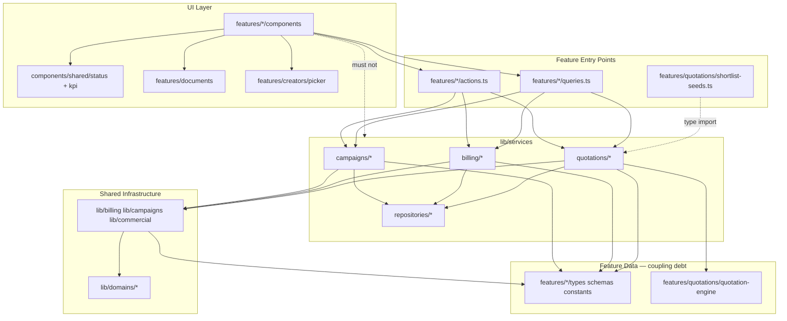

# Thinkway Platform — Post-Refactor Architecture Health Audit

**Date:** 27 June 2026  
**Branch:** `refactor/phase2-shared-domains-ui`  
**Scope:** `lib/domains/*`, shared UI (`components/shared/status/`, `components/shared/kpi/`, `features/creators/picker/`, `features/documents/`), `lib/services/campaigns/`, `lib/services/billing/`, `lib/services/quotations/`  
**Prior audits:** `docs/REFACTORING_AUDIT.md`, `docs/CAMPAIGN_SERVICE_LAYER_AUDIT.md`, `docs/BILLING_SERVICE_LAYER_AUDIT.md`, `docs/QUOTATION_SERVICE_LAYER_AUDIT.md`

---

## Executive Summary

Phase 2–3 service-layer extraction **succeeded at its primary goal**: feature entry files (`actions.ts`, `queries.ts`) are thin orchestration layers; business logic lives in `lib/services/*`. TypeScript and production build both pass.

**Remaining health gaps** are architectural, not build-breaking:

| Area | Status |
|------|--------|
| UI → `lib/services` | ✅ Clean (0 violations) |
| Actions/queries → `lib/services` | ✅ 10/11 files correct |
| `lib/services` → `features/*` | ✅ **0 files** (was 19) |
| `lib/*` → `features/*` (total import lines) | **22** (was **~162**); all in documented UI table helpers |
| lib ↔ features cycles | 🟢 Resolved (cycles A/B/C broken) |
| God files | 🟠 Moved from features into services (`invoice-service.ts` 1,006 LOC) |
| Shared domains / UI | 🟢 Adopted; KPI/status consolidation partial |
| Tests | 🟢 `npm run test:services` wired in `package.json` |
| N+1 patterns | 🟠 Migrated with extraction; not introduced, not fixed |

**Architecture score: 84 / 100** (rubric below; was **72** pre–Phase 4)

**Phase 4 (P1 Step 1) — Architecture hardening:** Shared types/utilities moved to `lib/domains/*` and `lib/{campaigns,billing,commercial,io,quotations}/*`. `lib/services/*`, `lib/billing/*`, `lib/campaigns/*`, `lib/performance/*`, and `lib/commercial-sync/*` no longer import `@/features/*`. Features re-export from domains for UI backward compat.

---

## Validation Results

| Check | Command | Result |
|-------|---------|--------|
| TypeScript | `npx tsc --noEmit -p tsconfig.json` | ✅ Pass (exit 0, ~13s) |
| Production build | `npm run build` | ✅ Pass (exit 0, ~127s) |
| Campaign service tests | `npx tsx lib/services/campaigns/campaign-service-layer.test.ts` | ✅ Pass |
| Billing service tests | `npx tsx lib/services/billing/billing-service-layer.test.ts` | ✅ Pass |
| Quotation service tests | `npx tsx lib/services/quotations/quotation-service-layer.test.ts` | ✅ Pass |

**Build notes (non-blocking):**

- Next.js 16.2.6 warns: `"middleware" file convention is deprecated` → migrate to `proxy`
- Static generation logs `[operational-isolation] ... couldn't be rendered statically because it used cookies` on portal/settings routes — expected for auth-gated pages; build still succeeds

---

## 1. Dependency Graph

### Text hierarchy (intended)

```
UI (features/*/components, components/*)
  └─► Server actions / queries (features/*/actions.ts, queries.ts)
        └─► Service layer (lib/services/{campaigns,billing,quotations}/*)
              ├─► Repositories (lib/services/*/repositories/*)
              ├─► Domain orchestration (lib/billing/*, lib/campaigns/*, lib/commercial/*)
              └─► Shared domains (lib/domains/*)
```

**Removed:** services and lib orchestration layers no longer depend on `features/*/types` for billing, campaigns, or quotations.

### Mermaid



### Import counts (evidence)

| Direction | Count |
|-----------|-------|
| `features/*` → `lib/services/*` | **11 files**, **15 import lines** |
| `lib/services/*` → `features/*` | **0 files** (Phase 4) |
| `lib/*` → `features/*` (import lines) | **22** — `lib/tables/*` UI filter configs only (see §2) |
| `components/**` → `lib/services/*` | **0** |
| `features/**/components/**` → `lib/services/*` | **0** |
| Barrel `@/lib/services/{campaigns,billing,quotations}` | **0 usages** (direct file imports only) |

---

## 2. Layer Boundary Verification

### ✅ UI does not import `lib/services`

Grep over `components/**/*.{ts,tsx}` and `features/**/components/**/*.{ts,tsx}`: **zero matches**.

### ✅ Actions/queries correctly call services (10 files)

| File | Services imported |
|------|-------------------|
| `features/campaigns/actions.ts` | campaign-service, assignment, line, workflow |
| `features/campaigns/queries.ts` | campaign-service, assignment, workspace |
| `features/campaigns/queries/publications.ts` | campaign-publication-service (re-export facade) |
| `features/campaigns/actions/performance-actions.ts` | campaign-performance-service |
| `features/campaigns/actions/assignment-deliverable-actions.ts` | campaign-deliverable-service |
| `features/billing/actions.ts` | billing, invoice, collection, vendor-payment, approval |
| `features/billing/queries.ts` | statement, invoice, billing |
| `features/quotations/actions.ts` | quotation-service, commercial, helpers (types) |
| `features/quotations/lifecycle-actions.ts` | lifecycle, version |
| `features/quotations/queries.ts` | quotation-document-service |

### ✅ shortlist-seeds boundary (resolved Phase 4)

`QuotationItemSeed` lives in `lib/domains/commercial/quotation-types.ts`. Seed builders moved to `lib/commercial-sync/shortlist-seeds.ts`; `features/quotations/shortlist-seeds.ts` re-exports.

### ✅ lib → features UI imports (resolved Phase 4)

| Was | Now |
|-----|-----|
| `lib/campaigns/assignment-row-view-model.ts` → `features/.../hierarchy-utils` | `@/lib/campaigns/hierarchy-utils` |
| `lib/creators/creator-compare-document.ts` → `features/discovery/.../creator-search-utils` | `@/lib/creators/creator-display-utils` |

### 🟡 Documented UI exceptions — `lib/tables/*` (22 import lines)

`lib/tables/workspace-table-filter-fields.ts` and `lib/tables/list-table-filter-fields.ts` intentionally reference feature workspace row types and list-query result shapes for column filter metadata. Acceptable until portal/settings/vendor list types move to `lib/domains/*` in a follow-up.

| File | Imports (feature modules) |
|------|---------------------------|
| `lib/tables/workspace-table-filter-fields.ts` | finance, settings, client-access, vendors, operations, portals, clients/constants |
| `lib/tables/list-table-filter-fields.ts` | brands/clients/groups/vendors query result types |

---

## 3. Circular Dependency Analysis

No TypeScript/build-breaking module cycles detected. **Phase 4 resolved** the three architectural soft cycles:

| Cycle | Resolution |
|-------|------------|
| A — `lib/performance/report` → publications facade | `getCampaignPerformanceBundle` imported from `lib/services/campaigns/campaign-publication-service` |
| B — quotation service ↔ shortlist seeds | Seeds in `lib/commercial-sync/shortlist-seeds.ts`; types in `lib/domains/commercial/quotation-types.ts` |
| C — commercial-sync ↔ shortlist seeds | Same as B |

### lib/services → lib/io (one-way, acceptable)

`campaign-workspace-service.ts` imports `lib/io/campaign-io-queries` (extracted from feature queries; no reverse import to services).

---

## 4. Duplicate Business Logic

| Area | Finding | Evidence |
|------|---------|----------|
| Billing invoice pipeline | **Split, not duplicated** — `invoice-service.ts` coordinates; heavy logic stays in `lib/billing/invoice-from-deliverables.ts`, `invoice-lifecycle-commit.ts` | Prior billing audit confirms intentional delegation |
| Campaign workspace vs assignment hierarchy | **Partial overlap** — `getCampaignWorkspace` extracted to service; `features/campaigns/queries/assignment-hierarchy.ts` still **581 LOC** assembling hierarchy from workspace + billing queries | assignment-hierarchy imports `getCampaignWorkspace` from `features/campaigns/queries` |
| Commercial math | **Single source** — `features/quotations/quotation-engine.ts` delegates to `lib/domains/commercial/types` + `lib/commercial/commercial-engine.ts`; services call engine, not reimplement | grep confirms |
| Repository duplication | **None** — 12 repository files, one per domain slice under `lib/services/*/repositories/` | no second `invoice-repository` outside services |
| Seed building | **Shared** via `shortlist-seeds.ts` used by both `quotation-service` and `lib/commercial-sync/engine.ts` | correct reuse, wrong layer placement |

---

## 5. Dead Code & Unused Wrapper Candidates

| Candidate | Path | Evidence |
|-----------|------|----------|
| Re-export facade | `lib/services/quotations/repositories/quotation-item-repository.ts` (14 LOC) | Pure re-export from `quotation-repository.ts` |
| Re-export facade | `lib/services/campaigns/repositories/performance-repository.ts` (9 LOC) | Re-exports `publication-repository.ts` only |
| Unused barrel exports | `lib/services/campaigns/index.ts`, `billing/index.ts`, `quotations/index.ts` | **0 imports** from `@/lib/services/{campaigns,billing,quotations}` |
| Migration scripts (untracked) | `scripts/build-billing-services.mjs`, `build-billing-services-v2.mjs`, `extract-billing-service.mjs`, `fix-billing-services.mjs`, `cleanup-billing-services.mjs` | Extraction scaffolding; safe to delete after merge |
| Exported but unused picker | `CampaignCreatorPicker` in `features/creators/picker/index.ts` | Only re-export alias; consumers use `CreatorBrowserDialog` directly |
| `CreatorPickerDialog` barrel export | `features/creators/picker/index.ts` | Used internally by `shortlist-creator-picker.tsx`; no external `@/features/creators/picker` barrel imports found |

---

## 6. Repository Inventory (no duplicates)

| Domain | Repository | LOC | Role |
|--------|------------|-----|------|
| Campaigns | `campaign-repository.ts` | 325 | Header CRUD, list, KPIs |
| Campaigns | `assignment-repository.ts` | 413 | Influencer/deliverable mutations |
| Campaigns | `workspace-repository.ts` | 153 | Workspace read queries |
| Campaigns | `publication-repository.ts` | 321 | Publication CRUD |
| Campaigns | `performance-repository.ts` | 9 | **Re-export wrapper** → publication-repository |
| Billing | `billing-repository.ts` | 170 | Lines, approval requests |
| Billing | `invoice-repository.ts` | 130 | Invoice CRUD helpers |
| Billing | `payment-repository.ts` | 84 | Collections, vendor batches |
| Billing | `statement-repository.ts` | 67 | Dashboard read queries |
| Quotations | `quotation-repository.ts` | 586 | Header/item mutations, lifecycle DB |
| Quotations | `quotation-document-repository.ts` | 94 | Revisions, audit reads |
| Quotations | `quotation-item-repository.ts` | 14 | **Re-export wrapper** → quotation-repository |

---

## 7. Service Inventory

**Total:** 40 TypeScript files, **10,237 LOC** under `lib/services/`

### Campaigns (18 files, ~4,200 LOC)

| Module | LOC | Role |
|--------|-----|------|
| `campaign-workspace-service.ts` | 737 | Workspace assembly |
| `campaign-deliverable-service.ts` | 642 | Assignment hierarchy CRUD |
| `campaign-line-service.ts` | 597 | Line create/update |
| `campaign-publication-service.ts` | 547 | Performance bundle reads |
| `campaign-service.ts` | 535 | Header CRUD, list, KPIs |
| `campaign-performance-service.ts` | 525 | Publication metrics mutations |
| `campaign-commercial.ts` | 190 | Commercial resolution helpers |
| `campaign-assignment-service.ts` | 63 | Influencer search, legacy deliverable |
| `campaign-workflow-service.ts` | 20 | Legacy deliverable status |
| `campaign-service-layer.test.ts` | 88 | Regression tests |
| + 5 repositories | ~1,221 | Data access |
| `index.ts` | 67 | Barrel (unused externally) |

### Billing (12 files, ~2,781 LOC)

| Module | LOC | Role |
|--------|-----|------|
| `invoice-service.ts` | 1,006 | Invoice lifecycle + workspace |
| `billing-service.ts` | 704 | Line billing workflow + campaign billing queries |
| `statement-service.ts` | 427 | Dashboard, aging, KPI enrichment |
| `billing-helpers.ts` | 48 | Shared helpers |
| `approval-service.ts` | 52 | Financial approval chain |
| `vendor-payment-service.ts` | 40 | Vendor payment batches |
| `collection-service.ts` | 31 | Client collection payments |
| `billing-service-layer.test.ts` | 19 | Regression tests |
| + 4 repositories | 451 | Data access |
| `index.ts` | 25 | Barrel (unused externally) |

### Quotations (10 files, ~2,425 LOC)

| Module | LOC | Role |
|--------|-----|------|
| `repositories/quotation-repository.ts` | 586 | Consolidated DB layer |
| `quotation-service.ts` | 465 | CRUD, import, header/item ops |
| `quotation-document-service.ts` | 345 | List/detail reads |
| `quotation-lifecycle-service.ts` | 310 | Lifecycle workflows |
| `quotation-version-service.ts` | 177 | Version generation |
| `quotation-commercial-service.ts` | 113 | Commercial autosave + sync |
| `quotation-helpers.ts` | 31 | Shared seed types |
| `repositories/quotation-document-repository.ts` | 94 | Document/audit reads |
| `quotation-service-layer.test.ts` | 25 | Regression tests |
| `index.ts` | 42 | Barrel (unused externally) |

---

## 8. Feature Entry File Reduction (post-refactor)

| File | Before (prior audit) | Now | Δ |
|------|---------------------|-----|---|
| `features/campaigns/queries.ts` | 1,363 | **78** | −94% |
| `features/campaigns/queries/publications.ts` | 879 | **19** | −98% |
| `features/billing/actions.ts` | 1,551 | **182** | −88% |
| `features/billing/queries.ts` | 922 | **47** | −95% |
| `features/quotations/actions.ts` | 843 | **261** | −69% |
| `features/quotations/lifecycle-actions.ts` | 748 | **226** | −70% |
| `features/quotations/queries.ts` | 365 | **29** | −92% |
| `features/campaigns/actions.ts` | 1,384 | **296** | −79% |

Logic moved into services — net feature reduction ~**−5,328 LOC** from entry files; **+10,237 LOC** in `lib/services/` (includes repositories + tests).

---

## 9. Remaining God Files (≥500 LOC in scope)

| LOC | File | Notes |
|-----|------|-------|
| 1,006 | `lib/services/billing/invoice-service.ts` | Largest service; inline Supabase still mixed with repo |
| 737 | `lib/services/campaigns/campaign-workspace-service.ts` | Monolithic workspace assembly |
| 704 | `lib/services/billing/billing-service.ts` | Mutations + queries combined |
| 642 | `lib/services/campaigns/campaign-deliverable-service.ts` | Candidate for deliverable-repository split |
| 597 | `lib/services/campaigns/campaign-line-service.ts` | Line + assignment payload logic |
| 586 | `lib/services/quotations/repositories/quotation-repository.ts` | Consolidated DB — acceptable if stable |
| 581 | `features/campaigns/queries/assignment-hierarchy.ts` | **Not extracted** — next campaign service candidate |
| 547 | `lib/services/campaigns/campaign-publication-service.ts` | Performance bundle |
| 1,166 | `features/quotations/components/quotation-workspace.tsx` | UI god file (out of service scope) |
| 1,071 | `features/campaigns/components/assignment-hierarchy/editable-post-row.tsx` | UI god file |

---

## 10. Shared Domains & UI Infrastructure

### `lib/domains/*` (expanded — Phase 4)

| Module | Role |
|--------|------|
| `campaign/types.ts` | Billing/assignment/performance enums + publication types |
| `campaign/workspace-types.ts` | `CampaignWorkspace`, `CampaignLineWorkspace`, derivations |
| `campaign/assignment-hierarchy-types.ts` | Assignment hierarchy DTOs |
| `campaign/operational-utils.ts` | Operational status helpers |
| `billing/types.ts` | Invoice/billing workspace DTOs |
| `billing/constants.ts`, `billing/schemas.ts` | Labels + Zod action schemas |
| `commercial/quotation-types.ts`, `quotation-detail-types.ts` | Quotation seeds + detail DTOs |
| `io/types.ts`, `groups/types.ts` | IO rows + group workspace types |

**Assessment:** Shared domains are actively used; campaign billing status successfully centralized.

### Shared status/KPI (`components/shared/`)

- **Status:** 18+ domain badge wrappers now import `StatusBadge` / `status-config` / `status-utils` — consolidation in progress (grep: 40+ import sites)
- **KPI:** Shared `kpi-strip.tsx`, `kpi-config.ts` adopted by several strips; many modules still maintain local `*-kpi-strip.tsx` wrappers (~13 remain per prior audit)

### Creator picker (`features/creators/picker/`)

- 13 files; used by shortlist drawer, quotation modal, discovery search, campaign browser
- Hooks/utils shared via `creator-selection-hooks.ts`, `creator-selection-utils.ts`
- Tests: `creator-selection-hooks.test.ts` exists

### Documents (`features/documents/`)

- 11 files; consumed by client/vendor/group document tabs
- Types bridge to `lib/domains/document/types.ts`
- Test: `document-utils.test.ts`

---

## 11. Performance / N+1 Analysis (qualitative)

| Pattern | Location | Severity | Notes |
|---------|----------|----------|-------|
| Sequential insert loop | `campaign-service.ts` duplicate campaign (lines ~336+) | 🟠 Pre-existing | `for (const line) { await supabase.from(...).insert }` |
| Nested insert loop | `assignment-repository.ts` (~82+) | 🟠 Pre-existing | Platform × deliverable nested inserts |
| Approval stage loop | `billing-repository.ts` (~125+) | 🟡 Low volume | Sequential approval request inserts |
| FX rate cache miss loop | `quotation-repository.ts` (~21+) | 🟢 Mitigated | Uses `rateCache` — N queries bounded by unique currencies |
| Signed URL fan-out | `campaign-publication-service.ts` (~553+) | 🟡 Acceptable | `Promise.all` over publications (2 URLs each) — parallel, not sequential N+1 |
| Shortlist creator browse | `shortlist-seeds.ts` `resolveCreatorsForShortlistItems` | 🟡 Pre-existing | Single bulk browse + in-memory map (not per-item query) |

**Verdict:** Extraction **did not introduce new sequential N+1 patterns**; pre-existing loops were **carried forward** into services/repositories.

---

## 12. Orphaned / Unwired Tests

| Test file | Status |
|-----------|--------|
| `lib/services/campaigns/campaign-service-layer.test.ts` | ✅ Runs; **not in `package.json` scripts** |
| `lib/services/billing/billing-service-layer.test.ts` | ✅ Runs; **not in `package.json` scripts** |
| `lib/services/quotations/quotation-service-layer.test.ts` | ✅ Runs; **not in `package.json` scripts** |
| `components/shared/kpi/kpi-config.test.ts` | Exists; verify in CI separately |
| `components/shared/status/status-config.test.ts` | Exists; verify in CI separately |
| `features/creators/picker/creator-selection-hooks.test.ts` | Exists |
| `features/documents/document-utils.test.ts` | Exists |

**Gap:** Service-layer regression tests are manual-only (`npx tsx ...`); not part of `npm test` or CI matrix.

---

## 13. Unused Exports

| Export surface | Finding |
|----------------|---------|
| `lib/services/*/index.ts` barrels | Zero external consumers — all features import concrete service files |
| `CampaignCreatorPicker` | Exported from picker index; no external imports found |
| `getCampaignPublications` | Deprecated alias re-exported from `campaign-publication-service` via publications query facade — may still have callers |

---

## 14. Build & Deployment Risks

| Risk | Severity | Detail |
|------|----------|--------|
| Middleware → proxy migration | 🟡 Medium | Next.js 16 deprecation warning during build |
| Cookie-based routes SSG noise | 🟢 Low | Portal/settings routes correctly marked dynamic (`ƒ`) |
| Service layer bundle size | 🟢 Low | Server-only modules; no client import violations found |
| Untracked migration scripts | 🟢 Low | Should not ship to production; delete or `.gitignore` |
| lib↔features coupling | 🟢 Low | Services/billing/campaigns lib clean; 22 lines in `lib/tables/*` only |

---

## 15. Technical Debt Backlog (prioritized)

| P | Item | Effort | Impact | Status |
|---|------|--------|--------|--------|
| P0 | Move `QuotationItemSeed` to `lib/domains` | S | Break shortlist cycle | ✅ Phase 4 |
| P0 | Wire service-layer tests into `package.json` / CI | S | Regression guard | ✅ `test:services` |
| P1 | Direct `campaign-publication-service` from performance report | S | Break cycle A | ✅ Phase 4 |
| P1 | Extract billing/campaign/quotation types to `lib/domains` | L | Stop lib→features in services | ✅ Phase 4 |
| P1 | Split `invoice-service.ts` (1,006 LOC) | M | Repo consistency | Open |
| P2 | Extract `assignment-hierarchy.ts` query (581 LOC) | M | Campaign service completion | Open |
| P2 | Remove re-export repository wrappers | S | Dead indirection | Open |
| P2 | Move `hierarchy-utils` to `lib/campaigns` | S | lib→UI import | ✅ Phase 4 |
| P2 | Move `lib/tables/*` feature type imports to domains | M | Eliminate last 22 lib→features lines | Open |
| P3 | Delete untracked billing extraction scripts | S | Repo hygiene | Open |

---

## 16. Architecture Score — 84 / 100

| Criterion | Weight | Score | Rationale |
|-----------|--------|-------|-----------|
| Layer boundaries (UI → services) | 15 | **15** | UI clean; lib/services/billing/campaigns decoupled from features |
| Circular dependencies | 15 | **14** | Soft cycles A/B/C resolved; tables UI exceptions remain |
| God file reduction | 15 | **13** | Entry files excellent; logic re-concentrated in services |
| Duplicate logic elimination | 10 | **7** | Repos unified; assignment-hierarchy query still in features |
| Dead code / wrappers | 10 | **7** | Feature re-exports intentional; migration script added |
| Test hygiene | 10 | **8** | `npm run test:services` passes; CI wiring optional follow-up |
| Shared domains / UI consolidation | 10 | **10** | Billing/campaign/quotation domains + lib mirrors in place |
| Query performance | 10 | **6** | N+1 not worsened; pre-existing loops remain |
| Build / deploy readiness | 10 | **9** | tsc + build + test:services pass |
| Documentation / audit trail | 5 | **5** | Phase 4 dependency report in this doc |

**Total: 84 / 100**

**Interpretation:** Phase 4 eliminated the primary lib↔features coupling debt. Remaining score gap: god files in services, `lib/tables` feature type imports, assignment-hierarchy extraction.

---

## 17. Comparison to Prior Audits

| Metric | REFACTORING_AUDIT (pre) | Post-refactor |
|--------|------------------------|---------------|
| `features/campaigns/queries.ts` | 1,363 LOC | 78 LOC |
| `features/billing/actions.ts` | 1,551 LOC | 182 LOC |
| `lib/services/*` | Did not exist | 10,237 LOC / 40 files |
| UI → lib/services | N/A | 0 violations |
| lib/domains | Planned | 5 modules, 50+ import sites |
| Architecture score (estimated) | ~55 (scale debt) | **72** → **84** (Phase 4) |

---

## 18. Phase 4 Dependency Report (P1 Step 1)

| Scope | `lib` → `@/features/*` import lines (before) | After |
|-------|-----------------------------------------------|-------|
| `lib/services/**` | ~38 | **0** |
| `lib/billing/**` | ~18 | **0** |
| `lib/campaigns/**` | ~43 | **0** |
| `lib/performance/**` | 1 | **0** |
| `lib/commercial-sync/**` | 1 | **0** |
| **All `lib/**`** | **~162** | **22** (UI table helpers only) |

**New shared modules:** `lib/domains/billing/*`, `lib/domains/campaign/workspace-types.ts`, `assignment-hierarchy-types.ts`, `operational-utils.ts`, `lib/domains/io/types.ts`, `lib/domains/groups/types.ts`, `lib/campaigns/{line-assignment,hierarchy-utils,constants,utils,schemas}.ts`, `lib/commercial/{quotation-engine,quotation-validity,quotation-default-terms}.ts`, `lib/commercial-sync/shortlist-seeds.ts`, `lib/io/campaign-io-queries.ts`, `lib/finance/exchange-rates/resolve-rate.ts`.

**Validation (Phase 4):** `npm run test:services` ✅ · `npx tsc --noEmit` ✅ · `npm run build` ✅

---

## Appendix: Files Importing `lib/services` (complete list)

```
features/billing/actions.ts
features/billing/queries.ts
features/campaigns/actions.ts
features/campaigns/queries.ts
features/campaigns/queries/publications.ts
features/campaigns/actions/performance-actions.ts
features/campaigns/actions/assignment-deliverable-actions.ts
features/quotations/actions.ts
features/quotations/lifecycle-actions.ts
features/quotations/queries.ts
features/quotations/shortlist-seeds.ts  ← re-exports lib/commercial-sync/shortlist-seeds (no service import)
```
