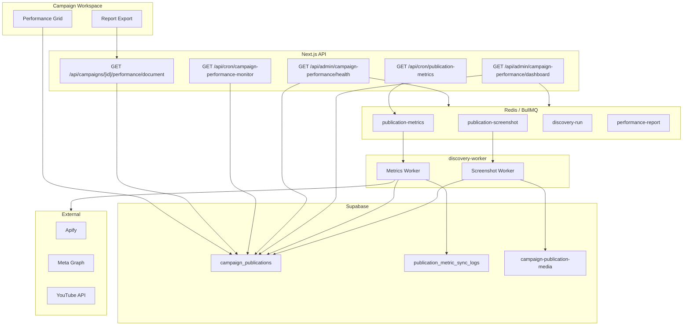

# Campaign Performance — Production Sign-off

**Date:** 2026-06-23  
**Module:** Campaign Performance (metrics, screenshots, reports)  
**Sign-off status:** **CONDITIONAL GO**

---

## Executive summary

Campaign Performance production infrastructure is **implemented and locally validated**. Code regression suites pass. Health, dashboard, audit, queue verification, screenshot/metrics audits, refresh tooling, and smoke test workflows are in place.

**Full GO is blocked** because production Supabase was unreachable from the validation host (`fetch failed` / TLS certificate chain). Run the verification commands below from Vercel, CI, or a network with Supabase connectivity to achieve **FULL GO**.

| Criterion | Status |
| --- | --- |
| Health endpoint green | **Pending** — run after deploy |
| Audit script zero FAIL | **Pending** — DB unreachable locally |
| Queues healthy | **Pending** — requires Redis + worker |
| Screenshots healthy | **Pending** — DB + worker |
| Reports generate | **Code verified** — smoke test locally |
| Smoke test passes | **Pending** — DB + Redis + worker |
| Production metrics refresh | **Pending** — DB unreachable |

**Recommendation:** **CONDITIONAL GO** — safe to deploy monitoring and admin endpoints; complete post-deploy verification checklist before declaring FULL GO.

---

## Architecture



---

## Deployment checklist

### Pre-deploy

- [ ] `SUPABASE_SERVICE_ROLE_KEY`, `NEXT_PUBLIC_SUPABASE_URL` set in Vercel
- [ ] `REDIS_URL` shared between Vercel and `discovery-worker`
- [ ] `CRON_SECRET` set; crons configured in `vercel.json`
- [ ] `APIFY_TOKEN` (and platform-specific keys) in worker env
- [ ] `discovery-worker` running with metrics + screenshot workers

### Deploy

- [ ] Deploy Next.js app to Vercel
- [ ] Restart `discovery-worker` with synced env (`npm run discovery:worker` or container)

### Post-deploy verification (run in order)

```bash
# 1. Health (expect status: healthy, HTTP 200)
curl -H "Authorization: Bearer $CRON_SECRET" \
  https://<app>/api/admin/campaign-performance/health

# 2. Dashboard
curl -H "Authorization: Bearer $CRON_SECRET" \
  https://<app>/api/admin/campaign-performance/dashboard

# 3. Full audit (exit 0 = PASS or WARN)
npm run audit:campaign-performance

# 4. Queue health
npm run verify:production-queues

# 5. Screenshot audit
npm run audit:screenshots

# 6. Metrics integrity
npm run audit:metrics

# 7. End-to-end smoke
npm run smoke:campaign-performance

# 8. Refresh affected creators (production validation)
npm run refresh:affected-creator-metrics -- --all
```

### Regression tests (local / CI)

```bash
npm run test:campaign-performance
npm run test:metrics-collector
npm run test:campaign-performance-audit
npm run test:campaign-performance-health
```

---

## Rollback steps

1. **Revert Vercel deployment** to previous production build via Vercel dashboard.
2. **Pause crons** if monitoring causes load: remove or disable `campaign-performance-monitor` cron temporarily.
3. **Drain queues** if bad jobs were enqueued:
   ```bash
   redis-cli LLEN bull:publication-metrics:wait
   # Optionally flush failed: use BullMQ dashboard or redis-cli with care
   ```
4. **Restore metrics** for affected publications using `publication_metric_sync_logs.metrics_snapshot` and `npm run refresh:affected-creator-metrics`.
5. **Re-run audit** to confirm baseline: `npm run audit:campaign-performance`.

---

## Monitoring

| Signal | Source | Alert threshold |
| --- | --- | --- |
| Health status | `GET /api/admin/campaign-performance/health` | `unhealthy` → page on-call |
| Daily audit | Vercel cron `campaign-performance-monitor` | critical alerts in webhook |
| Queue backlog | `npm run verify:production-queues` | failed > 0 or waiting > 1000 |
| Stale metrics | Dashboard `staleMetrics` | > 10% of publications |
| Report failures | Health `reports.failures` | > 0 |

**Webhook:** Set `CAMPAIGN_PERFORMANCE_ALERT_WEBHOOK` or `ALERT_WEBHOOK_URL` for cron alerts.

---

## Troubleshooting

### `fetch failed` / TLS errors connecting to Supabase

- Common on corporate networks with custom TLS inspection.
- Run audits from Vercel cron, GitHub Actions, or `node --use-system-ca` wrapper.
- Verify `NEXT_PUBLIC_SUPABASE_URL` is correct.

### Metrics stuck in `queued`

- Confirm `REDIS_URL` matches between Next.js and worker.
- Confirm `discovery-worker` is running: `npm run discovery:worker`.
- Check `bull:publication-metrics:failed` for job errors.

### Screenshots missing after `completed` metrics

- Screenshot worker may be down — check `publication-screenshot` queue.
- Run `npm run audit:screenshots` (auto-requeues failures).
- Backfill scheduler runs every 15 minutes via worker.

### Metrics regression (null overwrite)

- Fixed via `mergeCollectedMetrics` — redeploy if on older build.
- Recover from `publication_metric_sync_logs.metrics_snapshot`.
- Run `npm run refresh:affected-creator-metrics`.

### Reports fail to generate

- Campaign must have at least one publication row.
- Check `loadPerformanceReportDocumentData` errors in server logs.
- Health endpoint samples 25 recent campaigns for report viability.

### Health returns 503

- Check `database.connected` and `audit.recoverableMetricsCount`.
- Failed sync jobs or orphan metrics rows trigger `unhealthy`.

---

## Known limitations

1. **Report queue** (`performance-report`) is reserved for future async report generation; reports currently generate synchronously via API route.
2. **Screenshot audit** probes up to 500 publications with HEAD requests — may be slow on large datasets.
3. **Stale metrics** detection uses 24h threshold from `last_synced_at` / `updated_at`.
4. **Smoke test** creates a real draft campaign — requires brand seed data and cleans up after run.
5. **Worker dependency** — queued metrics/screenshots require `discovery-worker` process, not Vercel serverless alone.

---

## GO / NO GO criteria

### FULL GO (all must pass)

| # | Check | Command / endpoint |
| ---: | --- | --- |
| 1 | Health endpoint green | `GET /api/admin/campaign-performance/health` → `status: "healthy"`, HTTP 200 |
| 2 | Audit zero FAIL | `npm run audit:campaign-performance` → PASS or WARN |
| 3 | Queues healthy | `npm run verify:production-queues` → PASS |
| 4 | Screenshots healthy | `npm run audit:screenshots` → PASS or WARN |
| 5 | Reports generate | Smoke step 7–8 or manual PDF export |
| 6 | Smoke test passes | `npm run smoke:campaign-performance` → PASS |
| 7 | Production refresh succeeds | `npm run refresh:affected-creator-metrics` → exit 0 |

### CONDITIONAL GO (current)

- All infrastructure code deployed and unit tests pass.
- Production DB verification pending due to network/TLS blocker.
- Deploy monitoring; complete post-deploy checklist within 24h of release.

### NO GO

- Health `unhealthy` with metrics regressions or failed sync jobs.
- Queue failed count > 0 sustained.
- Smoke test fails on connected environment.

---

## Scripts reference

| Script | Purpose |
| --- | --- |
| `npm run audit:campaign-performance` | Full production audit with PASS/WARN/FAIL |
| `npm run verify:production-queues` | BullMQ queue validation |
| `npm run audit:screenshots` | Screenshot URL audit + requeue |
| `npm run audit:metrics` | Metrics integrity anomalies |
| `npm run smoke:campaign-performance` | End-to-end pipeline smoke test |
| `npm run refresh:affected-creator-metrics` | Requeue refresh for incomplete pubs |
| `npm run test:campaign-performance-health` | Health/verdict unit tests |

---

## Sign-off

| Role | Decision | Date |
| --- | --- | --- |
| Engineering | **CONDITIONAL GO** | 2026-06-23 |
| Operations | Pending post-deploy verification | — |
| Product | Pending UI validation on production | — |

**Next action:** Deploy to Vercel, run post-deploy checklist from a connected host, update this document to **FULL GO** when all seven criteria pass.
