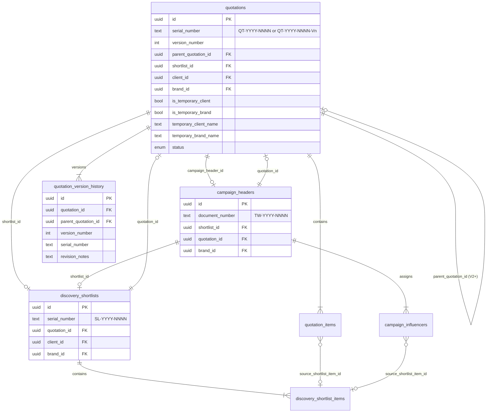

# Quotation Commercial Lifecycle

**Status:** MVP implemented (Jun 2026)  
**Scope:** Quotation ↔ Shortlist ↔ Campaign with revision history, bidirectional sync, and audit trail.

---

## Overview

The commercial lifecycle connects Discovery quotations to shortlists and campaigns while preserving Thinkway hierarchy:

```text
Group → Legal Entity (clients) → Brand → Campaign Header → Campaign Line
```

Quotations can start with **master** client/brand selections or **temporary** quotation-scoped names. Temporary values never auto-create master records; authorized users promote them explicitly.

---

## Entity relationship diagram



---

## Migration

| File | Purpose |
|------|---------|
| `supabase/migrations/20260706010000_quotation_commercial_lifecycle.sql` | Lifecycle columns, reverse links, `quotation_version_history`, version serial helper |

**Apply:** `supabase db push` (requires explicit approval per project policy).

---

## Synchronization rules

Implementation: `lib/commercial-sync/rules.ts` (pure rules) + `lib/commercial-sync/engine.ts` (server-side sync).

| Quotation status | Sync |
|------------------|------|
| `draft`, `under_review` | **Enabled** — bidirectional |
| `sent`, `approved`, `accepted` | **Disabled** — immutable snapshot |
| `rejected`, `archived`, `cancelled` | **Disabled** |

### Shortlist → Quotation

When `discovery_shortlists.quotation_id` ↔ `quotations.shortlist_id` are linked:

- Creator **added** on shortlist → quotation item inserted (via `source_shortlist_item_id`)
- Creator **removed** on shortlist → matching quotation item deleted
- **Commercials / deliverables** updated on shortlist → copied to linked quotation item

Hooked from: `features/discovery/shortlists/actions.ts`, `commercial-actions.ts`

### Quotation → Shortlist

- Commercial or deliverable autosave on quotation → updates linked shortlist item
- Creator removed on quotation → removes linked shortlist item
- New quotation line without shortlist link → creates shortlist item and back-links

Hooked from: `features/quotations/actions.ts`

### Loop prevention

In-memory lock per `(quotationId, shortlistId)` pair prevents re-entrant sync cycles.

---

## Lifecycle actions

Server actions: `features/quotations/lifecycle-actions.ts`

| Action | Preconditions | Result |
|--------|---------------|--------|
| `moveQuotationToShortlist` | No existing `shortlist_id` | Creates `SL-YYYY-NNNN`, copies creators/commercials, links both ways |
| `generateQuotationVersion` | Status `sent` / `approved` / `accepted` | New draft `QT-YYYY-NNNN-Vn`, copies items, writes `quotation_version_history` |
| `createCampaignFromQuotation` | Status `approved`, master brand | Creates/links shortlist if needed, creates `TW-YYYY-NNNN` campaign, vendor assignments |
| `promoteQuotationToMasterData` | `clients.write`, temporary flags | Creates `clients` + `brands`, clears temporary fields |
| `updateQuotationClientBrand` | Discovery write | Master or temporary client/brand update |

Audit events: `lib/commercial-sync/audit.ts` → `audit_logs` (`entity_type = quotation`).

---

## UI locations

| Surface | Route | Component |
|---------|-------|-----------|
| Quotation workspace | `/discovery/quotations/[id]` | `QuotationLifecyclePanel` — links, actions, Activity tab |
| Client / brand | Same page | `QuotationClientBrandPanel` — master select or temporary inline |
| Linked shortlist | `/discovery/shortlists/[id]` | Existing shortlist workspace |
| Linked campaign | `/campaigns/[id]` | Existing campaign workspace |

**Screenshots:** Run `npm run dev` and open `/discovery/quotations/{id}` — Commercial lifecycle panel appears above client/brand panel. (Browser screenshots deferred if dev server unavailable.)

---

## Serial numbers

| Entity | Pattern | Generator |
|--------|---------|-----------|
| Quotation V1 | `QT-YYYY-NNNN` | `generate_quotation_serial()` trigger |
| Quotation V2+ | `QT-YYYY-NNNN-Vn` | `format_quotation_version_serial()` / lifecycle action |
| Shortlist | `SL-YYYY-NNNN` | Existing shortlist trigger |
| Campaign | `TW-YYYY-NNNN` | Existing campaign header trigger |

---

## Tests

```bash
npm run test:quotations
```

Includes:

- `lib/commercial-sync/rules.test.ts` — sync eligibility, version serial formatting
- `features/quotations/commercial-lifecycle.test.ts` — lifecycle regression scenarios

---

## Deferred / gaps

- Full Supabase integration tests (shortlist-workflow pattern uses pure guards; DB E2E requires live `supabase db push`)
- Campaign line commercial copy from quotation (MVP creates header + vendor assignments only)
- Director/Manager role slugs not in DB — promote uses `clients.write` permission instead
- PDF/screenshot capture in CI

---

## File index

| Path | Role |
|------|------|
| `lib/commercial-sync/rules.ts` | Sync/version/campaign eligibility |
| `lib/commercial-sync/engine.ts` | Bidirectional sync engine |
| `lib/commercial-sync/audit.ts` | Audit log helper |
| `features/quotations/lifecycle-actions.ts` | Move, version, campaign, promote |
| `features/quotations/components/quotation-lifecycle-panel.tsx` | Workspace UI |
