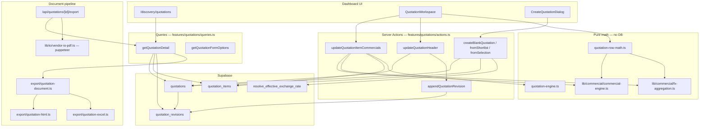

# Client Quotation Module — Phase 1 Architecture Audit

> Branch: `feature/shortlist-v2` · Audit date: June 2026  
> Scope: Discovery Client Quotations (`/discovery/quotations`, export API, commercial engine)

## Executive summary

The quotation module sits on a solid Phase 2.5 foundation (DB, serial `QT-YYYY-NNNN`, commercial engine, autosave, spreadsheet workspace from `2c599ef`). This redesign closes enterprise gaps: VIO/CIO-quality documents, client/brand governance, validity/versioning, GP visualization, revision history, and export parity.

---

## Architecture diagram

---

## Route & file map

| Surface | Path |
|---------|------|
| List | `app/(dashboard)/discovery/quotations/page.tsx` |
| Workspace | `app/(dashboard)/discovery/quotations/[id]/page.tsx` |
| Export API | `app/api/quotations/[id]/export/route.ts` |
| Workspace UI | `features/quotations/components/quotation-workspace.tsx` |
| Actions | `features/quotations/actions.ts` |
| Queries | `features/quotations/queries.ts` |
| Row math | `features/quotations/quotation-row-math.ts` |
| Totals engine | `features/quotations/quotation-engine.ts` → `fx-aggregation.ts` |
| Commercial core | `lib/commercial/commercial-engine.ts` |
| Migrations | `20260703010000_quotations_commercial.sql`, `20260704010000_commercial_markup_mode.sql`, **`20260705010000_quotations_enterprise.sql`** |

---

## Reusable components & patterns

| Pattern | Source | Reuse in quotations |
|---------|--------|---------------------|
| PDF rendering | `lib/io/vendor-io-pdf.ts` | Export route |
| Excel builder | `lib/reports/document/excel-report-builder.ts` | `quotation-excel.ts` |
| CIO terms structure | `lib/io/client-io-default-terms.ts` | `quotation-default-terms.ts` |
| Client/brand selects | `SearchableSelect` + `getClientsForSelect` / `getBrandsForSelect` | Client brand panel |
| Creator row identity | `CreatorIdentityCell` | Spreadsheet column |
| GP tone pills | `lib/ui/status-tone.ts` | `quotation-gp-health.ts` |
| Autosave | `useDebouncedAutosave` | Row + header + terms |
| Discovery chrome | `DiscoverySubNav` | List page |

---

## Commercial totals flow

1. **Row edit** → `computeCommercials()` → `toEgp()` per line  
2. **Live UI totals** → `computeLiveQuotationTotals()` (drafts) — matches visible cells  
3. **Persisted header** → `recomputeTotals()` → `aggregateEgpTotals()` — GP = Revenue − Cost (EGP)  
4. **Export** → reads persisted `total_*_egp` from `QuotationDetail`

Modes: `cost_markup_pct`, `cost_gp_pct`, `cost_revenue`, `cost_gp_value`.

---

## Schema gaps (addressed)

| Gap | Resolution |
|-----|------------|
| Issue / validity dates | `issue_date`, `validity_date` + defaults |
| Version / department | `version`, `department` |
| Reviewed by | `reviewed_by_name` |
| Client portal timestamps | `shared_with_client`, `client_viewed_at`, `client_approved_at` |
| Revision history | `quotation_revisions` table |
| GP target | `gp_target_pct` (default 25%) |

Pre-existing: `client_visible` mirrored by `shared_with_client`.

---

## Export limitations (before → after)

| Limitation | Status |
|------------|--------|
| Single-page basic HTML | **Fixed** — cover, summary, grid, terms, signatures |
| Hardcoded `#1D9E75` only in old template | **Aligned** with Thinkway brand; semantic GP colors in exports |
| No PDF row break control | **Fixed** — `avoid-break` / `page-break` CSS |
| Excel missing validity/version | **Fixed** — header meta expanded |
| Preview ≠ Word | **Fixed** — same `buildQuotationHtml` |

---

## Blockers & deferred

| Item | Notes |
|------|-------|
| Migration not auto-applied | Run `20260705010000_quotations_enterprise.sql` manually |
| Deliverables inline edit | Column shows snapshot; edit via shortlist/commercial tab (future) |
| Client portal UI | Schema only (`shared_with_client`, timestamps) |
| Inline client/brand create | Select existing only; use Clients module to create |
| `expired` status enum | Computed badge from `validity_date`, not DB enum |

---

## VIO/CIO reuse opportunities (implemented)

- Puppeteer PDF pipeline from vendor IO  
- Excel styled workbook from analytics reports  
- Multi-section HTML document (cover → body → terms → signatures)  
- Default legal terms pattern from Client IO  
- Serial document numbering (`QT-YYYY-NNNN` vs `VIO-*`)

---

## Test coverage

`npm run test:quotations` runs commercial engine, quotation engine, row math, serial, seeds, GP health, validity, default terms, document HTML.
