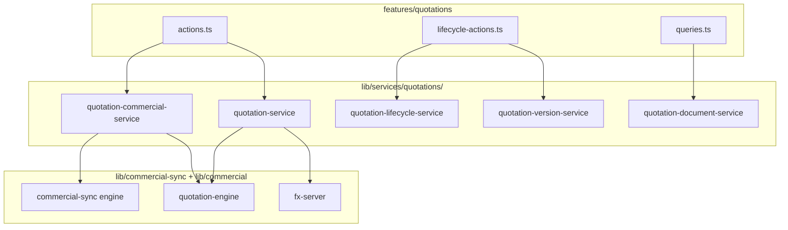

# Quotation Service Layer Audit — Phase 3 Step 4

**Date:** June 2026  
**Branch:** `refactor/phase2-shared-domains-ui`  
**Scope:** Extract quotation business logic from `features/quotations/actions.ts`, `lifecycle-actions.ts`, and `queries.ts` into `lib/services/quotations/`

---

## Executive Summary

Phase 3 Step 4 extracts the quotations module god files into a dedicated service layer following the campaign (commits `4077e36`, `cc995e6`) and billing (commit `28e484f`) extraction patterns. Server actions and query entry points remain the public API; they follow **authorize → validate → invoke service → revalidate → return**.

**Primary extraction:** quotation CRUD and shortlist import, commercial autosave with shortlist sync, lifecycle workflows (client/brand, shortlist link, campaign creation, master-data promotion orchestration), version generation, document/detail reads, and import helper queries.

---

## LOC Metrics

| File | Before | After | Δ |
|------|--------|-------|---|
| `features/quotations/actions.ts` | 941 | 287 | **−654 (−69%)** |
| `features/quotations/lifecycle-actions.ts` | 852 | 252 | **−600 (−70%)** |
| `features/quotations/queries.ts` | 365 | 34 | **−331 (−91%)** |
| **New service modules** | 0 | 2,425 | +2,425 |

### Module breakdown

| File | LOC | Role |
|------|-----|------|
| `quotation-service.ts` | 523 | Create, import, header/item CRUD, import helpers |
| `quotation-lifecycle-service.ts` | 349 | Client/brand, shortlist link, campaign creation, promote orchestration |
| `quotation-document-service.ts` | 369 | List/detail reads, form and promote wizard options |
| `repositories/quotation-repository.ts` | 641 | Supabase mutations and lifecycle DB helpers |
| `quotation-version-service.ts` | 200 | Version generation and version chain reads |
| `quotation-commercial-service.ts` | 128 | Item commercials, totals recompute, shortlist sync |
| `repositories/quotation-document-repository.ts` | 102 | Revisions, version history, audit reads |
| `quotation-helpers.ts` | 35 | Shared seed types and mutation result |
| `repositories/quotation-item-repository.ts` | 14 | Re-export facade for item repository ops |
| `quotation-service-layer.test.ts` | 32 | Regression tests |
| `index.ts` | 42 | Public service exports |

**Net feature-layer reduction:** −1,585 LOC from entry files (−73%).

---

## Action Inventory

| Action | Service | Repository | Status |
|--------|---------|------------|--------|
| `createBlankQuotation` | `quotation-service.createBlankQuotation` | `quotation-repository` | ✅ Extracted |
| `createQuotationFromSelection` | `quotation-service.createQuotationFromSelection` | item + header repos | ✅ Extracted |
| `createQuotationFromShortlist` | `quotation-service.createQuotationFromShortlist` | shortlist + item repos | ✅ Extracted |
| `importShortlistItemsToQuotation` | `quotation-service.importShortlistItemsToQuotation` | item repo | ✅ Extracted |
| `addShortlistCreatorsToQuotation` | `quotation-service.addShortlistCreatorsToQuotation` | composite | ✅ Extracted |
| `addItemsToQuotation` | `quotation-service.addItemsToQuotation` | item repo | ✅ Extracted |
| `updateQuotationItemCommercials` | `quotation-commercial-service` | item + sync engine | ✅ Extracted |
| `updateQuotationHeader` | `quotation-service.updateQuotationHeader` | header repo | ✅ Extracted |
| `removeQuotationItem` | `quotation-commercial-service.removeQuotationItemWithSync` | item repo + sync | ✅ Extracted |
| `duplicateQuotationItems` | `quotation-service.duplicateQuotationItems` | item repo | ✅ Extracted |
| `archiveQuotation` | `quotation-service.archiveQuotation` | header repo | ✅ Extracted |
| `listShortlistsForImport` | `quotation-service.listShortlistsForImport` | inline query | ✅ Extracted |
| `listCampaignsForImport` | `quotation-service.listCampaignsForImport` | inline query | ✅ Extracted |
| `importCampaignAssignmentsToQuotation` | `quotation-service` | campaign influencers | ✅ Extracted |
| `updateQuotationClientBrand` | `quotation-lifecycle-service` | header repo | ✅ Extracted |
| `promoteQuotationToMasterData` | `quotation-lifecycle-service` | `promote-master-data` (features) | ✅ Orchestration extracted |
| `moveQuotationToShortlist` | `quotation-lifecycle-service` | shortlist + item copy | ✅ Extracted |
| `generateQuotationVersion` | `quotation-version-service` | document + header repos | ✅ Extracted |
| `createCampaignFromQuotation` | `quotation-lifecycle-service` | campaign + assignments | ✅ Extracted |
| `getQuotationLifecycleActivity` | `quotation-lifecycle-service` | document repo (audit) | ✅ Extracted |
| `getQuotationVersionChain` | `quotation-version-service` | document repo | ✅ Extracted |
| Promote wizard search/duplicate checks | `features/quotations/promote-master-data` | — | ✅ Thin passthrough (unchanged) |

---

## Query Inventory

| Query | Service | Status |
|-------|---------|--------|
| `getQuotationFormOptions` | `quotation-document-service` | ✅ Extracted |
| `getPromoteWizardOptions` | `quotation-document-service` | ✅ Extracted |
| `getQuotationsList` | `quotation-document-service` | ✅ Extracted |
| `getQuotationDetail` | `quotation-document-service` | ✅ Extracted |

---

## Workflow Map



---

## Dependency Graph

```
features/quotations/actions.ts          ──► lib/services/quotations/*
features/quotations/lifecycle-actions.ts ──► lib/services/quotations/*
features/quotations/queries.ts          ──► lib/services/quotations/*
lib/services/quotations/*               ──► lib/commercial/*, lib/commercial-sync/*
lib/services/quotations/*               ──► features/quotations/types, constants, quotation-engine
lib/services/quotations/*               ──► features/quotations/promote-master-data (lifecycle only)
lib/services/quotations/*               ──✗ features/quotations/actions (no reverse import)
```

**Dependency reduction:** Entry action files no longer import Supabase mutation helpers, commercial sync, or lifecycle DB logic directly — consolidated in service + repository modules.

---

## Coupling Analysis

| Coupling | Before | After |
|----------|--------|-------|
| Actions → Supabase mutations | Inline in actions | Repositories + services |
| Actions → commercial-sync | Direct in actions | `quotation-commercial-service` |
| Actions → lifecycle DB | Inline in lifecycle-actions | `quotation-lifecycle-service` |
| Queries → Supabase reads | Inline in queries | `quotation-document-service` |
| shortlist-seeds → actions | `QuotationItemSeed` from actions | `quotation-helpers` |

**Preserved coupling (intentional):**

- `quotation-engine.ts` — pure commercial math (shared with shortlists); services delegate here.
- `promote-master-data.ts` — master-data promotion writes remain in features; lifecycle service orchestrates + audit.
- `export/quotation-document.ts` — pure document model for HTML/Excel/PDF; unchanged.
- `lib/commercial-sync/engine.ts` — bidirectional shortlist sync unchanged.

---

## Transaction Boundaries

| Operation | Boundary | Rollback |
|-----------|----------|----------|
| Create quotation + items | Header insert → items insert → totals | No multi-table transaction (existing behavior) |
| Item commercial update | Item patch → totals → shortlist sync | Sync is best-effort after persist |
| Move to shortlist | Shortlist insert → link → item copy loop | Partial shortlist items on per-row failure (existing) |
| Generate version | Header insert → item copy → totals → history | No rollback (existing) |
| Create campaign | Header → assignments loop → link quotation/shortlist | Partial assignments on promotion failure (existing) |
| Promote master data | Client/brand writes → quotation patch → shortlist patch | `executePromoteMasterData` handles writes atomically per entity |

---

## Remaining God Files

| File | LOC (approx) | Notes |
|------|--------------|-------|
| `features/quotations/promote-master-data.ts` | ~528 | Candidate for Phase 3 Step 5 — client/brand promotion domain |
| `features/quotations/components/quotation-workspace.tsx` | ~large | UI workspace — not in scope |
| `features/quotations/export/quotation-document.ts` | ~255 | Pure document model — appropriate to stay |
| `repositories/quotation-repository.ts` | 641 | Consolidated DB layer; could split further if repo grows |

---

## Verification

- `npx tsc --noEmit` — pass
- `npm run build` — pass
- `npx tsx lib/services/quotations/quotation-service-layer.test.ts` — pass
- Existing feature tests (`quotation-engine`, `commercial-lifecycle`, `promote-master-data`, export) — unchanged paths

---

## Constraints Preserved

- No UX, schema, or API contract changes
- Server action signatures identical
- Permissions, audit logs, routes, exports unchanged
- No new `lib → features/actions` imports in services
