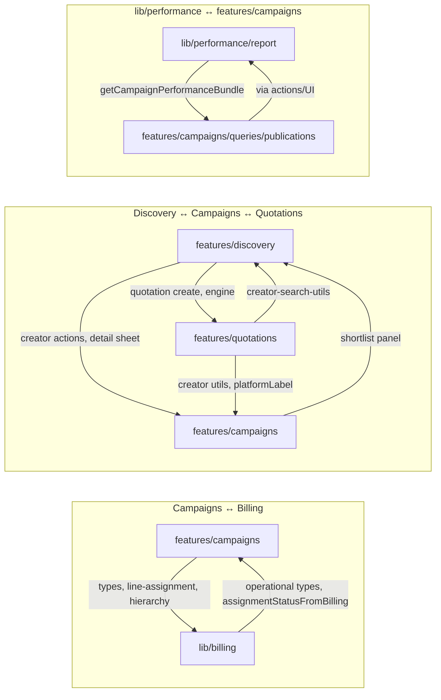
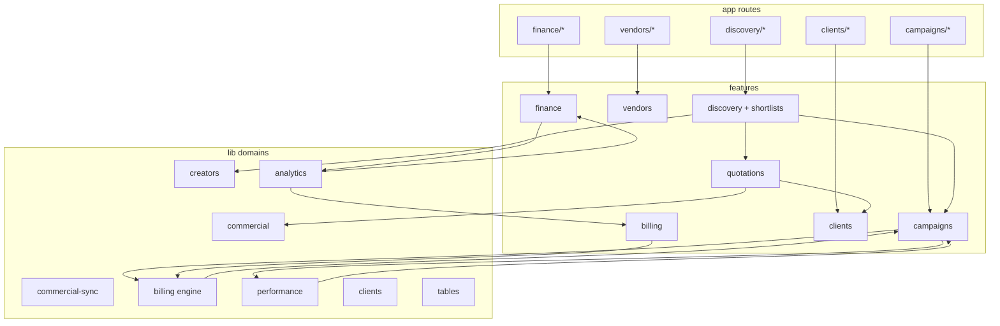

# Thinkway Platform — Refactoring Audit

**Date:** June 2026  
**Scope:** Full read-only architecture audit of `thinkway-platform`  
**References:** `docs/THINKWAY_SYSTEM_REFERENCE.md`, `docs/ARCHITECTURE_ALIGNMENT.md`  
**Method:** Line-count analysis (PowerShell), cross-module import grep, pattern sampling, manual circular-dependency review (madge unavailable — npm TLS error)

---

## Executive Summary

Thinkway is a mature enterprise SaaS codebase with strong domain modeling (hierarchy, billing engine, commercial math) but **accumulated scale debt** concentrated in **Campaigns** (~29.7k LOC), **lib/billing** (~11.5k), and **lib/performance** (~10.3k). The highest-impact refactor targets are:

1. **Split oversized god files** — especially `features/campaigns/queries.ts`, `features/campaigns/actions.ts`, `features/billing/actions.ts`, and assignment-hierarchy UI.
2. **Break Campaigns ↔ Billing ↔ lib/billing coupling** — types and assignment logic live in `features/campaigns` while billing logic lives in `lib/billing`; both depend on each other.
3. **Consolidate operational UI primitives** — 13 KPI strips, 18 status badges, 37 tables, 30 workspaces; shared patterns exist (`KpiCarousel`, `OperationalConfigurableTable`) but are reimplemented per module.
4. **Extract shared domains** — Creator (`lib/creators`), Commercial (`lib/commercial`), Document upload, Audit — partially done; finish extraction before more feature growth.
5. **Performance hardening** — N+1 in credit-limit list; monolithic workspace loads; client components importing heavy server-side libs at boundaries.

**Severity legend:** 🔴 Critical · 🟠 High · 🟡 Medium · 🟢 Low

---

## 1. Oversized Files

### 1.1 Threshold Summary

| Threshold | Count (app code) | Severity |
|-----------|------------------|----------|
| > 2000 lines | 1 | 🔴 |
| > 1000 lines | 14 | 🟠 |
| > 500 lines | 52 | 🟡 |

*Excludes `node_modules`, `.next`, generated-only artifacts counted separately.*

### 1.2 Files > 2000 Lines

| Lines | File | Classification | Severity |
|-------|------|----------------|----------|
| 2860 | `types/database.ts` | Generated Supabase types | 🟢 Acceptable (regenerate, don't hand-edit) |

### 1.3 Files > 1000 Lines

| Lines | File | Domain | Issue | Severity |
|-------|------|--------|-------|----------|
| 1551 | `features/billing/actions.ts` | Billing | Monolithic server actions (15+ exports) | 🔴 |
| 1384 | `features/campaigns/actions.ts` | Campaigns | CRUD + vendors + deliverables + duplicate | 🔴 |
| 1363 | `features/campaigns/queries.ts` | Campaigns | List KPIs + full workspace + influencer search | 🔴 |
| 1232 | `supabase/schema.sql` | DB | Canonical schema snapshot | 🟢 |
| 1178 | `lib/billing/invoice-from-deliverables.ts` | Billing | Invoice pipeline logic | 🟠 |
| 1166 | `features/quotations/components/quotation-workspace.tsx` | Quotations | Workspace + forms + export + lifecycle UI | 🟠 |
| 1082 | `lib/performance/metrics-collector/persist.ts` | Performance | Metrics persistence | 🟠 |
| 1071 | `features/campaigns/components/assignment-hierarchy/editable-post-row.tsx` | Campaigns | Row editor + actions + billing badges | 🔴 |
| 1037 | `features/campaigns/components/campaign-line-sheet.tsx` | Campaigns | Line CRUD sheet | 🟠 |
| 1029 | `lib/clients/classify-client-category.ts` | Clients | AI + keyword + web search classifier | 🟠 |
| 1007 | `lib/billing/repair-orphaned-invoice-state.ts` | Billing | Repair/migration utility | 🟡 |

### 1.4 Files > 500 Lines (Selected — Full List in Appendix A)

| Lines | File | Severity |
|-------|------|----------|
| 934 | `features/campaigns/components/performance/publication-workspace/publication-workspace.tsx` | 🟠 |
| 922 | `features/billing/queries.ts` | 🟠 |
| 910 | `features/portals/queries.ts` | 🟠 |
| 879 | `features/campaigns/queries/publications.ts` | 🟠 |
| 858 | `features/quotations/components/promote-master-data-wizard.tsx` | 🟡 |
| 855 | `features/discovery/shortlists/actions.ts` | 🟡 |
| 843 | `features/quotations/actions.ts` | 🟡 |
| 783 | `features/vendors/actions.ts` | 🟡 |
| 753 | `features/campaigns/components/assignment-hierarchy/assignment-safe-grid.tsx` | 🟠 |
| 748 | `features/quotations/lifecycle-actions.ts` | 🟡 |
| 740 | `features/reports/components/pnl-report-view.tsx` | 🟡 |
| 712 | `features/campaigns/actions/assignment-deliverable-actions.ts` | 🟠 |
| 706 | `lib/billing/operational-billing-query.ts` | 🟠 |
| 694 | `features/operations/components/move-between-accounts-workspace.tsx` | 🟡 |
| 661 | `features/campaigns/components/assignment-hierarchy/assignment-influencer-detail-sheet.tsx` | 🟡 |
| 635 | `lib/performance/campaign-performance-audit.ts` | 🟡 |
| 633 | `lib/billing/repair-invoice-create-pipeline.ts` | 🟡 |
| 631 | `lib/billing/invoice-from-posts.ts` | 🟡 |
| 626 | `features/campaigns/actions/performance-actions.ts` | 🟡 |
| 618 | `features/campaigns/components/tabs/campaign-billing-tab.tsx` | 🟠 |
| 613 | `components/layout/collapsible-app-sidebar.tsx` | 🟡 |
| 610 | `features/vendors/components/platform-accounts-editor.tsx` | 🟡 |
| 605 | `features/discovery/shortlists/components/shortlist-workspace.tsx` | 🟡 |
| 574 | `features/clients/actions.ts` | 🟡 |
| 547 | `features/campaigns/components/performance/campaign-performance-center-tab.tsx` | 🟡 |
| 545 | `features/billing/components/billing-campaign-queue-table.tsx` | 🟡 |
| 541 | `lib/clients/company-hints-global.ts` | 🟡 (data) |
| 517 | `features/campaigns/components/performance/campaign-performance-grid.tsx` | 🟡 |
| 516 | `features/vendors/queries.ts` | 🟡 |
| 516 | `features/reports/components/daily-report-view.tsx` | 🟡 |
| 507 | `features/campaigns/components/new-campaign-dialog.tsx` | 🟡 |
| 504 | `features/groups/actions.ts` | 🟡 |

### 1.5 Module Size (LOC, excl. tests)

| Module | Files | Lines | Severity |
|--------|-------|-------|----------|
| `features/campaigns` | 149 | 29,710 | 🔴 |
| `lib/billing` | 52 | 11,509 | 🟠 |
| `lib/performance` | 77 | 10,329 | 🟠 |
| `features/billing` | 35 | 8,377 | 🟠 |
| `features/quotations` | 34 | 7,990 | 🟡 |
| `features/clients` | 35 | 6,245 | 🟡 |
| `features/vendors` | 36 | 6,228 | 🟡 |
| `features/finance` | 45 | 5,896 | 🟡 |
| `features/discovery` | 61 | 9,343 | 🟡 |
| `features/discovery/shortlists` | 27 | 4,589 | 🟡 |
| `lib/creators` | 12 | 1,406 | 🟢 (well-scoped) |

---

## 2. Duplicate Components

### 2.1 Inventory

| Pattern | Count | Examples |
|---------|-------|----------|
| `*-workspace.tsx` | 30 | `campaign-workspace`, `shortlist-workspace`, `quotation-workspace`, `billing-workspace` |
| `*-table.tsx` | 37 | Entity list tables + portal tables + billing queue tables |
| `*-dialog.tsx` | 26 | `new-*-dialog`, dependency dialogs, invoice dialogs |
| `*-sheet.tsx` | 27 | Detail/edit sheets across campaigns, groups, billing |
| `*-kpi-strip.tsx` | 13 | Per-module KPI carousels |
| `*-status-badge.tsx` | 18 | Domain-specific status rendering |

### 2.2 High-Confidence Duplicates

| Duplicate pair / cluster | Evidence | Recommended abstraction | Severity |
|--------------------------|----------|-------------------------|----------|
| **Entity dependency dialogs** | `features/operations/components/entity-dependency-dialog.tsx` vs `features/vendors/components/vendor-dependency-dialog.tsx` — same Dialog + `OperationalConfigurableTable` + archive/move actions; differ only in action, columns, formatters | `components/operations/dependency-dialog-shell.tsx` with column/action injectors | 🟠 |
| **KPI strips (13 files)** | All use `KpiCarousel` with copy-pasted `ACCENT_TILE` maps (e.g. `campaign-kpi-strip.tsx`, `campaigns-kpi-strip.tsx`, `billing-kpi-strip.tsx`) | `components/kpi/domain-kpi-strip.tsx` + config-driven items; shared accent tokens in `lib/ui/kpi-tokens.ts` | 🟡 |
| **Status badges (18 files)** | Parallel badge components per domain; some use `lib/ui/status-tone`, others inline Tailwind | `components/ui/domain-status-badge.tsx` wrapping `StatusTone` + label maps per enum | 🟡 |
| **New entity dialogs** | `new-client-dialog`, `new-vendor-dialog`, `new-campaign-dialog`, `new-brand-dialog`, `new-group-dialog` — shared Dialog + form grid + name availability hooks | `components/forms/entity-create-dialog-shell.tsx` | 🟡 |
| **Documents tabs** | `client-documents-tab`, `vendor-documents-tab`, `group-documents-tab` — all use `OperationalDataTable` + upload patterns | `components/documents/entity-documents-tab.tsx` parameterized by entity type + upload action | 🟠 |
| **List sections** | `clients-list-section`, `vendors-list-section`, `campaigns-list-section` — search + pagination + table + empty state | Already partially shared via `OperationalConfigurableTable`; extract list-section layout | 🟡 |
| **Enrichment status badges** | `components/forms/enrichment-status-badge.tsx` (platform sync) vs `features/discovery/enrichment/components/enrichment-status-badge.tsx` (creator enrichment) — **different domains, similar name** | Rename for clarity; do not merge semantics | 🟢 |
| **Operational typography** | `operational-table-typography` imported from campaigns into billing, IO, clients | Move to `components/operational/` or `lib/ui/operational-chrome.ts` | 🟠 |
| **Creator selection UI** | Discovery search, shortlist add drawer, quotation add modal, campaign creator browser all browse unified creators | Shared `CreatorPicker` / `CreatorBrowsePanel` wrapping `browseUnifiedCreatorsAction` | 🟠 |

### 2.3 Tables Architecture (Positive Pattern)

Shared infrastructure already exists and should be extended, not replaced:

- `components/tables/operational-configurable-table.tsx`
- `components/tables/operational-data-table.tsx`
- `components/tables/operational-table-suite-provider.tsx`
- `lib/tables/workspace-table-filter-fields.ts`
- `lib/tables/operational-table-ids.ts`

**Gap:** Portal tables (`features/portals/components/tables/*`) and some finance tables duplicate column defs instead of reusing filter accessors.

---

## 3. Duplicate Business Logic

### 3.1 Discovery → Shortlists → Quotations → Campaigns Pipeline

| Concern | Current locations | Duplication / coupling | Severity |
|---------|-------------------|------------------------|----------|
| **Creator browse** | `lib/creators/unified-browse.ts`, `features/campaigns/creator-discovery-actions.ts`, used by discovery + shortlists + quotations | Actions live under **campaigns** but serve discovery — misplaced module boundary | 🟠 |
| **Commercial math** | `lib/commercial/commercial-engine.ts` ✅, `features/quotations/quotation-engine.ts` (FX + normalization), `features/quotations/quotation-row-math.ts` | Engine is shared; quotation layer adds FX — **good**. Shortlists import `normalizeCommercialLine` from quotations | 🟢 |
| **Commercial sync** | `lib/commercial-sync/engine.ts` links shortlist ↔ quotation | Depends on `features/quotations/shortlist-seeds` — should move seeds to `lib/commercial-sync/` | 🟡 |
| **Creator compare** | `lib/creators/creator-compare-bundle.ts`, discovery compare workspace | Well isolated | 🟢 |
| **Platform labels** | `features/campaigns/line-assignment.ts` → `platformLabel` used in discovery, quotations, billing | Campaign module owns cross-cutting label util | 🟠 |
| **Promote to master** | `features/quotations/promote-master-data.ts` (858-line wizard UI) creates clients/brands from quotations | Overlaps client onboarding (`lib/clients/onboarding-*`) | 🟡 |

**Cross-import evidence:**

```
discovery/creator-search-workspace → campaigns/creator-detail-sheet, campaigns/creator-discovery-actions, quotations/actions
discovery/shortlists/commercial-actions → quotations/quotation-engine
quotations/quotation-workspace → discovery/creator-search-utils, campaigns/line-assignment, clients/onboarding-status-badge
campaigns/campaign-creator-discovery-panel → discovery/shortlists/campaign-shortlist-assignments-panel
```

### 3.2 Clients & Vendors

| Concern | Locations | Issue | Severity |
|---------|-----------|-------|----------|
| **Form UI kits** | `features/clients/components/client-form-ui.tsx`, `features/vendors/components/vendor-form-ui.tsx` | Parallel styling primitives | 🟡 |
| **Document upload** | `lib/clients/persist-client-document-upload.ts`, `components/forms/document-upload-form.tsx`, group/vendor/client tabs | Same upload flow, three entity adapters | 🟠 |
| **Classification** | `lib/clients/classify-client-category.ts` (1029 LOC), AI + web + keywords | Should split: rules, AI adapter, web adapter | 🟠 |
| **Dependency checks** | `lib/operations/entity-dependencies.ts`, `lib/operations/vendor-dependencies.ts` | Parallel query logic | 🟡 |
| **Money formatting** | `features/campaigns/utils`, `features/billing/utils`, `features/vendors/utils`, `lib/finance/currency-format.ts` | Multiple formatters | 🟡 |

### 3.3 Campaigns & Performance

| Concern | Locations | Issue | Severity |
|---------|-----------|-------|----------|
| **Assignment hierarchy** | 20+ files under `assignment-hierarchy/` | Largest UI cluster; billing status woven into rows | 🔴 |
| **Performance reports** | `lib/performance/report/*`, `lib/campaigns/performance-report-document-legacy.ts` | Legacy exports marked `@deprecated` in `lib/performance/report/index.ts` | 🟡 |
| **Metrics collection** | `lib/performance/metrics-collector/*` (1082-line persist) | Server-only; keep out of client bundle | 🟢 |
| **Publication workspace** | 934-line client component + sheet + open policy | Candidate for hook extraction | 🟠 |

### 3.4 Finance & Billing

| Concern | Locations | Issue | Severity |
|---------|-----------|-------|----------|
| **Operational billing** | `features/billing/*` + `lib/billing/*` | Split across feature UI and lib engine — intentional but heavy coupling to campaigns types | 🟠 |
| **Finance register** | `features/finance/invoices/*` vs `features/billing/components/invoice-workspace.tsx` | Two invoice UIs (operational vs finance register) — product-intentional per ARCHITECTURE_ALIGNMENT | 🟢 |
| **Exchange rates** | `features/finance/exchange-rates/queries.ts` imported by `lib/analytics/*` | Correct direction (lib → features queries) | 🟢 |
| **Ungenerate dialogs** | `features/billing/components/regenerate-invoice-dialog.tsx`, `features/finance/invoices/components/invoice-ungenerate-dialog.tsx` | Parallel lifecycle UX | 🟡 |

---

## 4. Circular Dependencies

**Tooling:** `npx madge --circular` failed (npm TLS `UNABLE_TO_VERIFY_LEAF_SIGNATURE`). Analysis is manual via import grep.

### 4.1 Confirmed Logical Cycles



### 4.2 lib → features Imports (Layer Violation Hotspots)

`lib/` should not depend on `features/` in a clean architecture. **52+ instances** found. Highest impact:

| lib module | Imports from features | Severity |
|------------|----------------------|----------|
| `lib/billing/*` (12 files) | `features/campaigns/line-assignment`, `types/operational`, `types/assignment-hierarchy` | 🔴 |
| `lib/analytics/*` | `features/billing/types`, `features/finance/exchange-rates/queries` | 🟠 |
| `lib/campaigns/*` | `features/campaigns/queries`, `types`, `utils` | 🟡 (namespace collision) |
| `lib/performance/report/*` | `features/campaigns/queries/publications` | 🟠 |
| `lib/tables/workspace-table-filter-fields.ts` | 10+ feature type imports | 🟡 |
| `lib/commercial-sync/engine.ts` | `features/quotations/shortlist-seeds` | 🟡 |
| `lib/clients/persist-client-document-upload.ts` | `features/clients/schemas` | 🟡 |

### 4.3 Hidden Dependencies

| Pattern | Risk |
|---------|------|
| `operational-table-typography` exported from campaigns, consumed by billing/IO/clients | UI chrome trapped in campaigns feature |
| `platformLabel` in `features/campaigns/line-assignment.ts` | Used by discovery, quotations, billing lib |
| Server actions in `features/campaigns/creator-discovery-actions.ts` | Discovery feature depends on campaigns for core browse |
| `lib/tables/workspace-table-filter-fields.ts` | Central coupling hub for all workspace tables |

### 4.4 Recommended Dependency Rule

```
app → features → lib → types/supabase
         ↓
    components (shared UI)
```

Move shared types to `lib/<domain>/types` or `types/domain/` to break cycles.

---

## 5. Dependency Graph

### 5.1 Module Import Matrix (features → features)

Rows import from columns. Approximate import statement counts.

|  | Discovery | Shortlists | Quotations | Campaigns | Clients | Vendors | Billing | Finance | Performance (lib) |
|--|-----------|------------|------------|-----------|---------|---------|---------|---------|-------------------|
| **Discovery** | — | internal | via UI | **6** | 0 | 0 | 0 | 0 | via lib/creators |
| **Shortlists** | internal | — | **1** (engine) | **1** (actions) | 0 | 0 | 0 | 0 | 0 |
| **Quotations** | **3** | seeds | — | **2+** | **2** | 0 | 0 | 0 | PlatformIcon |
| **Campaigns** | **1** | **1** | 0 | internal | 0 | 0 | via lib | 0 | heavy lib use |
| **Clients** | 0 | 0 | 0 | 0 | internal | 0 | 0 | 0 | minimal |
| **Vendors** | 0 | 0 | 0 | 0 | 0 | internal | **2** | 0 | 0 |
| **Billing** | 0 | 0 | 0 | **6+** | 0 | 0 | internal | 0 | 0 |
| **Finance** | 0 | 0 | 0 | 0 | 0 | 0 | **1** | internal | 0 |

### 5.2 Layer Diagram



### 5.3 Critical Paths

1. **Pre-sales:** Discovery → Shortlists → Quotations → (promote) Clients/Brands → Campaigns  
2. **Operations:** Campaigns → Assignment hierarchy → Billing (lib) → Finance register  
3. **Performance:** Campaigns publications → lib/performance metrics → report export  
4. **Creator data:** lib/creators/unified-browse ← influencers + discovered_profiles + import

---

## 6. Shared Domain Opportunities

### 6.1 Creator Domain — Partial ✅

| Asset | Location | Status |
|-------|----------|--------|
| Unified browse | `lib/creators/unified-browse.ts` | ✅ Extracted |
| Compare bundle | `lib/creators/creator-compare-bundle.ts` | ✅ |
| Campaign shortlist | `lib/creators/campaign-shortlist.ts` | ✅ |
| Server actions | `features/campaigns/creator-discovery-actions.ts` | ⚠️ Move to `features/discovery/actions/` or `lib/creators/actions.ts` |
| Detail sheet | `features/campaigns/components/creator-detail-sheet.tsx` | ⚠️ Move to `features/creators/` or `components/creators/` |
| Unified card | `features/campaigns/components/creator-unified-card.tsx` | ⚠️ Same |

**Target package:** `lib/creators/` + `components/creators/` + thin feature wrappers.

### 6.2 Commercial Domain — Strong ✅

| Asset | Location |
|-------|----------|
| Pure engine | `lib/commercial/commercial-engine.ts` |
| FX aggregation | `lib/commercial/fx-aggregation.ts` |
| Quotation normalization | `features/quotations/quotation-engine.ts` |
| Shortlist sync | `lib/commercial-sync/engine.ts` |

**Next step:** Move `quotation-engine.ts` → `lib/commercial/quotation-normalize.ts`; keep feature-specific re-exports.

### 6.3 Client/Brand Domain

| Asset | Location | Gap |
|-------|----------|-----|
| Onboarding status | `lib/clients/onboarding-status.ts` | ✅ |
| Classification | `lib/clients/classify-client-category.ts` | Split 1029-line file |
| Category taxonomy | `lib/clients/client-category-taxonomy.ts` | ✅ |
| Brand commercial fields | `features/brands/*` | VR inheritance in `lib/clients/vr-inheritance.ts` |
| Promote from quotation | `features/quotations/promote-master-data.ts` | Should call shared `lib/clients/provision-from-quotation.ts` |

### 6.4 Campaign Domain

| Asset | Location | Gap |
|-------|----------|-----|
| Line assignment | `features/campaigns/line-assignment.ts` | Used cross-module — move to `lib/campaigns/` |
| Operational types | `features/campaigns/types/operational.ts` | Move to `lib/campaigns/types/` |
| Assignment hierarchy types | `features/campaigns/types/assignment-hierarchy.ts` | Move to `lib/campaigns/types/` |
| Workspace query | `features/campaigns/queries.ts` | Split by aggregate |

### 6.5 Document Domain

| Asset | Location |
|-------|----------|
| Client docs | `lib/clients/persist-client-document-upload.ts`, `features/clients/client-document-upload-api.ts` |
| IO docs | `lib/io/client-io-document-service.ts`, `lib/io/vendor-io-document-service.ts` |
| Group/vendor tabs | Parallel tab components |

**Target:** `lib/documents/` with `uploadDocument({ entityType, entityId, file, metadata })`.

### 6.6 Audit Domain

| Asset | Location |
|-------|----------|
| Finance audit | `lib/finance/audit-log.ts`, `lib/finance/audit-events.ts` |
| Campaign audit | `lib/campaigns/campaign-group-audit.ts` |
| Performance audit | `lib/performance/campaign-performance-audit.ts` |
| Onboarding audit | `lib/clients/onboarding-audit.ts` |
| Commercial sync audit | `lib/commercial-sync/audit.ts` |
| Discovery import | `lib/discovery-import/process.ts` |

**Target:** `lib/audit/` with typed `writeAuditEvent(domain, action, payload)` facade.

---

## 7. Dead Code

### 7.1 Deprecated / Legacy (Confirmed)

| Item | Path | Notes |
|------|------|-------|
| Legacy performance report exports | `lib/campaigns/performance-report-document-legacy.ts` | `@deprecated` in `lib/performance/report/index.ts`; grep shows only index + wrapper imports |
| Demo data | `lib/discovery/demo-data.ts`, `services/discovery-worker/src/discovery/demo-data.ts` | Used in search fallback/tests — keep but gate with env flag |
| Operational data table | `components/tables/operational-data-table.tsx` | Still widely imported (20+ files) — **not dead**, but consider merging with configurable table |

### 7.2 Orphan / Low-Reference Candidates

| Item | Path | Evidence |
|------|------|----------|
| Discovery enrichment badge export | `features/discovery/enrichment/components/enrichment-status-badge.tsx` | Zero direct imports found; only re-exported via `index.ts` |
| Forms enrichment badge | `components/forms/enrichment-status-badge.tsx` | Only used by `platform-accounts-editor.tsx` |
| `.tmp/` scratch scripts | 46 files under `.tmp/` | Not in git product surface — exclude from builds, add to `.gitignore` if tracked |
| Patch scripts | `.tmp/patch-quotation-workspace.mjs`, `.tmp/patch-database-types.mjs` | One-off migrations — archive or delete |

### 7.3 Obsolete Migrations

108 migrations in `supabase/migrations/`. No automated orphan detection run. **Manual policy recommended:**

- Do not delete applied migrations
- Flag superseded reconcile migrations (e.g. multiple `campaign_publications_*`) in a `docs/MIGRATION_INDEX.md`
- Notable: `20260609000000_disable_operational_bootstrap.sql` — verify still intentional

### 7.4 Abandoned Experiments

| Area | Path | Notes |
|------|------|-------|
| AI analyst | `features/ai-analyst/` | Workspace exists; confirm product roadmap before investing |
| Intelligence ETL | `scripts/intelligence-etl/` | 832-line run script — ops tooling, not app dead code |
| Planning | `features/planning/` | Partial vs reference §11 budgets |

### 7.5 Unused Export Detection

**Not run:** Full `ts-prune` / knip analysis was not executed in this audit. Recommend adding `knip` to CI for ongoing dead export detection.

---

## 8. Performance Risks

### 8.1 N+1 Queries

| Location | Pattern | Severity |
|----------|---------|----------|
| `features/finance/credit-limit/queries.ts:40-61` | `Promise.all(records.map(async → getClientCreditExposure))` — **1 query per client** | 🔴 |
| `features/vendors/queries.ts` | Loops over assignRows/headerRows for aggregation | 🟡 |
| `features/portals/queries.ts` | Multiple sequential loops over publication/deliverable/ios rows (910 LOC file) | 🟠 |
| `features/brands/queries.ts` | Campaign aggregation loops | 🟡 |

**Fix pattern for credit-limit:** Single SQL view or RPC returning exposure per client; or batch exposure query.

### 8.2 Duplicate / Oversized Fetches

| Location | Issue | Severity |
|----------|-------|----------|
| `getCampaignWorkspace` (`features/campaigns/queries.ts:363+`) | Loads lines, vendors, deliverables, invoices, approvals, audit, client IO, vendor IOs in parallel — **good Promise.all**, but always loads full workspace even for single-tab views | 🟠 |
| `useCampaignTabData` hook | Deferred tab loading exists — **partial mitigation** | 🟢 |
| `features/billing/actions.ts` | 1551 lines; `loadCampaignBillingDetailAction` may re-fetch overlapping hierarchy data | 🟡 |
| `features/campaigns/queries/publications.ts` | 879 lines; performance bundle queries | 🟡 |

### 8.3 Oversized Server Actions

| File | Exports | Risk |
|------|---------|------|
| `features/billing/actions.ts` | 15+ actions | Hard to tree-shake; large cold-start on serverless |
| `features/campaigns/actions.ts` | 10+ actions | Same |
| `features/discovery/shortlists/actions.ts` | 855 LOC | Mixed CRUD + workflow + commercial |

**Recommendation:** Split into `actions/` directory per domain verb (already started for campaigns: `assignment-deliverable-actions.ts`, `publication-actions.ts`).

### 8.4 Client Bundle Risks

| Risk | Evidence | Severity |
|------|----------|----------|
| Heavy workspace components | `quotation-workspace.tsx` (1166), `publication-workspace.tsx` (934), `campaign-workspace.tsx` (500+) | 🟠 |
| Playwright in performance lib | `lib/performance/metrics-collector/providers/playwright-scraper.ts` | 🟢 if server-only (verify no client import) |
| Excel/PPTX/PDF libs | `performance-report-pptx.ts`, `vendor-io-pdf.ts`, `quotation-html.ts` | 🟡 — ensure dynamic `import()` in server routes only |
| `platform-icon.tsx` in lib/performance | Imported by quotation-workspace client component | 🟢 lightweight |
| Sidebar | `collapsible-app-sidebar.tsx` (613 LOC) | 🟡 — code-split nav items |

### 8.5 revalidatePath Sprawl

30+ feature action files call `revalidatePath`/`revalidateTag` with hardcoded paths — risk of stale or over-invalidation. Centralize path constants per feature (`features/campaigns/paths.ts` pattern).

---

## 9. Refactoring Roadmap

### Phase 1: Safe Extraction (4–6 weeks)

*Low behavioral risk — move files, add re-exports, no schema changes.*

| # | Recommendation | Risk | Effort | Impact |
|---|----------------|------|--------|--------|
| 1.1 | Move `platformLabel`, operational types, `line-assignment` from `features/campaigns` → `lib/campaigns/` | Low | M | Breaks lib↔features cycles |
| 1.2 | Move `creator-discovery-actions.ts` + `creator-detail-sheet.tsx` → `features/discovery/` or new `features/creators/` | Low | M | Clarifies discovery ownership |
| 1.3 | Move `operational-table-typography` → `components/operational/` | Low | S | Removes campaigns as UI dependency hub |
| 1.4 | Split `features/campaigns/queries.ts` into `queries/list.ts`, `queries/workspace.ts`, `queries/influencers.ts` | Low | M | Maintainability |
| 1.5 | Split `features/billing/actions.ts` into `actions/invoice.ts`, `actions/queue.ts`, `actions/payments.ts` | Low | M | Serverless cold-start |
| 1.6 | Add `knip`/`ts-prune` CI job for dead exports | Low | S | Ongoing hygiene |
| 1.7 | Document migration index for 108 SQL files | Low | S | Onboarding |

### Phase 2: Shared Domains (6–8 weeks)

| # | Recommendation | Risk | Effort | Impact |
|---|----------------|------|--------|--------|
| 2.1 | Create `lib/documents/` upload facade; refactor client/vendor/group document tabs | Medium | L | −30% doc upload duplication |
| 2.2 | Create `lib/audit/` unified writer; migrate finance/campaign/onboarding audit calls | Medium | M | Consistent audit trail |
| 2.3 | Move `quotation-engine.ts` → `lib/commercial/quotation-normalize.ts` | Low | S | Commercial domain completeness |
| 2.4 | Extract `lib/clients/provision-from-quotation.ts` from promote wizard logic | Medium | M | Single client creation path |
| 2.5 | Split `classify-client-category.ts` into rules / AI / web modules | Low | M | Testability |
| 2.6 | Move `shortlist-seeds` to `lib/commercial-sync/` | Low | S | Break lib→quotations import |

### Phase 3: UI Consolidation (6–10 weeks)

| # | Recommendation | Risk | Effort | Impact |
|---|----------------|------|--------|--------|
| 3.1 | Config-driven `DomainKpiStrip` replacing 13 KPI strip files | Medium | L | Visual consistency |
| 3.2 | `DomainStatusBadge` + per-domain label maps | Medium | M | −18 badge files → maps |
| 3.3 | `DependencyDialogShell` for entity + vendor dependency dialogs | Low | S | −150 LOC duplicate |
| 3.4 | `EntityDocumentsTab` shared component | Medium | M | 3 tabs → 1 |
| 3.5 | `CreatorPicker` shared across discovery/shortlist/quotation/campaign | Medium | L | UX parity |
| 3.6 | Decompose `assignment-hierarchy/` — extract row editors, footers, badges | High | XL | Campaigns maintainability |

### Phase 4: Service Layer (8–12 weeks)

| # | Recommendation | Risk | Effort | Impact |
|---|----------------|------|--------|--------|
| 4.1 | Introduce `services/campaigns/` for workspace assembly (queries → service → actions) | Medium | L | Testable business logic |
| 4.2 | Introduce `services/billing/` wrapping `lib/billing` for action handlers | Medium | L | Thinner actions |
| 4.3 | Introduce `services/quotations/` for lifecycle + commercial sync orchestration | Medium | M | Clear transaction boundaries |
| 4.4 | Typed repository layer over Supabase for hot paths (campaign_headers, campaign_lines, invoices) | Medium | XL | RLS testability |
| 4.5 | Path registry + revalidation helper (`revalidateCampaign(id)`) | Low | S | Cache consistency |

### Phase 5: Performance Optimization (4–6 weeks)

| # | Recommendation | Risk | Effort | Impact |
|---|----------------|------|--------|--------|
| 5.1 | Batch credit exposure query (fix N+1 in `credit-limit/queries.ts`) | Low | M | Finance page load |
| 5.2 | SQL view `client_credit_exposure_v` | Low | M | DB-side aggregation |
| 5.3 | Expand deferred tab loading to billing + performance tabs | Medium | M | Campaign workspace TTI |
| 5.4 | Dynamic import for report exporters (PPTX/XLSX/PDF) | Low | S | Bundle size |
| 5.5 | Portal queries refactor — single RPC for creator dashboard | Medium | L | Portal latency |
| 5.6 | Index review on hot FK paths (campaign_lines, campaign_influencers, invoices) | Low | M | Query latency |

---

## Appendix A: Complete Files > 500 Lines

See Section 1.4 plus migrations/scripts:

| Lines | File |
|-------|------|
| 832 | `scripts/intelligence-etl/run.ts` |
| 729 | `supabase/policies.sql` |
| 725 | `supabase/migrations/20260531140000_enterprise_hierarchy.sql` |
| 693 | `supabase/migrations/20260603001000_thinkway_io_system.sql` |
| 651 | `scripts/billing-lifecycle-e2e-retest.ts` |
| 592 | `scripts/lifecycle-final-validation.ts` |
| 568 | `lib/discovery-import/upsert.test.ts` |
| 559 | `scripts/intelligence-etl/final-reconciliation.ts` |
| 544 | `supabase/migrations/20260603030000_creator_client_portals.sql` |

---

## Appendix B: Audit Commands Used

```powershell
# Large files
Get-ChildItem -Recurse -Include *.ts,*.tsx | Where-Object { $_.FullName -notmatch 'node_modules|\.next' } |
  ForEach-Object { ... } | Where-Object { $_.Lines -gt 500 }

# Module sizes
Get-ChildItem features/campaigns -Recurse -Include *.ts,*.tsx | ...
```

```bash
# Circular deps (failed — TLS)
npx madge --circular --extensions ts,tsx features lib components
```

---

## Appendix C: Alignment with Product Reference

Per `docs/ARCHITECTURE_ALIGNMENT.md`:

- **Hierarchy** (Group → Legal Entity → Brand → Campaign → Line) is aligned — refactor must preserve brand-first campaign create and line numbering.
- **Commercial fields on brand** — do not move back to client during refactors.
- **Finance on lines** — assignment-hierarchy refactor must keep line-level revenue/cost/GP/PO/billing states.
- **Phase 2 product gaps** (notifications, tasks, workflow rules) are out of scope for this code refactor but should not be blocked by Campaigns god-module coupling.

---

*End of audit.*
