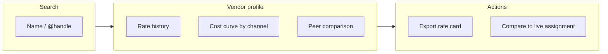

# Thinkway Intelligence Engine — Phase 1 Architecture

**Status:** Analysis & architecture only (Phase 1)  
**Source file:** `c:\Users\X13 Yoga G3\Documents\Thinway\Thinkway Intelligence Engine\data 2023 - 2026.xlsx`  
**Date:** June 2026  
**Constraints:** No production imports · No AI · No production Supabase tables

---

## Executive summary

The historical workbook contains **five sheets** spanning **~32,225 physical rows** (~**14,182 operational line-level facts** after excluding blank layout rows). Data evolves from a **13-column 2023 operational log** to a **49–51 column schema** in 2025–2026 that closely mirrors Thinkway campaign headers and lines (Camp#, Code#, billing states, margins, category hierarchy).

The **Database** sheet is a separate **influencer/vendor master** (8,452 rows) with platform handles, geography, banking, and sparse rate cards — the primary asset for **Influencer Pricing Intelligence**.

Recommended approach: a **physically isolated intelligence schema** (or separate Supabase project) with a **raw → intermediate → mart** pipeline. Entity resolution maps historical strings to live `groups`, `clients`, `brands`, and `influencers` via confidence-scored links — **never writing back** to operational billing, finance, or workflow tables.

---

## 1. Excel inventory

### 1.1 Sheet summary

| Sheet | Physical rows | Data rows (est.) | Columns | Role |
|-------|---------------|------------------|---------|------|
| **2023** | 6,575 | 6,575 | 13 | Early ops log — influencer × campaign × month |
| **2024** | 6,250 | ~2,006 | 41 | Transitional schema; ~68% blank rows (spreadsheet layout) |
| **2025** | 199 | 199 | 51 | Reference schema — full header/line + billing |
| **2026** | 10,749 | ~5,402 | 49 | Primary volume + richest operational fields |
| **Database** | 8,452 | 8,452 | 46 | Influencer master, rates, banking, platforms |

**Total operational facts (deduped estimate):** ~14,182 campaign-line rows + 8,452 vendor master rows.

### 1.2 Sheet: 2023 (6,575 rows × 13 columns)

| Column | Samples | Notes |
|--------|---------|-------|
| Month | Dec-22, Jan-23, Feb-23 | Budget/ad-live month label |
| Date | 2022-12-01 … 2023-12-31 | Transaction/ad date |
| INFLUENCER | Bashayer Hamad, Amona x | Free-text vendor name |
| Campaign Name | FirstCry, Trendyol, ASQ | Header surrogate (no Camp#) |
| Entity | KSA, UAE | **Market/entity**, not legal entity |
| Country Manager | Mais Janakat | Ops role |
| Team Leader | Mais Janakat, kholoud Hendy | Case inconsistent |
| Channel | Snapchat, Insta Story, snapchat | Mixed casing |
| Team Member | Randa Mohsen, Kholoud Hendy | Account manager |
| Revenue ($) ROI | $2,024, $8,325 | **String** with `$` and commas |
| our cost | $1,687, $350 | Lowercase column name |
| Went live | Yes | Boolean-like |
| Campaign Type | ROI, Fixed Budget | Maps to Fixed / Hard ROI |

**Date range:** 2022-12-01 → 2023-12-31 (Date column).

### 1.3 Sheet: 2024 (6,250 rows × 41 columns)

Adds hierarchy and finance columns. **~4,244 rows are empty** (merged-cell / section layout); treat as non-data.

| Column group | Key columns |
|--------------|-------------|
| Time | Month, Date, Add live date |
| Hierarchy | Group Name, Client Name, Brand, Campaign Name, Entity |
| Line | INFLUENCER, Channel, Campaign Type |
| Team | COO, Country Manager, Team Leader, Team Member (1–4) |
| Commercial | Revenue ($) ROI, Our Cost ($), Profit ($), Profit Margin %, Budget ($) |
| Billing | Went live, Invoiced (×2 duplicate header), Invoice #, Paid Confirmation, Payment type/statuse |
| Classification | Direct/Agency, Old/New, Owner, Reporting, Agency/Agent |

**Notable issues:** Duplicate `Invoiced` column; `Profit ($)` populated on rows where core fields are blank (formula spill); PO#, Invoice #, Proof Of Payment 100% empty.

**Date range:** 2024-01-01 → 2025-01-30.

### 1.4 Sheet: 2025 (199 rows × 51 columns) — schema reference

Aligns with Thinkway Level 1 + Level 2 semantics:

| Column | Samples |
|--------|---------|
| Camp# | Camp-75, Camp-76 |
| Code# | MH-1, MH-2 (line suffix analogue) |
| Month of ad live | Jan-25, Feb-25 |
| Date / Budget Month / Add live date | 2025-07-01, Jan-25 |
| Group Name | Landmark Retail Investment Co. L.L.C |
| Client Name | Landmark Arabia Company |
| Brand | Max KSA, Max KWT, Riva Home |
| Campaign Name | Max KSA Feb |
| Entity | KSA, UAE, KWT |
| Campaign Type | ROI, Fixed |
| INFLUENCER | Hanan Al ghamdi, Saudi Stores |
| Agent / Agency | ARC (98.5% missing) |
| Channel | Snapchat, Instagram, TikTok |
| IO Currancy / IO Amount in Local Currancy | SAR, 4,000 |
| Revenue ($) ROI / Cost ($) / Profit ($) | $1,692 / $1,066.67 / $625 |
| Profit Margin % / Markup Margin % | 37%, 58.62% |
| Billing workflow | Moved/Not Moved to Billing, Vendor Paid, Invoiced, Payment status |
| Classification | Direct/Agency, Old/New, Report Client type, Team |
| Taxonomy | Category, Sub Category (emoji-prefixed) |
| Influencer geo | Influencer Country, Influencer Nationality |
| Week | Week 1, Week 3 |

**Date range:** 2025-01-01 → 2025-12-02.

### 1.5 Sheet: 2026 (10,749 rows × 49 columns)

Same schema family as 2025 with Thinkway-style numbering and billing maturity:

| Metric | Value |
|--------|-------|
| Rows with Camp# or INFLUENCER | ~5,402 |
| Unique Camp# | 845 |
| Unique Code# | 5,405 |
| Camp# format | `(26) Camp-23`, `(26) Camp-903` |
| Invoice # populated | ~40% of data rows (INV-17461, …) |
| Locked/Unlocked | Present (🔒 Locked) |

Additional vs 2025: Client PO attachment, PO Number, Client Type, Comments; drops Influencer Country/Nationality on sheet (available via Database join).

**Date range:** 2024-05-22 → 2026-12-06 (includes early 2024 carry-forward rows).

### 1.6 Sheet: Database (8,452 rows × 46 columns)

Influencer/vendor master — **not campaign facts**.

| Column | Fill rate | Samples |
|--------|-----------|---------|
| Influencer NEW name | 53% | Badr Family, Saud Homud |
| Influencer OLD Name | 99% | Mohamed Ghazy, Lama Km |
| Username | 93% | lio_, km_x_ |
| Platform | 97% | IG |
| Country / Nationality | 100% | Saudi Arabia, Saudi |
| Gender / Influencer Type / Category | 78–93% | M/F, Macro, Lifestyle |
| Snapchat / TikTok / Youtube / Facebook | 2–7% | Platform handles |
| Bank fields (IBAN, SWIFT, …) | 62–81% | SA598000… |
| (old) rates for 1 ad | 1.5% | Free-text rate cards |
| New Rate | 0.6% (50 rows) | Mixed AR/EN pricing |
| NEW PACKAGES | 0.4% | Package pricing |
| Finance Statuse | 69% | Old to be Approved |
| VAT % / Legal Status | sparse | 15%, Individual |

**Unique usernames:** ~7,049 · **Countries:** 38.

---

## 2. Dimension & metric catalog

### 2.1 Campaign dimensions

| Excel field(s) | Proposed warehouse field | Thinkway live mapping |
|----------------|-------------------------|----------------------|
| Camp# | `source_campaign_key` | `campaign_headers.document_number` (after normalization) |
| Code# | `source_line_key` | `campaign_lines.document_number` (`TW-YYYY-NNNN-A`) |
| Campaign Name | `campaign_name_raw` | `campaign_headers.name` |
| Month of ad live / Month | `ad_live_month` | Line `budget_month` / ad-live month (planned) |
| Date / Add live date | `ad_live_date` | Line `ad_live_date` |
| Budget Month | `budget_month` | Line `budget_month` |
| Campaign Type | `campaign_type` | Fixed / Hard ROI / Performance |
| Went live | `went_live_flag` | Line went-live boolean |
| Week | `ad_live_week` | Auto week 1–4 from ad-live date |
| Entity | `market_entity` | **Not** legal entity — maps to KSA/UAE/KWT market |
| Team / Owner | `ops_team` | `md_teams` (OPS / Iman) |
| Actual/Budget in Hand | `planning_status` | Budget module (future) |

### 2.2 Client dimensions

| Excel field | Warehouse field | Live mapping |
|-------------|-----------------|--------------|
| Group Name | `group_name_raw` | `groups.name` |
| Client Name | `client_name_raw` | `clients.name` (legal entity) |
| Report Client type / Client Type | `client_type_report` | New / Existing / L'Oréal |
| Old/New | `client_age_bucket` | New Carryover / Old / New 2025 |
| Direct/Agency | `commercial_model` | Brand `direct_agency` |
| Category | `category_raw` | `md_categories` (strip emoji) |
| Sub Category | `subcategory_raw` | `md_subcategories` |
| Sales Person | `sales_person_raw` | Header `sales_person_id` (resolved) |

### 2.3 Brand dimensions

| Excel field | Warehouse field | Live mapping |
|-------------|-----------------|--------------|
| Brand | `brand_name_raw` | `brands.name` |
| Campaign Name (2023) | Often equals brand | Historical quirk |

### 2.4 Influencer dimensions

| Excel field | Warehouse field | Live mapping |
|-------------|-----------------|--------------|
| INFLUENCER | `influencer_name_raw` | `influencers.name` |
| Agent / Agency | `agency_name_raw` | `agencies` |
| Database.Username | `primary_handle` | `influencer_platform_accounts.handle` |
| Database.Platform | `primary_platform` | Platform enum |
| Influencer Country / Database.Country | `influencer_country` | Vendor country |
| Influencer Nationality / Database.Nationality | `influencer_nationality` | Vendor metadata |
| Database.Influencer Type | `influencer_tier` | Macro / etc. |
| Database.Gender | `gender` | Vendor metadata |

### 2.5 Commercial metrics

| Excel field | Warehouse field | Thinkway semantics (`lib/analytics/metrics/definitions.ts`) |
|-------------|-----------------|-------------------------------------------------------------|
| Revenue ($) ROI | `revenue_usd` | Maps to billable base components (Rev; UR/AF often embedded in historical) |
| Cost ($) / our cost / Our Cost ($) | `cost_usd` | Vendor cost (`cost_before_vat`) |
| Profit ($) | `gp_usd` | GP = revenue − cost (historical; no UR split) |
| IO Amount in Local Currancy | `io_amount_local` | Line IO amount |
| IO Currancy | `io_currency` | Line currency |
| Budget ($) | `budget_label` | Often barter label, not numeric |

**Note:** Live Thinkway uses `rollupLineClientCommercial()` — revenue + UR Rev + agency fees for billable base; GP deducts cost + UR cost (`lib/assignments/client-billing-commercial.ts`). Historical data rarely separates UR/AF; treat as **revenue_usd ≈ billable proxy** with documented variance.

### 2.6 Margin metrics

| Excel field | Warehouse field | Formula |
|-------------|-----------------|---------|
| Profit Margin % | `margin_pct` | GP ÷ revenue |
| Markup Margin % | `markup_pct` | GP ÷ cost |

Align with DB trigger `profit_margin` and `markup_margin` on `campaign_lines`.

### 2.7 Pricing metrics (Database sheet)

| Excel field | Warehouse field | Use |
|-------------|-----------------|-----|
| (old) rates for 1 ad | `rate_card_text_legacy` | NLP parse in Phase 2 |
| New Rate | `rate_usd_text` | Structured extraction |
| NEW PACKAGES | `package_rate_text` | Volume pricing |
| Database.Category | `content_category` | Vertical benchmarking |

### 2.8 Country / market dimensions

| Excel field | Meaning | Warehouse field |
|-------------|---------|-----------------|
| Entity | Thinkway operating entity (KSA/UAE/KWT) | `market_entity` |
| Influencer Country | Creator residence | `influencer_country` |
| Database.Country | Vendor master country | `vendor_country` |
| IO Currancy | Transaction currency | `io_currency` |

**Do not conflate** `Entity` with `clients.country` or legal entity — historical `Entity` is market/PO entity.

### 2.9 Team / org dimensions

| Excel field | Warehouse field |
|-------------|-----------------|
| COO | `coo_name_raw` |
| Country Manager | `country_manager_raw` |
| Team Leader | `team_leader_raw` |
| Team Member (1–4) | `account_manager_raw` |

Maps to future `profiles.reports_to_id` hierarchy for live analytics (`ARCHITECTURE_ALIGNMENT.md` §6).

### 2.10 Billing state dimensions (historical only — not synced to live billing)

| Excel field | Values | Purpose |
|-------------|--------|---------|
| Moved/Not Moved to Billing | Moved, Not Moved | Benchmark ops velocity |
| Invoiced | Yes/No/FALSE | Collections patterns |
| Invoice # | INV-17461 | **Reference only** — do not insert into `invoices` |
| Vendor Paid Confirmation | Paid, Not paid | Payment cycle benchmarks |
| Locked/Unlocked | 🔒 Locked | Process maturity indicator |

---

## 3. Data quality assessment

### 3.1 Missing values (key columns)

| Sheet | Column | Missing % | Impact |
|-------|--------|-----------|--------|
| 2023 | Entity | 32.1% | Market attribution gaps |
| 2023 | Team Member | 5.6% | AM attribution |
| 2024 | Group Name | 84.7% | Client hierarchy (sparse layout) |
| 2024 | Core row fields | ~68% | **Blank layout rows** — filter before load |
| 2025 | Agent / Agency | 98.5% | Agency model mostly Direct |
| 2026 | Camp# / core fields | ~50% | Blank rows + planning placeholders |
| 2026 | Channel | 63.3% | Benchmark by channel incomplete |
| 2026 | Agent / Agency | ~100% | No agency attribution |
| Database | Influencer NEW name | 46.6% | Must fall back to OLD Name / Username |
| Database | New Rate | 99.4% | Pricing intel needs text mining |

### 3.2 Duplicate campaigns

Campaign names repeat because **one header spans many influencer lines** — not always true duplicates.

| Sheet | Distinct campaign names with repeats | Top repeat (name → row count) |
|-------|--------------------------------------|----------------------------------|
| 2023 | 106 | Trendyol → 3,036 |
| 2024 | 74 | FirstCry → 611 |
| 2025 | 18 | Max KSA Feb → 32 |
| 2026 | 534 | Kérastase creme seeding → 64 |

**Recommendation:** Deduplicate at **`Camp# + Code#`** where present; for 2023 use **`Campaign Name + Month + Entity`** synthetic key.

### 3.3 Duplicate influencers

Expected at line grain (same creator, many campaigns).

| Sheet | Distinct influencers with repeats | Top repeat |
|-------|-----------------------------------|------------|
| 2023 | 521 | Sarah Alrashdan → 144 lines |
| 2024 | 224 | Bashayer Hamad → 67 |
| 2026 | 848 | nyx barter deal → 118 (placeholder vendor rows) |

**Database sheet:** 111 name collisions at exact match (mostly agencies/companies appearing twice).

### 3.4 Inconsistent naming patterns

| Pattern | Examples | Count (2026) |
|---------|----------|--------------|
| Case variants | Bashayer Hamad / BASHAYER HAMAD | 143 influencer keys |
| Handle vs display name | iwaled575 vs Yasmeen Dakheel | Common in 2024 |
| Channel casing | Snapchat vs snapchat | All years |
| Client typos | Aramada vs Armada | 2025–2026 |
| Brand vs campaign | Trendyol as both brand and campaign | 2023–2024 |
| **Column mis-posting** | Old/New contains UAE/KSA/KWT in 2026 | Data entry error |
| Camp# evolution | None → Camp-75 → (26) Camp-903 | Requires normalization rules |
| Month labels | Jan-23 parsed as Excel epoch in tooling | Store as string + parsed date |

### 3.5 Top 5 data quality issues (priority)

1. **Sparse blank rows** (2024 ~68%, 2026 ~50%) — risk of inflated row counts if not filtered.
2. **No stable campaign keys in 2023** — Camp#/Code# absent; header identity is free-text Campaign Name.
3. **Influencer identity fragmentation** — 143+ case/handle variants in 2026; master sheet uses NEW/OLD/Username triple.
4. **Monetary fields as formatted strings** — `$2,024 `, `37%`, mixed locales; requires ETL normalizer.
5. **Schema drift across years** — 13 → 41 → 51 → 49 columns; billing and hierarchy fields appear mid-stream.

---

## 4. Data model recommendation

### 4.1 Design principles

1. **Isolation:** Intelligence tables live in schema `intelligence` (or separate DB) — zero FK constraints to `campaign_headers`, `invoices`, `payments`.
2. **Immutability:** Raw layer preserves source exactly; transformations are reproducible.
3. **Entity resolution:** `resolved_*_id` columns are nullable UUIDs with `match_confidence` — never auto-write to production masters.
4. **Read-only consumption:** App surfaces via `/intelligence/*` routes and read replicas; existing `lib/analytics/` continues to query **live** operational facts only.

### 4.2 Raw layer

#### `intelligence.historical_campaigns_raw`

One row per non-empty Excel row from sheets 2023–2026.

| Field | Type | Description |
|-------|------|-------------|
| `id` | uuid | PK |
| `source_sheet` | text | 2023 \| 2024 \| 2025 \| 2026 |
| `source_row_number` | int | Excel row |
| `loaded_at` | timestamptz | Ingest batch |
| `payload` | jsonb | All columns as key→string (preserves originals) |
| `row_hash` | text | Dedup hash |

#### `intelligence.historical_influencers_raw`

One row per Database sheet row (same structure pattern).

### 4.3 Warehouse layer (intermediate)

#### `intelligence.int_campaigns`

Grain: **one row per campaign line** (Code# when present, else synthetic).

| Field | Source column(s) | Transform |
|-------|------------------|-----------|
| `source_line_id` | Camp# + Code# or synthetic | Normalized key |
| `source_campaign_key` | Camp# | Strip `(26)` prefix → map to TW format rules |
| `source_line_key` | Code# | Map MH-1 → `-A` pattern |
| `source_sheet` | sheet name | |
| `ad_live_month` | Month / Month of ad live | Parse Mon-YY |
| `ad_live_date` | Date, Add live date | ISO date |
| `budget_month` | Budget Month | |
| `campaign_name` | Campaign Name | trim |
| `campaign_type` | Campaign Type | enum map |
| `market_entity` | Entity | KSA/UAE/KWT |
| `channel` | Channel | title-case enum |
| `went_live` | Went live | boolean |
| `ad_live_week` | Week | int 1–4 |
| `revenue_usd` | Revenue ($) ROI | parse money |
| `cost_usd` | Cost / our cost | parse money |
| `gp_usd` | Profit ($) | parse or compute |
| `margin_pct` | Profit Margin % | parse percent |
| `markup_pct` | Markup Margin % | parse percent |
| `io_amount_local` | IO Amount in Local Currancy | parse number |
| `io_currency` | IO Currancy | ISO currency |
| `billing_moved` | Moved/Not Moved to Billing | |
| `invoiced_flag` | Invoiced | |
| `invoice_number_ref` | Invoice # | **reference only** |
| `vendor_paid_flag` | Vendor Paid Confirmation | |
| `locked_flag` | Locked/Unlocked | |
| `direct_agency` | Direct/Agency | |
| `client_type_report` | Report Client type | |
| `ops_team` | Team / Owner | |
| `planning_status` | Actual/Budget in Hand | |
| `resolved_header_id` | — | UUID nullable |
| `resolved_line_id` | — | UUID nullable |
| `match_confidence` | — | 0–1 |

#### `intelligence.int_clients`

| Field | Source |
|-------|--------|
| `client_name_raw` | Client Name |
| `group_name_raw` | Group Name |
| `client_type_report` | Report Client type |
| `client_age_bucket` | Old/New |
| `category_raw` | Category |
| `subcategory_raw` | Sub Category |
| `resolved_group_id` | entity resolution |
| `resolved_client_id` | entity resolution |

#### `intelligence.int_brands`

| Field | Source |
|-------|--------|
| `brand_name_raw` | Brand |
| `client_name_raw` | join key |
| `commercial_model` | Direct/Agency |
| `category_raw`, `subcategory_raw` | taxonomy |
| `resolved_brand_id` | entity resolution |

#### `intelligence.int_influencers`

| Field | Source |
|-------|--------|
| `display_name_raw` | INFLUENCER / Influencer NEW name |
| `legacy_name` | Influencer OLD Name |
| `username` | Username |
| `platform` | Platform / Channel |
| `country`, `nationality` | geo fields |
| `gender`, `tier`, `content_category` | Database sheet |
| `resolved_influencer_id` | entity resolution |

#### `intelligence.int_pricing_history`

Grain: parsed rate observations from Database + line-level implied rates.

| Field | Source |
|-------|--------|
| `influencer_key` | FK to int_influencers |
| `rate_text` | New Rate, NEW PACKAGES, old rates |
| `parsed_rate_usd` | ETL output |
| `parsed_rate_local` | ETL output |
| `currency` | Bank Acc Currency / IO Currancy |
| `platform` | Platform |
| `effective_period` | inferred from sheet year |
| `source` | database_sheet \| implied_from_line |

#### `intelligence.int_margin_history`

Grain: line-level margin facts (subset of int_campaigns for analytics).

| Field | Source |
|-------|--------|
| `source_line_id` | |
| `revenue_usd`, `cost_usd`, `gp_usd` | |
| `margin_pct`, `markup_pct` | |
| `market_entity`, `channel`, `campaign_type` | |
| `category_raw`, `brand_name_raw` | |
| `below_threshold_15pct` | computed flag |

#### `intelligence.int_benchmarks`

Pre-aggregated slices for dashboard performance.

| Field | Description |
|-------|-------------|
| `benchmark_key` | hash(category, channel, market, tier) |
| `period_year` | |
| `median_cost_usd`, `p25`, `p75` | |
| `median_margin_pct` | |
| `sample_size` | |
| `dimensions` | jsonb |

### 4.4 Column mapping matrix (Excel → warehouse)

<details>
<summary>2023 → int_campaigns</summary>

| Excel | Warehouse field |
|-------|-----------------|
| Month | ad_live_month |
| Date | ad_live_date |
| INFLUENCER | → int_influencers |
| Campaign Name | campaign_name, source_campaign_key (synthetic) |
| Entity | market_entity |
| Channel | channel |
| Revenue ($) ROI | revenue_usd |
| our cost | cost_usd |
| Campaign Type | campaign_type |
| Team Member | account_manager_raw |
| Country Manager | country_manager_raw |
| Team Leader | team_leader_raw |
| Went live | went_live |

</details>

<details>
<summary>2025/2026 → int_campaigns (full mapping)</summary>

| Excel | Warehouse field |
|-------|-----------------|
| Camp# | source_campaign_key |
| Code# | source_line_key |
| Month of ad live | ad_live_month |
| Date / Add live date | ad_live_date |
| Budget Month | budget_month |
| Group Name | → int_clients.group_name_raw |
| Client Name | → int_clients |
| Brand | → int_brands |
| Campaign Name | campaign_name |
| Entity | market_entity |
| INFLUENCER | → int_influencers |
| Agent / Agency | agency_name_raw |
| Channel | channel |
| IO Currancy / IO Amount | io_currency, io_amount_local |
| Revenue/Cost/Profit/Margins | revenue_usd, cost_usd, gp_usd, margin_pct, markup_pct |
| Billing columns | billing_moved, invoiced_flag, invoice_number_ref, vendor_paid_flag, locked_flag |
| Direct/Agency | direct_agency |
| Category / Sub Category | category_raw, subcategory_raw |
| Team / Sales Person | ops_team, sales_person_raw |
| Week | ad_live_week |

</details>

<details>
<summary>Database → int_influencers + int_pricing_history</summary>

| Excel | Target |
|-------|--------|
| Influencer NEW/OLD Name, Username | int_influencers |
| Platform, Snapchat, TikTok, … | platform handles (jsonb) |
| Country, Nationality, Gender | int_influencers |
| New Rate, NEW PACKAGES, (old) rates | int_pricing_history.rate_text |
| Bank Acc Currency | int_pricing_history.currency |
| Finance Statuse | compliance flag (do not sync to live finance) |

</details>

---

## 5. Feature opportunities (ranked by business value)

| Rank | Feature | Required fields | Complexity | Business value |
|------|---------|-----------------|------------|----------------|
| 1 | **Influencer Pricing Intelligence** | Database rates + int_campaigns cost by influencer/channel/platform/country; username resolution | **M** | **High** — negotiate from historical paid rates; reduces margin leakage |
| 2 | **Campaign Benchmarking** | int_benchmarks: category × channel × market × campaign_type; margin_pct, revenue_usd | **M** | **High** — price new lines vs peer campaigns |
| 3 | **Margin Protection Engine** | margin_pct, markup_pct, campaign_type, client_type; threshold rules (15% per reference §20) | **L** | **High** — proactive alerts before deal close |
| 4 | **Client Intelligence** | int_clients: client_type, category, revenue/GP rollups, Old/New lifecycle | **M** | **Medium** — prioritization and pricing strategy by segment |
| 5 | **Forecasting** | Time series by ad_live_month, market_entity, category; 2023–2026 trends | **H** | **Medium** — capacity and revenue planning (Phase 3 AI) |
| 6 | **AI Campaign Builder** | All above + live vendor master + discovery profiles | **H** | **Medium** (future) — Phase 3; needs clean entity resolution first |

### 5.1 Feature detail

#### 1. Influencer Pricing Intelligence

- **Required:** `int_influencers`, `int_pricing_history`, line-level `cost_usd` grouped by influencer × channel × year; Database usernames.
- **Complexity:** M — entity resolution is the hard part; sparse rate text needs parser.
- **Value:** Immediate ROI for Account Managers at line creation (`/campaigns/[id]` vendors tab).

#### 2. Campaign Benchmarking

- **Required:** `int_benchmarks`, category/subcategory (emoji-stripped), channel, market_entity, campaign_type.
- **Complexity:** M — aggregation straightforward; taxonomy normalization needed.
- **Value:** Supports discovery shortlist pricing and client proposals.

#### 3. Margin Protection Engine

- **Required:** `int_margin_history`, live line commercial rollup for active deals, threshold config table (intelligence schema only).
- **Complexity:** L — compare `rollupLineClientCommercial().marginPercent` vs historical percentiles; alert UI only.
- **Value:** Enforces reference workflow rule "Margin < 15% → Finance/CFO".

#### 4. Client Intelligence

- **Required:** `int_clients`, rollups from int_campaigns, client_type_report, L'Oréal flag.
- **Complexity:** M — client name fuzzy matching across 15–101 variants per year.
- **Value:** Strategic account views at `/groups/[id]` (read-only intel panel).

#### 5. Forecasting

- **Required:** Clean monthly series 2023–2026, market_entity, category; FX normalization to USD.
- **Complexity:** H — gaps in 2025 (199 rows), schema drift, no UR/AF split.
- **Value:** Planning module input; defer ML to Phase 3.

#### 6. AI Campaign Builder

- **Required:** Resolved entities, benchmarks, pricing, live campaign APIs, discovery worker output.
- **Complexity:** H — Phase 3 per roadmap (`THINKWAY_SYSTEM_REFERENCE.md` §16).
- **Value:** Long-term differentiator; blocked on data quality + entity resolution.

---

## 6. Integration plan

### 6.1 Isolation from operational systems

Historical intelligence **must not**:

- Insert/update `campaign_headers`, `campaign_lines`, `campaign_influencers`
- Create `invoices`, `invoice_line_items`, `payments`, or Vendor IO records
- Trigger billing locks, approval workflows, or audit events on operational entities
- Modify vendor bank details used for live payment runs

Historical intelligence **may**:

- Read live masters (groups, clients, brands, influencers) for **matching display**
- Expose read-only API routes and dashboards under `/intelligence/*`
- Write only to `intelligence.*` tables

### 6.2 Combining historical + live data

```
┌─────────────────────────────────────────────────────────────────┐
│                     Presentation layer                          │
│  /intelligence/dashboard  ·  campaign workspace "Insights" tab   │
└────────────────────────────┬────────────────────────────────────┘
                             │
         ┌───────────────────┴───────────────────┐
         ▼                                       ▼
┌─────────────────────┐               ┌─────────────────────┐
│  Live analytics      │               │  Intelligence marts  │
│  lib/analytics/*     │               │  int_benchmarks etc. │
│  load-facts.ts       │               │  (historical only)   │
└─────────┬───────────┘               └─────────┬───────────┘
          ▼                                       ▼
┌─────────────────────┐               ┌─────────────────────┐
│  Operational DB      │               │  intelligence schema │
│  campaign_headers    │◄── match ────│  int_campaigns       │
│  campaign_lines      │   (read-only) │  resolved_*_id       │
│  influencers         │               │  historical_*_raw    │
│  invoices (billing)  │   ✗ no write  │                      │
└─────────────────────┘               └─────────────────────┘
```

### 6.3 Entity resolution strategy

| Historical | Live target | Method |
|------------|-------------|--------|
| Camp# / (26) Camp-903 | `document_number` | Regex normalize → exact match |
| Code# / MH-1 | line suffix | Map to header + suffix |
| Client Name | `clients.name` | Fuzzy + manual override table |
| Brand | `brands.name` | Fuzzy within resolved client |
| INFLUENCER | `influencers.name` | Fuzzy + Username join to `influencer_platform_accounts` |
| Invoice # | — | **Never linked** to live invoices |

Store overrides in `intelligence.entity_resolution_overrides` (admin UI, Phase 2).

### 6.4 Alignment with Thinkway hierarchy

```
Group → Legal Entity (clients) → Brand → Campaign Header → Campaign Line
         ↑ historical Group/Client Name    ↑ Brand    ↑ Camp#      ↑ Code#
```

- Historical **Entity** maps to **market/PO entity** (KSA/UAE/KWT), not legal entity — display separately.
- Commercial fields (category, VR%, direct/agency) on historical rows align with **brand** placement in codebase (not client).
- Line economics in intelligence mirror `campaign_lines` finance fields but remain **non-authoritative** for billing.

### 6.5 Coexistence with `lib/analytics/`

Existing analytics (`load-facts.ts`, `METRIC_DEFINITIONS`, PnL/revenue reports) continue to source **live** data only. Intelligence features consume:

- **Historical:** `intelligence.*` marts
- **Live:** read-only SELECT on headers/lines for "current deal vs benchmark" comparisons

Metric parity note: live GP includes UR/AF (`rollupLineClientCommercial`); historical GP is simpler — dashboards must label **"Historical (Rev−Cost)"** vs **"Live billable GP"**.

---

## 7. Dashboard concepts

### 7.1 Intelligence Dashboard (landing)

```
┌──────────────────────────────────────────────────────────────────────────┐
│ Thinkway Intelligence          [Market ▼] [Year 2023-2026] [Category ▼] │
├──────────────────────────────────────────────────────────────────────────┤
│  ┌─────────────┐ ┌─────────────┐ ┌─────────────┐ ┌─────────────┐        │
│  │ $12.4M      │ │ 28.4%       │ │ 8,452       │ │ 845         │        │
│  │ Hist.Revenue│ │ Median margin│ │ Vendors     │ │ Campaigns   │        │
│  └─────────────┘ └─────────────┘ └─────────────┘ └─────────────┘        │
├──────────────────────────────────────────────────────────────────────────┤
│  Revenue trend (2023-2026)          │  Margin by market entity         │
│  ▁▂▃▅▇█▇▅ (by quarter)               │  KSA ████████ 32%                │
│                                     │  UAE ██████ 26%                  │
├─────────────────────────────────────┴──────────────────────────────────┤
│  Quick links: [Influencer Intel] [Benchmarks] [Margin Guard] [Clients]   │
└──────────────────────────────────────────────────────────────────────────┘
```

### 7.2 Influencer Intelligence



```
┌─────────────────────────────────────────────────────────────────┐
│ @bashayer_hamad  ·  Saudi Arabia  ·  Macro  ·  Match: 94%      │
├─────────────────────────────────────────────────────────────────┤
│ Rate card (parsed)     │  Paid history (lines)                  │
│ IG Story  $X–Y         │  2023: 139 lines  median cost $2.1K    │
│ Snap      $X–Y         │  2026: 38 lines   median margin 31%    │
├────────────────────────┴────────────────────────────────────────┤
│ vs Peers (Lifestyle, KSA, Snapchat):  you are +12% above median │
└─────────────────────────────────────────────────────────────────┘
```

### 7.3 Campaign Benchmarking

```
┌──────────────────────────────────────────────────────────────────┐
│ Benchmark: Beauty & Personal Care · Instagram · KSA · Fixed      │
├──────────────────────────────────────────────────────────────────┤
│         │ Revenue    │ Cost       │ Margin % │ Sample │          │
│ Median  │ $1,088     │ $822       │ 24%      │ n=142  │          │
│ P25     │ $653       │ $491       │ 18%      │        │          │
│ P75     │ $1,450     │ $1,050     │ 32%      │        │          │
├──────────────────────────────────────────────────────────────────┤
│ Your draft line (live):  $1,200 rev  →  margin 22%  ⚠ below P50  │
└──────────────────────────────────────────────────────────────────┘
```

### 7.4 Margin Protection

```
┌──────────────────────────────────────────────────────────────────┐
│ Margin Protection                          Threshold: 15% (ref §20)│
├──────────────────────────────────────────────────────────────────┤
│ Active campaigns below threshold (live):          3                │
│  TW-2026-0042-A  Brand X  margin 11%  vs hist peer 26%  [Review]│
├──────────────────────────────────────────────────────────────────┤
│ Historical sub-15% by client type:                               │
│  New Business ████████ 22% of lines                              │
│  L'Oréal      ██ 8%                                              │
└──────────────────────────────────────────────────────────────────┘
```

---

## 8. Phase 2 implementation (delivered)

| Step | Status | Artifact |
|------|--------|----------|
| ETL prototype | Done | `scripts/intelligence-etl/run.ts` |
| Row filter rules | Done | `lib/intelligence/parsers/row-filter.ts` |
| Money/percent parsers | Done | `lib/intelligence/parsers/money.ts`, `percent.ts` + tests |
| Entity resolution v1 | Done | `lib/intelligence/entity-resolution/` |
| Schema migration | Done | `supabase/migrations/20260623010000_intelligence_warehouse.sql` |
| Benchmark mart job | Done | `lib/intelligence/benchmarks/aggregate.ts` (ETL stage) |
| UI shell | Done | `/intelligence` — 3 read-only tabs |
| Run instructions | Done | `docs/INTELLIGENCE_ETL.md` |

### Run locally

```bash
supabase db push
npx tsx scripts/intelligence-etl/run.ts
```

Open **`/intelligence`** in the app (Insights → Intelligence in sidebar).

---

## 9. References

- `docs/THINKWAY_SYSTEM_REFERENCE.md` — hierarchy, campaign fields, Phase 3–4 roadmap (§16: data warehouse = Phase 4)
- `docs/ARCHITECTURE_ALIGNMENT.md` — analytics warehouse listed Phase 4; do not duplicate operational tables (§3)
- `lib/analytics/queries/load-facts.ts` — live fact loader pattern
- `lib/analytics/metrics/definitions.ts` — canonical live metric semantics
- `lib/assignments/client-billing-commercial.ts` — billable base + GP calculation for live comparison

---

## Appendix A — Analysis artifact

Machine-readable inventory generated during Phase 1:

- Script: `scripts/analyze-intelligence-excel.mjs`
- Output: `scripts/intelligence-excel-analysis.json`

Re-run after workbook updates:

```bash
node scripts/analyze-intelligence-excel.mjs
```
