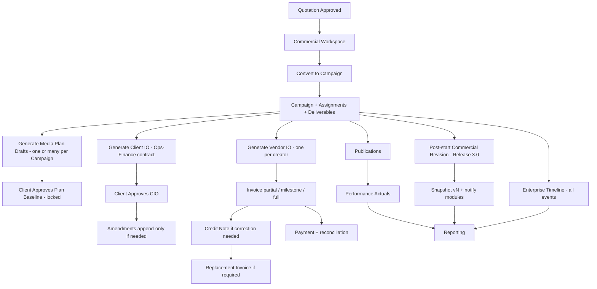
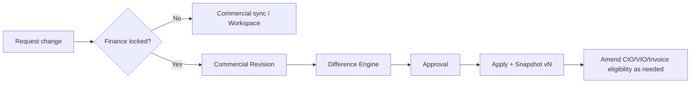

# Thinkway Platform — Enterprise Operations & Finance Architecture

**Document type:** Architecture & Solution Design (approval package)  
**Status:** **APPROVED & FROZEN** (Product 2026-07-30) — implementation may begin only for **Release 2.1** after this freeze  
**Date:** 2026-07-30 (decisions incorporated)  
**Scope:** Release 2.x completion + Release 3.0 ERP operating model  

### Architecture thesis (approved)

> **Thinkway does not need another ERP redesign. It needs to complete and harden the ERP it already has.**

Remaining work is: complete existing modules, strengthen relationships, improve workflow orchestration, and close gaps — **not** parallel systems or rebuilds.

### Non-negotiable constraints (this package)

| Constraint | Rule |
|---|---|
| Code | **Do not write code** except for an explicitly approved release slice (next: **2.1**) |
| Migrations | **Do not create** until that release slice is approved for implementation |
| Feature flags | Prefer existing gates; do not invent parallel flag systems without Product approval |
| Commercial SSOT | Preserve [`COMMERCIAL_SSOT_QUOTE_CAMPAIGN.md`](./COMMERCIAL_SSOT_QUOTE_CAMPAIGN.md) |
| Campaign architecture | Preserve Group → Legal Entity → Brand → Campaign Header → Campaign Line (Assignment) |
| Deliverables | Preserve Assignment → Deliverable → Post Schedule → Documentation Repository boundaries |
| Convert | Convert creates Campaign + Assignments + Deliverables (+ snapshot); **never** auto-creates CIO/VIO/Invoice/Media Plan |

### Design principles (approved)

1. **Reuse first** — harden existing Production modules; no second ledger.  
2. **Assignment ID is the universal join key** across Plan, Actual, IO, Invoice, Performance, Reporting.  
3. **Convert stays thin** — planning and finance documents are explicit human actions.  
4. **Commercial SSOT + finance lock** remain authoritative for Master amounts.  
5. **Append-only history** — amendments, credit notes, and revisions never overwrite.  
6. **Enterprise Timeline** — every Campaign exposes one chronological cross-module event spine driven by the audit/event system (see §8.4).

---

## 0. Executive summary

Thinkway already has most ERP-shaped modules in Production or feature-frozen code. The remaining work is **lifecycle completion, join-key hardening, and enterprise operating discipline** — not a greenfield rebuild.

### Already released / feature-complete (must reuse)

| Workstream | State | Canonical docs / owners |
|---|---|---|
| Commercial SSOT | Feature-complete (UAT/freeze) | `COMMERCIAL_SSOT_QUOTE_CAMPAIGN.md` |
| Commercial Workspace | Released & Active in Production | Quotation commercial workspace docs |
| Deliverables Documentation Repository | Phase 1 approved / UAT | `DELIVERABLES_DOCUMENTATION_REPOSITORY.md` |
| Productivity & Navigation UX | Production | Productivity UAT docs |
| Quote → Campaign Conversion (R2.0 P1) | Shipped; Prod convert flag may be OFF | `docs/release/2.0/*` |
| Media Plan v1 engine | Production (feature freeze except approved lifecycle work) | `MEDIA_PLANNING_V1_*`, `MEDIA_PLAN_VERSIONING.md` |
| Client IO / Vendor IO / Invoices / Payments | Production operational | `VENDOR_IO_INVOICE_LIFECYCLE.md`, IO services |
| Commercial Revision | Implemented (finance-locked path) | `commercial_revisions*` + revision service |
| Performance / Publications | Production | `campaign_publications`, metrics collector |

### Target enterprise workflow (unchanged Production prefix)

```text
Quotation
  → Commercial Workspace
  → Convert to Campaign          ← already shipped (flag-gated)
  → Campaign + Assignments + Deliverables + Post Schedule + Commercial Snapshot
  → Media Plan                   ← Phase 2 (harden + lifecycle; exists as v1)
  → Client IO                    ← Phase 3 (exists; design generation policy)
  → Vendor IO                    ← Phase 4 (exists; design grouping/policy)
  → Publication                  ← Phase 6/7 (exists; harden ownership)
  → Performance                  ← Phase 7 (exists; Planned vs Actual)
  → Commercial Revision          ← Phase 8 (exists; post-start operating model)
  → Reporting                    ← Phase 9 (cross-module enterprise views)
```

**Design principle:** Each later module **reads** commercial Master via SSOT / snapshot / Assignment IDs. No module becomes a second commercial ledger.

---

## 1. Enterprise architecture document

### 1.1 Operating model

Thinkway is an **Influencer Marketing Operations ERP** with four planes:

| Plane | Owner modules | Writes |
|---|---|---|
| **Commercial** | Quotation, Commercial Workspace, Commercial Snapshot, Commercial Revision | Master amounts, terms, CML identity |
| **Operations** | Campaign, Assignment, Deliverable, Post Schedule, Media Plan, Documentation | Scope, schedule, content workflow |
| **Finance execution** | Client IO, Vendor IO, Invoice, Payment, PO governance | Billing artifacts & cash |
| **Outcomes** | Publication, Performance, Reporting | Actuals, KPIs, drill-down |

### 1.2 Non-negotiable hierarchy (preserve)

```text
Group → Legal Entity (clients) → Brand → Campaign Header → Campaign Line (Assignment)
                                                      ├── campaign_influencers (vendor link)
                                                      ├── assignment_deliverables
                                                      │     └── assignment_post_schedule
                                                      └── (billing FKs: vendor_io_id, invoice_id, …)
```

- **Do not** introduce a parallel `assignments` table.
- Media Plan identity remains `campaign_objects.id` (no new `media_plans` table unless a later approval explicitly changes this).
- Commercial Line ID remains the sync join (`quotation_items.id` ↔ `campaign_lines.source_quotation_item_id`).

### 1.3 Convert boundary (locked)

Convert **automatically creates**: Campaign header, Assignments, Deliverables, post schedules (as mapped), commercial snapshot, shortlist link (create-if-missing), provenance pins, CRM activation (best-effort).

Convert **never creates**: Client IO, Vendor IO, Media Plan document, Invoice, Payment, Commercial Revision, PO document register rows (beyond seeding `po_amount` on lines).

---

## 2. Domain model

### 2.1 Core entities (existing + completion fields)

```text
Commercial
  quotations / quotation_items (CML)
  campaign_commercial_snapshots
  commercial_revisions / commercial_revision_lines
  commercial synchronization events / versions

Campaign ops
  campaign_headers
  campaign_lines (Assignment)
  campaign_influencers
  assignment_deliverables
  assignment_post_schedule
  deliverable_documentation_* (docs repo; not execution)

Planning
  campaign_objects + campaign_object_versions (Media Plan)
  meta.mediaPlanSchedule / mediaPlanLifecycle

Finance docs
  client_ios
  vendor_ios + vendor_io_lines
  invoices + invoice_line_items
  payments / vendor_payment_batches
  campaign_purchase_orders (governance register — not creative brief)

Outcomes
  campaign_publications (+ metrics / media)
```

### 2.2 Ownership matrix (normative)

| Concern | Owner | Must not own |
|---|---|---|
| Client agreement & pricing | Quotation / Commercial Revision | Media Plan, Performance |
| Operational PO unit | Assignment (`campaign_lines`) | Quotation after finance lock (direct edits) |
| Planned calendar | Media Plan Engine | Commercial amounts, live metrics |
| Content assets & comments | Deliverables Documentation Repo | Billing, metrics |
| Client commercial document | Client IO | Vendor payables |
| Vendor commercial document | Vendor IO | Client receivables |
| Client receivable / tax invoice | Invoice | Vendor payout |
| Actual live URL / metrics | Performance / Publications | Planned calendar writes |
| Cross-module KPIs | Reporting (read models) | Transactional writes |

### 2.3 Identity joins (must harden)

| From | To | Join key |
|---|---|---|
| Quotation item | Assignment | `source_quotation_item_id` (CML) |
| Assignment | Deliverable / Post | `campaign_line_id` |
| Media Plan slot | Assignment / Deliverable / Post | **Phase 2 required:** stable IDs on schedule items (not label match alone) |
| Publication | Post / Deliverable / Line | existing FKs — enforce on all create paths |
| VIO line | Assignment | `vendor_io_lines.campaign_line_id` |
| Invoice line | Line / Deliverable / Post | existing invoice line refs |
| Revision line | CML + affected Assignments | revision service identity rules |

---

## 3. ERD / database impact (design only — no migrations yet)

### 3.1 Prefer reuse over new tables

| Need | Recommendation |
|---|---|
| Media Plan multi-version / approval | Reuse `campaign_object_versions` + lifecycle meta; extend schedule item JSON with Assignment/Deliverable/Post IDs |
| Client IO milestones | **New optional** `client_io_billing_milestones` (or JSON on `client_ios` if low volume) — only if Product confirms milestone billing |
| Vendor grouping policy | Reuse `vendor_ios` + `vendor_io_lines` (already multi-line per influencer) |
| Credit notes | Extend invoice model with credit-note type / linkage — **new table or typed invoice** (decision required) |
| Planned KPI targets | Media Plan / Campaign objectives store (snapshot or plan meta) — not a second commercial book |
| Performance snapshots | Time-bucketed metrics snapshots table or versioned metrics JSON — design in Phase 7 |
| Reporting | Prefer SQL views / materialized read models over duplicating transactional tables |

### 3.2 Explicit non-goals for schema

- No parallel commercial ledger.
- No second Assignment entity.
- No Media Plan owning `po_amount`.
- No Documentation Repo owning publications/metrics.

---

## 4. Service architecture

### 4.1 Reuse first (existing services)

| Capability | Existing service / location |
|---|---|
| Convert | `lib/services/campaigns/convert-quotation-to-assignments.ts` |
| Assignment factory | `createCampaignLine` + deliverable sync |
| Commercial sync | `commercial-synchronization-service` |
| Finance lock | `lib/finance/campaign-finance-lock.ts` (**single gateway**) |
| Commercial revision | `commercial-revision-service` |
| Media Plan engine | `lib/media-plan/*` + campaign-outputs mutations |
| Client IO docs | `lib/io/client-io-document-service.ts` |
| Vendor IO docs | `lib/io/vendor-io-document-service.ts` + generate actions |
| Invoices | `lib/services/billing/invoice-service.ts` |
| Vendor payments | `lib/services/billing/vendor-payment-service.ts` |
| Publications | `campaign-publication-service` + metrics collector |
| Deliverable docs | `lib/services/deliverables/*` |

### 4.2 New/completion services (design intent only)

| Service | Role | Release |
|---|---|---|
| Media Plan Assignment Linker | Bind schedule slots ↔ Assignment/Deliverable/Post IDs; enforce non-live guards | 2.1 |
| Client IO Composer | Select Assignments → draft CIO; milestones; amendments | 2.2 |
| Billing Milestone Engine | Configurable CIO milestone schedules → invoice eligibility | 2.2 (schedule) / 2.3 (billing execution) |
| Credit Note Service | First-class credit documents linked to invoices | 2.3 |
| Enterprise Timeline Projector | Cross-module chronological event spine | 2.1 contract → 2.2/2.3 panel → 3.0 complete |
| Planned vs Actual Projector | ID-based reconciliation for Media Plan + Reporting | 2.1 / 3.0 |
| Enterprise Reporting Read Models | Cross-module drill-down views | 3.0 |
| Notification Orchestrator | Domain events → in-app / email | 2.2+ |

All new services **must** call finance-lock and Commercial SSOT gates before mutating Master commercial fields.

---

## 5. Phase designs

### PHASE 2 — Media Plan (completion)

**Reuse:** Media Plan v1 engine, versioning, portal approval, Original/Current/Actual rules in `MEDIA_PLAN_LIFECYCLE_OWNERSHIP.md`.

#### Relationships

| Relation | Rule |
|---|---|
| Campaign | **A Campaign may contain multiple Media Plans** (approved). Each Media Plan belongs to **exactly one** Campaign |
| Multi-plan examples | Platform-specific, country-specific, phase-specific, budget-revision plans, seasonal waves |
| Assignments | Slots **reference** Assignment IDs; plan never creates Assignments; every Assignment has one authoritative operational owner |
| Version history | Preserve business version ≠ audit history (`MEDIA_PLAN_VERSIONING.md`) per Media Plan identity |
| Client approval | Existing portal lifecycle; lock = promote to approved baseline for that plan |
| Lock after approval | Approved Media Plan immutable; corrections via draft → re-approve (or new plan identity when Product chooses a new wave/revision plan) |
| Planned deliverables | Calendar slots mapped to Assignment deliverable types via stable IDs |
| Budget / platform / creator allocation | **Display/allocation context** from Assignments + snapshot — not a write path for PO |
| Timeline | Sat–Fri publishing calendar within campaign window |
| Planned KPIs | Store targets on plan/campaign objectives; Actuals from Performance |

**Implementation note (2.1+):** Today v1 commonly uses one `campaign_objects` Media Plan identity per campaign. Supporting concurrent multi-plan identities (platform/country/phase) is an approved Product requirement — Release 2.1 must define the identity model (multiple `campaign_objects` under one header **or** first-class plan collection) without breaking existing single-plan campaigns. Prefer extending the existing object model over inventing a parallel `media_plans` ledger.

#### Auto vs manual generation

| Recommendation | Rationale |
|---|---|
| **Manual or explicit “Generate Media Plan” after Convert** (default) | Convert must stay finance/ops-light; Media Plan needs human scheduling intent |
| Optional later: “Generate draft from Assignments” action | Seeds slots from Assignment deliverables + campaign window; never auto on convert |
| Never auto-approve | Client approval remains explicit |

#### Phase 2 / Release 2.1 delivery outcomes (approved priority)

1. **Assignment ID as the primary join key** on schedule slots (+ deliverable/post IDs where known).  
2. Preserve Media Plan history (business versions + audit).  
3. Lock approved Media Plans (baseline immutability).  
4. Remove remaining temporary / label-only relationships (ID joins authoritative; labels fallback only).  
5. Ensure every Assignment has one authoritative operational owner.  
6. Hard guards: Current draft cannot edit published/live/billing-locked Assignments.  
7. Multi-plan campaign model design aligned with §5 Phase 2 (multiple plans per campaign).  
8. Budget mismatch banner if plan allocation ≠ Assignment rollup / snapshot.

---

### PHASE 3 — Client IO

**Reuse:** `client_ios`, document generation, approval tokens, portal actions.

**Product role (approved):** Client IO is the **commercial contract between Operations and Finance** — not a disposable PDF. It carries versioning, amendments, approval, billing milestones, commercial audit, and lifecycle tracking.

#### Generation policy

- **Not** created by Convert.
- Generated **on demand** by Finance / Account Manager from Campaign + selected Assignments.
- Precondition recommendations: Campaign exists; Assignments selected; commercial snapshot present; brand/legal entity complete.

#### Contents

| Field group | Source |
|---|---|
| Client / Brand / Campaign | Masters + header |
| Assignment references | Selected `campaign_lines` |
| Commercial values | Assignment rollups / SSOT Master (not a private CIO ledger) |
| Currency / VAT | Campaign + client VAT rules |
| Payment terms | Quotation terms / campaign terms snapshot |
| Billing milestones | **Required in Release 2.2** — configurable schedules (see Decisions) |
| Approval / status | Full lifecycle tracking |
| Version history / audit | Append-only commercial audit on every change |

#### Status lifecycle (proposed product language; map to existing statuses)

```text
Draft → Generated → Sent → Under Client Review → Approved → (Amended via new amendment docs) → Cancelled
```

#### Amendments (approved — never overwrite)

```text
Client IO (v1 / root)
  → Amendment 1
  → Amendment 2
  → Amendment 3
```

- Do **not** overwrite prior CIO content.  
- Each amendment is a first-class document with complete audit history.  
- Pattern analogous to VIO supersession / revision chain.

#### Configurable billing milestones (approved for 2.2)

Support without hard-coding a single commercial pattern:

| Pattern | Example |
|---|---|
| 100% upfront | One milestone at issue/approval |
| 50/50 | Kickoff + completion |
| Monthly | Calendar milestones |
| Campaign completion | Single end milestone |
| Custom | User-defined milestone schedule |

Milestones drive invoice eligibility in Release 2.3 billing — CIO owns the schedule; Invoice executes against it.

#### SSOT integration

- CIO displays commercial Master; finance lock applies when CIO exists (already in lock gateway).
- Post-lock commercial changes require Commercial Revision (Release 3.0 operating model), then CIO amendment if amounts change.

---

### PHASE 4 — Vendor IO

**Reuse:** `vendor_ios`, `vendor_io_lines`, generate-by-influencer, revision `/n`, invoice prerequisite.

#### One vs grouped (approved)

| Model | Decision |
|---|---|
| **One Vendor IO per creator** | **Approved default** — covering one or many Assignments for that creator |
| Grouped multi-creator VIO | **Not approved** as the enterprise default |
| Packages | Packages are **commercial constructs**; vendor obligations belong to **individual creators** |

#### Contents

| Field group | Source |
|---|---|
| Vendor / Creator | `campaign_influencers` + influencer master |
| Assignment refs | `vendor_io_lines` → `campaign_lines` |
| Deliverables | Assignment deliverables (read) |
| Commercial values | Assignment cost / VAT — **no duplicate commercial book** |
| Payment terms | VIO terms |
| Status / approval / amendments / audit | Existing VIO lifecycle + revision rules |

#### Policy

- Manual generate from selected Assignments (strict order before invoice).
- Never auto on Convert.
- Package Assignments with multiple creators → **emit one VIO per creator** (creator-level economic share derived from Assignment/member linkage; never a single multi-creator VIO as the standard path).

---

### PHASE 5 — Billing

**Reuse:** invoices, invoice line items, payments, vendor payment batches, ungenerate/regenerate, VIO prerequisite.

#### Client billing (Release 2.3 completes finance workflow)

| Capability | Design |
|---|---|
| Multiple invoices | Already: new invoice when locked; append when unlocked |
| Partial invoices / partial billing | Deliverable/post grain + milestone eligibility |
| Milestone billing | Driven by **configurable CIO milestones** (2.2) — not hard-coded patterns |
| Final billing | Invoice covering remaining unbilled Assignment revenue |
| Credit notes | **First-class finance documents (approved)** — never modify an invoice in place |
| Taxes | Existing VAT engines — preserve |
| Payment tracking / reconciliation | `payments` linked to invoices + reconciliation views |

#### Credit note chain (approved)

```text
Invoice
  → Credit Note          (first-class document; append-only)
  → Replacement Invoice  (if required)
```

Never edit a posted invoice’s commercial truth directly.

#### Vendor billing

| Capability | Design |
|---|---|
| Creator billing | One VIO per creator → payout / payment tracking |
| Partial payments | Vendor payment batches against VIO/Assignment cost |
| Payment reconciliation | Batches + status + finance dashboards |

#### Strict order (preserve)

```text
Assignment (draft)
  → Vendor IO (io_generated)
  → Invoice (partial/full / milestone-eligible)
  → Payment
```

Client IO is the **Ops↔Finance commercial contract**; Invoice is the **AR tax/billing instrument**. Do not collapse them.

---

### PHASE 6 — Campaign execution lifecycle

Map **product language** onto existing fields; avoid a big-bang enum rewrite in one release.

#### Assignment status (product)

```text
Draft → Confirmed → Scheduled → Published → Verified → Completed
```

| Product status | Existing / proposed owner field | Owner |
|---|---|---|
| Draft | `assignment_status` / line draft | Ops |
| Confirmed | confirmed vendor link / assignment confirmed | Ops + Vendor |
| Scheduled | posts have dates / Media Plan scheduled | Ops + Media Plan |
| Published | Phase 1 lock trigger ≈ `posted` + publication | Ops / Performance |
| Verified | publication verified / metrics OK | Ops / Performance |
| Completed | all posts verified + billing closed (policy) | Ops + Finance |

**Billing status remains separate** (`draft` / `io_generated` / `partially_invoiced` / `invoiced` / `reopened`). Never overload content status with billing status.

#### Deliverable status (product)

```text
Draft → Uploaded → Submitted → Approved → Completed
```

Owner: Operations / Creative workflow + Documentation Repo for assets.  
Billing lock still uses deliverable/post billing fields — not documentation status.

#### Publication status (product)

```text
Scheduled → Published → Verified → Completed
```

Owner: Performance module (`campaign_publications`).

---

### PHASE 7 — Performance

**Reuse:** `campaign_publications`, metrics collector, Media Plan Actual projection.

#### KPI layers

| Layer | Grain |
|---|---|
| Campaign | Rollup of publications |
| Creator | Filter by influencer |
| Deliverable | Deliverable FK |
| Post | Post schedule / publication |

#### Metrics catalog (minimum)

Reach, Impressions, Views, Clicks, CTR, CPM, CPV, CPA, Conversions, Engagement, Engagement Rate, Audience Growth, Video Completion, plus platform-specific extensions in raw/derived JSON.

#### Planned vs Actual

| Side | Source |
|---|---|
| Planned | Media Plan / Campaign KPI targets |
| Actual | Publications metrics (ID-joined) |
| Variance | Reporting projector |

#### Refresh strategy

| Mode | Use |
|---|---|
| On-demand collect | Manual / queue button |
| Scheduled worker | Apify/provider jobs with rate limits |
| Import | Spreadsheet fallback |
| Snapshot | Periodic frozen metrics for historical reporting |

Automatic enrichment remains subject to operational safety flags already in Production.

---

### PHASE 8 — Commercial Revision (post-Campaign) — **Release 3.0**

**Reuse:** `commercial_revisions`, revision lines, finance lock, synchronization service, snapshots.

Commercial Revision **already exists** for finance-locked campaigns. **Product decision (2026-07-30):** keep broader **post-start campaign revision operating model disabled until Release 3.0**. Current revision capability remains sufficient until the operational lifecycle (2.1–2.3) is complete.

This phase designs the **operating model after Campaign start**, not a new ledger.

#### Change classes

| Class | Examples | Apply behavior |
|---|---|---|
| Creator replace/remove/add | Swap influencer; drop/add Assignment | Preserve CML identity; operational restructure with provenance |
| Deliverable change | Qty/type/platform | Update Assignment children; skip locked/invoiced grains |
| Price / currency | Rate, AF, FX | Master sync + snapshot vN |
| Timeline / budget | Dates, PO governance | Ops + PO register; commercial fields via revision if Master |

#### Workflow (normative)

```text
Detect drift / request change
  → Difference Engine (preview deltas)
  → Approval (role-gated)
  → Apply (append-only)
  → Commercial Snapshot vN
  → Notify: Media Plan, CIO, VIO, Invoices (eligibility), Reporting
```

#### Rules

- Never overwrite history.
- Never break CML identity.
- Skip locked/invoiced lines unless finance override policy exists.
- Pre-finance-lock: prefer Commercial Workspace / sync confirmation path (already SSOT).
- Post-finance-lock: **only** Commercial Revision.

---

### PHASE 9 — Reporting

#### Drill-down spine

```text
Campaign
  → Assignment
  → Deliverable / Post
  → Client IO
  → Vendor IO
  → Invoice / Payment
  → Performance
  → Commercial Revision / Snapshot
```

#### Dashboards

| Dashboard | Primary audience | Questions |
|---|---|---|
| Commercial | Sales / Commercial | Pipeline, GP, AF, revisions |
| Operations | Campaign / AM | Schedule adherence, publish readiness |
| Finance | Finance | IO, AR/AP, VAT, PO consumption |
| Campaign | CM | One campaign command center |
| Creator | Ops / Talent | Delivery + payout readiness |
| Client | AM / Client portal | Plan, delivery, performance |
| Executive | Leadership | Portfolio revenue, margin, risk |

#### Architecture

- **Read models / SQL views** on Assignment IDs + snapshot pins.
- No transactional writes from dashboards.
- Export uses existing document/PDF pipelines where applicable.

---

## 6. Cross-module relationships — gaps & duplication risks

| Relationship | Status | Gap / risk |
|---|---|---|
| Campaign ↔ Assignment | Strong | — |
| Assignment ↔ Deliverable ↔ Post | Strong | — |
| Media Plan ↔ Assignment | Weak (label match) | **Must harden IDs** |
| Media Plan ↔ Performance | Partial | ID-based Actual |
| Client IO ↔ Assignments | Soft / header-centric | Explicit selected-line composition + amendment chain |
| Vendor IO ↔ Assignments | Strong | One VIO per creator (packages do not become multi-creator VIOs) |
| Campaign ↔ Enterprise Timeline | Missing as unified UX | Cross-module event spine (§8.4) |
| Snapshot ↔ Reporting | Partial | Formal audit views |
| Documentation ↔ Publication | Optional link | Keep docs ≠ metrics |
| Commercial Revision ↔ IO/Invoice | Lock detects artifacts | Amendment fan-out notifications |

**Duplication to forbid:** second PO book on Media Plan; second pricing book on CIO/VIO; metrics stored in Documentation Repo; Actual calendar editable UI.

---

## 7. Permissions matrix (design)

| Module | Sales | Commercial | Operations / CM | Account Manager | Finance | Client (portal) | Admin |
|---|---|---|---|---|---|---|---|
| Quotation / Workspace | R/W | R/W | R | R/W | R | R (portal) | Full |
| Convert | — | Approve gate | Execute* | Execute* | — | — | Full |
| Campaign / Assignments | R | R | R/W | R/W | R | R (limited) | Full |
| Media Plan | R | R | R/W draft | R/W draft | R | Approve Original | Full |
| Deliverable Docs | R | R | R/W | R/W | R | R (shared) | Full |
| Client IO | R | R | R | R/W | R/W | Approve | Full |
| Vendor IO | R | R | R | R | R/W | — | Full |
| Invoices / Payments | R | R | R | R | R/W | Pay portal (if any) | Full |
| Performance | R | R | R/W collect | R | R | R (report) | Full |
| Commercial Revision | R | R/W + approve | R | Request | Approve/apply | — | Full |
| Reporting | R | R | R | R | R | Limited | Full |

\*Convert also requires `RELEASE_2_0_ASSIGNMENT_CONVERT` (existing) and approved quotation preconditions.

Map to existing RBAC roles (Admin / Director / Manager / Account Manager / Finance / Data Entry) in implementation planning — do not invent a parallel ACL system.

---

## 8. Audit strategy

### 8.1 Principle

Every commercially or financially material change is append-only and attributable.

### 8.2 Minimum audit record

| Field | Meaning |
|---|---|
| Who | User id / role |
| When | Timestamp |
| Before / After | Structured JSON patch or version pointers |
| Reason | Required on revisions / amendments |
| Approval | Approver + decision |
| Linked Revision | `commercial_revision_id` / IO revision / invoice ungenerate id |
| Correlation | Campaign id, Assignment ids, CML ids |

### 8.3 Existing sinks to reuse

- Quotation lifecycle events  
- Commercial revision tables  
- Media Plan audit / object versions  
- VIO supersession rows  
- Invoice regeneration status  
- Deliverable documentation events  

**Gap:** unify a cross-module audit query API for Reporting/Executive — Release 3.0 (with Timeline below starting earlier as read projection).

### 8.4 Enterprise Timeline (approved design principle)

Every Campaign exposes a **single chronological timeline** of major events across modules — so Operations, Finance, Account Management, and Executives see progress without hopping modules.

#### Rules

| Rule | Detail |
|---|---|
| One spine per Campaign | Not one history UI per module |
| Event-sourced | Driven by the **existing audit / lifecycle event system**, not a parallel history store per feature |
| Append-only | Timeline entries are projections of immutable events |
| Cross-module | Commercial, Ops, Finance, Performance events coexist on one axis |
| Deep link | Each event links to its source record (CIO, VIO, Invoice, Plan version, Publication, Revision, …) |

#### Minimum event catalog

| Event example | Typical source |
|---|---|
| Campaign created | Convert / header create |
| Media Plan approved | Media Plan lifecycle |
| Client IO issued | CIO generate/send |
| Client IO amendment issued | CIO amendment chain |
| Vendor IO approved | VIO lifecycle |
| Deliverable submitted / approved | Ops / docs workflow |
| Publication verified | Performance |
| Invoice issued | Billing |
| Credit note issued | Billing |
| Payment received | Payments |
| Commercial Revision approved | Revision service (R3) |

#### Delivery

| Release | Timeline work |
|---|---|
| **2.1** | Define event contract + emit/normalize key Media Plan + Campaign events |
| **2.2–2.3** | Add CIO / VIO / Invoice / Payment events; Campaign Timeline panel v1 |
| **3.0** | Full catalog + Reporting/Executive consumption |

---

## 9. Notification strategy

| Event | Primary audience | Channel (initial) |
|---|---|---|
| Campaign Created (convert) | CM / AM | In-app |
| Media Plan ready for approval | Client / AM | In-app + email |
| Assignment Published | CM / AM | In-app |
| Deliverable Submitted / Approved | CM / Creator portal | In-app |
| Client IO Approved | Finance / AM | In-app + email |
| Vendor IO Approved | Finance | In-app |
| Invoice Due / Overdue | Finance / Client | Email |
| Performance Ready / Collect failed | Ops | In-app |
| Commercial Revision Required / Applied | Commercial / Finance / CM | In-app + email |
| Campaign out of sync with Quotation Vn | Commercial / CM | In-app |

Phase delivery: start with in-app event log; email digests in 2.2+; no mandatory chat/SMS in 2.x.

---

## 10. UI/UX proposal (high level)

| Surface | Purpose |
|---|---|
| Campaign workspace | Command center: Assignments, plan(s), IO, billing chips, performance |
| **Enterprise Timeline** | Single chronological campaign event spine (§8.4) |
| Media Plan Studio + Campaign Plan tabs | Multi-plan list + Original / Current / Actual / Remaining per plan |
| Finance rail | CIO (contract) / amendments / VIO / Invoices / Credit Notes / Payments / PO |
| Commercial Revision workspace | Diff → approve → apply (**Release 3.0** operating model) |
| Reporting hub | Role-based dashboards + drill-down |
| Client portal | Plan approval, CIO approval, limited performance |

Preserve operational workspace patterns (not CRUD grids) already used on `/campaigns/[id]`, `/groups/[id]`.

---

## 11. Workflow diagrams

### 11.1 Happy path (enterprise)



### 11.2 Finance-locked change



---

## 12. Release roadmap (approved sequence)

> Architecture is **frozen**. **Release 2.1 is Production Complete** (2026-07-31, tag `v2.1.0`). Next implementation slice is **Release 2.2** (Client IO). **Release 2.2a** (Planning Board) and **2.2b** (Media Plan Copilot) are approved as separate slices — see [`RELEASE_2_2A_PLANNING_BOARD_ARCHITECTURE.md`](./RELEASE_2_2A_PLANNING_BOARD_ARCHITECTURE.md). Production convert enablement remains approved **after final Prod smoke** when that work ships.

### Release 2.1 — Media Plan ↔ Assignment hardening — **COMPLETE (Production)**

| | |
|---|---|
| **Status** | ✅ Production Complete · `v2.1.0` · tip `35086130` · deploy `dpl_7STrhfLRw3utjkVmRwr6Kj817m1e` |
| **Scope** | Assignment ID as primary join key; preserve history; lock approved plans; remove temporary/label joins; authoritative Assignment ownership; non-live edit guards; multi-plan-per-campaign identity design; Enterprise Timeline event contract for Campaign/Plan events |
| **Package** | [`RELEASE_2_1_PRODUCTION_PACKAGE.md`](./RELEASE_2_1_PRODUCTION_PACKAGE.md) · UAT [`RELEASE_2_1_UAT.md`](./RELEASE_2_1_UAT.md) |
| **Migrations** | None (JSON / audit_logs metadata only) |

### Release 2.2 — Client IO completion (Ops↔Finance contract) — **IMPLEMENTATION NEXT**

| | |
|---|---|
| **Status** | Implementation package ready — [`RELEASE_2_2_IMPLEMENTATION.md`](./RELEASE_2_2_IMPLEMENTATION.md) · UAT [`RELEASE_2_2_UAT.md`](./RELEASE_2_2_UAT.md) |
| **Scope** | CIO as commercial contract; assignment-selected composer; **append-only amendments**; approval; **configurable billing milestones**; commercial audit; lifecycle tracking; Timeline panel v1 (CIO events); notifications |
| **Dependencies** | 2.1 (stable Assignment refs) |
| **Risks** | Duplicate commercial display vs SSOT; amendment UX complexity |
| **Migrations** | Amendment chain + milestone schedule model — Dev-first after coding kickoff |
| **Testing** | Document parity; amendment history; finance-lock; milestone configs |
| **UAT** | Finance + AM |
| **Prod rollout** | Explicit approval |
| **Scope rule** | **No expansion** — Planning Board / Copilot are **not** part of 2.2 |

### Release 2.2a — Media Plan Planning Board — **APPROVED (architecture) · QUEUED**

| | |
|---|---|
| **Status** | Architecture approved 2026-07-31 · **implementation starts only after R2.2 Feature Freeze** |
| **Scope** | Commercial Workspace–style Planning Board; DnD + multi-select + deliverable-level move + bulk Move; same Assignment mutation engine as Calendar; Timeline audit; 300–1,000 creator performance |
| **Package** | [`RELEASE_2_2A_PLANNING_BOARD_ARCHITECTURE.md`](./RELEASE_2_2A_PLANNING_BOARD_ARCHITECTURE.md) |
| **Dependencies** | 2.1 Assignment IDs + grain guards |
| **Non-goals** | New tables; sync layer; Copilot (→ 2.2b); CIO scope |
| **Prod rollout** | Explicit approval after own UAT |

### Release 2.2b — AI Copilot for Media Plan Scheduling — **APPROVED (architecture)**

| | |
|---|---|
| **Status** | Architecture approved 2026-07-31 · after 2.2a stable |
| **Scope** | NL → intent → resolve → validate → **same scheduling service** → Timeline → UI refresh; **AI Review Mode** before confirm; never direct UI mutation |
| **Package** | See §8 in [`RELEASE_2_2A_PLANNING_BOARD_ARCHITECTURE.md`](./RELEASE_2_2A_PLANNING_BOARD_ARCHITECTURE.md) |
| **Dependencies** | 2.2a Planning Board + shared mutation path |
| **Prod rollout** | Explicit approval after own UAT |

### Release 2.3 — Vendor IO + Billing completion

| | |
|---|---|
| **Scope** | VIO lifecycle completion; **one VIO per creator**; creator billing; partial billing; milestone-driven invoicing; **first-class credit notes** (Invoice → Credit Note → Replacement Invoice); payment reconciliation; Timeline finance events |
| **Dependencies** | 2.2 CIO milestones + existing VIO/Invoice stack |
| **Risks** | Double-billing; credit-note accounting edge cases |
| **Migrations** | Credit note documents; billing eligibility against milestones |
| **Testing** | VIO→INV→Credit→PAY soak; ungenerate/regenerate; per-creator VIO from packages |
| **UAT** | Finance |
| **Prod rollout** | Explicit approval |

### Release 3.0 — Execution, Performance, Post-start Revision OS, Reporting

| | |
|---|---|
| **Scope** | Planned vs Actual; Performance snapshots; **post-start Commercial Revision operating model** (Difference Engine UX); enterprise reporting hub; full Enterprise Timeline catalog; cross-module audit query; notification orchestrator |
| **Dependencies** | 2.1–2.3 stable |
| **Risks** | Scope creep; reporting performance |
| **Migrations** | Read models / metrics snapshots as approved |
| **Testing** | Full lifecycle E2E QT→…→Report |
| **UAT** | Cross-functional enterprise UAT |
| **Prod rollout** | Phased dashboards; no big-bang cutover |

### Production enablement decisions (approved)

| Capability | Decision |
|---|---|
| `RELEASE_2_0_ASSIGNMENT_CONVERT` | **Enable after final Production smoke test** |
| Post-start Commercial Revision OS | **Keep deferred until Release 3.0** (current revision capability sufficient until then) |

---

## 13. Migration strategy (policy only)

1. Development Supabase first (`hsxrewjcbvmbkqdlzjhs`).  
2. No Production schema change without explicit approval.  
3. Prefer expandable JSON/meta on Media Plan before new tables.  
4. Backfills must be idempotent and assignment-ID based.  
5. Never rewrite historical snapshots, VIOs, or invoices in place — supersede / version.

---

## 14. Risks

| Risk | Mitigation |
|---|---|
| Rebuilding modules that already exist | This package mandates reuse |
| Commercial divergence | Finance lock + revision only |
| Media Plan becomes second PO book | Display-only budget rules |
| Convert scope creep | Locked convert boundary |
| Enum big-bang | Map product statuses onto existing fields first |
| Reporting load | Read models, not live heavy joins in UI |
| Package → multi-creator VIO | Mitigated — one VIO per creator (approved) |
| Multi-plan Media Plan identity | Mitigated by explicit 2.1 design spike before schema |

---

## 15. Product decisions (resolved 2026-07-30)

| # | Topic | Decision |
|---|---|---|
| 1 | Multiple Media Plans | **Yes** — a Campaign may contain multiple Media Plans (platform/country/phase/budget-revision/seasonal). Each plan belongs to exactly one Campaign |
| 2 | Client IO amendments | **Never overwrite** — Client IO → Amendment 1 → Amendment 2 → … with full audit history |
| 3 | Milestone billing | **Configurable** — 100% upfront, 50/50, monthly, campaign completion, custom. No hard-coded single pattern |
| 4 | Credit notes | **First-class** finance documents: Invoice → Credit Note → Replacement Invoice (if required). Never modify invoice directly |
| 5 | Package → Vendor IO | **One Vendor IO per creator**. Packages are commercial constructs; vendor obligations are per creator |
| 6a | Assignment Convert (Prod) | **Enable after final Production smoke test** |
| 6b | Post-start Commercial Revision OS | **Deferred to Release 3.0**; current revision capability sufficient until then |
| 7 | Enterprise Timeline | **Approved principle** — single chronological campaign event spine from audit/events (§8.4) |

### Remaining non-blocking questions (may resolve during release kickoffs)

| Topic | Notes |
|---|---|
| Assignment “Completed” definition | Content-complete vs finance-closed — decide in 3.0 execution mapping |
| Client portal depth | Performance/CIO visibility depth — decide with 2.2 / 3.0 UX |
| ERP/GL export | Remains out of scope for 2.x/3.0 unless Product reopens |

---

## 16. Recommendations (post-approval)

1. **Freeze this architecture package** (done — status APPROVED & FROZEN).  
2. **Implement Release 2.1 next** (Media Plan ↔ Assignment hardening + Timeline event contract).  
3. Continue **2.2 → 2.3 → 3.0** in sequence.  
4. Keep Convert thin; enable Prod convert only after smoke.  
5. Keep post-start Commercial Revision OS in **3.0**.  
6. Do not open parallel redesign tracks.

---

## 17. Related source-of-truth documents

| Topic | Path |
|---|---|
| Product reference | `docs/THINKWAY_SYSTEM_REFERENCE.md` |
| Architecture gaps | `docs/ARCHITECTURE_ALIGNMENT.md` |
| Release 2.0 | `docs/release/2.0/*` |
| Commercial SSOT | `docs/architecture/COMMERCIAL_SSOT_QUOTE_CAMPAIGN.md` |
| Media Plan v1 / versioning | `docs/architecture/MEDIA_PLANNING_V1_PRODUCTION_READINESS.md`, `MEDIA_PLAN_VERSIONING.md` |
| Media Plan ownership | `docs/release/2.0/MEDIA_PLAN_LIFECYCLE_OWNERSHIP.md` |
| VIO / Invoice | `docs/VENDOR_IO_INVOICE_LIFECYCLE.md` |
| Deliverables docs | `docs/architecture/DELIVERABLES_DOCUMENTATION_REPOSITORY.md` |
| Release workflow | `docs/RELEASE_WORKFLOW.md` |

---

## 18. Approval record & freeze

| Role | Decision | Date |
|---|---|---|
| Product | **Approved** architecture direction, release order, and §15 decisions | 2026-07-30 |
| Engineering | Bound by this freeze; next impl slice = **Release 2.1** | — |
| Finance | Policies for CIO amendments, milestones, credit notes incorporated | 2026-07-30 |
| Operations | Media Plan multi-plan + Assignment-ID backbone approved | 2026-07-30 |

### Freeze rules

1. This document is the **canonical completion architecture** for Ops & Finance ERP work.  
2. **Implementation may begin for Release 2.1 only** (Media Plan ↔ Assignment Hardening), respecting Dev-first / approval-gated Production policy.  
3. Releases 2.2, 2.3, and 3.0 require an explicit kickoff against this frozen doc (no silent scope expansion).  
4. Material scope changes require a dated amendment to this document — not silent code divergence.
