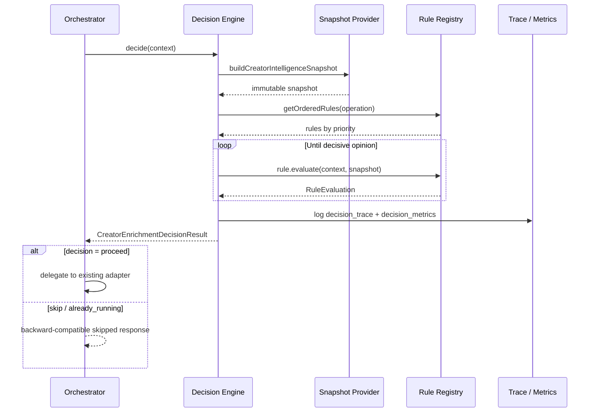
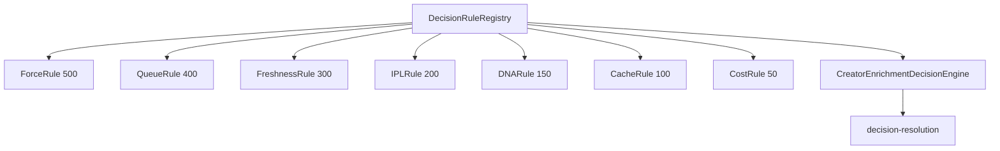

# Creator Enrichment Decision Platform

> **Status:** Feature complete (Phase 2.4)  
> **Scope:** Pre-enrichment decisions only — no queue, worker, IPL, or DNA implementation changes. Phase 3 adds advisory execution planning; Phase 4 adds policy governance — see [Governance Platform](./creator-enrichment-governance-platform.md).

---

## Decision lifecycle



---

## Snapshot lifecycle

1. **Request context** — orchestrator normalizes `creatorId`, `force`, `operation`, `supabase`.
2. **Provider gather** — `PlatformCreatorIntelligenceSnapshotProvider` calls `snapshot-sources` (sole I/O gateway).
3. **Freeze** — `buildCreatorIntelligenceSnapshot` merges context identifiers + provider data.
4. **Version metadata** — every snapshot includes `snapshotVersion`, `providerVersion`, `schemaVersion`.
5. **Rules read only** — rules must never query DB, Redis, or BullMQ directly.

---

## Rule lifecycle

1. **Register** — rules self-describe via `DecisionRule` contract (`id`, `priority`, `description`, `supportedOperations`).
2. **Order** — `DecisionRuleRegistry` sorts by priority (descending).
3. **Filter** — rules unsupported for the current `operation` are skipped.
4. **Evaluate** — engine calls `evaluate(context, snapshot)` in order until a decisive opinion.
5. **Win** — first `proceed`, `skip`, or `already_running` opinion becomes the engine outcome.

### Rule priority matrix

| Priority | Rule | Status | Decisive outcomes |
|---------:|------|--------|-------------------|
| 500 | ForceRule | Active | `proceed` (force_refresh) |
| 400 | QueueRule | Active | `already_running` |
| 300 | FreshnessRule | Active | `skip`, `proceed` |
| 200 | IPLRule | Placeholder | — |
| 150 | DNARule | Placeholder | — |
| 100 | CacheRule | Placeholder | — |
| 50 | CostRule | Placeholder | — |

### Decision outcome coverage

| Outcome | Active rules | Orchestrator behavior |
|---------|--------------|----------------------|
| `proceed` | ForceRule, FreshnessRule | Delegate unchanged |
| `skip` | FreshnessRule | `skipped: true`, no enqueue/execute |
| `already_running` | QueueRule | `skipped: true`, syncStatus collecting |

---

## Rule Registry architecture



The engine **never** instantiates rules directly. Tests and production both use `getDefaultRuleRegistry()` or a custom registry.

---

## Explainability flow

Every decision emits:

1. `decision_started` — request metadata
2. `freshness_rule` — (legacy channel; Force/Freshness logging consolidated in trace)
3. `decision_trace` — full trace (see example below)
4. `decision_metrics` — rolling counters
5. `decision_complete` — summary + snapshot completeness

### Decision trace example

```json
{
  "decisionId": "a1b2c3d4-...",
  "traceId": "e5f6g7h8-...",
  "decision": "proceed",
  "winningRule": "FreshnessRule",
  "reason": "creator_stale",
  "snapshotVersion": "2.4",
  "snapshotCompleteness": 82,
  "decisionTimeMs": 12,
  "snapshotBuildTimeMs": 9,
  "rules": [
    {
      "rule": "ForceRule",
      "priority": 500,
      "opinion": "no_opinion",
      "executionTimeMs": 0
    },
    {
      "rule": "QueueRule",
      "priority": 400,
      "opinion": "no_opinion",
      "executionTimeMs": 0
    },
    {
      "rule": "FreshnessRule",
      "priority": 300,
      "opinion": "proceed",
      "reason": "creator_stale",
      "executionTimeMs": 1
    }
  ]
}
```

### Decision metrics example

```json
{
  "totalDecisions": 42,
  "proceedCount": 28,
  "skipCount": 10,
  "alreadyRunningCount": 4,
  "forceRefreshCount": 8,
  "averageDecisionTimeMs": 11,
  "averageSnapshotBuildTimeMs": 8
}
```

---

## Configurable policies

`getDecisionPolicy()` in `decision-policy.ts`:

| Setting | Default | Used by |
|---------|---------|---------|
| `freshnessWindowDays` | 30 | Snapshot `metricsFreshness` |
| `queueInflightTimeoutMs` | 600_000 | Policy reference (queue timeout) |
| `rulePriorities` | see matrix | Registry ordering |

No magic numbers inside rules.

---

## Extension guide — adding a new rule

1. Create `lib/creator-enrichment/decision/rules/my-rule.ts` implementing `DecisionRule`.
2. Read **only** from `CreatorIntelligenceSnapshot` — zero infrastructure I/O.
3. Return `no_opinion` until the rule is ready for production.
4. Register in `createDefaultRuleRegistry()` with an appropriate priority.
5. Add unit tests in `rules/my-rule.test.ts`.
6. **Do not modify** `CreatorEnrichmentDecisionEngine`.

Phase 3 rules (IPL reuse, DNA reuse, Cache, Cost) plug in at priorities 200–50 without engine changes.

---

## Related documents

- [Creator Enrichment Orchestrator](./creator-enrichment-orchestrator.md) — routing layer above the decision platform.
