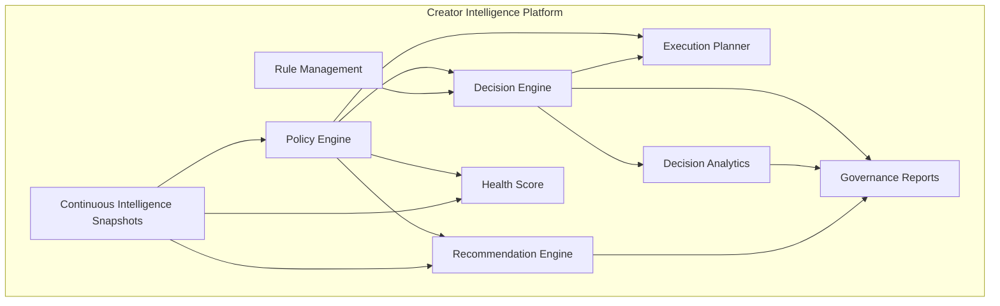

# Creator Enrichment Governance Platform

> **Status:** Feature complete (Phase 4)  
> **Scope:** Policy engine, rule management, decision analytics, autonomous recommendations, intelligence health scoring, and operational governance. No automatic execution — recommendations only.

---

## Platform vision



The platform shifts from reactive request handling to **continuous intelligence evaluation** with policy-governed decisions and proactive recommendations.

---

## Policy lifecycle

1. **Configure** — `GovernancePolicyConfig` in `governance/policy/` (global, platform, tier, campaign, feature overrides).
2. **Resolve** — `resolveEnrichmentPolicyForRequest(context, snapshot)` merges applicable slices (zero I/O).
3. **Consume** — Decision rules, execution planner, health score, and recommendations read resolved policy — never hardcoded thresholds.
4. **Validate** — `validateGovernancePolicy()` checks weight sums, threshold bounds.
5. **Version** — every resolution includes `policyVersion` and `appliedPolicyIds`.

### Policy override matrix

| Layer | Example |
|-------|---------|
| Global | 30-day freshness, DNA threshold 70 |
| Platform | TikTok 21-day freshness |
| Tier | VIP 14-day freshness, DNA threshold 85 |
| Campaign | Per-campaign overrides via `campaignPolicies` |
| Feature | Campaign Studio 14-day freshness |

### Policy evaluation example

**Before** (global 30-day window, creator enriched 25 days ago):

```
FreshnessRule → skip (creator_already_fresh)
```

**After** (`setGovernancePolicyForTests({ platformPolicies: { tiktok: { freshnessWindowDays: 21 } } })`, same creator on TikTok):

```
Applied policies: global, platform:tiktok
FreshnessRule → proceed (creator_stale)
```

---

## Rule management lifecycle

Rules are operational assets managed in `governance/rules/rule-management.ts`:

| Capability | API |
|------------|-----|
| Metadata + version | `getRuleMetadata(ruleId)` |
| Enable / disable | `setRuleEnabled(ruleId, false)` |
| Priority override | `setRulePriorityOverride(ruleId, 350)` |
| Feature flags | `setFeatureFlag("rules.ipl_rule", true)` |
| Health tracking | `recordRuleEvaluationHealth(evaluations)` |
| Dependency validation | `validateRuleDependencies()` |

**No Decision Engine code changes** are required to enable/disable rules — `DecisionRuleRegistry.getOrderedRules()` filters inactive rules automatically.

### Rule health

Each rule tracks evaluations, decisive rate, average execution time, and status (`healthy` | `idle` | `degraded`).

---

## Recommendation lifecycle

1. **Snapshot** — intelligence gathered via existing snapshot provider.
2. **Policy resolve** — freshness and completeness thresholds applied.
3. **Health score** — 0–100 composite score calculated.
4. **Recommend** — `generateRefreshRecommendations({ snapshot })` produces prioritized actions.
5. **Log** — included in `governance_trace` (no execution).

Recommendations only. No automatic refresh execution in Phase 4.

### Example recommendation report

```
Creator: creator-42
Health Score: 62 (fair)

Recommendations:
  1. Refresh Metrics (priority 90)
     - Metrics stale for 45 days
  2. Refresh DNA (priority 75)
     - DNA completeness 58% (threshold 70%)

Optimization opportunities:
  - reuse_existing_ipl (when applicable)
```

---

## Intelligence health score

**Location:** `governance/intelligence/health-score.ts`

| Component | Weight (default) | Input |
|-----------|------------------|-------|
| Metrics freshness | 25% | `metricsFreshness`, `lastSuccessfulEnrichment` |
| DNA completeness | 25% | `dnaCompleteness`, `dnaStatus` |
| Audience | 15% | `audienceKnown` |
| IPL freshness | 15% | `hasIPLSnapshot`, `lastIPLFetch` |
| Avatar | 10% | `avatarFreshness`, recent enrichment |
| AI coverage | 10% | `metadata.aiAnalysisComplete` or DNA proxy |

**Grades:** excellent (90+), good (75+), fair (60+), poor (40+), critical (<40).

Weights are configurable via `GovernancePolicyConfig.healthScoreWeights`.

---

## Decision analytics

**Location:** `governance/analytics/decision-analytics.ts`

Aggregated in-memory analytics (reusable service, no UI):

| Metric | Description |
|--------|-------------|
| `proceedRate` / `skipRate` / `alreadyRunningRate` | Decision distribution |
| `winningRuleCounts` | Rule effectiveness |
| `ruleUtilization` | Evaluation frequency per rule |
| `averageDecisionTimeMs` | Decision latency |
| `averageSnapshotBuildTimeMs` | Snapshot I/O cost |
| `totalEstimatedApifySavings` | Advisory savings from plans |
| `optimizationOpportunityCount` | Plans with optimization potential |

Recorded automatically via `buildGovernanceContextForRequest()` in the orchestrator.

---

## Governance reports

**Location:** `governance/reports/governance-reports.ts`

`buildGovernanceReport()` produces:

### Governance report example

```json
{
  "policyVersion": "4.0.0",
  "decisionAnalytics": {
    "proceedRate": 42,
    "skipRate": 51,
    "averageDecisionTimeMs": 12
  },
  "executionMetrics": {
    "iplReuseCount": 18,
    "estimatedApifySavingsTotal": 18
  },
  "ruleManagement": {
    "enabledCount": 3,
    "disabledCount": 4
  },
  "platformReadiness": {
    "decisionPlatformReady": true,
    "executionPlannerReady": true,
    "pipelineEnforcementReady": false,
    "autonomousRecommendationsReady": true
  }
}
```

Additional report surfaces:

| Report | Contents |
|--------|----------|
| Decision effectiveness | Skip/proceed rates, rule utilization |
| Optimization | IPL/DNA reuse, estimated savings |
| Data quality | Missing DNA, audience, IPL via recommendations |
| Platform health | Snapshot completeness, rule health, decision latency |

---

## Explainability extension

`governance_trace` log includes:

- Applied policies (`appliedPolicyIds`, `policyVersion`)
- Rule versions and active/disabled rules
- Intelligence health score + components
- Refresh recommendations + reasons
- Optimization opportunities
- Execution plan linkage (`executionPlanId`)

---

## End-to-end architecture (Phase 4)

```
Public API
  → Orchestrator
    → Snapshot Provider (I/O)
    → Policy Engine (resolve)
    → Decision Engine (registry rules consume policy)
    → Execution Planner (advisory plan)
    → Governance Context (analytics + health + recommendations + trace)
    → Legacy Pipeline (unchanged on proceed)
```

---

## Future automation roadmap

| Phase | Capability |
|-------|------------|
| 4 (current) | Policy governance, recommendations, analytics, health scores |
| 5 | Scheduled autonomous refresh from recommendation queue |
| 6 | Pipeline enforcement from execution plans |
| 7 | Cost-aware auto-throttling via CostRule |
| 8 | Campaign-aware batch orchestration |

Proactive execution requires pipeline enforcement (Phase 3 migration) plus a recommendation scheduler — architecture is ready without core rewrites.

---

## Production readiness assessment

| Area | Status | Notes |
|------|--------|-------|
| Policy engine | Ready | Configurable, validated, zero I/O resolution |
| Rule management | Ready | Enable/disable without engine changes |
| Decision analytics | Ready | In-memory; swap store for Redis/DB when scaling |
| Health score | Ready | Pure function over snapshot |
| Recommendations | Ready | No auto-execution |
| Governance reports | Ready | Reusable service functions |
| Pipeline enforcement | Not ready | Advisory plans only (Phase 3 assessment) |
| Auto-refresh | Not in scope | Recommendations only |

---

## Validation

```bash
npx tsx lib/creator-enrichment/governance/governance.test.ts
npx tsx lib/creator-enrichment/decision/decision-engine.test.ts
npx tsx lib/creator-enrichment/execution/execution-planner.test.ts
npx tsx lib/creator-enrichment/orchestrator/creator-enrichment-orchestrator.test.ts
```

---

## Related documentation

- [Decision Platform](./creator-enrichment-decision-platform.md)
- [Intelligent Platform (Phase 3)](./creator-enrichment-intelligent-platform.md)
- [Orchestrator](./creator-enrichment-orchestrator.md)
