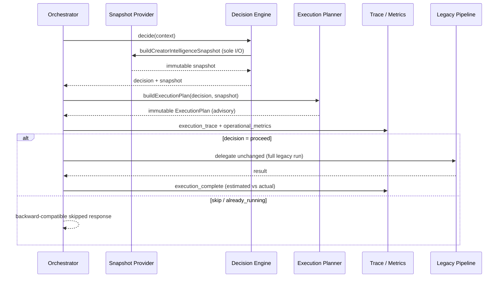
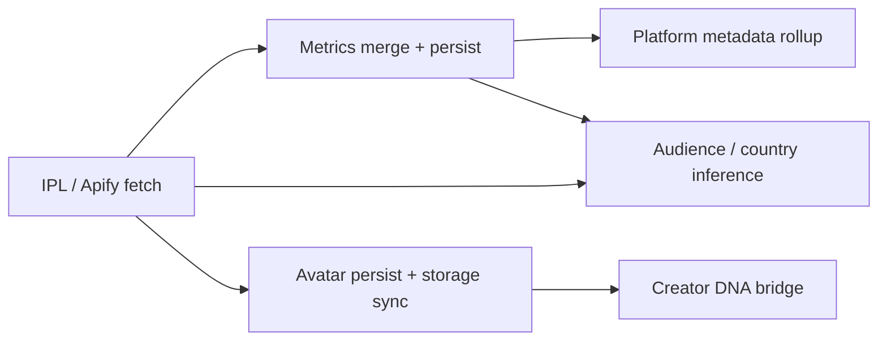

# Creator Enrichment Intelligent Platform

> **Status:** Feature complete (Phase 3)  
> **Scope:** Execution planning, optimization policy, cost/duration estimation, explainability, and operational metrics. Pipeline execution remains unchanged until modularization is complete.

---

## End-to-end lifecycle



---

## Pipeline compatibility assessment

### Is partial execution currently safe?

**No.** Execution-plan enforcement is **disabled** (`PIPELINE_ENFORCEMENT_ENABLED = false`).

### Why not

`runCreatorEnrichment()` in `lib/creator-enrichment/service.ts` is a **monolithic per-platform loop**. Findings:

| Finding | Impact |
|---------|--------|
| `fetchProfileWithIpl()` runs for every supported account on every proceed | IPL cannot be skipped at pipeline level even when plan says Reuse |
| `scope` only filters IPA field writes via `filterIncomingByScope` | Metrics-only scope still fetches IPL and may persist avatar |
| DNA bridge runs after avatar persist when `fetched.snapshotId` exists | DNA depends on fresh IPL snapshot + post-avatar URL |
| Avatar persist runs when Apify returns photo | Not gated by execution plan |
| AI Analysis stage does not exist in commercial pipeline | Always Skip in plan |
| Stage order is mandatory | IPL → merge → avatar → DNA bridge |

### Stage dependency diagram



### Required refactoring before enforcement

1. Extract stage runners behind a shared interface (`run | reuse | skip`).
2. Gate `fetchProfileWithIpl` — skip Apify when plan action is Reuse and cached snapshot is valid.
3. Make DNA bridge scope-aware and callable only when plan action is Run.
4. Gate avatar persist on plan action and existing freshness semantics.
5. Pass `ExecutionPlan` into worker payload or job context for enforcement.
6. Add integration tests proving partial runs produce consistent downstream data.

Until then, the planner produces **advisory plans**; the legacy pipeline always executes the full flow on `proceed`.

---

## Execution Planner architecture

| Property | Value |
|----------|-------|
| Location | `lib/creator-enrichment/execution/` |
| I/O | **Zero** — pure functions over snapshot + decision |
| Input | `BuildExecutionPlanInput` (requestId, force, snapshot, decision) |
| Output | Immutable `ExecutionPlan` |

### Stage actions

| Action | Meaning |
|--------|---------|
| `run` | Stage work should execute |
| `reuse` | Existing intelligence is valid; no external acquisition |
| `skip` | Stage not applicable or decision short-circuited |

### Supported stages

| Stage ID | Pipeline mapping |
|----------|------------------|
| `metrics` | IPA metric fields + influencer rollup |
| `ipl` | `fetchProfileWithIpl` |
| `creatorDna` | `bridgeSnapshotToCreatorDna` |
| `avatar` | Avatar persist + storage sync |
| `audience` | Audience country / interest inference |
| `platformMetadata` | Platform account metadata rollup |
| `aiAnalysis` | Not in commercial pipeline (always skip) |

---

## Optimization policy matrix

Configured in `lib/creator-enrichment/execution/optimization-policy.ts` via `getOptimizationPolicy()`.

| Policy | Default | Used by |
|--------|---------|---------|
| `freshnessWindowDays` | 30 (from decision policy) | Metrics freshness alignment |
| `iplValidityDays` | 30 | IPL Reuse |
| `dnaCompletenessThreshold` | 70 | DNA Reuse |
| `avatarValidityDays` | 30 | Avatar Reuse |
| `audienceValidityDays` | 30 | Audience Reuse |
| `stageCosts.*` | Apify / AI / API units | Cost estimation |
| `stageDurationsMs.*` | Per-stage ms | Duration estimation |

### Stage decision matrix

| Stage | Reuse when | Run when | Skip when |
|-------|------------|----------|-----------|
| Metrics | `metricsFreshness === fresh`, not forced | Stale/unknown or forced | Decision short-circuit |
| IPL | Valid IPL snapshot within `iplValidityDays` | Missing/expired or forced | Decision short-circuit |
| Creator DNA | `hasCreatorDNA`, lifecycle valid, completeness ≥ threshold | Below threshold/missing or forced | Decision short-circuit |
| Avatar | `avatarFreshness === fresh` or recent enrichment + IPL | Refresh needed or forced | Decision short-circuit |
| Audience | `audienceKnown` within validity window | Missing/stale or forced | Decision short-circuit |
| Platform metadata | Metrics fresh + DNA present | Refresh needed or forced | Decision short-circuit |
| AI Analysis | — | — | Always (not in pipeline) |

---

## Example execution plans

### Fresh creator (all intelligence valid)

```
Metrics      → Reuse  (metrics_fresh)
IPL          → Reuse  (ipl_snapshot_valid)
Creator DNA  → Reuse  (dna_complete_above_threshold)
Avatar       → Reuse  (avatar_fresh)
Audience     → Reuse  (audience_intelligence_valid)
Platform Metadata → Reuse (platform_metadata_current)
AI Analysis  → Skip   (ai_analysis_outside_commercial_pipeline)
```

Estimated savings: ~1 Apify credit, ~12s duration (advisory).

### New creator (no prior intelligence)

```
All pipeline stages → Run
AI Analysis → Skip
```

### Forced refresh

```
All pipeline stages → Run (force_refresh)
AI Analysis → Skip (ai_not_in_enrichment_pipeline)
```

### Already running

```
All stages → Skip (enrichment_already_in_progress)
Decision: already_running — no delegation
```

### Partially enriched creator

```
Metrics      → Run   (metrics_stale_or_unknown)
IPL          → Reuse (ipl_snapshot_valid)
Creator DNA  → Run   (dna_missing)
Avatar       → Run   (avatar_refresh_needed)
Audience     → Reuse (audience_intelligence_valid)
Platform Metadata → Run (platform_metadata_refresh_needed)
AI Analysis  → Skip
```

---

## Cost estimation example

For a new creator (all stages Run except AI):

```json
{
  "estimatedApifyCredits": 1,
  "estimatedAiProcessingUnits": 0.1,
  "estimatedExternalApiCalls": 1,
  "estimatedApifyCreditsIfAllRun": 1,
  "estimatedSavingsApifyCredits": 0
}
```

For a fresh creator (IPL/metrics/DNA/avatar/audience Reuse):

```json
{
  "estimatedApifyCredits": 0,
  "estimatedApifyCreditsIfAllRun": 1,
  "estimatedSavingsApifyCredits": 1,
  "optimizationPercentage": 92
}
```

No billing logic — estimates are for operational explainability only.

---

## Performance estimation example

```json
{
  "estimatedDurationMs": 13000,
  "actualDurationMs": 8420,
  "durationVarianceMs": -4580,
  "optimizationPercentage": 0
}
```

Logged on `execution_complete` after delegation. Compare estimated plan duration vs orchestrator delegation duration.

---

## Explainability example

`execution_trace` log (via `logExecutionTrace`):

```json
{
  "planId": "…",
  "traceId": "…",
  "winningRule": "FreshnessRule",
  "decision": "proceed",
  "enforcementEnabled": false,
  "pipelineMode": "full_legacy",
  "stages": [ … ],
  "totals": { … },
  "optimizationSummary": "run: metrics, creatorDna; reuse: ipl, audience; skip: aiAnalysis. Plan advisory only — full legacy pipeline will execute.",
  "reusedIntelligence": ["ipl", "audience"],
  "skippedStages": ["aiAnalysis"]
}
```

Extends decision trace — decision rules remain authoritative for proceed/skip/already_running; execution plan explains **what work would be optimal**.

---

## Operational metrics (logs only)

Rolling counters via `recordExecutionPlanMetrics` / `recordExecutionActualDuration`:

| Metric | Description |
|--------|-------------|
| `proceedPlans` / `skipPlans` / `alreadyRunningPlans` | Plan counts by decision |
| `iplReuseCount` / `dnaReuseCount` / `metricsReuseCount` | Stage reuse frequency |
| `audienceReuseCount` / `avatarReuseCount` | Stage reuse frequency |
| `estimatedApifySavingsTotal` | Cumulative advisory Apify savings |
| `estimatedAiSavingsTotal` | Cumulative advisory AI savings |
| `averageEstimatedDurationMs` | Mean planned duration |
| `averageActualDurationMs` | Mean delegation duration |
| `averageOptimizationPercentage` | Mean advisory optimization % |

Logged as `execution_operational_metrics` and `execution_duration`. No dashboards in this phase.

---

## Before vs after optimization

| Aspect | Before Phase 3 | After Phase 3 |
|--------|----------------|---------------|
| Decision | proceed / skip / already_running | Unchanged |
| Work planning | Implicit (full run on proceed) | Explicit per-stage ExecutionPlan |
| Intelligence reuse | IPL cache inside `fetchProfileWithIpl` only | Planner identifies all reusable stages |
| Cost visibility | None at orchestration layer | Estimated Apify/AI/API per plan |
| Duration tracking | Orchestrator delegation ms only | Estimated + actual comparison |
| Explainability | Decision trace only | Decision trace + execution trace |
| Pipeline behavior | Full monolithic run | **Unchanged** (enforcement disabled) |

---

## Extension guide

### Add a new optimization stage

1. Add stage ID to `ExecutionStageId` in `execution-plan-types.ts`.
2. Add decide function in `stage-planner.ts`.
3. Add cost/duration defaults in `optimization-policy.ts`.
4. Update stage dependency diagram in this doc.
5. Re-run pipeline compatibility assessment before enabling enforcement.

### Enable pipeline enforcement (future)

1. Complete refactoring checklist above.
2. Set `PIPELINE_ENFORCEMENT_ENABLED = true` in `execution-planner.ts`.
3. Wire plan into worker/job execution.
4. Add integration tests for partial execution scenarios.

### Configure policies in tests

```typescript
import { setOptimizationPolicyForTests, resetOptimizationPolicyForTests } from "@/lib/creator-enrichment/execution";

setOptimizationPolicyForTests({ dnaCompletenessThreshold: 80 });
// …
resetOptimizationPolicyForTests();
```

---

## Validation

```bash
npx tsx lib/creator-enrichment/execution/execution-planner.test.ts
npx tsx lib/creator-enrichment/decision/decision-engine.test.ts
npx tsx lib/creator-enrichment/orchestrator/creator-enrichment-orchestrator.test.ts
```

Scenarios covered: fresh creator, new creator, forced refresh, already running, partially enriched, policy thresholds, cost/duration estimates.

---

## Related documentation

- [Decision Platform](./creator-enrichment-decision-platform.md) — Phase 2.4 rules, snapshot, trace
- [Orchestrator](./creator-enrichment-orchestrator.md) — request routing and adapters
