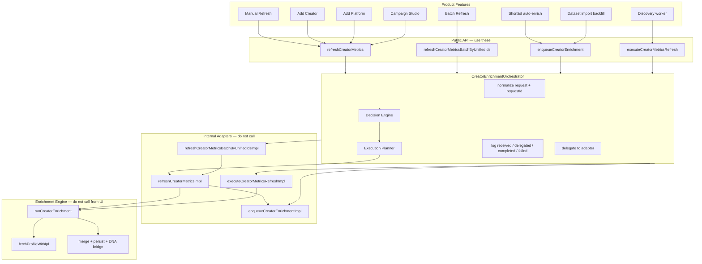

# Creator Enrichment Orchestrator

> **Status:** Platform standard (Phase 1.6 + Phase 3 advisory planning)  
> **Behavior:** All commercial creator enrichment enters through `CreatorEnrichmentOrchestrator` before reaching existing implementations. The orchestrator routes requests and builds advisory execution plans; it does not contain enrichment business logic.

---

## Architecture Diagram



---

## Public API

Use **only** these entry points for new enrichment features:

| Function | Module | Orchestrator method |
|----------|--------|-------------------|
| `refreshCreatorMetrics()` | `lib/services/creators/creator-enrichment-service.ts` | `requestRefresh()` |
| `refreshCreatorPlatformMetrics()` | same (wrapper) | `requestRefresh()` |
| `refreshCreatorMetricsByUnifiedId()` | same (wrapper) | `requestRefresh()` |
| `refreshCreatorMetricsBatchByUnifiedIds()` | same | `requestBatchRefresh()` |
| `refreshCreatorMetricsBatch()` | same | per-item or batch |
| `executeCreatorMetricsRefresh()` | same | `executeJob()` |
| `enqueueCreatorEnrichment()` | `lib/creator-enrichment/queue.ts` | `enqueue()` |
| `enqueueCreatorEnrichmentBestEffort()` | same | `enqueueBestEffort()` |

Read-only helpers (not enrichment triggers):

- `getCreatorMetricsSyncStatus()`
- `resolveCreatorInfluencerId()`
- `stopCreatorMetricsRefresh*()`

Re-export barrel: `lib/services/creators/index.ts`

### Optional feature attribution (Phase 1.6)

Pass `feature` on refresh options or enqueue options for accurate logs:

```typescript
await refreshCreatorMetrics(supabase, creatorId, {
  trigger: "manual",
  feature: "add_creator", // optional — inferred when omitted
});
```

Supported values: `manual_refresh`, `add_creator`, `add_platform`, `campaign_studio`, `shortlist`, `dataset_import`, `worker_execution`, `batch_refresh`.

`feature` is **observability only** — it is not stored on queue payloads and does not affect routing.

---

## Internal Adapters

| Function | Module | Called by |
|----------|--------|-----------|
| `refreshCreatorMetricsImpl` | `creator-enrichment-service-impl.ts` | Orchestrator adapter only |
| `enqueueCreatorEnrichmentImpl` | `queue-impl.ts` | Orchestrator adapter + internal refresh chain |
| `executeCreatorMetricsRefreshImpl` | `creator-enrichment-service-impl.ts` | Orchestrator adapter only |
| `refreshCreatorMetricsBatchByUnifiedIdsImpl` | `creator-enrichment-service-impl.ts` | Orchestrator adapter only |

**Wiring:** `lib/creator-enrichment/orchestrator/instance.ts` — the only module that imports `*Impl` for production.

### Internal adapter chain (by design)

When a queued refresh runs, the orchestrator logs one envelope at the refresh level. Inside the adapter:

```
requestRefresh → refreshCreatorMetricsImpl → enqueueCreatorEnrichmentImpl
```

This inner enqueue does **not** re-enter the orchestrator (avoids duplicate requestIds and double logging).

---

## Request Lifecycle

1. **Caller** invokes a public API function with existing options (+ optional `feature`).
2. **Public API** delegates to `getCreatorEnrichmentOrchestrator()`.
3. **Normalizer** assigns `requestId`, resolves `feature`, copies `trigger`, `priority`, `requestedBy`, `timestamp`.
4. **Log:** `request_received` with core correlation fields.
5. **Decision Engine** builds a {@link CreatorIntelligenceSnapshot} via the snapshot provider, evaluates registry rules in priority order, and emits a full decision trace. See [Decision Platform](./creator-enrichment-decision-platform.md).
6. **Execution Planner** (Phase 3) builds an advisory {@link ExecutionPlan} from decision + snapshot — zero I/O. See [Intelligent Platform](./creator-enrichment-intelligent-platform.md).
7. **Log:** `decision_started` → `decision_trace` → `execution_trace` → `execution_operational_metrics` → `decision_complete`.
8. If decision is `skip` or `already_running`, return backward-compatible skipped response **without** delegating.
9. **Log:** `delegated` with `delegatedTo`, `planId`, and estimated duration (proceed only).
10. **Adapter** runs unchanged existing implementation (full legacy pipeline).
11. **Log:** `execution_complete` with estimated vs actual duration (proceed only).
12. **Log:** `completed` or `failed` with `duration` (ms).
13. **Return:** Identical result object as pre-orchestrator (no wrapping at public API boundary).

### Request context fields

| Field | Refresh | Enqueue | Execute | Batch |
|-------|---------|---------|---------|-------|
| `requestId` | Yes | Yes | Yes | Yes |
| `feature` | Yes | Yes | Yes | Yes |
| `trigger` | Yes | Yes | Yes | Yes |
| `timestamp` | Yes | Yes | Yes | Yes |
| `priority` | Yes | Yes | Yes | Yes |
| `requestedBy` | Yes (nullable) | Yes (nullable) | Yes (nullable) | Yes (nullable) |
| `creatorId` | Yes | Yes | Yes | **No** — batch uses `unifiedIds[]`; see `creatorCount` in logs |

`requestedBy` is null when no user initiated the request (e.g. system backfill without actor).

---

## Logging Lifecycle

All orchestrator logs use the prefix `[creator-enrichment:orchestrator]` and JSON payload.

**Every log line includes:**

- `requestId` — correlate all events for one envelope
- `feature` — originating product surface
- `trigger` — enrichment trigger enum
- `delegatedTo` — present on `delegated`, `completed`, `failed`
- `duration` — present on `completed`, `failed` (milliseconds)

**Events:** `request_received` → `delegated` → `completed` | `failed`

Existing logs (`[refresh]`, `[manual-refresh]`, `[creator-enrichment:service]`, worker logs) are unchanged.

No database audit tables in Phase 1.x — console only.

---

## Extension Points (Future Phases)

| Capability | Plug-in location |
|------------|------------------|
| Decision engine | Before adapter delegation in `CreatorEnrichmentOrchestrator` |
| Cost ledger | After `delegated`, before adapter call |
| Persistent audit | Replace/extend `logOrchestratorEvent` in `logging.ts` |
| Distributed locking | Wrap `enqueueCreatorEnrichmentImpl` adapter |
| Explicit feature from all callers | `feature` on `RefreshCreatorMetricsOptions` (done Phase 1.6) |
| Batch acquisition envelope | New `requestBatchAcquisition()` method |
| Trace propagation | `request-normalizer.ts` at UUID assignment |

Do not add business logic to the orchestrator without a dedicated phase plan.

---

## Enrichment Architecture Rules

1. **All new enrichment features must enter through `CreatorEnrichmentOrchestrator`.** Use the public API functions — never `*Impl` adapters.

2. **`runCreatorEnrichment()` is the engine** and must not be called by UI features, server actions, or API routes. Workers reach it via `executeCreatorMetricsRefresh()`.

3. **`fetchProfileWithIpl()` is an internal implementation detail** of the enrichment engine and import pipeline. Do not call it from product features.

4. **`*Impl` functions are internal adapters.** Only `lib/creator-enrichment/orchestrator/instance.ts` may wire them in production.

5. **New features must depend on the public API only** (`refreshCreatorMetrics`, `enqueueCreatorEnrichment`, etc.).

6. **The orchestrator is the only orchestration layer** for commercial creator enrichment. Do not add parallel routing facades.

7. **`feature` is for observability only.** It must not change queue payloads, SQL writes, merge logic, or Apify behavior.

8. **Do not bypass the orchestrator** to "save a hop" — internal adapter chains exist where nested envelopes would duplicate requestIds.

---

## Guardrails — Accidental `*Impl` Usage

| Location | Risk | Mitigation |
|----------|------|------------|
| `orchestrator/instance.ts` | Legitimate adapter wiring | Documented as sole production importer |
| `creator-enrichment-service-impl.ts` | Internal refresh→enqueue chain | Comment at `enqueueCreatorEnrichmentImpl` call |
| New imports of `*-impl.ts` | Accidental bypass | Code review + INTERNAL JSDoc on exports |
| Direct `runCreatorEnrichment()` | Engine bypass | Do not export to feature modules |
| Direct `fetchProfileWithIpl()` | IPL bypass | Keep inside engine/import pipeline only |

Search before adding enrichment calls:

```
refreshCreatorMetricsImpl
enqueueCreatorEnrichmentImpl
executeCreatorMetricsRefreshImpl
refreshCreatorMetricsBatchByUnifiedIdsImpl
```

Expected matches: `instance.ts`, `creator-enrichment-service-impl.ts` (internal chain), tests.

---

## File Map

```
lib/creator-enrichment/
  decision/
    decision-engine.ts           # Centralized decision engine (Phase 2.0+)
    decision-context.ts          # Immutable request context builders
    decision-result.ts           # Proceed / delegate result model
    decision-rules.ts            # Placeholder rules (no_opinion)
    decision-types.ts            # Shared decision types
    snapshot/
      creator-intelligence-snapshot.ts  # Snapshot model
      snapshot-provider.ts              # Sole future I/O gateway (placeholder)
      snapshot-builder.ts               # Context + provider → immutable snapshot
      snapshot-types.ts                 # Snapshot field types
  enrichment-feature.ts          # Feature enum + enqueue options
  orchestrator/
    creator-enrichment-orchestrator.ts  # Router class
    request-normalizer.ts        # Request normalization
    logging.ts                   # Structured logs
    instance.ts                  # Singleton + adapter wiring
    types.ts                     # Request/response models
  queue.ts                       # Public enqueue API
  queue-impl.ts                  # INTERNAL enqueue adapter
  queue-operations.ts            # Stats/cancel/inflight (no orchestrator)

lib/services/creators/
  creator-enrichment-service.ts        # Public refresh API
  creator-enrichment-service-impl.ts   # INTERNAL refresh adapters
  creator-enrichment-service-shared.ts # Types + helpers
```

---

## Related Documentation

- `docs/APIFY_CREATOR_ENRICHMENT_ARCHITECTURE.md` — Apify pipeline design
- Phase 1.5 audit — call graph and escape hatch inventory (conversation history)
