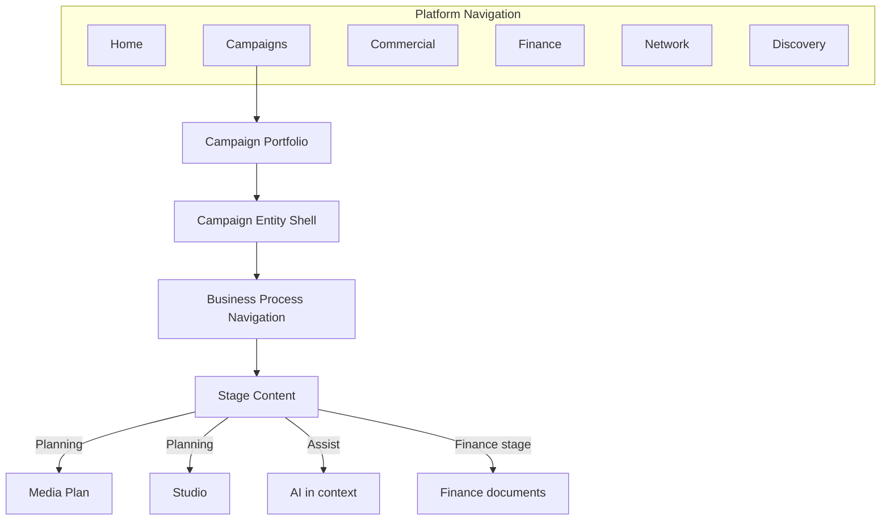
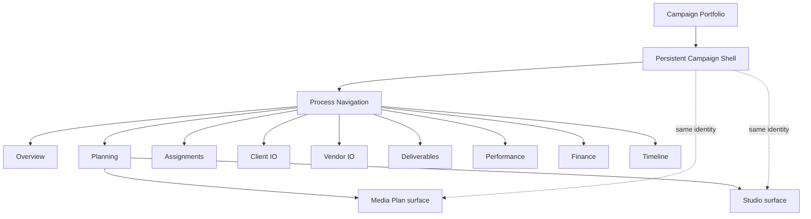
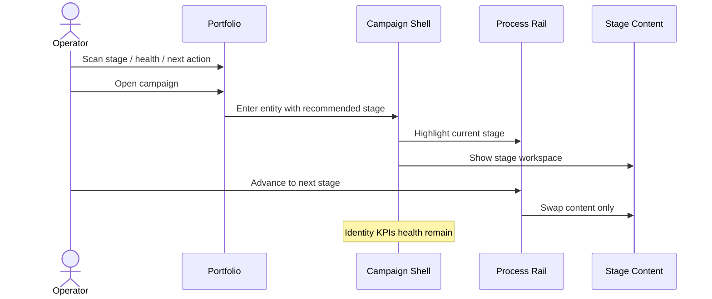
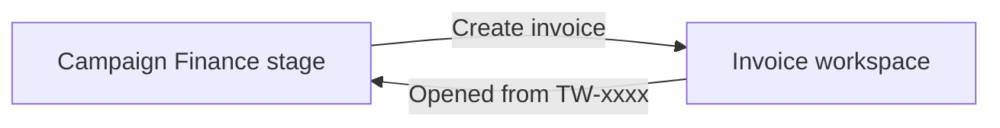

# 07 — Navigation Flow Diagrams

**Status:** Draft for Product approval

---

## 1. Target platform flow



---

## 2. Current vs target (Campaign)

### Current (problem)

```mermaid
flowchart LR
  Sidebar --> StudioApp[/studio and /ai]
  Sidebar --> CampList[/campaigns]
  CampList --> Aurora[/campaigns/id]
  Aurora --> Tabs[Peer tabs]
  Aurora --> Hero[Hero actions]
  Hero --> StudioApp
  Hero --> MP[/media-plan]
  Tabs --> Hero
```

Multiple parallel paths to the same work; Studio feels external.

### Target



---

## 3. Open campaign journey



---

## 4. Cross-module with origin



---

## 5. Approval question

Confirm these flows as the navigation contract for implementation phases.
