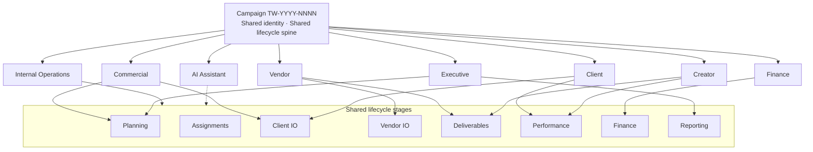

# 11 — Stakeholder Journey Architecture

**Status:** Draft for final Product approval  
**Depends on:** [`01-PLATFORM_UX_ARCHITECTURE.md`](./01-PLATFORM_UX_ARCHITECTURE.md) · [`06-BUSINESS_LIFECYCLE_MODEL.md`](./06-BUSINESS_LIFECYCLE_MODEL.md)  
**Constraints:** Presentation · navigation · IA only — no API · DB · permission · calculation changes in this initiative

---

## 1. Thesis

Thinkway is **one connected enterprise operating system**.

Every participant works on the **same campaign** through a journey appropriate to their responsibilities.

| Rule | Meaning |
|------|---------|
| Same campaign | All journeys bind to one campaign identity (TW-…) |
| Same lifecycle | Stages are shared; stakeholders enter at different points |
| Same navigation philosophy | Platform → Module → Business Process → Content |
| Never a separate app | Portals, Reporting Hub, and AI extend this architecture |
| Responsibility-scoped | Visibility and actions differ; product identity does not |

Internal tools and external portals are **views into the same campaign**, not independent products.

---

## 2. Architecture layer

```
Platform UX Architecture
  ├── Business Process Architecture     (what stages exist)
  ├── Master Navigation Architecture    (how stages are traversed)
  └── Stakeholder Journey Architecture  (who enters where, with what lens)
```

Business Process Navigation defines the **campaign spine**.  
Stakeholder Journey Architecture defines **role-appropriate paths along that spine**.

---

## 3. Stakeholder catalog

| Stakeholder | Primary responsibility | Typical entry stage | Surfaces (today → target) |
|-------------|------------------------|---------------------|---------------------------|
| **Internal Operations** | Run the campaign end-to-end | Overview / Assignments | Internal Campaign Workspace |
| **Commercial** | Quotation, IO, commercial lock | Planning → Client IO | Campaign + Commercial registers |
| **Client** | Approve commercial & creative outcomes | Commercial Approval / Client IO / Performance | Client Collaboration Portal |
| **Vendor** | Agency-side IO & delivery coordination | Vendor IO / Deliverables | Vendor Portal (extend) |
| **Creator** | Deliver content & publications | Vendor IO / Deliverables / Performance | Creator Portal |
| **Finance** | Invoice, collect, close books | Finance / Collection | Campaign Finance stage + Finance module |
| **Executive** | Health, risk, portfolio outcomes | Overview / Reporting | Portfolio + Executive views |
| **AI Assistant** | Context-aware assistance | Current stakeholder’s stage | In-context Assist (not a separate OS) |

---

## 4. Journey contracts (all stakeholders)

Every journey **must**:

1. **Begin and end within the same campaign** (or portfolio → same campaign → return).  
2. **Share the same campaign identity** (TW-#, name, brand, status cues).  
3. **Reuse enterprise navigation philosophy** (process progression, not peer apps).  
4. **Never feel like a separate application** (shared language: identity, stage, next action, status).  
5. **Enter the lifecycle at the stage matching responsibility** while remaining connected to the full spine (read-only awareness of adjacent stages where permitted).

Every journey **must not**:

- Invent a parallel navigation system  
- Rebrand into a disconnected “mini-product”  
- Hide that work belongs to campaign TW-…  
- Require mental re-mapping when switching from internal to portal (or vice versa)

---

## 5. Journey definitions

### 5.1 Internal Operations

```
Portfolio → Campaign shell → full process rail
  Overview → Planning → Assignments → Client IO → Vendor IO
  → Deliverables → Performance → Finance → Timeline → Completed
```

- Owns day-to-day progression and unblocking  
- Sees cross-stakeholder attention (waiting on client/vendor/creator)  
- Primary “conductor” of the campaign OS  

### 5.2 Commercial

```
Campaign → Planning / Shortlist / Quotation cues
        → Client IO (generate, send, revise, approve)
        → handoff signal to Vendor IO / Assignments
```

- Focus: commercial readiness and Client IO lifecycle  
- Still inside Campaign identity; Commercial registers deep-link back with origin  

### 5.3 Client

```
Client Portal → Campaign (same TW-…)
  enter at: Media Plan review · Client IO approve · Deliverable/creative review
            · Performance / publications · Invoices / reports
  exit: return to portal campaign list (same product family)
```

- Responsibility-scoped stages (approve, review, pay visibility)  
- Must show campaign identity + current stage + waiting-on-them actions  
- Future **Client Collaboration Portal** extends this journey — does not replace it with a new product  

### 5.4 Vendor

```
Vendor Portal → Campaign (same TW-…)
  enter at: Vendor IO · Deliverables coordination · Payment status
```

- Agency/vendor lens on the same assignments and IOs  
- Same campaign crumb language as internal (scoped fields)  

### 5.5 Creator

```
Creator Portal → Campaign (same TW-…)
  enter at: Vendor IO accept · Deliverables upload · Publications · Payments
```

- Creator sees their slice of the campaign lifecycle  
- Deliverables selection/upload integrity rules still apply in their journey  
- Must feel like “my work on TW-…”, not a freelance island app  

### 5.6 Finance

```
Campaign Finance stage ↔ Finance module documents
  Invoice → Post → Collect → Close
  always retain “Opened from TW-…” / campaign identity
```

- Enters lifecycle at Finance / Collection  
- May work primarily in Finance registers, but never loses campaign binding  
- Portfolio/exec views roll up the same campaign financial health  

### 5.7 Executive

```
Portfolio / Executive Overview → Campaign (read-heavy)
  Stage · Health · Risk · Margin · Next organizational action
  optional: Reporting Hub outputs for that campaign
```

- Enters at Overview / Reporting  
- Does not need full operational rail density; still same campaign OS chrome  
- Future **Reporting Hub** publishes from this journey, not a separate BI product identity  

### 5.8 AI Assistant

```
Bound to: current stakeholder + current campaign + current stage
  Assist inside shell (dock/panel/workspace)
  Knows: campaign, client, stage, assignments, documents, deliverables, financial summary
  Never: a standalone “Intelligence app” that drops campaign context
```

- AI is a **participant mode**, not a stakeholder portal  
- Same campaign identity; recommendations respect stakeholder permissions  
- Copilot / Assist extend this journey; warehouse analytics remain Insights (distinct name)

---

## 6. Intersection model — one campaign, many journeys



### Intersection rules

| When… | Then… |
|-------|-------|
| Client approves Client IO | Commercial + Ops see stage advance; Vendor journey may unlock |
| Creator submits deliverable | Ops/Vendor see Deliverables attention; Client may see review item |
| Finance posts invoice | Ops Finance stage + Executive health update; Client may see payable |
| AI suggests next action | Scoped to stakeholder permissions on the same campaign |

Hand-offs are **lifecycle events on one object**, not “send to another system.”

---

## 7. Portal & future module placement

| Future / existing module | Journey it extends | Must not become |
|--------------------------|--------------------|-----------------|
| Client Collaboration Portal | Client | Standalone client SaaS |
| Vendor Portal | Vendor | Standalone vendor SaaS |
| Creator Portal | Creator | Standalone creator app |
| Reporting Hub | Executive (+ Ops export) | Standalone BI product |
| AI Assistant / Copilot | AI Assistant | Standalone Intelligence OS |
| Media Plan Planning Board | Internal Ops + Commercial (+ Client review) | Second planner product |

Portals may use lighter chrome suited to external users, but **must inherit**:

- Campaign identity  
- Stage awareness  
- Next recommended action  
- Shared status language  
- Financial Display Standard where money appears  

---

## 8. Navigation per stakeholder (same philosophy)

```
Stakeholder entry surface (internal shell or portal shell)
        ↓
Campaign identity (always)
        ↓
Business Process Navigation (scoped stages visible)
        ↓
Stage content (responsibility-filtered)
```

Internal vs portal shells differ in density and permissions — **not** in product metaphor.

---

## 9. Gaps today (architecture drivers)

| Gap | Impact |
|-----|--------|
| Portals feel like separate apps from Aurora Campaign | Breaks “one OS” |
| Studio/AI drop campaign crumb | Breaks Internal/AI journeys |
| No shared “waiting on stakeholder” narrative across journeys | Hand-offs invisible |
| Reporting not framed as campaign lifecycle stage | Executive journey fragments |
| Intelligence naming collision | AI journey confused with warehouse |

---

## 10. Approval questions

1. Accept Stakeholder Journey Architecture as a first-class layer beside Business Process Navigation?  
2. Accept that Client / Vendor / Creator portals must extend these journeys (not independent products)?  
3. Accept AI Assistant as in-campaign participant mode for all stakeholders (permission-scoped)?  
4. Accept Reporting Hub as Executive/Ops journey extension on the same campaign spine?
