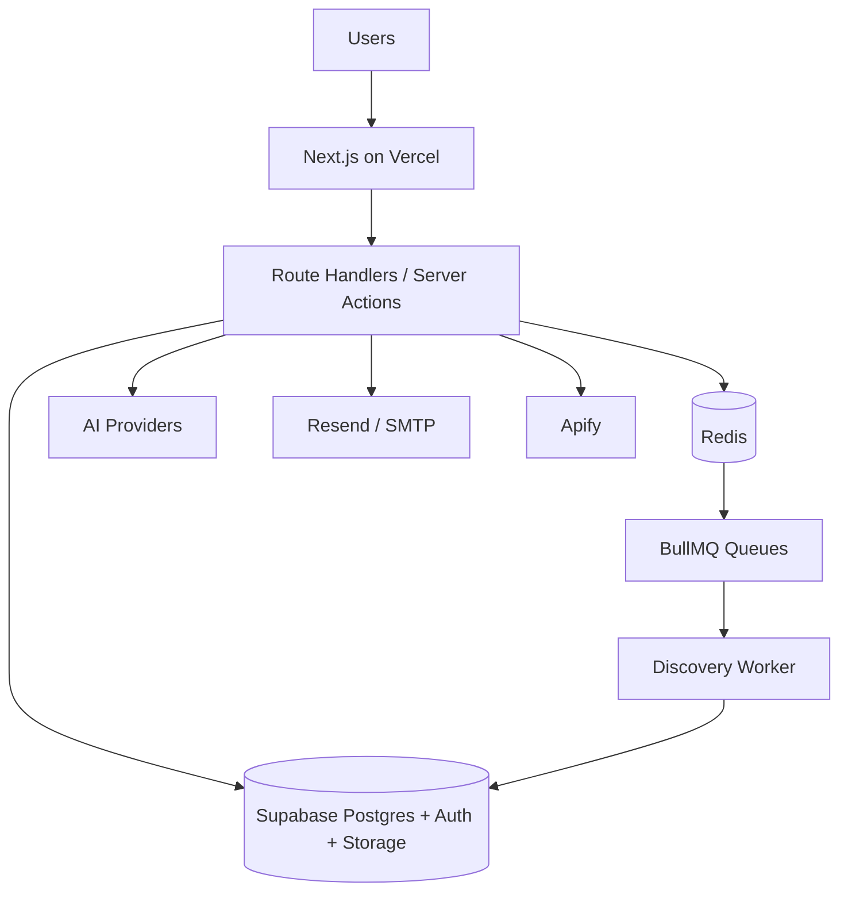
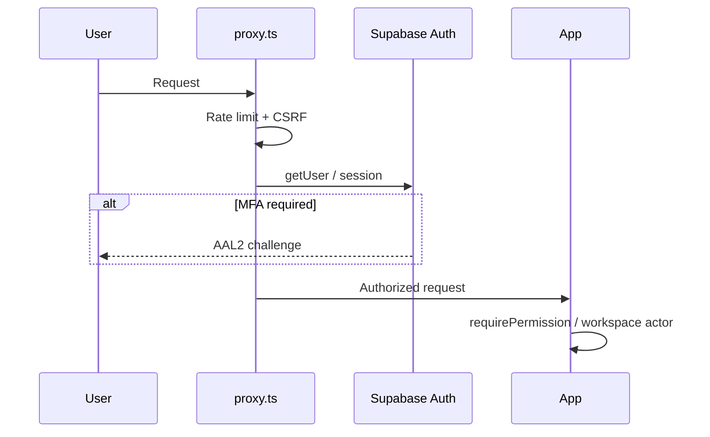
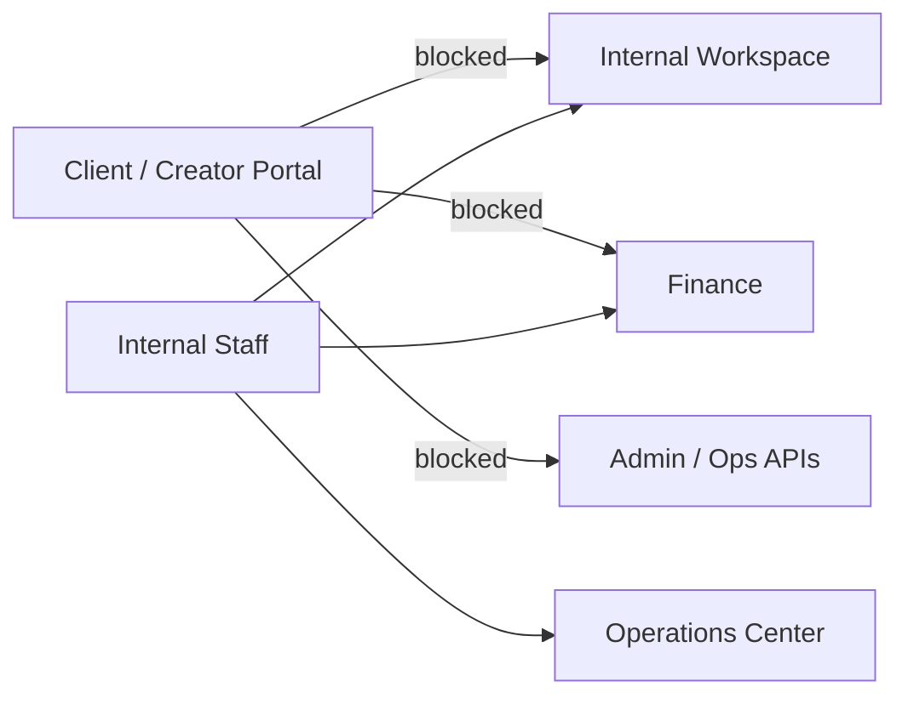
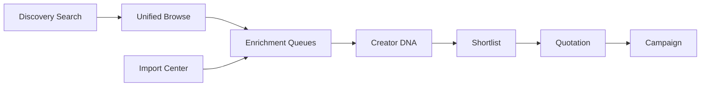
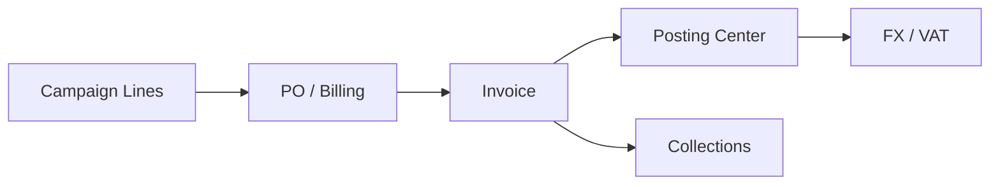
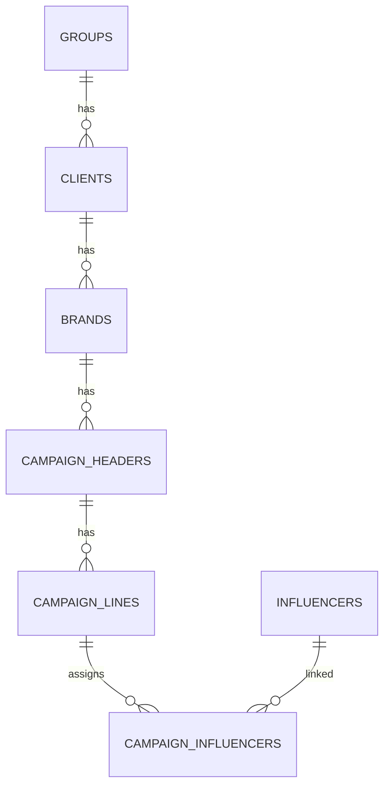
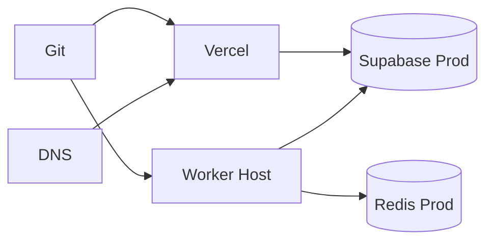

# Architecture Diagrams (Mermaid)

## Overall Architecture



## Authentication Flow



## Workspace Isolation



## Discovery Pipeline



## AI Pipeline

```mermaid
flowchart TB
  User --> Chat[/api/ai/chat]
  Chat --> Tools[Tool Registry]
  Tools --> JWT[User JWT + RLS]
  JWT --> SB[(Supabase)]
  Tools --> Isolation[AI Isolation Guards]
  Isolation -->|deny| FinanceTools[Finance tools / billing reports]
```

## Finance Pipeline



## Queue Architecture

```mermaid
flowchart TB
  App[Next.js producers] --> Redis
  Cron[/api/cron] --> Redis
  Redis --> Q1[discovery-run]
  Redis --> Q2[creator-enrichment]
  Redis --> Q3[publication-metrics]
  Redis --> DLQ[creator-enrichment-dlq]
  Q1 & Q2 & Q3 --> Worker
  Worker --> SB[(Supabase)]
```

## Database Relationships



## Deployment Architecture



## Operations Center

```mermaid
flowchart TB
  OpsUI[/operations] --> Snapshot[buildOperationsCenterSnapshot]
  Snapshot --> Health[Health Engine]
  Snapshot --> Queues[Queue Monitor]
  Snapshot --> Alerts[Alert Engine]
  Snapshot --> Graph[Dependency Graph]
  Health --> Adapters[HealthProvider Registry]
```

## Monitoring Architecture

```mermaid
flowchart LR
  Probes[/api/health /ready] --> Ops[Operations Center]
  Adapters --> Ops
  Heartbeat[Worker Heartbeat] --> Ops
  Guards[Rate limit / CSRF counters] --> Ops
  Ops --> Alerts
  Sentry[(Sentry optional)] --> Oncall
```

