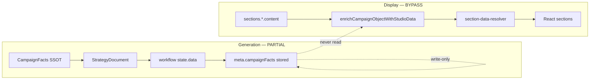
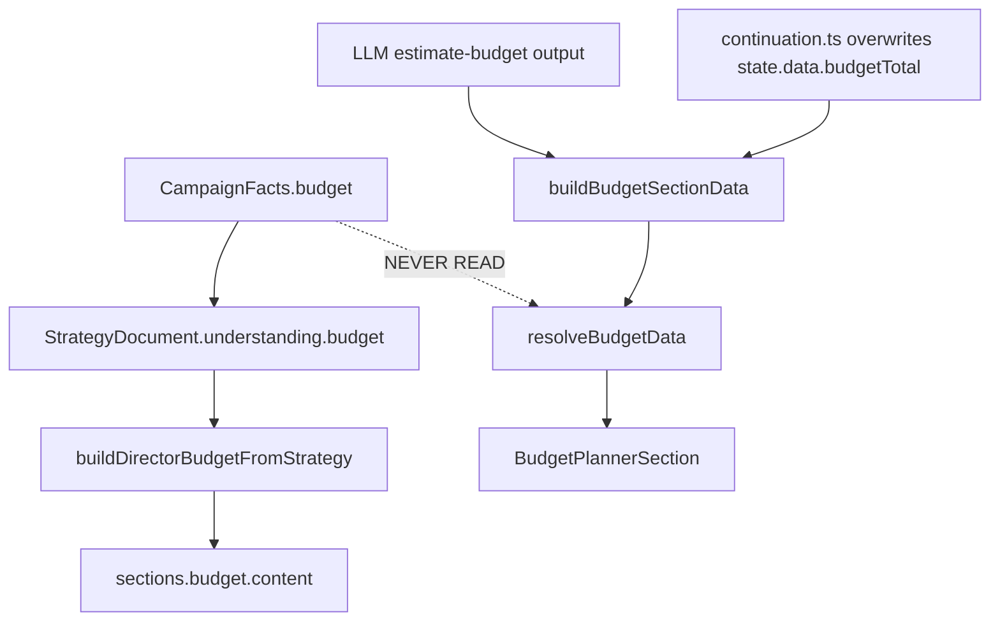

# Campaign Facts Dependency Audit

**Date:** 2026-07-04  
**Scope:** Nine factual fields from `features/campaign-director/facts/` through browser display  
**Constraint:** Audit only — no fixes implemented  
**Method:** Static trace + grep verification across generation and display pipelines

---

## Executive Summary

Campaign Facts Layer correctly extracts and validates facts at workflow initialization and writes them into `CampaignStrategyDocument` and `CampaignObject.meta.campaignFacts`. However, **zero studio display resolvers read `meta.campaignFacts`**. The runtime display path re-parses LLM-generated `sections.*.content`, uses legacy text parsers, or falls back to industry templates.

| Field | Bypass count | Migration status |
|-------|-------------|-------------------|
| Budget | 13 | PARTIAL |
| Currency | 11 | PARTIAL |
| Duration | 12 | PARTIAL |
| Brand | 10 | BYPASS |
| Client | 7 | BYPASS |
| Campaign Objective | 9 | PARTIAL |
| Creator Mix | 8 | BYPASS |
| Timeline | 11 | BYPASS |
| KPIs | 10 | BYPASS |

**Total distinct bypass locations: 91** (many shared parsers affect multiple fields).

**Architectural gap:**

| Path | Facts compliance |
|------|------------------|
| Generation (Director → workflow state → section writers) | ~40% |
| Display (enrichment → resolver → React sections) | ~0% |

**Critical finding:** `meta.campaignFacts` is **write-only** in the display pipeline. Grep across `features/campaign-studio/` returns **zero** reads of `campaignFacts` or `meta.campaignFacts`. The only production reads occur in the Director integration layer (`workflow-integration.ts`, `budget-rules.ts`, `campaign-director.ts`) — none of which feed the studio UI resolvers.

---

## Trace Architecture

### Generation path (partially facts-bound)

```
User prompt
  → extractCampaignFacts()           [facts/extract-campaign-facts.ts]
  → validateCampaignFacts()          [facts/validate-campaign-facts.ts]
  → writeStrategyDocumentFromBrief() [services/strategy-document.ts]
  → state.data.campaignFacts         [workflow-engine.ts:204-219]
  → meta.campaignFacts (stored)      [workflow-integration.ts:115,131]
```

### Display path (facts bypass)

```
sections.*.content (LLM text)
  → applyTaskResultToCampaignObject  [section-updaters.ts]
  → enrichCampaignObjectWithStudioData [studio-section-data-builders.ts:283+]
  → section-data-resolver.ts
  → React sections/*
  → Browser

meta.campaignFacts ──X──> (never read)
```



---

## Classification Legend

| Code | Meaning |
|------|---------|
| **(1)** | Reads `CampaignFacts` directly (or facts-derived strategy field) |
| **(2)** | Re-parses raw prompt / section text |
| **(3)** | Uses legacy resolver (pre-facts pipeline) |
| **(4)** | Uses fallback / hardcoded defaults |
| **(5)** | Uses generated text / LLM output without facts binding |

---

## Per-Field Traces

### 1. Budget

**Bypass count:** 13 · **Status:** PARTIAL (generation compliant; display bypass)



| Hop | File:Function | Classification |
|-----|--------------|----------------|
| Extract (SSOT origin) | `extract-campaign-facts.ts:extractCampaignFacts` | (2) `parseBudgetTotalFromText` — authoritative at extraction only |
| Validate | `validate-campaign-facts.ts:validateCampaignFacts` | (1) normalizes budget amount |
| Strategy | `strategy-document.ts:writeStrategyDocumentFromBrief` | (1) reads `facts.budget` |
| Director budget | `budget-rules.ts:buildDirectorBudgetFromStrategy` | (1) reads `campaignFacts?.budget` with strategy fallback |
| Workflow init | `workflow-engine.ts` (create-campaign, L204-219) | (1) seeds `state.data.budgetTotal` from facts |
| **State overwrite** | `continuation.ts:mergeTaskResultIntoState` (estimate-budget, L308-316) | (2)(5) `parseBudgetAmount` from LLM overwrites facts-derived total |
| Section build | `structured-section-builders.ts:buildBudgetSectionData` (L63-127) | (2)(3)(5) `parseBudgetAmount` / `detectCurrencyFromText` from LLM content |
| Task merge | `section-updaters.ts:deriveSectionUpdatesFromTask` (estimate-budget) | (5) LLM content → `buildBudgetSectionData` |
| Summary path | `section-updaters.ts:applySummarySectionsToCampaignObject` (L497,514) | (2)(3) `buildBudgetSectionData(summary.content, {})` — empty stateData |
| Director merge gap | `section-builder-integration.ts:applyDirectorBudgetRules` (L38-52) | (3) calls `buildDirectorBudgetFromStrategy(strategy, briefText)` **without `campaignFacts`** |
| Summary cards | `studio-section-data-builders.ts:buildSummarySectionData` (L131-138) | (2) `parseBudgetTotalFromText(combined)` |
| Budget extras | `studio-section-data-builders.ts:buildBudgetSectionExtras` (L183) | (2) `parseBudgetTotalFromText(contextText)` fallback |
| Enrichment | `studio-section-data-builders.ts:enrichCampaignObjectWithStudioData` (L283+) | (3) orchestrates bypass builders |
| Display resolver | `section-data-resolver.ts:resolveBudgetData` (L461+) | (3)(5) re-parses string content via `buildBudgetSectionData` |
| Industry KPI scaling | `industry-intelligence.ts:getIndustryKpis` (L205) | (2) `parseBudgetTotalFromText(budgetText)` |
| Decision workspace | `campaign-context.ts:extractBudget` | (3) via `resolveBudgetData` chain |
| Browser | `budget-planner-section.tsx` → `resolveBudgetData` | (3) consumes bypass chain |

**QA root cause:** Budget planner shows wrong total/currency when LLM `estimate-budget` output or `detectCurrencyFromText` disagrees with facts (e.g. USD vs EGP).

---

### 2. Currency

**Bypass count:** 11 · **Status:** PARTIAL

| Hop | File:Function | Classification |
|-----|--------------|----------------|
| Extract | `extract-campaign-facts.ts:extractCampaignFacts` (L182) | (2) `detectCurrencyFromSources(text)` at origin |
| Validate | `validate-campaign-facts.ts:validateCampaignFacts` | (1) normalizes currency |
| Strategy | `strategy-document.ts:writeStrategyDocumentFromBrief` | (1) `facts.budget?.currency ?? "USD"` |
| Workflow init | `workflow-engine.ts` (L210-214) | (1) seeds `state.data.currency` |
| **Overwrite analyze** | `continuation.ts:mergeTaskResultIntoState` (analyze-request, L302-305) | (2)(5) re-detects from LLM output |
| **Overwrite estimate** | `continuation.ts:mergeTaskResultIntoState` (estimate-budget, L310-314) | (2)(5) re-detects from LLM + state |
| Legacy parser A | `structured-section-builders.ts:detectCurrencyFromText` (L42-49) | (3)(4) duplicate parser, default `"USD"` |
| Legacy parser B | `format-utils.ts:detectCurrencyFromSources` (L82+) | (3) used outside facts in builders |
| Budget build | `structured-section-builders.ts:buildBudgetSectionData` (L67-73) | (2)(3) |
| Summary | `studio-section-data-builders.ts:buildSummarySectionData` (L136) | (2) `detectCurrencyFromSources(combined)` |
| Resolver | `section-data-resolver.ts:resolveCampaignObjectCurrency` (L207-223) | (2)(3)(4) text cascade, fallback `"USD"` |
| Budget resolver | `section-data-resolver.ts:resolveBudgetData` (L467) | (2)(3)(4) `detectCurrencyFromText(text) ?? "USD"` |
| Industry | `industry-intelligence.ts:getIndustryKpis` (L206) | (2)(4) `"USD"` default when budget text missing |
| Browser | `budget-planner-section.tsx` via `resolveBudgetData` | (3) |

**QA root cause:** Budget planner USD vs EGP when `detectCurrencyFromText` / `resolveCampaignObjectCurrency` scan LLM narrative, not `meta.campaignFacts.budget.currency`.

---

### 3. Duration

**Bypass count:** 12 · **Status:** PARTIAL

| Hop | File:Function | Classification |
|-----|--------------|----------------|
| Extract | `extract-campaign-facts.ts:extractCampaignFacts` (L188-189) | (2) `parseDurationFromText` + `parseDurationWeeks` |
| Validate | `validate-campaign-facts.ts:validateCampaignFacts` | (1)(4) clamps 1–52; default 6 weeks if missing |
| Strategy | `strategy-document.ts:writeStrategyDocumentFromBrief` | (1) `facts.durationWeeks ?? 6` |
| Director timeline | `timeline-rules.ts:buildClientTimelineFromStrategy` | (1) `strategy.understanding.timeline.durationWeeks` |
| LLM timeline | `structured-section-builders.ts:buildTimelineSectionData` (L130-173) | (2)(4)(5) regex from LLM; **4-week default milestones** (L158-165) |
| Task merge | `section-updaters.ts` (generate-timeline, L226) | (5) LLM → `buildTimelineSectionData`; director rules only if strategy in state (L229) |
| Summary bypass | `studio-section-data-builders.ts:buildSummarySectionData` (L128) | (2) `parseDurationFromText(combined)` |
| Summary path | `section-updaters.ts:applySummarySectionsToCampaignObject` (L529) | (5) `buildTimelineSectionData(summary.content)` — no director rules |
| Duration resolver | `timeline-duration.ts:resolveCampaignDurationWeeks` (L27-46) | (2)(3)(4) re-parses summary/strategy text; default 6 |
| Timeline enrich | `studio-section-data-builders.ts:enrichCampaignObjectWithStudioData` (L215,352) | (3) `resolveCampaignDurationWeeks` |
| Presentation | `presentation-intelligence.ts` (L445,466,950,1079) | (2)(3) `parseDurationWeeks(combined)` |
| Industry reach | `industry-intelligence.ts:getIndustryProfile` (L170) | (2) `parseDurationFromText` scales estimatedReach |
| Display | `section-data-resolver.ts:resolveTimelineData` (L514+) | (3) full legacy chain |
| Browser | `timeline-section.tsx` → `resolveTimelineData` | (3) |

**QA root cause:** Timeline shows 4-week default or wrong duration when LLM summary text differs from `facts.durationWeeks`.

---

### 4. Brand

**Bypass count:** 10 · **Status:** BYPASS

| Hop | File:Function | Classification |
|-----|--------------|----------------|
| Extract | `extract-campaign-facts.ts:extractBrandName` (L49) | (1)(2) workflow `brandName` override; else `parseBrandFromText` |
| Strategy | `strategy-document.ts:writeStrategyDocumentFromBrief` | (1) `facts.brandName` |
| Workflow init | `workflow-engine.ts` (L208-209) | (1) seeds `state.data.brandName` |
| **Overwrite** | `continuation.ts:mergeTaskResultIntoState` (analyze-request, L297-301) | (2)(5) brand regex from LLM output |
| Workflow fallback | `create-campaign.ts:extractBrandFromMessage` (L71,179,190) | (2) re-parses user message |
| Summary | `studio-section-data-builders.ts:buildSummarySectionData` (L119-124) | (2)(3) `SUMMARY_FIELD_PATTERNS` + `parseBrandFromText` |
| **Hardcoded list** | `format-utils.ts:parseBrandFromText` (L128-131) | (2)(4) `Coca-Cola\|BabyJoy\|…\|Pepsi` — **first match wins** |
| Presentation | `section-data-resolver.ts:resolvePresentationData` (L675) | (2)(3) `parseBrandFromText(summaryText)` |
| Executive summary | `presentation-intelligence.ts:deriveExecutiveSummary` (L1078+) | (2)(3) `resolveClientFromBrief` (same brand list) |
| Browser | `campaign-summary-section.tsx` → `resolveCampaignSummary` | (3) |
| Presentation status | `presentation-status-section.tsx` | (3) via resolver chain |
| **meta.campaignFacts** | stored at `workflow-integration.ts:131` | **never read for display** |

**QA root cause:** Pepsi appears on Coca-Cola campaign when any text (LLM narrative, strategy, cross-reference) contains both brand names in the hardcoded regex — first alternation match wins.

---

### 5. Client

**Bypass count:** 7 · **Status:** BYPASS

| Hop | File:Function | Classification |
|-----|--------------|----------------|
| Extract | `extract-campaign-facts.ts:extractCampaignFacts` (L60,162) | (1)(2) `input.clientName` or `resolveClientFromBrief` |
| Strategy | `strategy-document.ts:writeStrategyDocumentFromBrief` | (1) `facts.clientName` |
| Summary | `studio-section-data-builders.ts:buildSummarySectionData` (L112) | (2)(3) `resolveClientFromBrief(combined)` |
| **Hardcoded list** | `industry-intelligence.ts:resolveClientFromBrief` (L180-191) | (2)(4) same `Coca-Cola\|…\|Pepsi` list; fallback `"Brand Client"` |
| Grounded strategy | `presentation-intelligence.ts:deriveGroundedStrategy` (L890+) | (2)(3) `resolveClientFromBrief` for grounding evidence |
| Executive summary | `presentation-intelligence.ts:deriveExecutiveSummary` (L899) | (2)(3) |
| Browser | `campaign-summary-section.tsx` (Client card uses `data.client ?? data.brand`) | (3) |
| **meta.campaignFacts.clientName** | stored | **never read** |

---

### 6. Campaign Objective

**Bypass count:** 9 · **Status:** PARTIAL

| Hop | File:Function | Classification |
|-----|--------------|----------------|
| Extract | `extract-campaign-facts.ts:extractCampaignFacts` (L173) | (2)(4) `parseObjectiveFromText` or default `"Brand awareness and engagement"` |
| Strategy | `strategy-document.ts:writeStrategyDocumentFromBrief` | (1) `facts.objective` |
| Specialist | `specialist-dispatch.ts:buildStrategyOutput` | (1) `strategy.understanding.objective` |
| LLM storage | `section-updaters.ts` (build-strategy, analyze-request) | (5) raw LLM text → `sections.strategy/summary.content` |
| Summary | `studio-section-data-builders.ts:buildSummarySectionData` (L129) | (2)(3) `parseObjectiveFromText` + field patterns |
| Executive fields | `presentation-intelligence.ts:deriveExecutiveStrategyFields` (L561+) | (2)(4)(5) `extractSection` from LLM text; `profile.campaignType` fallback |
| Grounded display | `presentation-intelligence.ts:deriveGroundedStrategy` (L890+) | (3)(5) |
| Browser strategy | `executive-strategy-section.tsx` → `resolveGroundedStrategyFields` | (3)(5) |
| Browser summary | `campaign-summary-section.tsx` Objective card | (3) |

---

### 7. Creator Mix

**Bypass count:** 8 · **Status:** BYPASS

**Note:** No `creatorMix` field in `CampaignFacts`. Authoritative generation source is `strategy.creatorTierStrategy` (facts-informed industry defaults in `strategy-document.ts:defaultCreatorTierStrategy`).

| Hop | File:Function | Classification |
|-----|--------------|----------------|
| Strategy | `strategy-document.ts:writeStrategyDocumentFromBrief` | (1)(4) `defaultCreatorTierStrategy(industry)` |
| Specialist | `specialist-dispatch.ts:buildCreatorIntelligenceOutput` | (1) `strategy.creatorTierStrategy` |
| Summary card | `studio-section-data-builders.ts:buildSummarySectionData` (L115) | (4) `profile.creatorMixSummary` industry template |
| **Display mix** | `presentation-intelligence.ts:deriveCreatorMix` (L388-390) | (3)(4) `MIX_BY_INDUSTRY[industry]` — **ignores strategy tiers** |
| Strategy section data | `studio-section-data-builders.ts:buildStrategySectionData` (L156) | (3) calls `deriveCreatorMix` |
| Enrichment | `enrichCampaignObjectWithStudioData` | (3) |
| Resolver | `section-data-resolver.ts:resolveCreatorMix` (L628+) | (3) reads enriched strategy.data |
| Browser | `creator-mix-section.tsx` (L137) | (3) |

**QA root cause:** Creator mix shows generic industry template (e.g. beverage CPG Mega/Macro/Micro/Nano) regardless of facts-informed `creatorTierStrategy`.

---

### 8. Timeline

**Bypass count:** 11 · **Status:** BYPASS

| Hop | File:Function | Classification |
|-----|--------------|----------------|
| Facts → Strategy | `strategy-document.ts` + `timeline-rules.ts:buildClientTimelineFromStrategy` | (1) |
| Director apply | `section-builder-integration.ts:applyDirectorTimelineRules` (L56-71) | (1) when strategy present in `section-updaters` |
| LLM primary | `structured-section-builders.ts:buildTimelineSectionData` | (2)(4)(5) parses LLM; 4-week defaults |
| Summary path | `section-updaters.ts:applySummarySectionsToCampaignObject` | (5) **no director rules** |
| Week builder | `presentation-intelligence.ts:buildTimelineWeeksForCampaign` (L835+) | (3)(4) industry-phase templates |
| Enrichment extras | `studio-section-data-builders.ts:buildTimelineSectionExtras` | (3) |
| Enrichment | `studio-section-data-builders.ts:enrichCampaignObjectWithStudioData` (L216,358) | (3) `buildTimelineWeeksForCampaign` |
| Resolver | `section-data-resolver.ts:resolveTimelineData` (L514+) | (3) `resolveCampaignDurationWeeks` + `buildTimelineWeeksForCampaign` |
| Decision | `campaign-context.ts` (L219) | (3) `resolveTimelineData` |
| Browser | `timeline-section.tsx` (L36) | (3) |

---

### 9. KPIs

**Bypass count:** 10 · **Status:** BYPASS

| Hop | File:Function | Classification |
|-----|--------------|----------------|
| Extract | `extract-campaign-facts.ts:extractKpis` | (2)(4) regex from prompt; generic defaults |
| Strategy | `strategy-document.ts:factsToStrategyKpis` (L51+) | (1) maps `facts.kpis` |
| Specialist | `specialist-dispatch.ts:buildPerformanceOutput` | (1) `strategy.understanding.kpis` |
| LLM KPI parse | `structured-section-builders.ts:buildKpiForecastFromStrategy` (L182+) | (2)(4)(5) parses LLM markdown; TBD defaults |
| Task merge | `section-updaters.ts` (build-strategy, L177; summary L485) | (5) `buildKpiForecastFromStrategy(content)` → `sections.performance.content` |
| **Grounded KPIs** | `industry-intelligence.ts:getGroundedKpis` (L662-738) | (3)(4)(5) industry templates + historical campaign counts |
| Performance data | `studio-section-data-builders.ts:buildPerformanceSectionData` (L171) | (3) calls `getGroundedKpis` — **not facts.kpis** |
| Resolver | `section-data-resolver.ts:resolveGroundedKpis` (L575+) | (3) |
| Resolver alt | `section-data-resolver.ts:resolveKpiData` (L566+) | (5) reads `sections.performance.content` if structured |
| Browser | `kpi-forecast-section.tsx` (L30) → `resolveGroundedKpis` | (3)(5) shows industry templates |
| Decision | `campaign-context.ts:extractKpisFromCampaign` + `defaultKpisForIndustry` | (3)(4) |

**QA root cause:** KPI section shows fabricated industry benchmarks ("47 similar luxury campaigns", "124 baby campaigns") not brief KPIs from `facts.kpis`.

---

## Top 5 Critical Bypasses (QA Root Causes)

| Rank | Bypass | Impact |
|------|--------|--------|
| 1 | **`meta.campaignFacts` orphan in display pipeline** — `enrichCampaignObjectWithStudioData` and all `section-data-resolver` functions ignore `campaignObject.meta.campaignFacts` | Facts stored but never bound to UI; display path ~0% compliant |
| 2 | **`buildSummarySectionData` re-parses LLM section text** (`studio-section-data-builders.ts:101-145`) | Campaign Summary cards (budget, duration, brand, client, objective) from `sections.summary.content` + legacy parsers |
| 3 | **Hardcoded brand/client list** in `parseBrandFromText` + `resolveClientFromBrief` (`format-utils.ts:128-131`, `industry-intelligence.ts:180-191`) | First regex match wins across `Coca-Cola\|…\|Pepsi` — **Pepsi on Coca-Cola** |
| 4 | **`continuation.ts:mergeTaskResultIntoState` overwrites workflow state** (L297-316) | Facts-initialized `state.data.budgetTotal` / `currency` / `brandName` replaced by LLM task output |
| 5 | **`getGroundedKpis` ignores `facts.kpis`** (`industry-intelligence.ts:662-738`) | KPI Forecast shows industry templates + fabricated historical counts, not brief KPIs |

---

## Root Causes for Observed QA Issues

| QA symptom | Root cause | Evidence |
|-----------|-----------|----------|
| Wrong budget | LLM `estimate-budget` re-parsed; `applyDirectorBudgetRules` omits `campaignFacts`; currency re-detected from narrative | `continuation.ts:308-316`, `section-builder-integration.ts:43`, `buildBudgetSectionData` |
| Budget planner USD vs EGP | `detectCurrencyFromText` / `resolveCampaignObjectCurrency` scan LLM text, not facts | `section-data-resolver.ts:207-223`, `structured-section-builders.ts:42-49` |
| Wrong timeline / 4-week default | `buildTimelineSectionData` default milestones; display ignores `buildClientTimelineFromStrategy` when LLM content exists | `structured-section-builders.ts:158-166` |
| Pepsi on Coca-Cola | `parseBrandFromText` / `resolveClientFromBrief` hardcoded multi-brand regex — first match | `format-utils.ts:128-131`, `industry-intelligence.ts:180-191` |
| Generic recommendations | `getGroundedKpis`, `deriveOpportunities`, `deriveWhyAiInsights` use industry lookup tables | `industry-intelligence.ts:662+`, `presentation-intelligence.ts:1015+` |
| Presentation inconsistencies | `enrichCampaignObjectWithStudioData` re-derives from stale `sections.*.content` on every render; `section-renderer.tsx` falls back to raw `section.content` | `use-campaign-studio.ts:174`, `section-renderer.tsx:42` |
| Old campaign references | Industry templates cite "N historical campaigns" regardless of current brief | `getGroundedKpis` kpiMeta records (L668-675) |
| `meta.campaignFacts` ignored | Stored but no reader in studio/resolver/components | grep: zero reads in `features/campaign-studio/` |

---

## `meta.campaignFacts` Write vs Read

### Write locations (verified)

| File | Function | Lines |
|------|----------|-------|
| `workflow-integration.ts` | `applyDirectorPipelineToCampaignObject` | 115, 131 |
| `workflow-engine.ts` | create-campaign init | 207 |
| `section-updaters.ts` | passes facts to director apply | 404-407 |

### Read locations for **display** (verified)

**None** in:

- `features/campaign-studio/services/`
- `features/campaign-studio/components/sections/`
- `features/campaign-studio/hooks/`
- `features/campaign-intelligence/services/studio-section-data-builders.ts`
- `features/campaign-intelligence/services/section-data-resolver.ts` (N/A — lives under campaign-studio)

Director-only reads: `budget-rules.ts`, `campaign-director.ts`, `specialist-dispatch.ts`, `strategy-document.ts` — generation path only.

---

## Old CampaignObjects Without Facts

When `meta.campaignFacts` is absent (legacy objects):

- `workflow-integration.ts:106-108` falls back to `undefined` — no re-extraction
- Entire display path already uses legacy parsers — **silent degradation to text re-parse**
- `buildBudgetSectionData(text, {})` called with empty `stateData` in `applySummarySectionsToCampaignObject` (`section-updaters.ts:497,514`)

---

## Decision Workspace Display Path

Decision workspace consumes the same bypass chain:

- `use-campaign-studio.ts:174` → `enrichCampaignObjectWithStudioData`
- `campaign-decision-engine/campaign-context.ts` → `resolveBudgetData`, `resolveGroundedKpis`, `resolveTimelineData`
- `promote-scenario.ts:120` → re-enriches via bypass path after scenario promotion

No facts-first binding exists in `features/campaign-decision-workspace/`.

---

## Verification Notes

All file paths cited in this audit were verified via grep on 2026-07-04 against `c:\thinkway-platform`. Key line anchors:

- `format-utils.ts:128-131` — hardcoded brand regex
- `industry-intelligence.ts:180-191` — hardcoded client regex
- `continuation.ts:297-316` — LLM state overwrite
- `structured-section-builders.ts:158-165` — 4-week timeline defaults
- `getGroundedKpis` L662+ — industry template KPIs with historical counts

---

## Related Documents

- `docs/intelligence/CAMPAIGN_FACTS_LAYER.md` — intended architecture (generation path)
- `docs/intelligence/CAMPAIGN_FACTS_MIGRATION_TABLE.md` — migration status per field
- `docs/intelligence/CAMPAIGN_FACTS_AUDIT_RAW.json` — machine-readable findings
