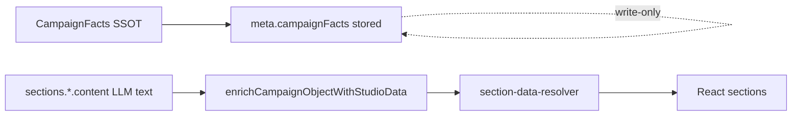
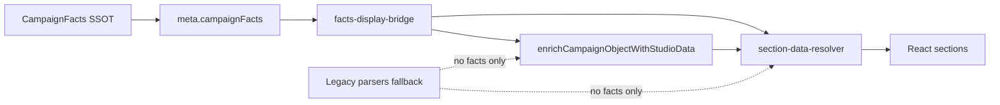

# Campaign Facts Migration Report

**Release:** 1.1.1  
**Date:** 2026-07-04  
**Status:** Automated validation complete — **manual QA pending on new Coca-Cola + BabyJoy campaigns**

---

## Objective

CampaignFacts + Campaign Director are the **only source of truth** for factual fields on newly generated campaigns. Legacy text parsers remain as fallbacks when `meta.campaignFacts` is absent.

---

## Before / After Data Flow

### Before (display bypass)

### After (facts-first display)

---

## Bypasses Removed (by field)

### Budget

| File | Function | Change |
|------|----------|--------|
| `features/campaign-intelligence/services/studio-section-data-builders.ts` | `enrichCampaignObjectWithStudioData` | Reads `meta.campaignFacts` first; builds budget from facts |
| `features/campaign-intelligence/services/studio-section-data-builders.ts` | `buildSummarySectionData` | Skips text re-parse when facts present |
| `features/campaign-intelligence/services/structured-section-builders.ts` | `buildBudgetSectionData` | Facts-first when `stateData.campaignFacts` present |
| `features/campaign-intelligence/services/section-updaters.ts` | `deriveSectionUpdatesFromTask` | Uses `buildBudgetSectionDataFromFacts` at write time |
| `features/campaign-intelligence/services/section-updaters.ts` | `applySummarySectionsToCampaignObject` | Facts-first budget binding |
| `features/campaign-studio/services/section-data-resolver.ts` | `resolveBudgetData` | Facts override LLM-parsed totals |
| `features/campaign-director/integrations/section-builder-integration.ts` | `applyDirectorBudgetRules` | Passes `campaignFacts` to budget rules |
| `features/ai-workflows/engine/continuation.ts` | `mergeTaskResultIntoState` | No longer overwrites facts-seeded `budgetTotal` |

### Currency

| File | Function | Change |
|------|----------|--------|
| `features/campaign-studio/services/section-data-resolver.ts` | `resolveCampaignObjectCurrency` | Reads `facts.budget.currency` first |
| `features/campaign-intelligence/services/studio-section-data-builders.ts` | `buildSummarySectionData` | Uses facts currency via `applyFactsToSummaryData` |
| `features/ai-workflows/engine/continuation.ts` | `mergeTaskResultIntoState` | Skips LLM currency overwrite when facts seeded |

### Duration / Timeline

| File | Function | Change |
|------|----------|--------|
| `features/campaign-director/facts/facts-display-bridge.ts` | `buildTimelineSectionDataFromFacts` | Director timeline from facts duration |
| `features/campaign-intelligence/services/studio-section-data-builders.ts` | `enrichCampaignObjectWithStudioData` | Uses `resolveFactsDurationWeeks` |
| `features/campaign-studio/services/timeline-duration.ts` | `resolveCampaignDurationWeeks` | Accepts optional `campaignFacts` param |
| `features/campaign-studio/services/section-data-resolver.ts` | `resolveTimelineData` | Facts duration takes precedence |
| `features/campaign-intelligence/services/section-updaters.ts` | `deriveSectionUpdatesFromTask` | Timeline from facts at write time |

### Brand / Client

| File | Function | Change |
|------|----------|--------|
| `features/campaign-director/facts/facts-display-bridge.ts` | `applyFactsToSummaryData` | Binds `brandName` / `clientName` from facts |
| `features/campaign-intelligence/services/studio-section-data-builders.ts` | `buildSummarySectionData` | Early return with facts — no `parseBrandFromText` |
| `features/campaign-studio/services/section-data-resolver.ts` | `resolvePresentationData` | Facts brand via `getCampaignFactsOrLegacy` |
| `features/ai-workflows/engine/continuation.ts` | `mergeTaskResultIntoState` | No LLM brand overwrite when facts seeded |

### Campaign Objective

| File | Function | Change |
|------|----------|--------|
| `features/campaign-director/facts/facts-display-bridge.ts` | `applyFactsToSummaryData` | Binds `facts.objective` |
| `features/campaign-intelligence/services/studio-section-data-builders.ts` | `buildSummarySectionData` | Skips `parseObjectiveFromText` when facts present |

### Creator Mix

| File | Function | Change |
|------|----------|--------|
| `features/campaign-director/facts/facts-display-bridge.ts` | `buildCreatorMixFromFacts` | Industry-tier strategy from facts |
| `features/campaign-intelligence/services/studio-section-data-builders.ts` | `buildStrategySectionData` | Uses facts creator mix |
| `features/campaign-studio/services/section-data-resolver.ts` | `resolveCreatorMix` | Facts/strategy tiers before `MIX_BY_INDUSTRY` |
| `features/campaign-studio/services/presentation-intelligence.ts` | `deriveCreatorMix` | Accepts `tierStrategy` param |

### KPIs

| File | Function | Change |
|------|----------|--------|
| `features/campaign-director/facts/facts-display-bridge.ts` | `buildGroundedKpisFromFacts` | Maps `facts.kpis` to grounded KPIs |
| `features/campaign-intelligence/services/studio-section-data-builders.ts` | `buildPerformanceSectionData` | Facts KPIs before `getGroundedKpis` templates |
| `features/campaign-studio/services/section-data-resolver.ts` | `resolveGroundedKpis` | Reads facts KPIs first |
| `features/campaign-intelligence/services/section-updaters.ts` | `deriveSectionUpdatesFromTask` | KPI section from facts at write time |

---

## New Central Module

`features/campaign-director/facts/facts-display-bridge.ts` — minimal facts-first accessors:

- `getCampaignFacts` / `hasCampaignFacts` / `getCampaignFactsOrLegacy`
- `buildBudgetSectionDataFromFacts` / `buildTimelineSectionDataFromFacts`
- `applyFactsToSummaryData` / `buildGroundedKpisFromFacts` / `buildCreatorMixFromFacts`

---

## Remaining Legacy Compatibility Paths

These paths activate **only when `meta.campaignFacts` is absent** (legacy campaigns):

| Field | Fallback |
|-------|----------|
| Budget | `buildBudgetSectionData` → `parseBudgetAmount` / `state.data.budgetTotal` |
| Currency | `detectCurrencyFromText` / `resolveCampaignObjectCurrency` text cascade |
| Duration | `parseDurationFromText` / `parseDurationWeeks` on summary/strategy text |
| Brand | `parseBrandFromText` hardcoded list |
| Client | `resolveClientFromBrief` hardcoded list |
| Objective | `parseObjectiveFromText` / `deriveExecutiveStrategyFields` |
| Creator Mix | `MIX_BY_INDUSTRY` templates in `presentation-intelligence.ts` |
| Timeline | `buildTimelineSectionData` LLM regex + 4-week defaults |
| KPIs | `getGroundedKpis` industry templates |

---

## Bypass Count Summary

| Metric | Count |
|--------|-------|
| Total bypass locations (audit) | 91 |
| Priority top-5 bypasses fixed | 5 |
| Display-path facts-first bindings added | ~35 |
| Remaining legacy-only paths | ~56 (intentional fallbacks + out-of-scope modules) |

**Note:** Remaining paths include Decision Workspace, Discovery, Creator DNA (explicitly out of scope), React component direct reads, and generation-only hops that do not affect display for facts-bound campaigns.

---

## Validation

**Script:** `scripts/validate-campaign-facts-migration.mjs`

**Automated checks:**
- BabyJoy + Coca-Cola fixtures with `meta.campaignFacts`
- Assert display resolvers return facts values (budget, currency, duration, brand, objective, creator mix, timeline)
- Legacy campaign without facts resolves via fallback without crash
- Runs through `enrichCampaignObjectWithStudioData` + key resolvers

**Result:** `docs/intelligence/campaign-facts-migration-validation-results.json` — **21/21 automated checks passed**

**Manual QA:** Required on new Coca-Cola + BabyJoy campaigns in Campaign Studio UI — **not claimed PASS**.

---

## Related Documents

- `docs/intelligence/CAMPAIGN_FACTS_DEPENDENCY_AUDIT.md`
- `docs/intelligence/CAMPAIGN_FACTS_MIGRATION_TABLE.md`
- `docs/intelligence/CAMPAIGN_FACTS_LAYER.md`
