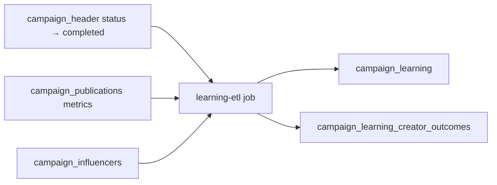
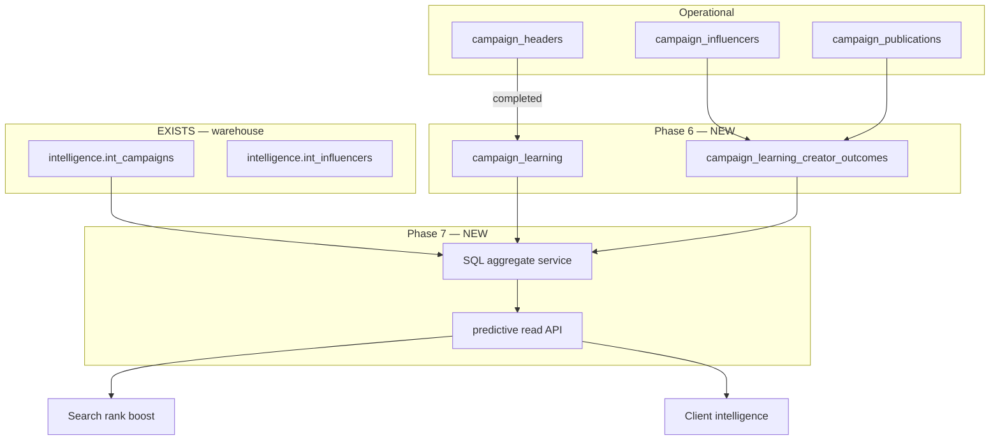

# Campaign Learning & Predictive Intelligence — Release 1.2

**Status:** Specification (Phase 6 + 7)  
**Parent:** [RELEASE_1_2_ARCHITECTURE.md](./RELEASE_1_2_ARCHITECTURE.md)

---

## Purpose

**Phase 6 — Campaign Learning:** Persist structured outcomes from **completed operational campaigns** (not in-flight drafts) to build an evidence base for future recommendations.

**Phase 7 — Predictive Intelligence:** Expose **historical-data-only** forecasts and benchmarks. Never invent metrics, ROI, or performance numbers when history is insufficient.

Both phases are **read extensions** for search/ranking and client intelligence — they do **not** modify Campaign Director, Debate, or CampaignFacts generation logic in Release 1.1.

---

## Phase 6 — Campaign Learning

### What to store

When a `campaign_header` reaches a completed/closed operational state, capture:

| Outcome group | Fields | Source |
|---------------|--------|--------|
| **Campaign summary** | `campaign_header_id`, `brand_id`, `client_id`, industry, country, budget, duration, objective | Operational DB |
| **Financial actuals** | Revenue, cost, GP, margin at line level (aggregated) | `campaign_lines` |
| **Creator performance** | Per-assignment: influencer_id, deliverables completed, reach, engagement, EMV if tracked | `campaign_influencers`, publications, metrics sync |
| **Quality signals** | Client satisfaction flag, renewal intent, brief adherence score | Manual / workflow (optional) |
| **Search context** | Original NL brief, intent snapshot, creators recommended vs selected | `search_intent_log` (Phase 3) |

### Proposed schema (NEW)

```sql
-- campaign_learning — one row per completed campaign header
CREATE TABLE public.campaign_learning (
  id uuid PRIMARY KEY DEFAULT gen_random_uuid(),
  campaign_header_id uuid NOT NULL REFERENCES public.campaign_headers (id),
  brand_id uuid REFERENCES public.brands (id),
  client_id uuid REFERENCES public.clients (id),
  completed_at timestamptz NOT NULL,
  outcomes jsonb NOT NULL DEFAULT '{}'::jsonb,
  -- outcomes shape: { objective, budget_actual, duration_days, markets[], platforms[] }
  aggregate_metrics jsonb NOT NULL DEFAULT '{}'::jsonb,
  -- { total_reach, avg_engagement_rate, total_emv, deliverable_completion_rate }
  intent_snapshot jsonb,
  source_version integer NOT NULL DEFAULT 1,
  created_at timestamptz NOT NULL DEFAULT now(),
  CONSTRAINT campaign_learning_header_key UNIQUE (campaign_header_id)
);

-- campaign_learning_creator_outcomes — per vendor assignment
CREATE TABLE public.campaign_learning_creator_outcomes (
  id uuid PRIMARY KEY DEFAULT gen_random_uuid(),
  campaign_learning_id uuid NOT NULL REFERENCES public.campaign_learning (id) ON DELETE CASCADE,
  influencer_id uuid NOT NULL REFERENCES public.influencers (id),
  campaign_influencer_id uuid REFERENCES public.campaign_influencers (id),
  line_id uuid REFERENCES public.campaign_lines (id),
  performance jsonb NOT NULL DEFAULT '{}'::jsonb,
  -- { reach, impressions, engagement_rate, likes, comments, views, cost, cpv, cpe }
  dna_snapshot_id uuid REFERENCES public.creator_dna_versions (id),
  created_at timestamptz NOT NULL DEFAULT now()
);
```

### ETL trigger points (proposed)



Implementation location (proposed): `features/campaign-learning/services/outcome-writer.ts` — triggered by campaign status transition hook or nightly cron.

### Relationship to intelligence warehouse (EXISTS)

| Layer | Schema | Role |
|-------|--------|------|
| Historical import | `intelligence.historical_campaigns_raw` | Pre-2026 sheet data |
| Warehouse dims | `intelligence.int_campaigns`, `int_clients`, `int_influencers` | Analytics / benchmarks |
| Operational learning | `campaign_learning` (**NEW**) | Live platform campaign outcomes |

Bridge: `int_campaigns.resolved_*_id` ↔ operational IDs with match confidence (pattern from warehouse migration).

**Gap:** Warehouse exists but is **not wired** to live campaign completion events. Phase 6 closes this loop for post-2026 operational campaigns.

---

## Phase 7 — Predictive Intelligence

### Principles

| Rule | Enforcement |
|------|-------------|
| **P7-1** | Predictions require minimum historical sample size (configurable per metric) |
| **P7-2** | Return `insufficient_data: true` — never interpolate or LLM-generate numbers |
| **P7-3** | Models consume `campaign_learning` + `intelligence.int_campaigns` + DNA snapshots only |
| **P7-4** | Predictive outputs are **read-only signals** for search rank boost — not Campaign Director inputs in 1.2 |
| **P7-5** | All predictions include `{ source, sample_size, confidence, computed_at }` metadata |

### Predictive outputs (target API)

| Signal | Input history | Output |
|--------|---------------|--------|
| Expected engagement band | Past creator outcomes in same industry/country | `{ p25, p50, p75 }` or null |
| Brand vertical benchmark | `campaign_learning` aggregates by brand category | Median CPE/CPV for category |
| Creator repeat performance | Creator's past `campaign_learning_creator_outcomes` | Trend direction (↑/→/↓) |
| Budget efficiency score | Historical budget vs reach for similar campaigns | Percentile rank |

### Minimum data requirements

| Metric | Min campaigns | Min creator appearances |
|--------|---------------|-------------------------|
| Industry engagement benchmark | 5 | — |
| Creator performance forecast | — | 2 completed assignments |
| Brand category CPE | 10 | — |
| Geo market reach | 3 in same country | — |

When below threshold → `{ value: null, insufficient_data: true, reason: "..." }`.

### Code placeholder (EXISTS — gap)

`lib/creators/historical-metrics.ts`:

```typescript
export async function loadInternalHistoricalMetrics(
  _supabase: SupabaseClient,
  _influencerId: string
): Promise<CreatorHistoricalMetrics> {
  // Placeholder until influencer_metrics_history table is added
  return { followers: [], engagement_rate: [], posting_frequency: [] };
}
```

Release 1.2 adds:

- `influencer_metrics_history` table (time-series from IPL/enrichment)
- `features/predictive-intelligence/services/historical-forecast.ts` (proposed)
- Read API: `GET /api/intelligence/predictive?...` (proposed, read-only)

### Predictive rank integration (Phase 7 → Phase 3)

Optional +5% rank boost in search when:

- Creator has ≥2 positive historical outcomes in same industry
- Boost capped; never overrides DNA quality floor

**Not in scope:** ML model training pipeline — Release 1.2 uses SQL aggregates and percentiles only.

---

## No Fabrication Rule

Explicit prohibitions (aligned with enrichment policy):

| Prohibited | Allowed alternative |
|------------|---------------------|
| Invent audience demographics | NULL + verification required |
| Estimate campaign ROI without history | `insufficient_data` response |
| Generate "typical CPE" from LLM | SQL aggregate from `campaign_learning` only |
| Backfill missing publication metrics | Leave NULL; flag in outcome record |
| Use Debate/Director to guess benchmarks | Frozen — not invoked for predictions |

Reference: `lib/creator-enrichment/service.ts` — "Demographics are intentionally NOT written here: Apify does not provide audience demographics, and we NEVER invent them."

---

## Data Flow (Phases 6 + 7)



---

## Gap Analysis

| Item | Exists | Gap |
|------|--------|-----|
| Operational campaign data | ✅ | — |
| Publication metrics sync | ✅ | Not aggregated into learning store |
| Warehouse historical campaigns | ✅ | Not linked to live completion events |
| `campaign_learning` table | ❌ | Phase 6 migration |
| Creator outcome rows | ❌ | Phase 6 migration |
| `influencer_metrics_history` | ❌ | Referenced as placeholder |
| Predictive read service | ❌ | Phase 7 |
| LLM benchmark generation | Never existed | Explicitly forbidden |

---

## Validation Fixtures — Phase 6 + 7

Release 1.2 validation **will test** (not claim PASS):

| Fixture | Learning test | Predictive test |
|---------|---------------|-----------------|
| BabyJoy | Store baby care EG campaign outcome | Industry benchmark if ≥5 historical baby campaigns |
| Coca-Cola | Beverage engagement aggregates | Gen Z platform mix percentile |
| Samsung | Multi-platform deliverable completion | Tech category CPE benchmark |
| L'Oréal | Beauty/skincare creator outcomes | Audience alignment retrospective |
| Visit Egypt | Tourism campaign reach | Geo EG tourism benchmark |
| Netflix | Entertainment campaign (if completed) | insufficient_data when N<5 |
| Talabat | Food delivery geo campaign | Market-specific reach band |
| Adidas | Sports campaign (ERS-1 extended) | Fitness creator repeat performance |
| Red Bull | Extreme sports outcomes | Niche sample size guard |
| Emirates NBD | Finance campaign | Finance vertical — likely insufficient_data initially |

---

## Manual QA Checklist

### Phase 6

- [ ] Completing a test campaign creates exactly one `campaign_learning` row
- [ ] Each assigned creator has a `campaign_learning_creator_outcomes` row
- [ ] Missing publication metrics stored as null (not zero, not estimated)
- [ ] Re-running ETL is idempotent (same header → upsert, no duplicates)
- [ ] DNA snapshot reference points to valid `creator_dna_versions` row

### Phase 7

- [ ] Forecast API returns `insufficient_data` for Netflix with empty history
- [ ] Forecast with sufficient history includes `sample_size` and `confidence`
- [ ] No numeric prediction fields in API response when sample below minimum
- [ ] Search rank boost disabled when predictive confidence < 0.5
- [ ] Campaign Director workflow unchanged (no new predictive tool calls)

---

## Implementation Checklist

### Phase 6

1. [ ] Migration: `campaign_learning`, `campaign_learning_creator_outcomes`
2. [ ] `features/campaign-learning/services/outcome-writer.ts`
3. [ ] Hook on campaign status → completed (or cron backfill)
4. [ ] Aggregate metrics from publications + assignments
5. [ ] Link to `search_intent_log` when available

### Phase 7

1. [ ] Migration: `influencer_metrics_history`
2. [ ] Implement `loadInternalHistoricalMetrics` with real data
3. [ ] `features/predictive-intelligence/services/aggregate-forecast.ts`
4. [ ] Read API with `insufficient_data` contract
5. [ ] Optional search rank boost (feature-flagged)
6. [ ] Validator: assert no fabricated numbers in API responses

---

## Success Criteria

| ID | Criterion |
|----|-----------|
| CL-1 | 100% of test completed campaigns produce learning rows |
| CL-2 | Creator outcomes reference real publication metrics only |
| CL-3 | Predictive API never returns numbers when sample below minimum |
| CL-4 | All predictions include provenance metadata |
| CL-5 | Release 1.1 intelligence validators remain PASS |
