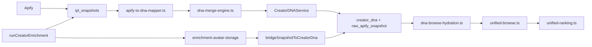

# Creator DNA Implementation — Release 1.2 Phase 2

**Status:** Implemented (validation WILL TEST — not PASS)  
**Spec:** [CREATOR_DNA_SPECIFICATION.md](./CREATOR_DNA_SPECIFICATION.md)  
**Migration:** `supabase/migrations/20260705120000_creator_dna_phase2_extensions.sql`

---

## Architecture



Creator DNA is the **canonical intelligence document** per influencer (`creator_dna.document` jsonb). Pre-promotion profiles use `creator_dna_staging`. Browse and ranking consume DNA via `hydrateCreatorsWithDna` — platform accounts remain fallback only. **No Apify call on browse read** when DNA exists.

---

## Enrichment → DNA flow (one path)

1. `runCreatorEnrichment` calls `fetchProfileWithIpl` with `deferDnaBridge: true` (single Apify fetch).
2. IPL `persistSnapshot` stores `raw_snapshot` + `normalized_snapshot` in `ipl_snapshots`.
3. Enrichment merges platform-account fields + persists avatar via `syncEnrichmentAvatarToStorage` (uploaded source).
4. **`await bridgeSnapshotToCreatorDna(snapshotId, { avatarUrlOverride })`** — maps full snapshot → DNA, upserts `creator_dna` row including `raw_apify_snapshot`, `enriched_at`, `apify_run_id`, `dna_completeness_score`.
5. Browse/shortlists read from `creator_dna` via `hydrateCreatorsWithDna` (no second Apify request).

Import path (`apify-import-pipeline.ts`) uses the same bridge after `persistSnapshot` (awaits by default).

---

## Apify → DNA field mapping

| Apify / normalized field | DNA section.path | Row column |
|--------------------------|------------------|------------|
| `displayName` | `identity.displayName` | — |
| `bio` | `identity.bio` | — |
| `profilePictureUrl` / storage URL | `identity.avatarUrl` | — |
| `username` | `identity.handle`, `content.username` | — |
| `platform` | `identity.platform`, `platforms.primaryPlatform` | — |
| `profileUrl` | `content.profileUrl` | — |
| `isVerified` | `identity.isVerified` | — |
| `followers` | `metrics.followers`, `platforms.crossPlatformReach` | — |
| `following` | `metrics.following` | — |
| `postsCount` | `metrics.postsCount` | — |
| `engagementRate` | `metrics.engagementRate` | — |
| `avgLikes` / `avgComments` / `avgViews` | `metrics.*` | — |
| `audienceCountry` | `audience.country`, `audience.countries` | — |
| `categories` | `audience.categories`, `audience.interests` | — |
| `hashtags` / `mentions` | `audience.hashtags`, `audience.mentions` | — |
| `recentPublications[]` | `content.recentPublications` | — |
| `contactEmail` / `contactPhone` / `contactLinks` | `contact.*` | — |
| `apifyRunId` | `meta.apifyRunId` (document) | `creator_dna.apify_run_id` |
| Full `profileRows` + `postRows` + run ids | — | `creator_dna.raw_apify_snapshot` |
| IPL `fetchedAt` | `meta.fetchedAt` | `creator_dna.enriched_at` |

Mapper: `features/creator-dna/services/apify-to-dna-mapper.ts` (`APIFY_DNA_FIELD_PATHS`).

---

## DNA Schema (Phase 2 sections)

| Section | Purpose |
|---------|---------|
| `identity` | Display name, bio, avatar, handle, platform, verified flag |
| `platforms` | Primary platform, account count, cross-platform reach |
| `metrics` | Followers, engagement, averages (envelope + confidence) |
| `audience` | Country, cities, languages, categories, interests, hashtags; **demographics nullable** |
| `contact` | Email, phone, links |
| `commercial` | Rate, deliverables, frequency, response speed, brand history, exclusivity |
| `brandSafety` | Sensitive topics, political risk, adult/copyright flags, fake followers, engagement quality |
| `historicalPerformance` | Campaign counts, ROI, repeat rate, on-time delivery |
| `scores` | Thinkway, brand fit, authenticity, AI category/niche |
| `meta` | Snapshot lineage, platform account IDs, document version |

### Audience demographics — Verification Required

Fields `audienceGender`, `audienceAgeBands`, `audienceCities`, `languagePrimary` are **never populated from Apify/IPL**. When missing or `confidence < 0.5`, completeness engine adds them to `verificationRequired[]`. UI should show **"Verification required"**.

---

## Merge Rules

**Tier priority:** Verified (`manual`, `campaign`, `oauth`) > Imported (`ipl`) > Inferred (`ai_infer`) > Empty

Implementation: `features/creator-dna/services/dna-merge-engine.ts`

1. Empty incoming never replaces non-empty higher-tier value.
2. Verified values are never overwritten by inferred candidates (history still appended).
3. Same-tier conflicts use composite score from `conflict-resolver.ts` (source priority × 0.55 + confidence × 0.45).
4. Field-level confidence stored on each envelope; cached `dna_completeness_score` on row update.

Apify import path: `apify-import-pipeline.ts` → IPL snapshot → `bridgeSnapshotToCreatorDna` → merge engine.

---

## Completeness Algorithm

`features/creator-dna/services/dna-completeness-engine.ts`

Scores **0–100** as sum of eight equal-weight dimensions (12.5 pts each):

| Dimension | Key fields |
|-----------|------------|
| Identity | displayName, bio, avatar, handle, platform |
| Platforms | primaryPlatform, accountCount, platformAccountIds |
| Audience | country, languages, interests |
| Categories | categories, aiCategory, aiNiche |
| Content | bio, hashtags, mentions, postsCount |
| Commercial | estimatedRate, deliverables, brand categories |
| Quality | authenticity, engagement quality, engagement rate |
| Historical Performance | campaigns, ROI, repeat rate |

Returns: `{ dnaCompleteness, dimensionScores, missingFields[], verificationRequired[] }`.

---

## Ranking Impact

`lib/creators/unified-ranking.ts` — priority weights:

| Signal | Weight |
|--------|--------|
| Brand fit | 22% |
| Audience match | 18% |
| Category match | 14% |
| Creator quality | 12% |
| Availability | 10% |
| Historical performance | 8% |
| Thinkway score | 8% |
| DNA completeness | 6% |
| Follower support | 2% |

Follower count is a **supporting metric only** (`followerSupportScore`, log-scaled).

Browse hydration: `lib/creators/dna-browse-hydration.ts` loads `creator_dna` / `creator_dna_staging` and overlays DNA onto `UnifiedCreatorResult` before ranking.

---

## Validation

```bash
node scripts/validate-creator-dna-phase2.mjs
node scripts/validate-creator-dna-enrichment-persist.mjs
npx tsx features/creator-dna/services/dna-merge-engine.test.ts
npx tsx features/creator-dna/services/dna-completeness-engine.test.ts
npm run build
npx tsc --noEmit
```

Fixtures registered (not PASS): BabyJoy, Coca-Cola, Samsung, L'Oréal, Visit Egypt, Netflix, Talabat, Adidas, Red Bull, Emirates NBD.

Results: `docs/release/1.2/creator-dna-phase2-validation-results.json`

---

## Manual QA Checklist

- [ ] Import Apify profile → `creator_dna` or staging row created with envelopes
- [ ] Manual edit on influencer → DNA manual source wins on re-import
- [ ] Browse `/discovery` AI path ranks by brand fit, not raw followers
- [ ] Creator card shows low completeness when demographics missing
- [ ] Staging promotion merges without duplicate influencers
- [ ] Verified display name not overwritten after IPL refresh

---

## Remaining Gaps

1. **Demographics providers** — Modash/HypeAuditor/CreatorIQ not wired; audience gender/age remain null.
2. **Commercial DNA backfill** — Requires campaign assignment + finance integration.
3. **Historical performance** — Needs campaign_learning Phase 7 models.
4. **UI badges** — Completeness + verification badges on discovery cards (checklist item 5 in spec).
5. **Backfill job** — Influencers with IPL snapshots but no `creator_dna` row (checklist item 3).
6. **Live fixture QA** — Ten brand fixtures registered; live PASS not claimed.

---

## Files Changed (Phase 2)

| Area | Files |
|------|-------|
| Types | `features/creator-dna/types/index.ts`, `lib/domains/creator/types.ts` |
| Mapper | `features/creator-dna/services/apify-to-dna-mapper.ts`, `ipl-snapshot-mapper.ts` |
| Engines | `dna-completeness-engine.ts`, `dna-merge-engine.ts`, tests |
| Service | `creator-dna-service.ts`, `document-factory.ts`, `creator-dna-writer.ts` |
| Enrichment | `lib/creator-enrichment/service.ts`, `enrichment-avatar-storage.ts` |
| IPL bridge | `lib/intelligence-persistence/services/snapshot-service.ts`, `dna-bridge.ts` |
| Browse | `lib/creators/dna-browse-hydration.ts`, `unified-browse.ts`, `unified-ranking.ts` |
| Import | `lib/discovery/apify-import-pipeline.ts` |
| Migration | `20260705120000_creator_dna_phase2_extensions.sql`, `20260705200000_creator_dna_apify_persistence.sql` |
| Validation | `scripts/validate-creator-dna-phase2.mjs`, `scripts/validate-creator-dna-enrichment-persist.mjs` |
