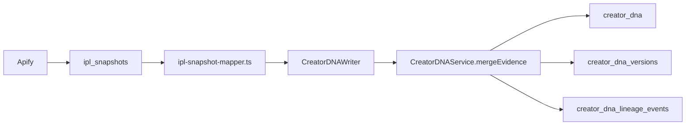
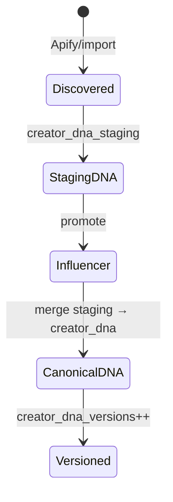

# Creator DNA Specification — Release 1.2

**Status:** Specification aligned with Phase 2  
**Parent:** [RELEASE_1_2_ARCHITECTURE.md](./RELEASE_1_2_ARCHITECTURE.md)  
**Migration:** `supabase/migrations/20260704120000_creator_dna.sql`  
**Types:** `features/creator-dna/types/index.ts`

---

## Purpose

Creator DNA is the **permanent, canonical intelligence document** for each creator (`influencers.id`). It consolidates identity, metrics, audience, contact, and scores from IPL snapshots, enrichment, campaigns, OAuth, manual edits, and AI inference — with full provenance and **never-downgrade merge rules**.

Pre-promotion creators live in `creator_dna_staging` keyed by `discovered_profiles.id`.

---

## Document Schema

Each field uses the **FieldEnvelope** shape:

```typescript
type FieldEnvelope<T> = {
  value: T;
  confidence: number;        // 0..1
  source: DnaSource;
  sourceVersion?: string | number | null;
  updatedAt: string;
  history: FieldHistoryEntry<T>[];
};
```

### Source priority

```typescript
type DnaSource = "manual" | "campaign" | "oauth" | "ipl" | "ai_infer";

// Priority: manual(5) > campaign(4) > oauth(3) > ipl(2) > ai_infer(1)
```

### Sections (aligned with Phase 2 user fields)

#### `identity`

| Field | Type | Phase 2 | Mapped in codebase |
|-------|------|---------|-------------------|
| `displayName` | `string \| null` | ✅ | ✅ `CreatorDNAIdentity.displayName` |
| `bio` | `string \| null` | ✅ | ✅ |
| `avatarUrl` | `string \| null` | ✅ | ✅ |
| `handle` | `string \| null` | ✅ | ✅ |
| `platform` | `string \| null` | ✅ Primary platform | ✅ |
| `isVerified` | `boolean \| null` | ✅ | ✅ |

#### `metrics`

| Field | Type | Phase 2 | Notes |
|-------|------|---------|-------|
| `followers` | `number \| null` | ✅ | IPL confidence ~0.88 in ERS-4 |
| `following` | `number \| null` | ✅ | |
| `postsCount` | `number \| null` | ✅ | |
| `engagementRate` | `number \| null` | ✅ | Percentage |
| `avgLikes` | `number \| null` | ✅ | |
| `avgComments` | `number \| null` | ✅ | |
| `avgViews` | `number \| null` | ✅ | |

#### `audience`

| Field | Type | Phase 2 | Notes |
|-------|------|---------|-------|
| `country` | `string \| null` | ✅ ISO-2 | |
| `categories` | `string[]` | ✅ Content categories | |
| `hashtags` | `string[]` | ✅ | |
| `mentions` | `string[]` | ✅ | |
| `interests` | `string[]` | ✅ | |

**Verification Required (not in current DNA document — Phase 2 extensions):**

| Field | Type | Status | Notes |
|-------|------|--------|-------|
| `audienceGender` | `{ male: number; female: number } \| null` | **NEW — proposed** | Requires Modash/HypeAuditor; never Apify-invented |
| `audienceAgeBands` | `Record<string, number> \| null` | **NEW — proposed** | Same provider constraint |
| `audienceCities` | `string[]` | **NEW — proposed** | Top cities when provider available |
| `languagePrimary` | `string \| null` | **NEW — proposed** | From bio/signals or provider |

These fields should be added to `CreatorDNAAudience` as optional envelopes with `verification_required: true` when source is not a demographics provider.

#### `contact`

| Field | Type | Phase 2 |
|-------|------|---------|
| `email` | `string \| null` | ✅ |
| `phone` | `string \| null` | ✅ |
| `links` | `string[]` | ✅ |

#### `scores`

| Field | Type | Phase 2 | Notes |
|-------|------|---------|-------|
| `thinkwayScore` | `number \| null` | ✅ | From `lib/creators/thinkway-score.ts` |
| `brandFit` | `number \| null` | ✅ | Campaign-contextual in future |
| `authenticityScore` | `number \| null` | ✅ | |
| `aiCategory` | `string \| null` | ✅ | |
| `aiNiche` | `string \| null` | ✅ | |

#### `meta`

| Field | Type | Purpose |
|-------|------|---------|
| `lastSnapshotId` | `uuid \| null` | Latest IPL snapshot |
| `lastEnrichmentRunId` | `uuid \| null` | Latest enrichment run |
| `platformAccountIds` | `uuid[]` | Linked accounts |
| `documentVersion` | `number` | Logical version |
| `lastMergedAt` | `string \| null` | Last merge timestamp |

---

## Database Mapping

| Table | PK | Purpose |
|-------|-----|---------|
| `creator_dna` | `influencer_id` | Canonical document (`document jsonb`) |
| `creator_dna_staging` | `id` (unique `discovered_profile_id`) | Pre-promotion |
| `creator_dna_versions` | `(influencer_id, version)` | Immutable history |
| `creator_dna_lineage_events` | `id` | Audit trail to IPL/enrichment |

**EXISTS** — all four tables deployed in migration `20260704120000_creator_dna.sql`.

---

## IPL → DNA Pipeline (EXISTS)



Key files:

- `features/creator-dna/writers/ipl-snapshot-mapper.ts` — maps ~21 IPL fields (ERS-4 verified)
- `features/creator-dna/writers/creator-dna-writer.ts` — routes to canonical or staging
- `features/creator-dna/services/creator-dna-service.ts` — merge + version bump
- `lib/intelligence-persistence/services/dna-bridge.ts` — IPL → DNA hook

---

## Merge Rules — Never Overwrite Good with Weaker

### Conflict resolution algorithm (EXISTS)

`features/creator-dna/services/conflict-resolver.ts`:

```
compositeScore = (sourcePriority / 5) × 0.55 + confidence × 0.45
```

Winner selection:

1. Highest composite score wins.
2. Tie → most recent `updatedAt`.
3. History append via `applyEnvelopeUpdate` — **previous values never deleted**.

### Downgrade prevention rules

| Scenario | Behavior |
|----------|----------|
| Manual edit (source=`manual`) vs IPL | Manual wins if composite score higher (always when confidence ≥ 0.5) |
| New IPL snapshot with lower confidence | Existing envelope retained |
| Empty incoming value | Never replaces non-empty higher-confidence value |
| Staging → promotion | Merge staging into canonical; staging history preserved in lineage |
| Enrichment merge (platform account) | `lib/creator-enrichment/merge.ts`: manual/imported never overwritten by Apify |

### Enrichment layer parallel rule (EXISTS)

From `lib/creator-enrichment/merge.ts`:

> Fill-missing-only: keep any non-empty value unless existing source is `apify` and incoming is also `apify` with fresher data.

Manual fields in `field_sources` jsonb on `influencers` / `influencer_platform_accounts` are **immutable** from automated merges.

---

## Hydration Read Path

| Consumer | File | Current | Target (1.2) |
|----------|------|---------|--------------|
| AI vendor cards | `features/creator-dna/services/creator-hydration-service.ts` | DNA → hydrated vendor | Default for all AI surfaces |
| Unified browse | `lib/creators/unified-browse.ts` | Reads platform accounts + scores | DNA-first with account fallback |
| Discovery detail | `features/discovery/enrichment/` | Enrichment status badges | DNA completeness indicator |

**Gap:** Browse still hydrates primarily from `influencer_platform_accounts` and `discovered_profiles`. Phase 2 completion requires DNA-first hydration in `fetchInternalCreators` / `fetchDiscoveryCreators`.

---

## Staging & Promotion Flow



Promotion triggers:

- Manual "Add to vendors" from Discovery
- Shortlist promote (`features/discovery/shortlists/promote.ts`)
- Campaign assignment linking

On promotion: `CreatorDNAService.promoteStaging(discoveredProfileId, influencerId)` merges staging document into canonical.

---

## Verification Required Fields

Fields that **must not be populated** without a verified provider:

| Field group | Allowed sources | Default when missing |
|-------------|-----------------|----------------------|
| Audience demographics | `modash`, `hypeauditor`, `creatoriq`, `manual` | `null` + envelope confidence 0 |
| Audience gender split | Same | `demographic_source = 'unavailable'` on influencer |
| Brand fit (campaign-specific) | `campaign`, `manual`, scored with brief context | Generic brand_fit from AI scores only |
| Predicted ROI | Phase 7 historical models only | `null` until campaign_learning data exists |

Display rule: UI shows **"Verification required"** badge when `confidence < 0.5` or source is `ai_infer` for demographic fields.

---

## ERS-4 Validation Status

**Release 1.1:** ERS-4 PASS (58/58 checks) for scenarios:

- Travel Egypt, BabyJoy, Luxury Dubai, Finance Emirates NBD, Visit Egypt Tourism
- Conflict resolution unit tests

**Release 1.2 will additionally test:**

- DNA hydration as browse primary source
- Audience extension fields remain NULL without provider
- Staging promotion merge integrity
- Adidas, Netflix, Talabat, Red Bull, Coca-Cola, Samsung, L'Oréal fixture profiles

---

## Implementation Checklist (Phase 2)

1. [ ] Extend `CreatorDNAAudience` with proposed demographic fields (nullable only).
2. [ ] DNA-first hydration in `unified-browse.ts`.
3. [ ] Backfill job: influencers with IPL snapshots but no `creator_dna` row.
4. [ ] Promotion merge tests for staging → canonical.
5. [ ] UI: DNA completeness + verification badges on creator cards.
6. [ ] Extend ERS-4 validator with Release 1.2 fixtures.

---

## Related Code References

```7:20:features/creator-dna/types/index.ts
export type DnaSource =
  | "manual"
  | "campaign"
  | "oauth"
  | "ipl"
  | "ai_infer";

export const DNA_SOURCE_PRIORITY: Record<DnaSource, number> = {
  manual: 5,
  campaign: 4,
  oauth: 3,
  ipl: 2,
  ai_infer: 1,
};
```

```25:76:features/creator-dna/services/conflict-resolver.ts
export function resolveConflicts<T>(
  current: FieldEnvelope<T> | undefined,
  candidates: DnaFieldCandidate<T>[]
): FieldEnvelope<T> {
  // ... composite score: source priority × 0.55 + confidence × 0.45
}
```
