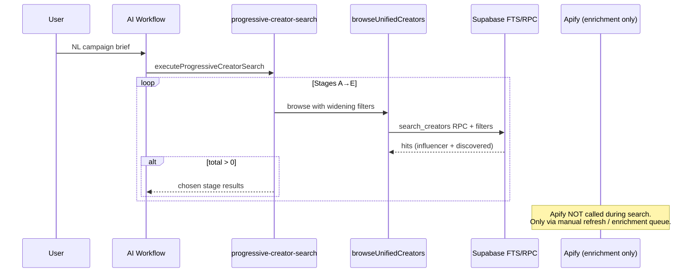

# Database-First Discovery — Release 1.2 Specification

**Status:** Target architecture (gap analysis included)  
**Parent:** [RELEASE_1_2_ARCHITECTURE.md](./RELEASE_1_2_ARCHITECTURE.md)

---

## Overview

Database-First Discovery ensures every user or AI search **queries Thinkway's operational creator catalog first** (`influencers` + `discovered_profiles` via unified browse). External providers (Apify) run **only when local coverage is insufficient**, never as the default path.

Release 1.1 already centralizes search on `browseUnifiedCreators()`. Release 1.2 adds an explicit **coverage gate** and **Apify fallback orchestration** without changing Campaign Director or Debate layers.

---

## Current vs Target Workflow

### Current (Release 1.1)



**Current behavior summary:**

- Search is **DB-only** via `lib/creators/unified-browse.ts` → `lib/creators/fts-search.ts` → `search_creators` RPC.
- Progressive search (`features/ai/tools/progressive-creator-search.ts`) stops at first stage with `total > 0` (not a quality/coverage threshold).
- Apify is invoked by `lib/creator-enrichment/service.ts` through the discovery worker — **on-demand enrichment**, not automatic search backfill.
- Discovery UI search (`features/discovery/components/creator-search/`) uses the same browse stack but a separate intent engine.

### Target (Release 1.2)

```mermaid
sequenceDiagram
  participant User
  participant Intent as NL Intent Parser
  participant BUC as browseUnifiedCreators
  participant DB as Supabase
  participant Cov as evaluateDiscoveryCoverage
  participant Audit as discovery_coverage_decisions
  participant Q as discovery-worker queue
  participant Apify as Apify
  participant DNA as Creator DNA Writer

  User->>Intent: query / brief
  Intent->>BUC: filters + semantic search
  BUC->>DB: DB-first query
  DB-->>BUC: creators[]
  BUC->>Cov: count, quality, DNA completeness
  alt coverage sufficient
    Cov-->>User: ranked DB results
    Cov->>Audit: decision=db_sufficient
  else coverage insufficient
    Cov->>Audit: decision=apify_fallback
    Cov->>Q: enqueue discovery/enrichment job
    Q->>Apify: fetch profiles for intent
    Apify->>DNA: normalize → dedupe → merge
    DNA->>DB: persist discovered_profiles / influencers
    Note over User: Return partial DB results immediately;<br/>refresh when enrichment completes (async).
  end
```

---

## Coverage Threshold Rules

Release 1.2 defines **"enough matching creators"** as a composite gate — not merely `total > 0`.

| Signal | Minimum (default) | Config key |
|--------|-------------------|------------|
| Raw match count | ≥ 10 creators | `DISCOVERY_COVERAGE_MIN_COUNT` |
| DNA completeness | ≥ 60% of matches have `creator_dna` row OR staging with confidence ≥ 0.7 | `DISCOVERY_COVERAGE_MIN_DNA_RATIO` |
| Category alignment | ≥ 50% of matches have ≥1 intent category in DNA/tags | `DISCOVERY_COVERAGE_MIN_CATEGORY_RATIO` |
| Country alignment | ≥ 70% match intent country when country specified | `DISCOVERY_COVERAGE_MIN_COUNTRY_RATIO` |
| Thinkway quality | Median Thinkway Score ≥ 40 | `DISCOVERY_COVERAGE_MIN_MEDIAN_SCORE` |

**Decision logic:**

```
sufficient = (
  count >= MIN_COUNT
  AND dna_ratio >= MIN_DNA_RATIO
  AND (no country OR country_ratio >= MIN_COUNTRY_RATIO)
  AND (no categories OR category_ratio >= MIN_CATEGORY_RATIO)
)
```

When `sufficient === false` and Apify is enabled → enqueue fallback job with intent payload.

**Progressive search change:** Stages A→E continue to widen filters, but the winning stage must pass `evaluateDiscoveryCoverage()`, not just `total > 0`.

---

## Rules 1–6 (Release 1.2 Discovery Policy)

| Rule | Statement | Current compliance |
|------|-----------|-------------------|
| **R1** | Always query DB (`browseUnifiedCreators` / `search_creators`) before any external provider | ✅ Search path is DB-only today |
| **R2** | Call Apify only when coverage evaluation fails | ❌ Apify is enrichment-triggered, not coverage-gated |
| **R3** | Never invent creators, metrics, or demographics | ✅ Enrichment + DNA layers use NULL / `unavailable` |
| **R4** | Dedupe creators at every pipeline boundary (ERS-1) | ✅ `lib/creators/dedupe-creators.ts`; offline ERS-1 PASS |
| **R5** | Record exactly one search execution per AI workflow task | ✅ Progressive search = one workflow search with internal stages |
| **R6** | Persist audit trail for DB vs Apify decisions | ❌ No `discovery_coverage_decisions` table yet |

---

## Integration Points (Existing Code)

| Concern | File path | Role in DB-first |
|---------|-----------|------------------|
| Unified browse SSOT | `lib/creators/unified-browse.ts` | Primary DB query; **insert coverage hook here** |
| FTS / RPC search | `lib/creators/fts-search.ts` | `search_creators` RPC wrapper |
| Dedupe | `lib/creators/dedupe-creators.ts` | Output dedupe by `unified_id` |
| Progressive widening | `features/ai/tools/progressive-creator-search.ts` | Stage A→E; **upgrade stop condition** |
| Campaign NL intent | `features/ai/tools/campaign-search-intent.ts` | Brief → filters for browse |
| Discovery UI intent | `features/discovery/components/creator-search/creator-search-intent-engine.ts` | Handle vs hybrid vs discovery mode |
| Discovery DB search API | `app/api/discovery/search/route.ts` | Direct `searchDiscoveredProfiles` (discovery-only subset) |
| Discovery profiles query | `lib/discovery/search.ts` | FTS on `discovered_profiles` |
| Database stats | `lib/discovery/database-stats.ts` | Coverage dashboard chips |
| Apify enrichment | `lib/creator-enrichment/service.ts` | Post-fetch merge engine |
| IPL cache-first | `lib/intelligence-persistence/services/fetch-orchestrator.ts` | Avoid redundant Apify calls |
| Discovery worker | `services/discovery-worker/src/workers/creator-enrichment.worker.ts` | **Apify fallback enqueue target** |
| DNA persist | `features/creator-dna/writers/creator-dna-writer.ts` | Save enriched evidence |
| ERS-1 validator | `features/ai-workflows/validate-creator-integrity.ts` | Integrity regression gate |

---

## Apify Fallback Job Shape (Proposed)

When coverage fails, enqueue a job (existing `creator-enrichment` or new `discovery-backfill` queue):

```typescript
type DiscoveryBackfillPayload = {
  intentId: string;           // search_intent_log.id
  query: string;
  country?: string;
  categories?: string[];
  platforms?: string[];
  minCount: number;           // from coverage config
  triggeredBy: "coverage_miss";
};
```

Worker responsibilities:

1. Resolve candidate profile URLs via Apify search actors (platform-specific).
2. Dedupe against `discovered_profiles` (platform + username unique constraint).
3. Persist IPL snapshot → normalize → `creator_dna_staging`.
4. Optionally auto-promote to `influencers` when quality gates pass.

**Important:** Fallback enriches the **database**, not the in-flight search response. UI shows async refresh pattern (existing enrichment status badges).

---

## Gap Summary

| Item | Exists | Needed |
|------|--------|--------|
| DB unified search | ✅ | — |
| Coverage evaluation function | ❌ | `lib/creators/discovery-coverage.ts` (proposed) |
| Coverage audit table | ❌ | Migration `discovery_coverage_decisions` |
| Apify on coverage miss | ❌ | Worker handler + queue wiring |
| Progressive threshold upgrade | ❌ | Replace `total > 0` with coverage gate |
| Unified intent SSOT | Partial | Merge campaign + discovery intent parsers |

---

## Implementation Checklist (Phase 1)

1. [ ] Add `discovery_coverage_decisions` migration.
2. [ ] Implement `evaluateDiscoveryCoverage(result, intent)` in `lib/creators/`.
3. [ ] Call evaluator at end of `browseUnifiedCreators` when `path === "ai"`.
4. [ ] Update `executeProgressiveCreatorSearch` stop condition.
5. [ ] Enqueue Apify backfill job on miss (feature-flagged).
6. [ ] Extend ERS-1 validator with coverage audit scenario.
7. [ ] Document env vars in `docs/infrastructure/ENVIRONMENT_MATRIX.md`.

---

## Validation (will test, not PASS)

| Fixture | DB-first test |
|---------|---------------|
| Visit Egypt | Travel + EG country — expect DB hits for tourism creators |
| BabyJoy | Parenting + EG — industry category expansion |
| Adidas | Sports UAE — ERS-1 Adidas scenario extended with coverage audit row |
| Netflix | Obscure entertainment niche — likely triggers Apify fallback |
| Talabat | Food delivery geo — tests country ratio gate |

See `scripts/validate-release-1-2-readiness.mjs` for structural readiness checks.
