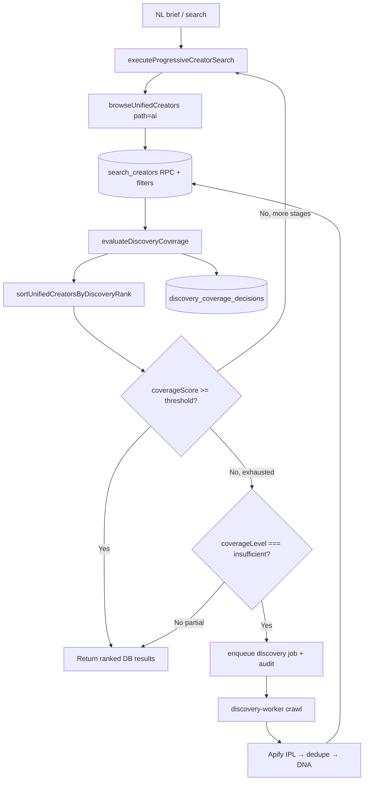

# Database-First Discovery — Implementation Report (Release 1.2 Phase 1)

**Status:** Implemented — validation WILL TEST, **does not claim PASS**  
**Date:** 2026-07-05  
**Parent:** [DATABASE_FIRST_DISCOVERY.md](./DATABASE_FIRST_DISCOVERY.md) · [RELEASE_1_2_ARCHITECTURE.md](./RELEASE_1_2_ARCHITECTURE.md)

---

## Architecture



### Components

| Module | Path | Role |
|--------|------|------|
| Coverage evaluator | `lib/creators/discovery-coverage.ts` | Composite 0–100 score + level |
| Browse hook | `lib/creators/unified-browse.ts` | AI-path ranking + coverage on return |
| Progressive search | `features/ai/tools/progressive-creator-search.ts` | Stage stop condition + Apify gate |
| Audit writer | `lib/creators/discovery-coverage-audit.ts` | Persist decision rows |
| Backfill enqueue | `lib/discovery/coverage-backfill.ts` | Queue job only when insufficient |
| Apify import pipeline | `lib/discovery/apify-import-pipeline.ts` | Normalize → dedupe → IPL → DNA |
| Unified ranking | `lib/creators/unified-ranking.ts` | Thinkway / brand fit sort |

---

## Coverage Algorithm

Weighted composite score (0–100) from:

| Signal | Weight | Default gate |
|--------|--------|--------------|
| Creator count | 25% | ≥ `DISCOVERY_COVERAGE_MIN_COUNT` (10) |
| Country match | 15% | ≥ 70% when country specified |
| Category match | 15% | ≥ 50% when categories specified |
| Platform match | 10% | ≥ 50% when platforms specified |
| Audience overlap | 10% | keyword overlap in bio/tags |
| Budget / followers | 10% | min/max follower filters |
| DNA completeness proxy | 10% | ≥ 60% with confidence / enrichment |
| Median Thinkway Score | 10% | ≥ 40 |
| Intent confidence | 5% | optional parser confidence |

**Levels:**

- `excellent` — score ≥ 90  
- `good` — score ≥ 80 (default progressive stop threshold)  
- `partial` — score ≥ 50 and < 80  
- `insufficient` — score < 50 or zero DB hits  

**Progressive search** continues stages A→E until `coverageScore >= DISCOVERY_COVERAGE_SCORE_THRESHOLD` (default **80**) or stages are exhausted.

---

## Threshold Logic

Environment variables:

| Variable | Default | Purpose |
|----------|---------|---------|
| `DISCOVERY_COVERAGE_MIN_COUNT` | 10 | Minimum creators |
| `DISCOVERY_COVERAGE_MIN_DNA_RATIO` | 0.6 | DNA completeness ratio |
| `DISCOVERY_COVERAGE_MIN_CATEGORY_RATIO` | 0.5 | Category alignment |
| `DISCOVERY_COVERAGE_MIN_COUNTRY_RATIO` | 0.7 | Country alignment |
| `DISCOVERY_COVERAGE_MIN_MEDIAN_SCORE` | 40 | Median Thinkway Score |
| `DISCOVERY_COVERAGE_SCORE_THRESHOLD` | 80 | Progressive stop + DB sufficient |
| `DISCOVERY_COVERAGE_APIFY_FALLBACK` | true* | Enable Apify enqueue |
| `RELEASE_12_DB_FIRST` | true* | Master feature flag |

\*Apify fallback disabled only when explicitly set false.

---

## Decision Tree

```
1. browseUnifiedCreators (DB only)
2. evaluateDiscoveryCoverage
3. IF score >= threshold → return ranked results, audit db_sufficient
4. ELSE IF more progressive stages → widen filters, goto 1
5. ELSE IF level === insufficient AND fallback enabled → enqueue discovery job
6. ELSE → return partial DB results, no Apify
7. write discovery_coverage_decisions row (always for progressive AI search)
```

Apify is **never** invoked for `excellent`, `good`, or `partial` levels.

---

## Audit Schema

Migration: `supabase/migrations/20260705100000_discovery_coverage_decisions.sql`

| Column | Type | Notes |
|--------|------|-------|
| `search_id` | uuid | One per progressive search execution |
| `timestamp` | timestamptz | Decision time |
| `search_query` | jsonb | Intent + stages attempted |
| `coverage_score` | smallint | 0–100 |
| `coverage_level` | text | excellent / good / partial / insufficient |
| `database_creators_count` | integer | Creators returned from DB |
| `apify_executed` | boolean | True when backfill job queued |
| `reason` | text | Human-readable decision |
| `duration_ms` | integer | Search wall time |

RLS: insert for `discovery.write` / `ai.workspace`; select for `discovery.admin` / `analytics.read`.

---

## Apify Import Pipeline (DNA)

Path: `lib/discovery/apify-import-pipeline.ts`

1. Resolve platform + username  
2. **Dedupe** — `discovered_profiles` (platform, username) + `influencer_platform_accounts.normalized_username`  
3. **Apify fetch** — IPL `fetchProfileWithIpl` (influencer) or raw + adapter normalize (discovery-only)  
4. **Persist snapshot** — `persistSnapshot` (triggers DNA bridge)  
5. **Upsert** discovered profile (merge, not duplicate insert)  

Uses `lib/creators/dedupe-creators.ts` for unified ID dedupe on merged result sets.

---

## Unified Ranking

Sort key (not follower-primary):

1. Thinkway Score (35%)  
2. Brand fit (25%)  
3. Audience match (15%)  
4. Availability / enrichment status (12%)  
5. Creator quality / source confidence (13%)  

Implemented in `sortUnifiedCreatorsByDiscoveryRank()`; applied on AI browse path.

---

## Validation

```bash
node scripts/validate-database-first-discovery.mjs
npm run build
npx tsc --noEmit
```

Fixtures registered (WILL TEST, not PASS): BabyJoy, Coca-Cola, Samsung, L'Oréal, Visit Egypt, Netflix, Talabat, Adidas, Red Bull, Emirates NBD.

Results written to `docs/release/1.2/database-first-discovery-validation-results.json`.

---

## Manual QA Checklist

- [ ] BabyJoy parenting Egypt — DB results, no Apify when count ≥ threshold  
- [ ] Netflix obscure niche — insufficient coverage, backfill job in `discovery_jobs`  
- [ ] Audit row per AI progressive search  
- [ ] ERS-1 — still one search execution per workflow task  
- [ ] No duplicate creators in merged results  
- [ ] Partial coverage returns DB results without Apify  

---

## Remaining Gaps (Honest)

| Gap | Notes |
|-----|-------|
| DNA row hydration in browse | Coverage uses proxy fields (`source_confidence`, `enrichment_status`); not a live `creator_dna` join |
| Apify search actors | Backfill uses discovery-worker location/hashtag crawl, not dedicated Apify search actors |
| Discovery UI path | `/discovery` browse does not yet write coverage audit rows |
| `search_intent_log` | Not implemented in Phase 1 |
| Generated DB types | `discovery_coverage_decisions` pending `types/database.ts` regen |
| Live fixture PASS | No E2E PASS claimed — requires staged Supabase + Redis + worker |
| Async refresh UX | Partial DB results returned immediately; enriched catalog refresh not wired to UI |

---

## Files Changed (Phase 1)

- `lib/creators/discovery-coverage.ts` (new)  
- `lib/creators/discovery-coverage-audit.ts` (new)  
- `lib/creators/unified-ranking.ts` (new)  
- `lib/creators/unified-browse.ts` (coverage + ranking hook)  
- `lib/domains/creator/types.ts` (coverage types on browse result)  
- `lib/discovery/apify-import-pipeline.ts` (new)  
- `lib/discovery/coverage-backfill.ts` (new)  
- `lib/discovery/types.ts` (backfill payload fields)  
- `features/ai/tools/progressive-creator-search.ts` (threshold + gate)  
- `supabase/migrations/20260705100000_discovery_coverage_decisions.sql` (new)  
- `scripts/validate-database-first-discovery.mjs` (new)  
- `docs/release/1.2/DATABASE_FIRST_DISCOVERY_IMPLEMENTATION.md` (this file)  

**Frozen layers untouched:** Campaign Director, Debate, CampaignFacts, Governance, Campaign Studio, Decision Workspace, Presentation Intelligence.
