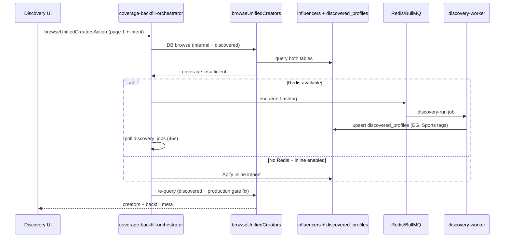

# Discovery C19 Debug Report (Adidas Egypt)

**Date:** 2026-07-05  
**Brief:** C19.pdf — Adidas Egypt sportswear / running collection launch

---

## C19 search criteria (extracted)

C19.pdf is image-based (no extractable text layer). Criteria are aligned with ERS-1 **Adidas campaign** validation scenario and the live-parity brief:

| Signal | Value |
|--------|--------|
| **Brand / campaign** | Adidas Egypt sportswear — new running collection |
| **Country** | Egypt (`EG`) |
| **Cities** | Cairo, Alexandria |
| **Audience** | Active lifestyle, ages 18–35 |
| **Platforms** | Instagram (primary), TikTok |
| **Categories** | Sports, Fitness, Running, Active lifestyle |
| **Keywords** | `adidas`, `running`, `sportswear`, `egypt`, `active lifestyle` |
| **Budget / objective** | EGP 4.5M · product launch & conversion (6 weeks) |

### Discovery UI filter mapping

```
Country: EG
Categories: Sports, Fitness (or Running)
Platforms: Instagram
Search: adidas running sportswear egypt
```

---

## Root causes (why list stayed empty after 781dcab4)

The prior fix wired backfill enqueue + wait on `/discovery`, but **five downstream bugs** still zeroed results:

| # | Bug | Effect |
|---|-----|--------|
| 1 | **Category browse ignored `discovered_profiles`** | C19-style searches with category chips only queried `influencers` — backfill writes to `discovered_profiles` |
| 2 | **`passesProductionCreatorGate` blocked `stage=discovered`** | Worker upserts fresh crawls as `discovered`; production filter removed 100% of backfill rows |
| 3 | **Backfill used ISO country as location hashtag** | `locationQuery: "EG"` crawled `/explore/tags/EG/` instead of `#adidas` / `#running` / `cairo` |
| 4 | **FTS zero-hit early return + strict discovered search** | Re-query after backfill returned empty when FTS index lagged; `searchDiscoveredProfiles` aborted on zero FTS hits |
| 5 | **Worker omitted `country_code` / `category_tags` on upsert** | Re-query with `country=EG` or category chips excluded newly inserted rows |

Secondary: without `REDIS_URL` + worker, enqueue failed silently unless user read audit/banner text.

---

## Fixes applied

| File | Change |
|------|--------|
| `lib/creators/unified-browse.ts` | Category browse merges `discovered_profiles`; FTS zero-hit no longer aborts when country/category/platform filters exist |
| `lib/creators/production-filter.ts` | Allow non-synthetic `discovered` / `basic_enriched` public profiles |
| `lib/discovery/search.ts` | Fall through to filter browse when FTS returns zero hits |
| `lib/discovery/coverage-backfill.ts` | Hashtag-first payload (C19 → `#adidas`); location uses city not ISO; inline Apify fallback when no Redis |
| `lib/discovery/inline-coverage-backfill.ts` | **New** — dev inline Apify hashtag + DNA import |
| `lib/discovery/coverage-backfill-orchestrator.ts` | Re-query after any completed backfill (not only `profilesAdded > 0`); inline path re-query |
| `services/discovery-worker/src/discovery/*.ts` | Persist `country_code` + `category_tags` from `coverageIntent` |
| `services/discovery-worker/src/workers/discovery.worker.ts` | Pass `coverageIntent` into crawl methods |
| `features/discovery/.../creator-search-workspace.tsx` | Clearer empty-state banners for failed/silent backfill |
| `app/api/discovery/diagnostics/route.ts` | **New** — env + DB counts + sample payload |

---

## Required environment

| Variable | Required for | Notes |
|----------|----------------|-------|
| `REDIS_URL` | Worker queue | e.g. `redis://127.0.0.1:6379` |
| `SUPABASE_URL` | App + worker | |
| `SUPABASE_SERVICE_ROLE_KEY` | Worker | Service role (not anon) |
| `APIFY_TOKEN` | Inline fallback / enrichment | Required if no worker |
| `APIFY_INSTAGRAM_ACTOR_ID` | Optional | Default `apify/instagram-scraper` |
| `DISCOVERY_COVERAGE_APIFY_FALLBACK` | Default `true` | Set `false` to disable backfill |
| `DISCOVERY_INLINE_BACKFILL` | Dev without Redis | Default `true` in non-production |
| `DISCOVERY_COVERAGE_BACKFILL_WAIT_MS` | Default `45000` | Server wait before UI poll |

Worker does **not** use Apify for hashtag crawl by default — it uses Playwright/HTML crawl. Apify is used for **inline fallback** and DNA import enrichment.

---

## Steps to test C19 locally

### A. Full path (recommended)

```bash
# Terminal 1 — Redis (Docker or local)
redis-server

# Terminal 2 — discovery worker
npm run discovery:worker:dev

# Terminal 3 — Next.js
npm run dev
```

1. Open `/discovery`
2. Set filters from C19 table above
3. First search on empty DB: loading up to ~45s while backfill runs
4. Expect creators from `discovered_profiles` (prefix `dis:` unified ids)
5. Check diagnostics: `GET /api/discovery/diagnostics`

### B. Dev without worker (inline Apify)

```bash
# .env.local
DISCOVERY_INLINE_BACKFILL=true
APIFY_TOKEN=apify_api_...
# REDIS_URL unset OK
```

Same UI search — server runs inline hashtag import (bounded ~30s).

### C. DB-only (no external fetch)

```bash
DISCOVERY_COVERAGE_APIFY_FALLBACK=false
```

Empty list expected; banner explains backfill disabled.

---

## Validation

```bash
node --import tsx lib/discovery/coverage-backfill.test.ts
node --import tsx lib/creators/production-filter.test.ts
node scripts/validate-database-first-discovery.mjs
npm run build
npx tsc --noEmit
```

---

## Architecture (fixed flow)



---

## Known limits

- Hashtag crawl quality depends on public HTML / Apify availability (Instagram rate limits).
- Category chips still post-filter results — backfill tags categories from intent but niche alignment may be partial until DNA enrichment completes.
- C19.pdf text cannot be parsed automatically; criteria above follow ERS-1 Adidas scenario.
