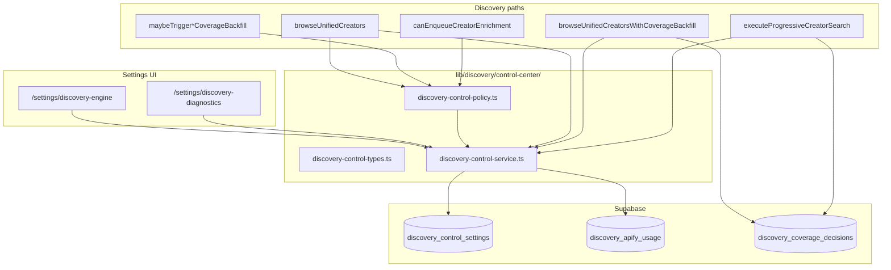

# Release 1.2 — Enterprise Discovery Control Center

Operational control plane for Discovery source selection, Apify gating, enrichment triggers, DNA policy flags, data freshness signals, and cost protection.

**Status:** Implementation complete — structural validation only. Does **not** claim PASS until migration applied and manual QA completed.

## Architecture



## Single source of truth

| Module | Role |
|--------|------|
| `discovery-control-types.ts` | Policy enums and `DiscoveryControlSettings` shape |
| `discovery-control-service.ts` | `getDiscoveryControlSettings()`, `updateDiscoveryControlSettings()`, defaults, Apify usage counters |
| `discovery-control-policy.ts` | `shouldCallApify()`, `applyPolicyToBrowse()`, `gateApifyBackfill()`, enrichment + DNA flag helpers |

All discovery browse, backfill, progressive AI search, and enrichment gate paths call `getDiscoveryControlSettings()` (or cached defaults) — **no duplicated env-only policy logic**.

## Storage

**Migration:** `supabase/migrations/20260705140000_discovery_control_settings.sql`

| Table | Purpose |
|-------|---------|
| `discovery_control_settings` | Singleton row `id = 'default'`, JSON `settings` blob |
| `discovery_apify_usage` | Daily `request_count` + `credits_used` for cost protection |

**RLS:** `discovery.admin` or `settings.write` or `admin`/`super_admin` role for settings read/write; `service_role` full access.

## Policy matrix

| `discoverySource` | Database browse | Apify backfill |
|-------------------|-----------------|----------------|
| `platform_database_only` | Yes (internal/imported) | **Never** |
| `hybrid` | Yes, first | When coverage `insufficient` and score &lt; `coverageThreshold` (default **80**) |
| `apify_live_only` | Optional skip when `searchPriority = apify_first` | **Yes** when browse intent present |

| `automaticEnrichment` | Triggers allowed |
|-----------------------|------------------|
| `never` | None (default — matches `AUTO_CREATOR_ENRICHMENT=false`) |
| `shortlisted` | `shortlist` add |
| `before_proposal` | `shortlist`, `campaign` |
| `always` | All auto triggers |

| `dataFreshnessDays` | Behavior |
|---------------------|----------|
| `null` | No flag |
| `7` / `30` / `90` | Sets `browse_metadata.data_may_be_outdated` when `last_enriched_at` exceeds window |

| Cost protection | Behavior |
|-----------------|----------|
| `maxRequestsPerDay` / `maxCreditsPerDay` **≤ 0 or unset** | **Fail-closed** — rejects ALL Apify acquisition (never unlimited) |
| Both caps **> 0** | Allows acquisition until daily usage reaches either cap |
| Rejections | Logged as `[apify-budget] rejected` with code/reason/caps/usage |

## Wiring

| Path | Change |
|------|--------|
| `lib/creators/unified-browse.ts` | `applyPolicyToBrowse`, `applyDataFreshnessFlags`, settings-aware coverage config |
| `lib/discovery/coverage-backfill-orchestrator.ts` | Settings load, `apify_live_only` skip-DB path |
| `lib/discovery/coverage-backfill.ts` | `gateApifyBackfill`, usage recording |
| `features/ai/tools/progressive-creator-search.ts` | Settings-aware threshold (Campaign Studio AI recommendations path) |
| `lib/creator-enrichment/enabled.ts` | `automaticEnrichment` policy |
| `features/discovery/shortlists/actions.ts` | Shortlist enrichment enqueue when policy allows |
| `lib/discovery/apify-import-pipeline.ts` | `generateAfterImport` DNA flag |
| `lib/creators/dna-browse-hydration.ts` | `calculateCompleteness` flag |
| `app/api/discovery/diagnostics/route.ts` | Exposes `controlCenter` + usage (requires `discovery.admin`) |

## Admin routes

| Route | Purpose |
|-------|---------|
| `/settings/discovery-engine` | Policy editor + save |
| `/settings/discovery-diagnostics` | Mode, infra, DNA stats, coverage audit (last 20) |

Sidebar: **Settings → Discovery Engine / Discovery Diagnostics**

## Manual QA checklist

- [ ] Apply migration `20260705140000_discovery_control_settings.sql`
- [ ] Open `/settings/discovery-engine` as `discovery.admin` — save hybrid defaults
- [ ] Set `platform_database_only` — run Discovery browse with low coverage — confirm no Apify job
- [ ] Set `hybrid` threshold 80 — confirm backfill only when score &lt; 80
- [ ] Set `apify_live_only` + `apify_first` — confirm live backfill triggers on intent
- [ ] Set `dataFreshnessDays = 30` — confirm outdated flag on stale creators in browse
- [ ] Set `maxRequestsPerDay = 1` — confirm second backfill blocked same day
- [ ] Set `automaticEnrichment = shortlisted` — add creator to shortlist — confirm enrichment enqueue (with Redis)
- [ ] Open `/settings/discovery-diagnostics` — verify counts and coverage decision table
- [ ] Run AI Campaign Studio creator search — confirm same threshold as Discovery UI

## Validation

```bash
node scripts/validate-discovery-control-center.mjs
npm run build
npx tsc --noEmit
```

Results written to `docs/release/1.2/discovery-control-center-validation-results.json` — **STRUCTURAL_OK does not mean production PASS**.

## Out of scope (per constraints)

- Campaign Director, Debate Engine, CampaignFacts, Governance
- Campaign Studio UI layout/sections
- Creator DNA merge/conflict/completeness **algorithms** (policy flags only)
