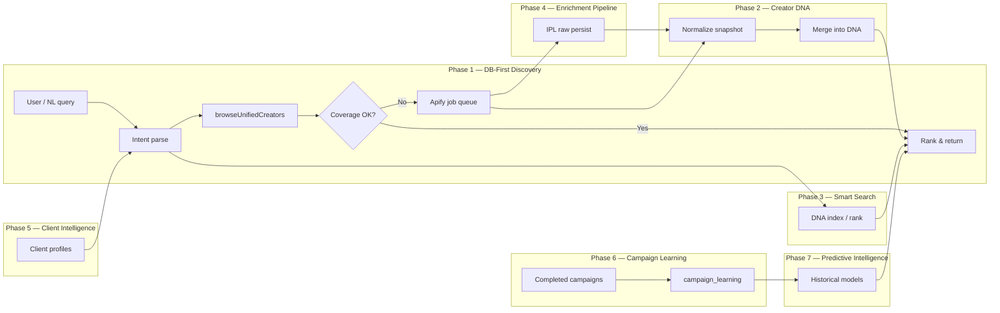
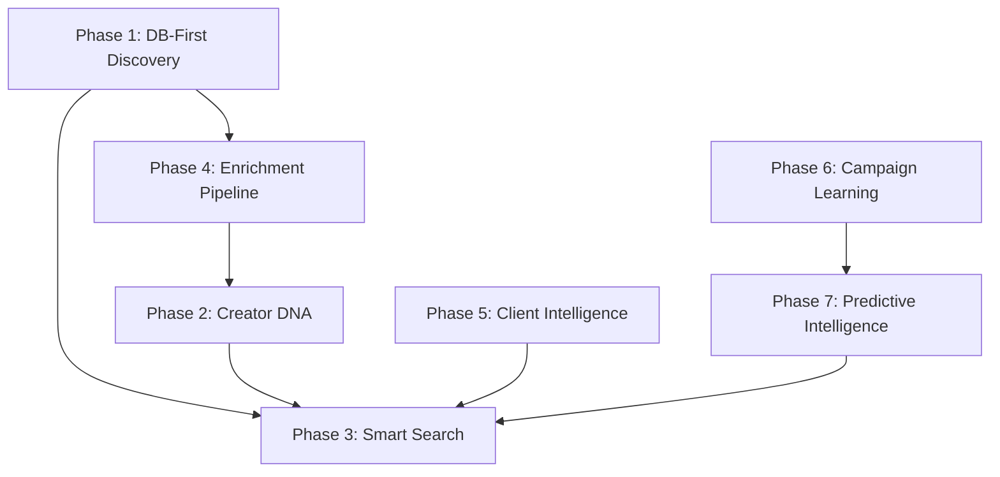
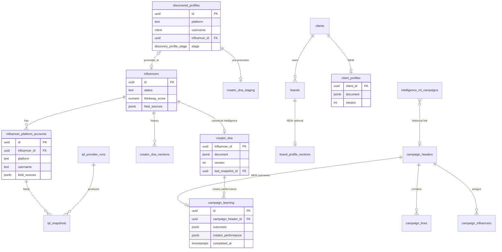
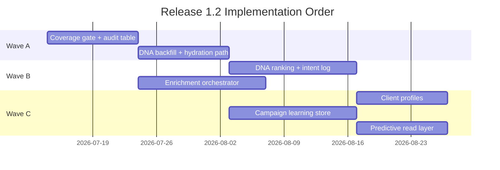

# Release 1.2 Architecture — Data, Discovery & Learning

**Status:** Specification (pre-implementation)  
**Generated:** 2026-07-05  
**Scope:** DATA + DISCOVERY + LEARNING only  
**Release 1.1:** CLOSED — intelligence architecture frozen

---

## Mission

Release 1.2 makes Thinkway **data-first**: search the operational database before any external provider, build permanent Creator DNA and Client Intelligence profiles, enrich only when coverage is insufficient, and learn from completed campaigns to power predictive recommendations — **without changing Release 1.1 Campaign Director, Debate, Review, or Governance layers**.

### Principles

| # | Principle | Enforcement |
|---|-----------|-------------|
| P1 | **Database-first** | `browseUnifiedCreators()` and `search_creators` RPC before Apify |
| P2 | **Never invent data** | NULL + `verification_required` for unknowns; no fabricated demographics or metrics |
| P3 | **Merge never downgrade** | DNA conflict resolver: source priority × confidence; manual always wins |
| P4 | **Single search integrity (ERS-1)** | One `searchExecuted` per workflow task; dedupe at every pipeline stage |
| P5 | **Frozen 1.1 intelligence** | CampaignFacts, Director, Debate, Specialists, Review, QA, Compliance, Presentation Validator, Campaign Studio, Decision Workspace, Governance, CampaignObject — **no redesign** |
| P6 | **Historical-only prediction** | Phase 7 models consume stored outcomes only; no LLM fabrication of benchmarks |

---

## Frozen vs Extended Components

### Frozen (Release 1.1 — do not modify architecture)

```
features/campaign-director/     Director orchestration
features/campaign-director/debate/   Debate engine
features/campaign-facts/        CampaignFacts layer
features/campaign-studio/       Campaign Studio presentation
features/decision-workspace/    Decision Workspace UI
features/governance/            Enterprise governance (1.1.7)
lib/campaign-objects/           CampaignObject persistence
features/ai-workflows/          Workflow validators (ERS-1..4 reference only)
```

### Extended (Release 1.2 — allowed changes)

| Area | Existing entry points | Release 1.2 extension |
|------|----------------------|------------------------|
| Unified browse | `lib/creators/unified-browse.ts` | DB-first coverage gate; DNA hydration as primary source |
| Dedupe | `lib/creators/dedupe-creators.ts` | Promotion + enrichment dedupe audit |
| Creator DNA | `features/creator-dna/` | Full field coverage; browse/search read path |
| Search intent | `features/ai/tools/campaign-search-intent.ts` | NL intent → DNA-ranked results |
| Progressive search | `features/ai/tools/progressive-creator-search.ts` | Coverage thresholds (not just `total > 0`) |
| IPL / enrichment | `lib/intelligence-persistence/`, `lib/creator-enrichment/` | Pipeline orchestration → DNA writer |
| Discovery worker | `services/discovery-worker/` | Apify fallback jobs triggered by coverage miss |
| Intelligence warehouse | `intelligence.*` schema | Bridge to operational learning tables |
| Client profiles | `clients`, `brands` tables | **NEW** `client_profiles` document layer |
| Campaign learning | `campaign_headers`, publications | **NEW** `campaign_learning` outcome store |

---

## Seven-Phase Overview



### Phase dependency graph



| Phase | Name | Depends on | Delivers |
|-------|------|------------|----------|
| 1 | Database-First Discovery | — | Coverage gate, Apify fallback policy |
| 2 | Creator DNA | 4 (partial) | Permanent profiles, merge rules |
| 3 | Smart Search Engine | 1, 2 | NL intent + DNA ranking |
| 4 | Data Enrichment Pipeline | 1 | Apify → normalize → dedupe → DNA → save |
| 5 | Client Intelligence | — | Permanent client/brand profiles |
| 6 | Campaign Learning | — | Outcome store from completed campaigns |
| 7 | Predictive Intelligence | 6 | Historical-only forecasts |

---

## Entity Relationship Diagram



---

## Database Diagram — EXISTS vs NEW

### Creator & discovery (EXISTS)

| Table | Status | Role |
|-------|--------|------|
| `influencers` | **EXISTS** | Operational creator registry |
| `influencer_platform_accounts` | **EXISTS** | Per-platform metrics & contact |
| `discovered_profiles` | **EXISTS** | Pre-promotion discovery registry |
| `profile_metrics` | **EXISTS** | Historical metrics snapshots (discovery) |
| `profile_ai_scores` | **EXISTS** | AI category/niche/brand_fit |
| `discovery_jobs` | **EXISTS** | Crawl/enrichment job queue |
| `discovery_shortlists` / `discovery_shortlist_items` | **EXISTS** | Shortlist workflow |
| `creator_enrichment_runs` | **EXISTS** | Enrichment audit trail |

### Intelligence persistence (EXISTS)

| Table | Status | Role |
|-------|--------|------|
| `ipl_refresh_policies` | **EXISTS** | TTL per provider/field group |
| `ipl_provider_runs` | **EXISTS** | External call audit |
| `ipl_snapshots` | **EXISTS** | Versioned raw + normalized JSONB |
| `ipl_reprocess_jobs` | **EXISTS** | Reprocess queue |

### Creator DNA (EXISTS)

| Table | Status | Role |
|-------|--------|------|
| `creator_dna` | **EXISTS** | Canonical DNA document per influencer |
| `creator_dna_staging` | **EXISTS** | Pre-promotion DNA |
| `creator_dna_versions` | **EXISTS** | Append-only version history |
| `creator_dna_lineage_events` | **EXISTS** | IPL/enrichment lineage audit |

### Search infrastructure (EXISTS)

| Object | Status | Role |
|--------|--------|------|
| `search_creators()` RPC | **EXISTS** | Unified FTS across influencers + discovered |
| `discovered_profiles.search_vector` | **EXISTS** | Discovery FTS trigger |

### Intelligence warehouse (EXISTS — read-only historical)

| Table | Status | Role |
|-------|--------|------|
| `intelligence.historical_campaigns_raw` | **EXISTS** | Imported sheet rows |
| `intelligence.int_clients` | **EXISTS** | Resolved client dimension |
| `intelligence.int_campaigns` | **EXISTS** | Historical campaign facts |
| `intelligence.int_influencers` | **EXISTS** | Historical influencer dimension |

### Release 1.2 proposed (NEW)

| Table | Status | Role |
|-------|--------|------|
| `client_profiles` | **NEW** | Permanent client intelligence document (FieldEnvelope shape) |
| `client_profile_versions` | **NEW** | Append-only client profile history |
| `campaign_learning` | **NEW** | Completed campaign outcome bundle |
| `campaign_learning_creator_outcomes` | **NEW** | Per-assignment performance rows |
| `influencer_metrics_history` | **NEW** | Time-series metrics for internal influencers (referenced in code as placeholder) |
| `discovery_coverage_decisions` | **NEW** | Audit: DB hit vs Apify fallback per search |
| `search_intent_log` | **NEW** | NL intent + chosen stage for analytics |

**Table count summary:** ~28 EXISTS (operational + IPL + DNA + core discovery) · **6 NEW** proposed for Release 1.2.

---

## Gap Analysis (Honest)

| Capability | Current state | Gap |
|------------|---------------|-----|
| DB-first search | `browseUnifiedCreators` queries DB only; progressive search widens filters | **No coverage threshold** before Apify; Apify is enrichment-triggered, not search-fallback |
| Apify integration | `runCreatorEnrichment` + IPL cache-first | Not wired as automatic search backfill when DB returns `< N` creators |
| Creator DNA | Tables + ERS-4 PASS; IPL → DNA writer exists | Browse/hydration still reads platform accounts in many paths; not all creators have DNA rows |
| NL search intent | `campaign-search-intent.ts` + Discovery intent engine | AI workflow uses intent; Discovery UI uses separate engine — not unified SSOT |
| DNA-based ranking | Thinkway Score includes engagement, brand fit, small follower band | Follower log band still in score; DNA not primary ranking input |
| Dedupe | ERS-1 PASS offline; `dedupe-creators.ts` at pipeline boundaries | Promotion dedupe across `discovered_profiles` ↔ `influencers` needs explicit merge policy |
| Client intelligence | `clients`/`brands` operational; `intelligence.int_clients` warehouse | **No operational `client_profiles`**; no learning loop from campaigns |
| Campaign learning | Warehouse historical data; live campaigns in ops DB | **No `campaign_learning`** linking completed headers to creator outcomes |
| Predictive intelligence | `loadInternalHistoricalMetrics` returns empty placeholder | **No models**; no `influencer_metrics_history` table |
| Enrichment pipeline | Worker + IPL + merge + partial DNA bridge | No single orchestrated job: Apify → dedupe → DNA → promote |

---

## Migration Plan (Phased)

### Wave A — Foundation (Phase 1 + 2)

1. Add `discovery_coverage_decisions` + coverage config (env or DB).
2. Implement `evaluateDiscoveryCoverage()` hook in `browseUnifiedCreators` return path.
3. Wire Apify fallback job enqueue when coverage miss (discovery-worker queue).
4. Backfill DNA for influencers with IPL snapshots (`CreatorDNAWriter`).
5. Switch AI progressive search to coverage threshold (not `total > 0` only).

### Wave B — Search & Enrichment (Phase 3 + 4)

1. Add `search_intent_log` for NL analytics.
2. DNA-first hydration in `browseUnifiedCreators` / vendor cards.
3. Ranking service: DNA confidence × brand fit × audience match (deprioritize raw followers).
4. Unified enrichment orchestrator: snapshot → dedupe → DNA → promote.

### Wave C — Intelligence (Phase 5 + 6 + 7)

1. Create `client_profiles` + versions; seed from brands/clients + warehouse.
2. Create `campaign_learning` + creator outcome rows; ETL from completed campaign headers.
3. Create `influencer_metrics_history`; backfill from IPL snapshots.
4. Predictive read API: historical aggregates only; expose to search ranker (not Director).

**Migration rule:** All migrations additive; no changes to CampaignFacts or CampaignObject schema.

---

## Risk Assessment

| Risk | Likelihood | Impact | Mitigation |
|------|------------|--------|------------|
| Apify cost spike on broad fallback | High | Medium | Coverage thresholds; rate limits; cache via IPL |
| DNA stale vs platform account | Medium | Medium | Hydration precedence doc; confidence badges in UI |
| Breaking ERS-1 on dual search | Medium | High | Keep single `executeProgressiveCreatorSearch`; Apify enriches DB, does not re-search |
| Warehouse ↔ ops ID mismatch | Medium | Medium | `resolved_*_id` columns; match confidence thresholds |
| 1.1 regression via shared browse | Low | High | Feature flag `RELEASE_12_DB_FIRST`; parallel validation suite |
| Empty predictive training data | High | Low | Phase 7 read-only until N completed campaigns stored |

---

## Implementation Phases & Dependencies



**Recommended Phase 1 start point:** Implement `evaluateDiscoveryCoverage()` + `discovery_coverage_decisions` audit in `lib/creators/unified-browse.ts` and connect to discovery-worker Apify enqueue — **without touching Campaign Director or Debate code paths**.

---

## Manual QA Checklist

### Phase 1 — DB-First Discovery

- [ ] Search "BabyJoy parenting Egypt" returns DB results without Apify when count ≥ threshold
- [ ] Obscure query with 0 DB hits enqueues Apify job (visible in `discovery_jobs` / worker logs)
- [ ] `discovery_coverage_decisions` row written per AI search
- [ ] ERS-1: exactly one search execution per workflow task
- [ ] No duplicate creators in results (dedupe stages)

### Phase 2 — Creator DNA

- [ ] DNA document exists after enrichment for test influencer
- [ ] Manual field edit wins over IPL merge (conflict resolver)
- [ ] Staging DNA promotes to `creator_dna` on influencer promotion
- [ ] Unknown demographics remain NULL (not invented)

### Phase 3 — Smart Search

- [ ] NL brief parses to intent (industry, country, categories)
- [ ] Results ranked by Thinkway Score + brand fit, not follower count alone
- [ ] Progressive stages logged; stops at first stage meeting coverage threshold

### Phase 4 — Enrichment Pipeline

- [ ] Apify run → IPL raw snapshot → normalized → DNA merge
- [ ] Dedupe prevents duplicate platform accounts on import
- [ ] Enrichment skip within TTL (30-day policy)

### Phase 5 — Client Intelligence

- [ ] Client profile document created for test legal entity
- [ ] Brand category/VR% reflected in profile; campaign history appended

### Phase 6 — Campaign Learning

- [ ] Completed campaign writes `campaign_learning` row
- [ ] Per-creator outcomes include actual metrics (not estimates)

### Phase 7 — Predictive Intelligence

- [ ] Forecast API returns NULL when insufficient history
- [ ] No LLM-generated benchmark numbers in API response

---

## Validation Fixtures (Release 1.2)

Release 1.2 validation **will test** (not claim PASS):

| Fixture | Phase focus | What validation exercises |
|---------|-------------|---------------------------|
| BabyJoy | 1, 2, 3 | Baby industry intent, Egypt country, parenting DNA categories |
| Coca-Cola | 3, 5 | Gen Z / beverage semantic keywords, client profile commercial model |
| Samsung | 4, 6 | Multi-platform enrichment, tech campaign learning |
| L'Oréal | 2, 3 | Beauty/skincare DNA fields, audience gender age |
| Visit Egypt | 1, 3 | Tourism intent, travel creator DB coverage |
| Netflix | 3, 7 | Entertainment NL intent; historical streaming benchmarks if data exists |
| Talabat | 1, 5 | Food delivery geo coverage; client profile market |
| Adidas | 1, 2, 3 | Sports/fitness (ERS-1 Adidas scenario extended) |
| Red Bull | 4, 6 | Extreme sports enrichment; campaign outcome storage |
| Emirates NBD | 2, 5, 7 | Finance DNA categories; client intelligence; predictive NULL guard |

Run readiness audit:

```bash
node scripts/validate-release-1-2-readiness.mjs
```

---

## Success Criteria (from user spec)

| # | Criterion | Measurement |
|---|-----------|-------------|
| SC1 | DB searched before any Apify call in user-facing search | 100% of searches log `source=db` or `source=db+apify_fallback` in coverage audit |
| SC2 | Creator DNA is permanent; merge never overwrites stronger evidence | ERS-4 conflict tests + manual override tests PASS |
| SC3 | Smart search uses NL intent and DNA-based ranking | Intent fields populated; rank order correlates with DNA brand_fit (not follower desc) |
| SC4 | Enrichment pipeline is idempotent: Apify → normalize → dedupe → DNA → save | Integration test on single influencer; version history increments |
| SC5 | Client profiles persist across campaigns | `client_profiles.version` > 1 after second campaign |
| SC6 | Campaign learning stores completed outcomes | `campaign_learning` row for each completed header in test set |
| SC7 | Predictive layer uses historical data only | API returns `insufficient_data` when history < minimum; zero fabricated metrics |
| SC8 | Release 1.1 intelligence unchanged | ERS-1..4 + BL1 + governance validators remain PASS |

---

## Related Documents

- [DATABASE_FIRST_DISCOVERY.md](./DATABASE_FIRST_DISCOVERY.md)
- [CREATOR_DNA_SPECIFICATION.md](./CREATOR_DNA_SPECIFICATION.md)
- [SEARCH_ENGINE_SPECIFICATION.md](./SEARCH_ENGINE_SPECIFICATION.md)
- [CAMPAIGN_LEARNING_SPECIFICATION.md](./CAMPAIGN_LEARNING_SPECIFICATION.md)
- Release 1.1 reference: `docs/release/RELEASE_CANDIDATE_REPORT.md`
- ERS validators: `features/ai-workflows/validate-creator-integrity.ts`, `validate-ers2-search-intelligence.ts`, `features/creator-dna/validate-ers4-creator-dna.ts`
