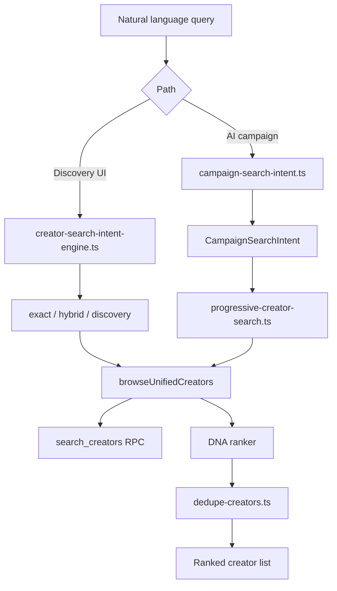

# Smart Search Engine Specification — Release 1.2

**Status:** Target specification (maps to existing code)  
**Parent:** [RELEASE_1_2_ARCHITECTURE.md](./RELEASE_1_2_ARCHITECTURE.md)  
**Phase:** 3 (depends on Phase 1 DB-first + Phase 2 DNA)

---

## Purpose

The Smart Search Engine translates **natural-language intent** into structured filters, queries the database first, and **ranks results by DNA-informed quality signals** — not raw follower count.

Release 1.1 provides intent parsing and progressive DB search. Release 1.2 unifies intent SSOT, adds DNA-weighted ranking, and ties ranking to coverage thresholds.

---

## Architecture



---

## NL Intent Examples

### AI Campaign path (`campaign-search-intent.ts`)

| User input | Parsed intent |
|------------|---------------|
| "Create BabyJoy baby care campaign in Egypt for new parents" | `industryKey: baby`, `country: EG`, `categories: [Parenting, Baby, ...]`, `platforms: [instagram, tiktok]` |
| "Find luxury hotel creators in Dubai for a 5-star resort" | `industryKey: luxury`, `city: Dubai`, `country: AE`, `categories: [Luxury, Hospitality, Travel]` |
| "Find travel creators in Egypt" | `industryKey: travel`, `country: EG`, `semanticKeywords: [travel, destination, adventure]` |
| "Strategize Coca-Cola summer engagement for Gen Z" | `industryKey: general`, `semanticKeywords: [creator, influencer]`, platforms from brief |
| "Launch Samsung Galaxy campaign in MENA" | `industryKey: general`, multi-platform, region keywords |
| "Plan L'Oréal Paris skincare for women 25–40" | `industryKey: general`, `audience: women 25-40`, beauty keywords |
| "Emirates NBD finance influencers UAE" | `industryKey: finance`, `country: AE` |
| "Visit Egypt destination awareness GCC" | `industryKey: tourism`, `semanticKeywords: [tourism, travel, destination, egypt]` |
| "Netflix series launch entertainment creators" | `industryKey: general`, entertainment semantic expansion |
| "Talabat food delivery creators Cairo" | `industryKey: general`, geo + food keywords |
| "Adidas running creators UAE" | `industryKey: sports_fitness`, `country: AE` |
| "Red Bull extreme sports MENA" | `industryKey: sports_fitness`, adventure keywords |

### Discovery UI path (`creator-search-intent-engine.ts`)

| Query pattern | Mode | Behavior |
|---------------|------|----------|
| `@username` | `exact` | Handle lookup via FTS |
| "Ahmed Hassan" (2–5 words, title case) | `exact` | Person name search |
| "luxury travel dubai" | `hybrid` | Taxonomy + FTS |
| "parenting" | `discovery` | Category browse |

**Gap:** Two intent engines — Release 1.2 should extract shared taxonomy + industry signals into `lib/creators/search-intent/` (proposed) without changing 1.1 AI tool contracts.

---

## Progressive Search Stages (EXISTS)

`features/ai/tools/progressive-creator-search.ts`:

| Stage | ID | Filters applied |
|-------|-----|-----------------|
| A | `A_category_country` | Categories + country |
| B | `B_category_only` | Categories only |
| C | `C_industry` | Industry category expansion + industry keyword |
| D | `D_semantic_keywords` | Semantic keyword FTS search |
| E | `E_broad` | Country + platform filters only |

**Current stop condition:** First stage with `total > 0`.  
**Release 1.2 stop condition:** First stage passing `evaluateDiscoveryCoverage()`.

ERS-2 validates stages A→E call `browseUnifiedCreators()` internally while preserving **one** `searchExecuted` per task (ERS-1 integrity).

---

## Ranking Dimensions

Release 1.2 ranking **must not sort by follower count alone**. Weighted dimensions:

| Dimension | Weight (proposed) | Source | Exists today |
|-----------|-------------------|--------|--------------|
| **DNA brand fit** | 25% | `creator_dna.scores.brandFit` or `profile_ai_scores.brand_fit_score` | Partial |
| **Thinkway Score** | 25% | `computeThinkwayScore()` — engagement-heavy, small reach band | ✅ |
| **Audience alignment** | 20% | Country, categories, interests vs intent | Partial (keyword hits in `campaign-match.ts`) |
| **Authenticity** | 15% | `authenticity_score` / DNA envelope | ✅ |
| **DNA confidence** | 10% | Average envelope confidence for matched fields | ✅ (ERS-4) |
| **Intent keyword match** | 5% | Token overlap in bio/tags | ✅ (`campaign-match.ts`) |
| **Reach band** | ≤5% | Log-scaled followers — **deprioritized** | Currently ~12% in Thinkway Score |

### Thinkway Score composition (EXISTS — reference)

From `lib/creators/thinkway-score.ts`:

- Engagement quality (up to 40 pts)
- Posting consistency (up to 15 pts)
- Authenticity (20% of score input)
- Profile completeness (15%)
- Brand fit (15%)
- Reach band — log10 followers (up to 12 pts) ← **reduce weight in 1.2 ranker**
- Confidence boost from metric sources

### Proposed rank function (Release 1.2)

```typescript
function rankCreatorForIntent(
  creator: UnifiedCreatorResult,
  dna: CreatorDNADocument | null,
  intent: CampaignSearchIntent
): number {
  const brandFit = dna?.scores.brandFit.value ?? creator.brand_fit_score ?? 50;
  const thinkway = creator.thinkway_score;
  const audience = scoreAudienceAlignment(creator, dna, intent);  // country, categories
  const authenticity = dna?.scores.authenticityScore.value ?? creator.authenticity_score ?? 70;
  const confidence = dna ? averageDnaConfidence(dna) : creator.source_confidence ?? 0.5;
  const keywords = scoreKeywordOverlap(creator, intent);

  return (
    brandFit * 0.25 +
    thinkway * 0.25 +
    audience * 0.20 +
    authenticity * 0.15 +
    confidence * 100 * 0.10 +
    keywords * 0.05
  );
}
```

**Not used as primary sort:** raw `followers`, `following`, or follower ratio alone.

---

## Unified Browse Integration (EXISTS)

| Function | File | Search role |
|----------|------|-------------|
| `browseUnifiedCreators` | `lib/creators/unified-browse.ts` | SSOT — merges internal + discovery |
| `searchCreators` | `lib/creators/fts-search.ts` | RPC wrapper |
| `searchDiscoveredProfiles` | `lib/discovery/search.ts` | Discovery-only API path |
| `matchCreatorsForCampaign` | `lib/creators/campaign-match.ts` | Brief token matching + brand fit |
| `findSimilarCreators` | `lib/creators/similar-creators.ts` | Niche/country/engagement band similarity |
| `executeProgressiveCreatorSearch` | `features/ai/tools/progressive-creator-search.ts` | AI workflow search |

### Browse paths

1. **Explicit lookup** — `influencerId` / scoped IDs (bypasses FTS).
2. **Empty search browse** — paginated internal + discovery merge, sorted by Thinkway Score.
3. **FTS search** — `search_creators` RPC returns ordered hits → hydrate internal + discovery rows.
4. **Unified index path** — when `shouldUseUnifiedBrowseIndexPath(filters)` (category browse without search text).

Search trace instrumentation: `lib/creators/search-trace.ts` (ERS-2 diagnostics).

---

## Category & Industry Expansion (EXISTS)

`features/ai/tools/campaign-search-intent.ts`:

- `INDUSTRY_CATEGORY_EXPANSION` — maps industry key → category OR-list
- `INDUSTRY_SEMANTIC_KEYWORDS` — fallback FTS terms
- `CREATOR_CATEGORY_KEYWORDS` in `lib/creators/category-keywords.ts` — browse filter resolution

Discovery taxonomy: `features/discovery/components/creator-search/creator-search-taxonomy.ts` (separate from campaign intent).

---

## Filters Available in Browse

From `UnifiedCreatorBrowseFilters` (`lib/domains/creator/types`):

- `search`, `platform` / `platforms`, `country`, `city`, `language`
- `categories`, `category`, `interests`, `hashtags`
- `minFollowers`, `maxFollowers`, `minEngagement`, `minThinkwayScore`
- `productionOnly`, `influencerId`, `discoveredProfileId`
- Pagination: `page`, `pageSize`

Post-browse filters: `applyPostBrowseFilters` in unified-browse (production gate, category refinement).

---

## Gap Analysis

| Capability | Status | Release 1.2 action |
|------------|--------|---------------------|
| NL intent parsing (AI) | ✅ | Extend fixtures; no prompt redesign |
| NL intent (Discovery UI) | ✅ separate engine | Extract shared library |
| Progressive DB search | ✅ | Add coverage threshold stop |
| DNA-weighted ranking | ❌ | New `lib/creators/dna-ranker.ts` (proposed) |
| Follower-deprioritized sort | Partial | Adjust rank weights; reduce reach band in sort |
| Search intent analytics | ❌ | `search_intent_log` table |
| Predictive rank boost | ❌ | Phase 7 — historical performance factor |

---

## ERS-2 Compliance (Release 1.1 reference)

- Stages A→E internal to one workflow search ✅
- `browseUnifiedCreators` SSOT ✅
- Search trace logging ✅

Release 1.2 validation **will test** ranking order invariants for all 10 brand fixtures (not claim PASS).

---

## Manual QA — Search

- [ ] Same brief produces identical intent fields across runs (deterministic parser)
- [ ] Results sorted by composite rank, not follower DESC
- [ ] `@handle` queries return exact creator first (Discovery mode=exact)
- [ ] Zero-result query triggers progressive widening then coverage miss audit
- [ ] ERS-1: no duplicate creators in ranked output
- [ ] Search trace JSON includes chosen stage + rank scores

---

## Implementation Checklist (Phase 3)

1. [ ] Create `lib/creators/dna-ranker.ts` with weighted formula above.
2. [ ] Integrate ranker post-merge in `browseUnifiedCreators` when search/intent context present.
3. [ ] Reduce follower weight in default sort (line ~1327 thinkway-only sort → ranker).
4. [ ] Add `search_intent_log` migration + write on AI search.
5. [ ] Extract shared intent types from campaign + discovery engines.
6. [ ] Extend ERS-2 validator with ranking dimension checks.
