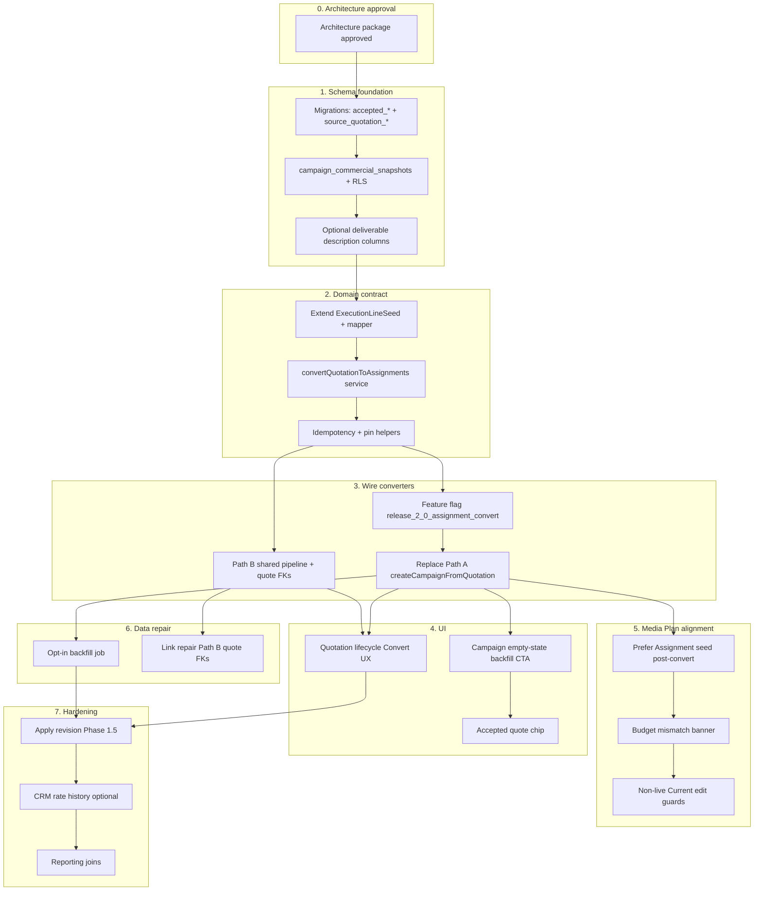

# Release 2.0 — Dependency Graph & Implementation Order

**Status:** Pre-implementation plan — awaiting approval  
**Parent:** [RELEASE_2_0_ARCHITECTURE.md](./RELEASE_2_0_ARCHITECTURE.md)

---

## 1. Dependency graph



### Critical path (Phase 1)

```text
Approval → Migrations → Mapper/service → Flag → Path A replace → Quotation UI
         ↘ Path B FK fix ↗
         ↘ Assignment seed preference (Media Plan load)
         ↘ Backfill CTA (not forced job)
```

---

## 2. Phased delivery

### Phase 0 — Approval gate

| Deliverable | Status |
|---|---|
| Architecture package in `docs/release/2.0/` | Done |
| Decisions D1–D7 locked | Done — [DECISIONS.md](./DECISIONS.md) |
| Field ownership matrix | Done — [FIELD_OWNERSHIP_MATRIX.md](./FIELD_OWNERSHIP_MATRIX.md) |
| Explicit approval to implement Phase 1 | **Approved 2026-07-28** |

**Exit:** Open `feature/release-2-0-lifecycle` from `develop` and implement Phase 1 only.

---

### Phase 1 — Unified Assignment convert (go-live blocker for quote ops)

**Goal:** Approved Quotation converts to Assignments once; billing path unblocked; backward compatible.

| Step | Work | Depends on | Est. risk |
|---|---|---|---|
| 1.1 | Dev migrations (provenance + snapshot + RLS) | Phase 0 | Medium |
| 1.2 | Types + repository helpers | 1.1 | Low |
| 1.3 | Extend `quotation-execution-mapper` (AF, descriptions, free_for_client, provenance ids) | 1.2 | Medium |
| 1.4 | `convertQuotationToAssignments` + unit/integration tests | 1.3 | High |
| 1.5 | Feature flag + Path A action delegates to convert | 1.4 | High |
| 1.6 | Path B uses shared seed path; sets `quotation_id` / accepted pins when quote present | 1.4 | Medium |
| 1.7 | Quotation UI: Convert preview, idempotent CTA | 1.5 | Medium |
| 1.8 | Campaign UI: accepted chip + backfill CTA | 1.5 | Low |
| 1.9 | Media Plan load: prefer Assignment hierarchy seed when lines exist | 1.5 | Medium |
| 1.10 | Dev verification: TS, tests, Ops Center, manual convert→VIO smoke | 1.7–1.9 | — |

**Phase 1 explicit non-goals:** Apply-revision UI, hard non-live Media Plan guards, CRM rate history, Production migrate.

---

### Phase 1.5 — Enterprise revision & Media Plan guards

| Step | Work | Depends on |
|---|---|---|
| 1.5.1 | Out-of-sync detection (accepted pin vs latest approved quote version) | Phase 1 |
| 1.5.2 | Apply revision diff (add/remove/reprice; skip locked) | 1.5.1 |
| 1.5.3 | Current Media Plan non-live edit guards | Phase 1 + Media Plan freeze exception approval |
| 1.5.4 | Schedule item ↔ Assignment ID linkage hardening | 1.5.3 |
| 1.5.5 | Optional admin backfill job | Phase 1 |

---

### Phase 2 — Commercial fidelity & reporting

| Step | Work |
|---|---|
| 2.1 | Collap package → single Assignment rules polish |
| 2.2 | Structured objectives / terms on snapshot UX |
| 2.3 | CRM package/rate history from accepted snapshot |
| 2.4 | Reporting views: Assignment + accepted quote audit columns |
| 2.5 | AI context guards (no dual commercial book) |

---

### Phase 3 — Cleanup

| Step | Work |
|---|---|
| 3.1 | Remove feature flag; Path A dead code paths |
| 3.2 | Deprecate vendor-link-only convert semantics in docs |
| 3.3 | Align `ARCHITECTURE_ALIGNMENT.md` + product reference pointers |
| 3.4 | Production migration + deploy **only with explicit approval** |

---

## 3. Workstream parallelism

| Track | Can parallelize after |
|---|---|
| Schema + convert service | Phase 0 |
| Path B FK fix | Convert service API stable |
| Quotation UI | Flag + service |
| Campaign UI chips/CTA | Header columns exist |
| Media Plan seed preference | Lines exist from convert (independent of Path B) |
| Docs / runbooks | Anytime |
| Apply revision | After Phase 1 stable in Dev |

Do **not** parallelize Production migration with Phase 1 coding.

---

## 4. Test order (Phase 1)

1. Pure mapper tests (seeds, AF, skip rules, options policy)  
2. Service tests with mocked Supabase / fixtures (idempotency, pin, snapshot write)  
3. Lifecycle regression (`commercial-lifecycle` / quotation tests)  
4. Campaign line create still works for manual Assignment  
5. Billing smoke: convert → generate VIO → invoice eligibility (Dev)  
6. Media Plan load with Assignment seed (no crash when baseline empty)  
7. Typecheck + build  

---

## 5. Branch & release mechanics

```text
develop
  └── feature/release-2-0-lifecycle
        ├── Phase 1 PRs (small, reviewable)
        └── merge → develop (Dev auto-deploy)
              └── QA
                    └── main + Production  [explicit approval only]
```

| Rule | Enforcement |
|---|---|
| No implementation on `main` | Branch gate |
| Dev Supabase first | Engineering policy |
| Feature flag default off in Prod until soak | Flag config |
| No `[deploy-production]` without approval | Release workflow |

---

## 6. Definition of Done — Phase 1

- [x] Architecture decisions D1–D7 + field ownership matrix recorded  
- [ ] Migrations applied on **Development** only (until Prod approval)  
- [ ] Convert from approved quote creates ≥1 Assignment with deliverables when items valid  
- [ ] Second convert returns `alreadyExists`  
- [ ] Snapshot + accepted pin persisted  
- [ ] Path B sets quote↔campaign links when quotation source used  
- [ ] Existing campaigns without provenance unaffected in smoke tests  
- [ ] Vendor IO can be generated for newly converted lines  
- [ ] Flagged rollout plan documented  
- [ ] No Production schema/app deploy without separate approval  

---

## 7. Suggested PR slicing (after approval)

1. `docs only` — this package (if not already on develop)  
2. `schema` — migrations + types  
3. `convert service` — mapper + service + tests (flagged)  
4. `wire Path A + UI`  
5. `wire Path B + Media Plan seed preference`  
6. `backfill CTA + runbook`  

Avoid a single monolithic PR.
