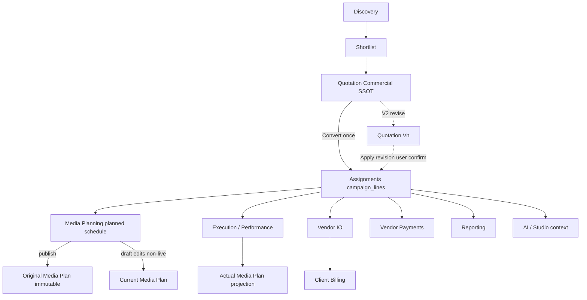

# Release 2.0 Architecture — Enterprise Campaign Lifecycle

**Status:** Approved for Phase 1 (2026-07-28)  
**Decisions:** [DECISIONS.md](./DECISIONS.md) · Field contract: [FIELD_OWNERSHIP_MATRIX.md](./FIELD_OWNERSHIP_MATRIX.md)  
**Generated:** 2026-07-28  
**Scope:** Quote → Assignment → Media Plan → Execution → IO → Billing → Payments → Reporting  
**Supersedes (for conversion design only):** Path A / Path B dual converters as the long-term product model  
**Does not supersede:** Media Planning v1 engine SSOT until Phase 1+ Media Plan ownership work lands

---

## 1. Mission

Release 2.0 makes Thinkway’s commercial→operational lifecycle **Assignment-centric**:

1. **Quotation** is the immutable commercial baseline (what was sold).
2. **Campaign Assignment** (`campaign_lines` + children) is the operational SSOT (what is executed, billed, paid).
3. Assignments are **created once** from an accepted Quotation (or equivalent seed) and then **progressively enriched**.
4. Downstream systems (Media Plan, Performance, Vendor IO, Billing, Payments, Reporting, AI) **reference the same Assignment hierarchy** — no parallel commercial ledgers.

---

## 2. Implementation principles (normative)

| # | Principle | Enforcement |
|---|-----------|-------------|
| P1 | Quotation = Commercial SSOT | Only `approved` converts (D1); convert is one-way projection |
| P2 | Assignment = Operational SSOT | `campaign_lines` is the Assignment; no new `assignments` table |
| P3 | Create once, enrich later | Convert writes lean scope + PO fields; schedules/URLs/metrics/approvals/actuals added by later stages |
| P4 | Media Planning owns planned scheduling only | Writes planned dates / calendar; does not own actuals or commercials |
| P5 | Performance owns actual execution only | Live dates, URLs, metrics, publications |
| P6 | Original Media Plan immutable after publication | Approved baseline items are frozen; changes require draft → republish |
| P7 | Current Media Plan editable only if Assignment not Published | D6/D7 — hard rule (guards Phase 2) |
| P8 | Actual Media Plan generated from Performance | Never editable (D7) |
| P9 | Downstream shares Assignment hierarchy | VIO, Billing, Payments, Reporting, AI use line / deliverable / post IDs |
| P10 | Backward compatibility | Existing campaigns without quote provenance remain valid; dual-read during migration |

---

## 3. Naming (resolve collisions)

| Product term | Physical model | Forbidden interpretation |
|---|---|---|
| **Assignment** | `campaign_lines` (+ `assignment_deliverables` → `assignment_post_schedule` + primary `campaign_influencers`) | New `assignments` table |
| **Vendor link** | `campaign_influencers` (on a line) | PO / invoice SSOT |
| **Quotation line** | `quotation_items` (+ nested `deliverables` JSON) | Operational execution unit |
| **Commercial snapshot** | New `campaign_commercial_snapshots` (proposed) | Editable second quote |
| **Original Media Plan** | Current Approved Baseline (`mediaPlanLifecycle`) | Working draft tip |
| **Current Media Plan** | Working Draft (when present) else baseline for display rules per surface | Actual view |
| **Actual Media Plan** | Engine projection from baseline + Performance facts | Editable plan |

UI continues to say “Assignment” for `campaign_lines` (already true on Campaign workspace).

---

## 4. Target entity graph

```text
quotations (Commercial SSOT — immutable when approved/accepted)
  └── quotation_items (+ deliverables JSON, Collap packages)
        │  one-way convert (accepted pin)
        ▼
campaign_headers
  ├── accepted_quotation_id / accepted_quotation_version   [NEW]
  ├── quotation_id (legacy / convenience link — keep)
  ├── campaign_commercial_snapshots                       [NEW]
  │
  └── campaign_lines                          ← Assignment (Operational SSOT)
        ├── source_quotation_id               [NEW]
        ├── source_quotation_item_id          [NEW]
        ├── campaign_influencers              ← vendor / CRM / VIO header link
        ├── assignment_deliverables           ← scope + billing grain
        │     └── assignment_post_schedule    ← finest schedule / invoice grain
        └── (referenced by) vendor_io_lines, invoice_line_items

campaign_objects (Media Plan identity)
  └── meta.mediaPlanSchedule + mediaPlanLifecycle
        ├── Original = Current Approved Baseline (immutable after publish)
        ├── Current  = Working Draft (non-live Assignment edits only)
        └── Actual   = projection ← Performance facts (publications / live dates)
```

**Invariant:** Do not add a parallel PO entity. Aligns with `ARCHITECTURE_ALIGNMENT.md`.

---

## 5. End-to-end lifecycle



### Stage ownership

| Stage | Owns writes | Must not own |
|---|---|---|
| Discovery / Shortlist | Candidate slate; pre-approval commercial drafts | Campaign PO, invoices |
| Quotation | Offer document, versions, terms, packages | Live schedules, invoice amounts |
| Convert | Assignment projection + commercial snapshot pin | Media Plan calendar, Performance |
| Media Planning | Planned dates / calendar on non-live items | Actual metrics, invoice locks |
| Performance | Live dates, URLs, publications, metrics | Repricing, quote edits |
| Vendor IO | IO documents linked to lines / influencers | Quote mutation |
| Billing | Invoices from line/deliverable/post | Live Quotation totals |
| Payments | Vendor payout readiness + batches on influencer link | Client invoice math |
| Reporting / AI | Read models / context from Assignment + pinned quote | Competing write SSOTs |

---

## 6. Dual converters today → unified convert tomorrow

| Path | Today | Release 2.0 |
|---|---|---|
| **A** `createCampaignFromQuotation` | Header + `campaign_influencers` only | **Unified Convert** → Assignments; header `planning`; D2/D3 selection/package rules |
| **B** `generateCampaignFromCampaignPlan` | Lines from quote or plan slate; weak quote link | Shared pipeline; pin quote when present; status `planning` |
| Shortlist → campaign | Assignments without quote | Remains valid; `source_quotation_*` null |

Canonical service (proposed name): `convertQuotationToAssignments` in `lib/services/campaigns/` (or `lib/services/quotations/`), reusing `mapQuotationItemsToExecutionLineSeeds` + `createCampaignLine`.

---

## 7. Frozen vs extended surfaces

### Frozen architecture (do not redesign)

| Surface | Reason |
|---|---|
| Hierarchy Group → Legal Entity → Brand → Header → Line | Product SSOT |
| `campaign_lines` as PO unit | Alignment doc |
| Vendor IO → Invoice strict order | Billing integrity |
| Media Plan Engine module (`lib/media-plan`) | v1 production SSOT |
| Creator identity = `influencers` | CRM soft-split |
| Invoice has no `quotation_id` | Correct enterprise boundary |

### Extended in Release 2.0

| Surface | Change type |
|---|---|
| Quotation lifecycle convert | Replace Path A behavior |
| Campaign header provenance | Accepted quote pin + snapshot |
| Assignment create from quote | Lean projection + FKs |
| Quotation V2 vs campaign | Explicit Apply revision (Phase 1.5+) |
| Media Plan edit guards | Non-live Assignment constraint (align P7) |
| Studio / AI hydration | Prefer Assignment hierarchy after convert |
| CRM rate suggestions | Optional from accepted snapshot (Phase 1.5+) |

---

## 8. Compatibility stance

| Existing state | R2.0 behavior |
|---|---|
| Campaign with `quotation_id` but zero lines | Eligible for **backfill Convert** (opt-in / admin job) |
| Campaign with lines, no `source_quotation_item_id` | Valid; provenance nullable; no forced rewrite |
| Campaign from Plan generate without quote FK | Valid; optional link repair if quotation has `campaign_object_id` |
| Invoiced / locked lines | Never auto-repriced by convert or quote V2 |
| Path B already-created lines | Keep; add provenance columns when safe match exists |

---

## 9. Success criteria (Phase 1)

1. Single user-facing convert from approved Quotation creates Assignments (lines + deliverables + vendor link).
2. Accepted Quotation version is pinned on the campaign header; commercial snapshot stored.
3. Second convert is blocked (idempotent); user is directed to existing campaign.
4. Existing campaigns without provenance continue to load, bill, and pay.
5. Media Plan / Performance / VIO / Billing continue to use the same line IDs — no parallel IDs introduced.
6. No Production deploy from this workstream without separate approval.

---

## 10. Document map

| Topic | Doc |
|---|---|
| Locked decisions D1–D7 | [DECISIONS.md](./DECISIONS.md) |
| Field ownership contract | [FIELD_OWNERSHIP_MATRIX.md](./FIELD_OWNERSHIP_MATRIX.md) |
| Convert field contract & revision | [ASSIGNMENT_SSOT_AND_CONVERSION.md](./ASSIGNMENT_SSOT_AND_CONVERSION.md) |
| Media Plan Original / Current / Actual | [MEDIA_PLAN_LIFECYCLE_OWNERSHIP.md](./MEDIA_PLAN_LIFECYCLE_OWNERSHIP.md) |
| Surface impact | [IMPACT_ANALYSIS.md](./IMPACT_ANALYSIS.md) |
| Build order | [IMPLEMENTATION_ORDER.md](./IMPLEMENTATION_ORDER.md) |
| Migration & risks | [MIGRATION_BACKFILL_AND_RISKS.md](./MIGRATION_BACKFILL_AND_RISKS.md) |
