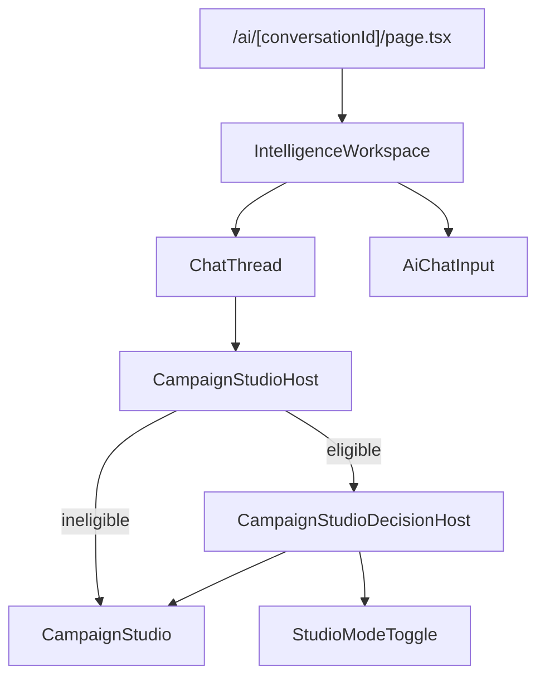

# F1.1 Routing & Composition Fix

Generated: 2026-07-04  
Status: **Fix applied — awaiting manual QA**

## Problem (Manual QA)

After dev restart, two divergent experiences appeared:

| Symptom | Route / surface |
| --- | --- |
| Presentation/Decision toggle visible, **no AI Chat** | `/ai/[conversationId]/decisions` |
| AI Chat visible, **no toggle** (plain Campaign Studio) | `/ai/[conversationId]` |

Approved architecture requires **one page** at `/ai/[conversationId]`:

```
/ai/[conversationId]
--------------------------------
AI Chat
Campaign Studio Host
    Presentation Mode
    Decision Mode
--------------------------------
```

---

## Phase 1 — Investigation

### Route chain

| Route | Page file | Root component | Chat? | Toggle? |
| --- | --- | --- | ---: | ---: |
| `/ai/[conversationId]` | `app/(dashboard)/ai/[conversationId]/page.tsx` | `IntelligenceWorkspace` | Yes | **No** (regression) |
| `/ai/[conversationId]/decisions` | `app/(dashboard)/ai/[conversationId]/decisions/page.tsx` | `CampaignIntelligenceShell` | **No** | Yes |

### Component chain (main route)

```
page.tsx
  └── IntelligenceWorkspace          (features/ai-workspace/components/intelligence-workspace.tsx)
        ├── ConversationList
        ├── ChatThread               (features/ai-workspace/components/chat-thread.tsx)
        │     └── CampaignStudioHost  (per campaign message + streaming)
        ├── SuggestedActionsBar
        └── AiChatInput
```

### Component chain (decisions dev route)

```
decisions/page.tsx
  └── CampaignIntelligenceShell      (features/campaign-decision-workspace/...)
        └── CampaignStudioHost       (host-only, full viewport)
```

### Answers

**1. Which route renders host-only page (no chat)?**

`/ai/[conversationId]/decisions` → `CampaignIntelligenceShell` loads conversation campaign object and renders `CampaignStudioHost` as the sole content. No `IntelligenceWorkspace`, no `ChatThread`, no `AiChatInput`.

**2. Which route renders old chat without toggle?**

`/ai/[conversationId]` → `IntelligenceWorkspace` → `ChatThread` already imports `CampaignStudioHost`, but completed campaigns fell through to the **passthrough** branch (`CampaignStudio` only) because eligibility check failed.

**3. Why they diverged?**

Two independent causes:

| Cause | Detail |
| --- | --- |
| **Separate dev route** | `decisions/page.tsx` was added as an isolated host test shell. It correctly shows toggle (hard-codes `workflowStatus="complete"`) but omits chat by design. |
| **Status string mismatch** | `CampaignStudioHost.isDecisionEligible()` required `workflowStatus === "complete"`. Chat metadata and `CampaignObject.meta` use `"completed"`. Eligibility failed → host rendered plain `CampaignStudio` with no `StudioModeToggle`. |

```typescript
// campaign-studio-host.tsx (before fix)
function isDecisionEligible(input) {
  return Boolean(input.campaignObject && input.workflowStatus === "complete");
}

// chat-thread.tsx passes metadata status
workflowStatus={campaignDisplay.status}  // typically "completed"

// campaign-intelligence-shell.tsx (dev route)
workflowStatus="complete"  // hard-coded — toggle works here only
```

No second user-facing route was intended. The dev shell and the status mismatch together produced the illusion of two products.

---

## Phase 2 — Fix

### Change

`features/campaign-decision-workspace/components/campaign-studio-host.tsx`

- Added `isWorkflowComplete()` accepting both `"complete"` and `"completed"`.
- `isDecisionEligible()` now uses normalized completion check.

### Unchanged (already correct)

- `app/(dashboard)/ai/[conversationId]/page.tsx` — renders `IntelligenceWorkspace` (not shell).
- `chat-thread.tsx` — already uses `CampaignStudioHost` (not direct `CampaignStudio`).
- `decisions/page.tsx` — remains dev-only; no user-facing nav links.

### Presentation parity

Presentation mode path unchanged: eligible host still renders `CampaignStudio` without `decisionMode` when mode is `"presentation"`.

---

## Phase 3 — After-fix component tree

### Primary route `/ai/[conversationId]`

```
DashboardShell
└── PlatformErrorBoundary
    └── IntelligenceWorkspace
        ├── AiWorkspaceTopbar
        ├── ConversationList (lg sidebar)
        └── Main column
            ├── [empty] AiWelcomeScreen
            └── [active conversation]
                ├── ChatThread
                │   ├── MessageBubble (user)
                │   ├── MessageBubble (non-campaign assistant)
                │   ├── MessageBubble (campaign) ──► CampaignStudioHost
                │   │   ├── [in-progress] CampaignStudio (passthrough)
                │   │   └── [complete + campaignObject] CampaignStudioDecisionHost
                │   │       ├── StudioModeToggle
                │   │       ├── [presentation] CampaignStudio
                │   │       └── [decision]
                │   │           ├── ScenarioBar
                │   │           ├── CampaignStudio (displayCampaignObject + decisionMode)
                │   │           ├── DecisionRightPanel
                │   │           └── CreatorDrawer
                │   └── [streaming campaign] CampaignStudioHost (running state)
                ├── SuggestedActionsBar
                └── AiChatInput
```

### Dev route `/ai/[conversationId]/decisions` (unchanged, no chat)

```
DashboardShell
└── PlatformErrorBoundary
    └── CampaignIntelligenceShell
        ├── Back link → /ai/[conversationId]
        └── CampaignStudioHost (complete campaignObject)
```

### Mermaid (primary route)



---

## Validation

Static checks added to `scripts/validate-f1-one-workspace.mjs`:

- Main conversation page imports `IntelligenceWorkspace` (not `CampaignIntelligenceShell`).
- `chat-thread.tsx` imports `CampaignStudioHost` (not direct `CampaignStudio`).
- `chat-thread.tsx` retains messages render area.
- Host accepts both `"complete"` and `"completed"` for decision eligibility.

Build / TypeScript: run `npm run build` + `npx tsc --noEmit` — see validation report for results.

**Build status (2026-07-04):** `npm run build` PASS · `npx tsc --noEmit` PASS

**Manual QA:** Not marked PASS. Verify on `/ai/[conversationId]` with a completed campaign:

1. AI Chat sidebar, thread, and input remain visible.
2. Campaign message shows Presentation | Decision toggle above studio.
3. Toggle switches modes without navigation.
4. `/decisions` dev route still works in isolation (optional).
