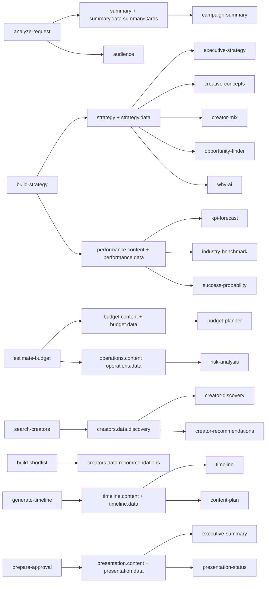

# ERS-3 Campaign Studio Dependency Graph

## Task → CampaignObject section → Studio section

## Ownership rules (ERS-3)

| Studio section | CampaignObject path | Data type |
| --- | --- | --- |
| campaign-summary | `sections.summary.data.summaryCards` | SummarySectionData |
| executive-strategy | `sections.strategy.data.groundedFields` | GroundedStrategyField[] |
| creator-discovery | `sections.creators.data.discoveryPipeline` | DiscoveryPipelineStage[] |
| creator-recommendations | `sections.creators.data.recommendations` | CreatorRecommendationSectionData |
| budget-planner | `sections.budget.content` + `.data` | BudgetSectionData + extras |
| timeline | `sections.timeline.content` + `.data.weekDetails` | TimelineSectionData |
| kpi-forecast | `sections.performance.data.groundedKpis` | GroundedKpi[] |
| risk-analysis | `sections.operations.content` + `.data.enrichedRisks` | RiskAnalysisSectionData |
| creative-concepts | `sections.strategy.data.creativeConcepts` | CreativeConcept[] |
| content-plan | `sections.timeline.data.contentPlan` | ContentPlanItem[] |
| creator-mix | `sections.strategy.data.creatorMix` | CreatorMixTier[] |
| why-ai | `sections.strategy.data.whyAiInsights` | WhyAiInsight[] |
| industry-benchmark | `sections.performance.data.industryBenchmark` | IndustryBenchmarkData |
| success-probability | `sections.performance.data.successProbability` | SuccessProbabilityData |
| opportunity-finder | `sections.strategy.data.opportunities` | OpportunityItem[] |
| executive-summary | `sections.presentation.data.executiveSummary` | ExecutiveSummaryData |
| presentation-status | `sections.presentation.content` | PresentationStatusSectionData |

## Removed render-path fallbacks

- `parseCampaignSummary` / `parseExecutiveStrategy` markdown field extraction
- `parseKpiFromFormattedText` strategy text → KPI cards
- `gatherContextText` cross-section brief assembly in resolver
- Industry intelligence fallbacks when structured section empty (budget, timeline, KPI, risk)
- `parseVendorsFromDisplay` text parsing for vendor recommendations
- `stripMarkdown` in all section renderers and resolver
- Presentation-intelligence `derive*` calls from `section-data-resolver` (moved to `studio-section-data-builders` at write time)

## Duplicate fields removed

- Campaign summary no longer re-parses audience/strategy/presentation text at render time
- KPI forecast no longer duplicates strategy bullet KPIs via text parsing
- Executive strategy no longer merges parsed markdown lists with derived fields
- Budget planner no longer re-derives allocations from industry profile at render time
