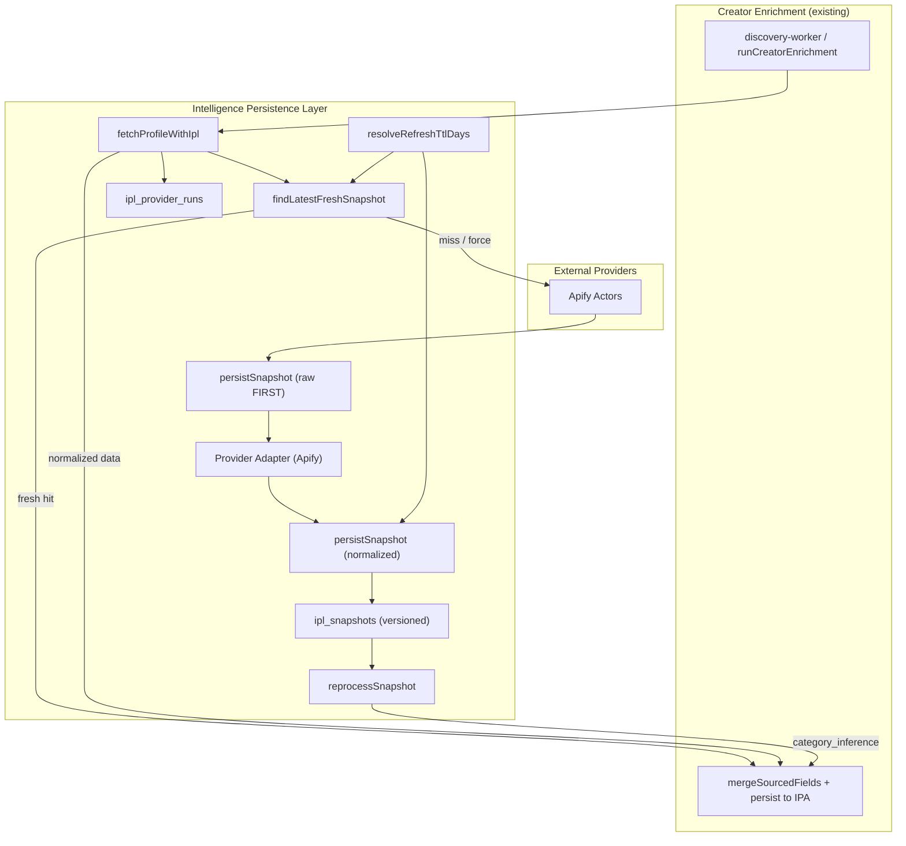

# Intelligence Persistence Layer (IPL) — Sprint 8.5

Permanent storage for external enrichment data. Additive foundation for Sprint 9 Creator DNA.

## Architecture

## Data Flow

1. **Cache-first**: `fetchProfileWithIpl` checks `ipl_snapshots` for a fresh `is_latest` row (TTL from `ipl_refresh_policies`).
2. **Provider fetch**: On miss, calls `fetchApifyProfileRaw` (no normalization yet).
3. **Raw persist**: Inserts immutable `raw_snapshot` JSONB **before** any merge/preview.
4. **Normalize**: Apify adapter produces provider-agnostic `normalized_snapshot`.
5. **Metadata**: `ipl_provider_runs` records duration, payload size, estimated cost, errors.
6. **Merge**: Existing enrichment merge engine unchanged — receives same `ApifyProfileData` shape.
7. **Reprocess**: `reprocessSnapshot` runs AI classifiers (category-inference today) from stored normalized data — no external calls.

## Tables

| Table | Purpose |
|-------|---------|
| `ipl_refresh_policies` | Configurable TTL per provider/field_group |
| `ipl_provider_runs` | Audit metadata per external call |
| `ipl_snapshots` | Immutable versioned raw + normalized JSONB |
| `ipl_reprocess_jobs` | Reprocessing job queue/audit |

## Configuration

| Env | Default | Description |
|-----|---------|-------------|
| `IPL_ENABLED` | `true` | Master switch; `false` falls back to legacy fetch |
| `IPL_CACHE_FIRST` | `true` | Skip external provider when fresh snapshot exists |

DB seed policies mirror the 30-day enrichment window with follower-tier overrides (7d / 14d / 30d).

## Backward Compatibility

- `fetchApifyProfile()` unchanged for direct callers.
- `runCreatorEnrichment()` API contract unchanged.
- IPL writes are best-effort — failures log but never abort enrichment.
- `IPL_ENABLED=false` bypasses IPL entirely.

## Sprint 9 Follow-ups

- Wire `brand_fit` / `niche_classification` reprocess job types to Creator DNA tables.
- Add Modash/HypeAuditor provider adapters.
- Background worker for `ipl_reprocess_jobs` queue.
- UI for snapshot version history in creator detail sheet.
